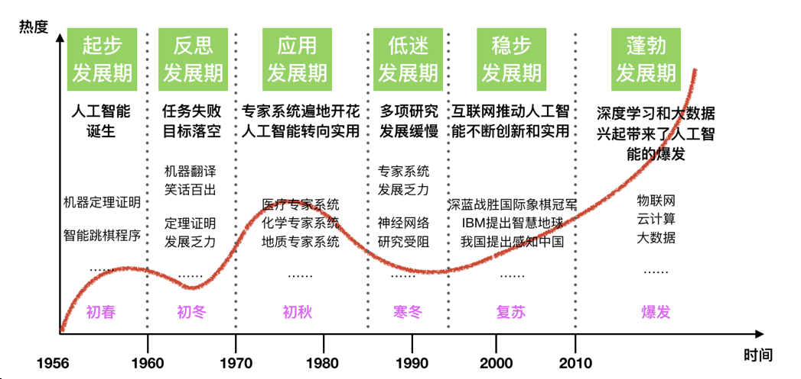
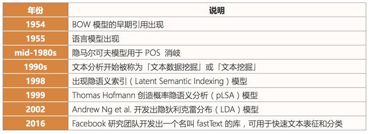

## 体验小案例
涂鸦识别：https://quickdraw.withgoogle.com
画风迁移：https://deepdreamgenerator.com/

## 人工智能发展历程
### 起源
1950年，图灵发表了一篇划时代的论文，文中预言了创造出具有真正智能的机器的可能性。由于注意到“智能”这一概念难以确切定义，他提出了著名的图灵测试：测试者与被测试者（一个人和一台机器）隔开的情况下，通过一些装置（如键盘）向被测试者随意提问。多次测试（一般为5min之内），如果有超过30%的测试者不能确定被测试者是人还是机器，那么这台机器就通过了测试，并被认为具有人类智能。

达特茅斯会议：1956年8月，在美国汉诺斯小镇宁静的达特茅斯学院中，
- 约翰·麦卡锡（John McCarthy）
- 马文·闵斯基（Marvin Minsky，人工智能与认知学专家）
- 克劳德·香农（Claude Shannon，信息论的创始人）
- 艾伦·纽厄尔（Allen Newell，计算机科学家）
- 赫伯特·西蒙（Herbert Simon，诺贝尔经济学奖得主）

等科学家正聚在一起，讨论着一个完全不食人间烟火的主题：用机器来模仿人类学习以及其他方面的智能。会议足足开了两个月的时间，虽然大家没有达成普遍的共识，但是却为会议讨论的内容起了一个名字：人工智能。

因此，1956年也就成为了人工智能元年。

### 发展历程
人工智能充满未知的探索道路曲折起伏。如何描述人工智能自1956年以来60余年的发展历程，学术界可谓仁者见仁、智者见智。我们将人工智能的发展历程划分为以下6个阶段：

第一是起步发展期：1956年—20世纪60年代初。人工智能概念提出后，相继取得了一批令人瞩目的研究成果，如机器定理证明、跳棋程序等，掀起人工智能发展的第一个高潮。

第二是反思发展期：20世纪60年代—70年代初。人工智能发展初期的突破性进展大大提升了人们对人工智能的期望，人们开始尝试更具挑战性的任务，并提出了一些不切实际的研发目标。然而，接二连三的失败和预期目标的落空（例如，无法用机器证明两个连续函数之和还是连续函数、机器翻译闹出笑话等），使人工智能的发展走入低谷。

第三是应用发展期：20世纪70年代初—80年代中。20世纪70年代出现的专家系统模拟人类专家的知识和经验解决特定领域的问题，实现了人工智能从理论研究走向实际应用、从一般推理策略探讨转向运用专门知识的重大突破。专家系统在医疗、化学、地质等领域取得成功，推动人工智能走入应用发展的新高潮。

第四是低迷发展期：20世纪80年代中—90年代中。随着人工智能的应用规模不断扩大，专家系统存在的应用领域狭窄、缺乏常识性知识、知识获取困难、推理方法单一、缺乏分布式功能、难以与现有数据库兼容等问题逐渐暴露出来。

第五是稳步发展期：20世纪90年代中—2010年。由于网络技术特别是互联网技术的发展，加速了人工智能的创新研究，促使人工智能技术进一步走向实用化。1997年国际商业机器公司（简称IBM）深蓝超级计算机战胜了国际象棋世界冠军卡斯帕罗夫，2008年IBM提出“智慧地球”的概念。以上都是这一时期的标志性事件。

第六是蓬勃发展期：2011年至今。随着大数据、云计算、互联网、物联网等信息技术的发展，泛在感知数据和图形处理器等计算平台推动以深度神经网络为代表的人工智能技术飞速发展，大幅跨越了科学与应用之间的“技术鸿沟”，诸如图像分类、语音识别、知识问答、人机对弈、无人驾驶等人工智能技术实现了从“不能用、不好用”到“可以用”的技术突破，迎来爆发式增长的新高潮。

## 人工智能主要分支
通讯、感知与行动是现代人工智能的三个关键能力，在这里我们将根据这些能力/应用对这三个技术领域进行介绍：
- 计算机视觉：全称Computer Vision，简称CV
- 自然语言处理：全称Natural Language Processing，简称NLP，包括文本挖掘/分类、机器翻译和语音识别
- 机器人

### 计算机视觉
计算机视觉(CV)是指机器感知环境的能力。这一技术类别中的经典任务有图像形成、图像处理、图像提取和图像的三维推理。物体检测和人脸识别是其比较成功的研究领域。

当前阶段：计算机视觉现已有很多应用，这表明了这类技术的成就，也让我们将其归入到应用阶段。随着深度学习的发展，机器甚至能在特定的案例中实现超越人类的表现。但是，这项技术离社会影响阶段还有一定距离，那要等到机器能在所有场景中都达到人类的同等水平才行(感知其环境的所有相关方面)。

发展历史：

### 语音识别
语音识别是指识别语音(说出的语言)并将其转换成对应文本的技术。相反的任务(文本转语音/TTS)也是这一领域内一个类似的研究主题。

当前阶段：语音识别已经处于应用阶段很长时间了。最近几年，随着大数据和深度学习技术的发展，语音识别进展颇丰，现在已经非常接近社会影响阶段了。语音识别领域仍然面临着声纹识别和「鸡尾酒会效应」等一些特殊情况的难题。现代语音识别系统严重依赖于云，在离线时可能就无法取得理想的工作效果。

发展历史：

### 文本挖掘/分类
这里的文本挖掘主要是指文本分类，该技术可用于理解、组织和分类结构化或非结构化文本文档。其涵盖的主要任务有句法分析、情绪分析和垃圾信息检测。

当前阶段：我们将这项技术归类到应用阶段，因为现在有很多应用都已经集成了基于文本挖掘的情绪分析或垃圾信息检测技术。文本挖掘技术也在智能投顾的开发中有所应用，并且提升了用户体验。文本挖掘和分类领域的一个瓶颈出现在歧义和有偏差的数据上。

发展历史：

### 机器翻译
机器翻译(MT)是利用机器的力量自动将一种自然语言(源语言)的文本翻译成另一种语言(目标语言)。

当前阶段：机器翻译是一个见证了大量发展历程的应用领域。该领域最近由于神经机器翻译而取得了非常显著的进展，但仍然没有全面达到专业译者的水平；但是，我们相信在大数据、云计算和深度学习技术的帮助下，机器翻译很快就将进入社会影响阶段。在某些情况下，俚语和行话等内容的翻译会比较困难(受限词表问题)。专业领域的机器翻译(比如医疗领域)表现通常不好。

发展历史：

### 机器人
机器人学(Robotics)研究的是机器人的设计、制造、运作和应用，以及控制它们的计算机系统、传感反馈和信息处理。

机器人可以分成两大类: 固定机器人和移动机器人。固定机器人通常被用于工业生产(比如用于装配线)。常见的移动机器人应用有货运机器人、空中机器人和自动载具。机器人需要不同部件和系统的协作才能实现最优的作业。其中在硬件上包含传感器、反应器和控制器；另外还有能够实现感知能力的软件，比如定位、地图测绘和目标识别。

当前阶段：自上世纪「Robot」一词诞生以来，人们已经为工业制造业设计了很多机器人。工业机器人是增长最快的应用领域，它们在 20 世纪 80 年代将这一领域带入了应用阶段。在安川电机、Fanuc、ABB、库卡等公司的努力下，我们认为进入 21 世纪之后，机器人领域就已经进入了社会影响阶段，此时各种工业机器人已经主宰了装配生产线。此外，软体机器人在很多领域也有广泛的应用，比如在医疗行业协助手术或在金融行业自动执行承销过程。但是，法律法规和「机器人威胁论」可能会妨碍机器人领域的发展。还有设计和制造机器人需要相对较高的投资。

发展历史：

## 人工智能、机器学习和深度学习
- 机器学习是人工智能的一个实现途径
- 深度学习是机器学习的一个方法（神经网络）发展而来

## 参考资料
> - 
> - 
