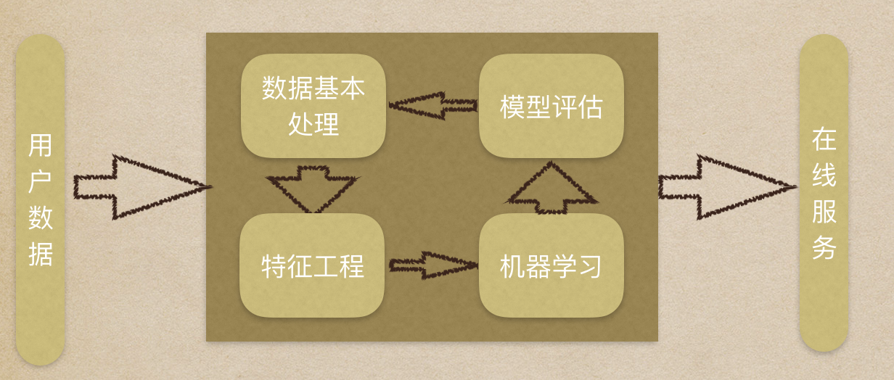
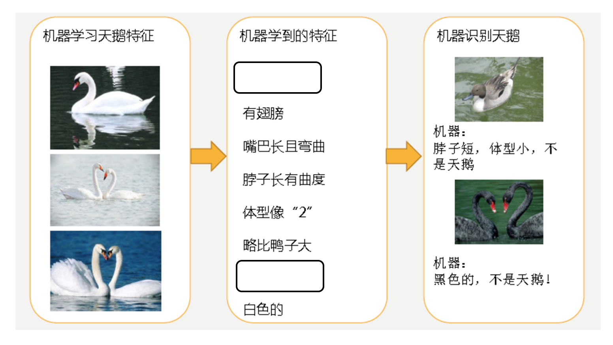

机器学习是人工智能的一个实现途径。

机器学习是从数据中自动分析获得模型，并利用模型对未知数据进行预测。

## 工作流程

### 数据集介绍
在数据集中一般：
- 一行数据我们称为一个样本
- 一列数据我们成为一个特征
- 有些数据有目标值（标签值/结果值），有些数据没有目标值

数据类型构成：
- 数据类型一：特征值+目标值（目标值是连续的和离散的）
- 数据类型二：只有特征值，没有目标值

数据分割，机器学习一般的数据集会划分为两个部分：
- 训练数据：用于训练，构建模型，一般划分比例为70% 80% 75%
- 测试数据：在模型检验时使用，用于评估模型是否有效，一般划分比例为30% 20% 25%

### 数据基本处理
​数据清洗等，即对数据进行缺失值、去除异常值等处理。

### 特征工程
特征工程是使用专业背景知识和技巧处理数据，使得特征能在机器学习算法上发挥更好的作用的过程。会直接影响机器学习的效果。

> 为什么需要特征工程(Feature Engineering)?
> 机器学习领域大神Andrew Ng(吴恩达)老师说“Coming up with features is difficult, time-consuming, requires expert knowledge. “Applied machine learning” is basically feature engineering. ”
> 注：业界广泛流传：数据和特征决定了机器学习的上限，而模型和算法只是逼近这个上限而已。

特征工程包含内容：
- 特征提取：将任意数据（如文本或图像）转换为可用于机器学习的数字特征。
- 特征预处理：通过一些转换函数将特征数据转换成更加适合算法模型的特征数据过程。
- 特征降维：指在某些限定条件下，降低随机变量(特征)个数，得到一组“不相关”主变量的过程。

特征预处理、数据清洗是很关键的步骤，往往能够使得算法的效果和性能得到显著提高。归一化、离散化、因子化、缺失值处理、去除共线性等，数据挖掘过程中很多时间就花在它们上面。这些工作简单可复制，收益稳定可预期，是机器学习的基础必备步骤。

筛选出显著特征、摒弃非显著特征，需要机器学习工程师反复理解业务。这对很多结果有决定性的影响。特征选择好了，非常简单的算法也能得出良好、稳定的结果。这需要运用特征有效性分析的相关技术，如相关系数、卡方检验、平均互信息、条件熵、后验概率、逻辑回归权重等方法。

### 机器学习
选择合适的算法对模型进行训练，常用算法见下文。现在很多算法都能够封装成黑盒供人使用。但是真正考验水平的是调整这些算法的（超）参数，使得结果变得更加优良。这需要我们对算法的原理有深入的理解。理解越深入，就越能发现问题的症结，提出良好的调优方案。

### 模型评估
对训练好的模型进行评估。评估方法和问题处理见下文。

## 机器学习算法分类
根据数据集组成不同，可以把机器学习算法分为：
- 监督学习：输入数据是由输入特征值和目标值所组成。函数的输出可以是一个连续的值(称为回归），或是输出是有限个离散值（称作分类）。
- 无监督学习：输入数据是由输入特征值组成，没有目标值，输入数据没有被标记，也没有确定的结果。样本数据类别未知；需要根据样本间的相似性对样本集进行类别划分。
- 半监督学习：训练集同时包含有标记样本数据和未标记样本数据。
- 强化学习：实质是自动进行决策，并且可以做连续决策。强化学习的目标就是获得最多的累计奖励。

监督学习和强化学习的对比：

   | 监督学习	| 强化学习
-- | -- | --
反馈映射	| 输出的是数据之间的关系，可以告诉什么样的输入对应着什么样的输出。	| 输出的是给机器的反馈 reward function，即用来判断这个行为是好是坏。
反馈时间	| 做了比较坏的选择会立刻反馈给算法。	| 结果反馈有延时，有时候可能需要走了很多步以后才知道以前的某一步的选择是好还是坏。
输入特征	| 输入是独立同分布的。	| 面对的输入总是在变化，每当算法做出一个行为，它影响下一次决策的输入。

总结：

 |In |Out | 目的 | 案例
-- | -- | -- | --| --
监督学习(supervised learning) |	有标签	| 有反馈 | 预测结果 | 猫狗分类 房价预测
无监督学习(unsupervised learning)|	无标签|	无反馈|	发现潜在结构|	“物以类聚，人以群分”
半监督学习(Semi-Supervised Learning)|	部分有标签，部分无标签|	有反馈 |	降低数据标记的难度	
强化学习(reinforcement learning)|	决策流程及激励系统|	一系列行动|	长期利益最大化|	学下棋

## 模型评估
模型评估是模型开发过程不可或缺的一部分。它有助于发现表达数据的最佳模型和所选模型将来工作的性能如何。如何确定模型调优的方向与思路呢？这就需要对模型进行诊断的技术。

- 过拟合、欠拟合 判断是模型诊断中至关重要的一步。常见的方法如交叉验证，绘制学习曲线等。过拟合的基本调优思路是增加数据量，降低模型复杂度。欠拟合的基本调优思路是提高特征数量和质量，增加模型复杂度。
- 误差分析 也是机器学习至关重要的步骤。通过观察误差样本全面分析产生误差的原因:是参数的问题还是算法选择的问题，是特征的问题还是数据本身的问题……
- 诊断后的模型需要进行调优，调优后的新模型需要重新进行诊断，这是一个反复迭代不断逼近的过程，需要不断地尝试， 进而达到最优状态。

按照数据集的目标值不同，可以把模型评估分为分类模型评估和回归模型评估。 

### 分类模型评估
准确率：预测正确的数占样本总数的比例。
其他评价指标：精确率、召回率、F1-score、AUC指标等

### 回归模型评估
均方根误差（Root Mean Squared Error，RMSE）是一个衡量回归模型误差率的常用公式。 不过，它仅能比较误差是相同单位的模型。
其他评价指标：相对平方误差（Relative Squared Error，RSE）、平均绝对误差（Mean Absolute Error，MAE)、相对绝对误差（Relative Absolute Error，RAE)等

### 拟合问题
模型评估用于评价训练好的的模型的表现效果，其表现效果大致可以分为两类：过拟合、欠拟合。在训练过程中，你可能会遇到如下问题：训练数据训练的很好啊，误差也不大，为什么在测试集上面有问题呢？当算法在某个数据集当中出现这种情况，可能就出现了拟合问题。

欠拟合（under-fitting）：模型学习的太过粗糙，连训练集中的样本数据特征关系都没有学出来。如下机器学习到的天鹅特征太少了，导致区分标准太粗糙，不能准确识别出天鹅。

过拟合（over-fitting）：所建的机器学习模型或者是深度学习模型在训练样本中表现得过于优越，导致在测试数据集中表现不佳。如下机器已经基本能区别天鹅和其他动物了。然后，很不巧已有的天鹅图片全是白天鹅的，于是机器经过学习后，会认为天鹅的羽毛都是白的，以后看到羽毛是黑的天鹅就会认为那不是天鹅。

## 参考资料
> - 
> - 
