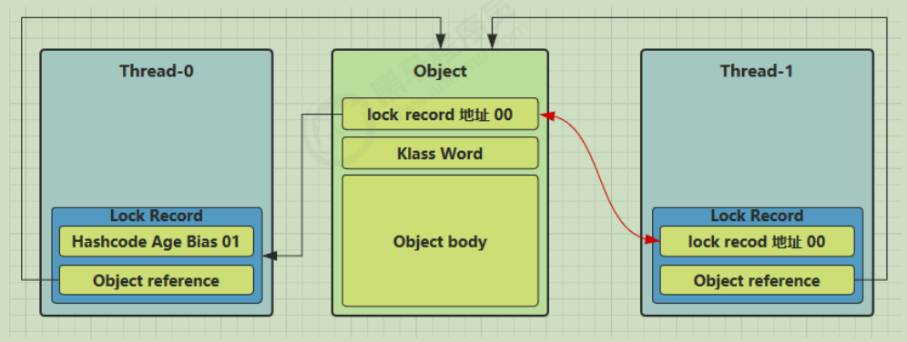
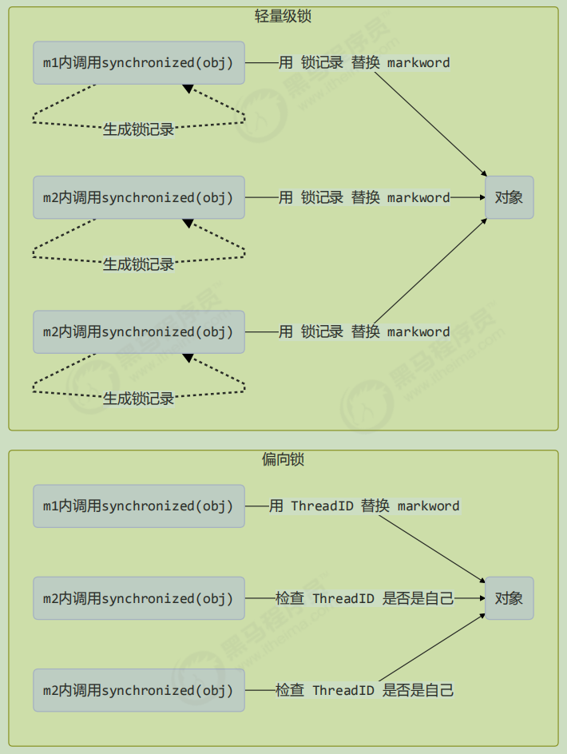
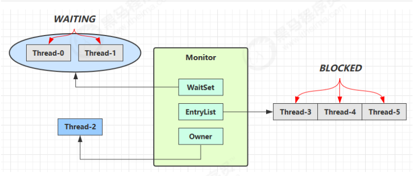
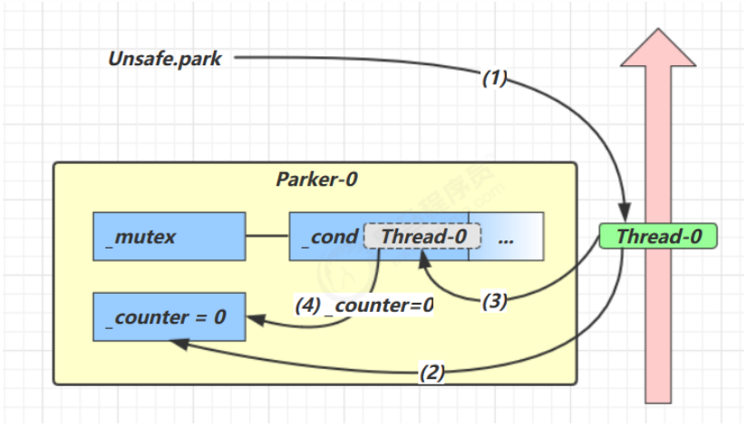
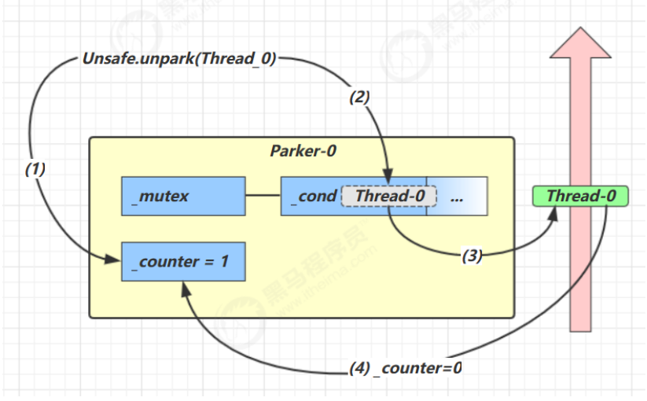
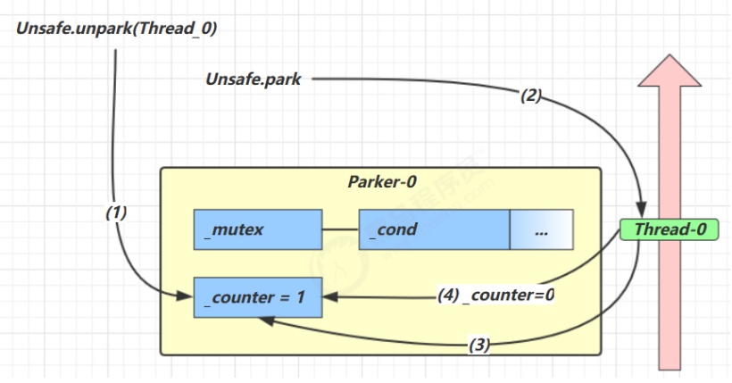
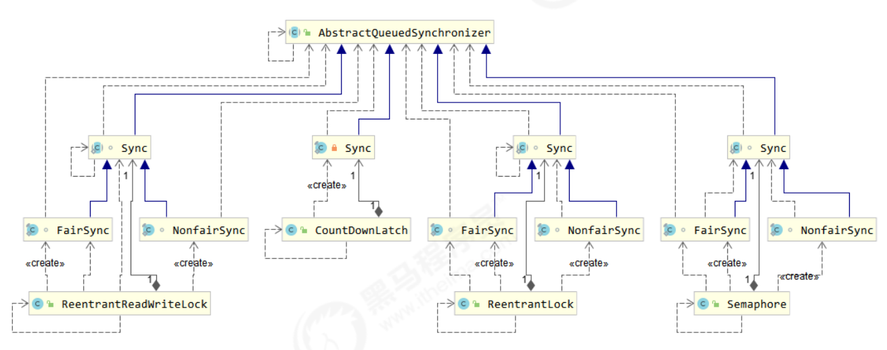
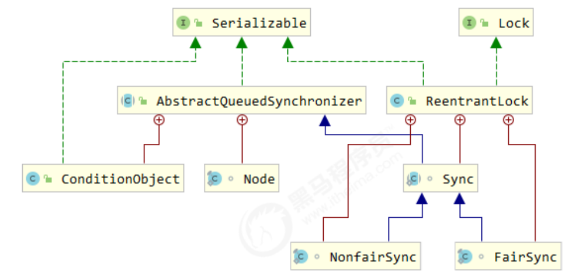

## 指令级并行原理

## CPU 缓存结构原理

## MESI缓存一致性协议
MESI指数据在缓存中四种状态，分别是M(Modify)修改、E(Exclusive)独占、S(Share)共享、I(Invild)无效

运行流程如下：
1. 读取数据：当一个CPU读数据到缓存行时，缓存初始状态为E，同时会通过总线嗅探机制监听总线，当有另一个CPU也读取了该数据时，数据在两个CPU缓存中的状态都变为S
2. 修改数据：当其中一个CPU修改了数据后先写到缓存中并不是直接同步回主存中，同时状态改为M，并向总线发送修改了该数据的消息，其他CPU会嗅探到，然后将自己缓存中的数据状态改为I,即失效掉
3. 同步数据：当有无效缓存数据的CPU要重新从主存读取数据时，先向总线发送读取消息，有修改状态的缓存数据的CPU会嗅探到，将修改数据同步到主存中，然后状态修改为E，当重新读数据的CPU读数据到缓存后，两个CPU的缓存数据再都改为S状态
4. 修改裁决：当同时有两个CPU向总线发出了修改数据的消息时，会通过硬件进行一个总线裁决，成功的为M状态，其他的为I无效状态

## 原理之 volatile
volatile 的底层实现原理是内存屏障，Memory Barrier（Memory Fence），字节码上看不出来 volatile 指令的效果
- 对 volatile 变量的写指令后会加入写屏障
- 对 volatile 变量的读指令前会加入读屏障

### 保证可见性
- 写屏障（sfence）保证在该屏障之前的，对共享变量的改动，都同步到主存当中
- 读屏障（lfence）保证在该屏障之后，对共享变量的读取，加载的是主存中最新数据

### 保证有序性
- 写屏障会确保指令重排序时，不会将写屏障之前的代码排在写屏障之后
- 读屏障会确保指令重排序时，不会将读屏障之后的代码排在读屏障之前

### lock前缀指令
内存屏障对应到底层CPU指令是会加lock前缀的指令，volatile关键字是在Java语言层面的体现，字节码层面不能体现，即不存在对应字节码指令，lock前缀的作用如下：
1. 会将修改的数据立即同步回主存中，写回主存会导致其他CPU缓存中的数据立即失效，这个失效要配合MESI协议来实现，MESI协议要依赖总线嗅探机制实现
2. 提供了内存屏障功能，使lock指令前后指令不能重排序，阻止优化CPU级别的流水线指令并行技术

PS: 还是那句话，不能解决指令交错：写屏障仅仅是保证之后的读能够读到最新的结果，但不能保证读跑到它前面去，而有序性的保证也只是保证了本线程内相关代码不被重排序

## 原理之伪共享
LongAdder 源码

## 原理之final
### 设置 final 变量的原理
理解了 volatile 原理，再对比 final 的实现就比较简单了
```java
public class TestFinal {
    final int a = 20; 
}

```
字节码
```java
0: aload_0
1: invokespecial #1 // Method java/lang/Object."<init>":()V
4: aload_0
5: bipush 20
7: putfield #2 // Field a:I
    <-- 写屏障
10: return
```
发现 final 变量的赋值也会通过 putfield 指令来完成，这个操作数引用的是运行时常量池里的一个字段，同样在这条指令之后也会加入写屏障，保证在其它线程读到它的值时不会出现为 0 的情况

### 获取 final 变量的原理
```java
public class TestFinal {
    final static int A = 10;
    final static int B = Short.MAX_VALUE + 1;

    final int a = 20;
    final int b = Integer.MAX_VALUE;
}

class UseFinal {
    public void test() {
        System.out.println(TestFinal.A); // BIPUSH 10  直接常数赋值
        System.out.println(TestFinal.B); // LDC 32768  从常量池中获取

        System.out.println(new TestFinal().a); // BIPUSH 20
        System.out.println(new TestFinal().b); // LDC 2147483647
    }
}
```

## 原理之 Monitor(锁)
Monitor被翻译为监视器或管程。

每个Java对象都可以关联一个 Monitor 对象，如果使用 synchronized关键字给对象上锁（重量级）之后，该对象头的Mark Word 中就被设置指向 Monitor 对象的指针。Monitor 结构如下：


1. 刚开始 Monitor 中 Owner 为 null
2. 当 Thread-2 执行 synchronized(obj) 就会将 Monitor 的所有者 Owner 置为 Thread-2，Monitor中只能有一个 Owner
3. 在 Thread-2 上锁的过程中，如果 Thread-3，Thread-4，Thread-5 也来执行 synchronized(obj)，就会进入EntryList BLOCKED
4. Thread-2 执行完同步代码块的内容，然后唤醒 EntryList 中等待的线程来竞争锁，竞争的时是非公平的
5. 图中 WaitSet 中的 Thread-0，Thread-1 是之前获得过锁，但条件不满足进入 WAITING 状态的线程，后面讲wait-notify 时会分析

> synchronized 必须是进入同一个对象的 monitor 才有上述的效果，不加 synchronized 的对象不会关联监视器，不遵从以上规则

## 原理之 synchronized
```java
static final Object lock = new Object();
static int counter = 0;

public static void main(String[] args) {
    synchronized (lock) {
        counter++;
    }
}
```

对应的字节码为:
```java
public static void main(java.lang.String[]);
    descriptor: ([Ljava/lang/String;)V
    flags: ACC_PUBLIC, ACC_STATIC
    Code:
        stack=2, locals=3, args_size=1
            0: getstatic #2 // <- lock引用 （synchronized开始）
            3: dup
            4: astore_1 // lock引用 -> slot 1
            5: monitorenter // 将 lock对象 MarkWord 置为 Monitor 指针
            6: getstatic #3 // <- i
            9: iconst_1 // 准备常数 1
            10: iadd // +1
            11: putstatic #3 // -> i
            14: aload_1 // <- lock引用
            15: monitorexit // 将 lock对象 MarkWord 重置, 唤醒 EntryList
            16: goto 24
            19: astore_2 // e -> slot 2 
            20: aload_1 // <- lock引用
            21: monitorexit // 将 lock对象 MarkWord 重置, 唤醒 EntryList（此处是发生异常时释放锁）
            22: aload_2 // <- slot 2 (e)
            23: athrow // throw e
            24: return
        Exception table:
            from to target type
            6 16 19 any
            19 22 19 any
        LineNumberTable:
            line 8: 0
            line 9: 6
            line 10: 14
            line 11: 24
        LocalVariableTable:
            Start Length Slot Name Signature
            0 25 0 args [Ljava/lang/String;
        StackMapTable: number_of_entries = 2
            frame_type = 255 /* full_frame */
                offset_delta = 19
                locals = [ class "[Ljava/lang/String;", class java/lang/Object ]
                stack = [ class java/lang/Throwable ]
            frame_type = 250 /* chop */
                offset_delta = 4

```
> 方法级别的 synchronized 不会在字节码指令中有所体现，而是通过一个标志位来体现

## 原理之 synchronized 进阶

### 轻量级锁
轻量级锁的使用场景：如果一个对象虽然有多线程要加锁，但加锁的时间是错开的（也就是没有竞争），那么可以使用轻量级锁来优化。
轻量级锁对使用者是透明的，即语法仍然是 synchronized。假设有两个方法同步块，利用同一个对象加锁：
```java
static final Object obj = new Object();
public static void method1() {
    synchronized( obj ) {
    // 同步块 A
    method2();
    }
}
public static void method2() {
    synchronized( obj ) {
    // 同步块 B
    }
}
```
每个线程的栈帧都会包含一个锁记录（Lock Record）的结构，内部可以存储锁对象的Mark Word。

加偏向锁时，让锁记录中 Object reference 指向锁对象，然后构造一个锁记录对象自己的地址+00标志位，并尝试用 cas 和锁对象的 Mark Word交换。


如果 CAS 替换成功，锁对象的对象头中存储了锁记录地址和 00 状态位，线程的栈帧中的锁记录对象持有锁对象原来的Mark Word，表示由该线程给对象加轻量级锁成功，这时图示如下


如果 cas 失败，有两种情况:
- 如果是其它线程已经持有了该 Object 的轻量级锁，这时表明有竞争，进入锁膨胀过程
- 如果是自己执行了 synchronized 锁重入，那么再添加一条 Lock Record 作为重入的计数


当退出 synchronized 代码块（解锁时）如果有取值为 null 的锁记录，表示有重入，这时删除锁记录，表示重入计数减一
当退出 synchronized 代码块（解锁时）锁记录的值不为 null，这时使用 cas 将 Mark Word 的值恢复给对象头成功，则解锁成功；失败，说明轻量级锁进行了锁膨胀或已经升级为重量级锁，进入重量级锁解锁流程

### 锁膨胀
如果在尝试加轻量级锁的过程中，CAS 操作无法成功，这时一种情况就是有其它线程为此对象加上了轻量级锁（有竞争），这时需要进行锁膨胀，将轻量级锁变为重量级锁。流程如下：

当 Thread-1 进行轻量级加锁时，Thread-0 已经对该对象加了轻量级锁



这时 Thread-1 加轻量级锁失败，进入锁膨胀流程，即为 锁Object 对象申请 Monitor 锁，让 锁Object的Mark Word 指向重量级锁地址，即将Monitor 锁地址+标志位10设置到锁Object的Mark Word，然后自己进入 Monitor 的 EntryList BLOCKED


当 Thread-0 退出同步块解锁时，使用 cas 将 Mark Word 的值恢复给对象头时会失败。这时会进入重量级解锁流程，即按照 Monitor 地址找到 Monitor 对象，设置 Owner 为 null，唤醒 EntryList 中 BLOCKED的线程

### 自旋优化
轻量级锁膨胀为重量级锁的时候，还可以使用自旋来进行优化，如果当前线程自旋成功（即这时候持锁线程已经退出了同步块，释放了锁），这时当前线程就可以避免阻塞。

自旋重试成功的情况:

线程 1 （core 1 上） |对象 Mark | 线程 2 （core 2 上）
-- | -- | --
访问同步块，获取 monitor| 10（重量锁）重量锁指针 |-
成功（加锁）| 10（重量锁）重量锁指针 |-
执行同步块 |10（重量锁）重量锁指针 |-
执行同步块 |10（重量锁）重量锁指针 |访问同步块，获取 monitor
执行同步块 |10（重量锁）重量锁指针 |自旋重试
执行完毕 |10（重量锁）重量锁指针 |自旋重试
成功（解锁）| 01（无锁） |自旋重试
 |10（重量锁）重量锁指针 |成功（加锁）
 |10（重量锁）重量锁指针 |执行同步块

自旋重试失败的情况:

线程 1（core 1 上） |对象 Mark| 线程 2（core 2 上）
-- | -- | --
访问同步块，获取 monitor |10（重量锁）重量锁指针 |-
成功（加锁）| 10（重量锁）重量锁指针 |-
执行同步块| 10（重量锁）重量锁指针 |-
执行同步块 |10（重量锁）重量锁指针 |访问同步块，获取 monitor
执行同步块 |10（重量锁）重量锁指针 |自旋重试
执行同步块 |10（重量锁）重量锁指针 |自旋重试
执行同步块 |10（重量锁）重量锁指针 |自旋重试
执行同步块 |10（重量锁）重量锁指针 |阻塞

- 自旋会占用 CPU 时间，单核 CPU 自旋就是浪费，多核 CPU 自旋才能发挥优势。
- Java 6 之后自旋锁是自适应的，比如对象刚刚的一次自旋操作成功过，那么认为这次自旋成功的可能性会高，就多自旋几次；反之，就少自旋甚至不自旋，总之，比较智能。
- Java 7 之后不能控制是否开启自旋功能

### 偏向锁
轻量级锁在没有竞争时（就自己这个线程），每次重入仍然需要执行 CAS 操作。

Java 6 中引入了偏向锁来做进一步优化：只有第一次使用 CAS 将线程 ID 设置到对象的 Mark Word 头，之后发现这个线程 ID 是自己的就表示没有竞争，不用重新 CAS。
以后只要不发生竞争，这个锁对象就归该线程所持有，注意处于偏向锁的对象解锁后，线程 id 仍存储于对象头中。

```java
static final Object obj = new Object();

public static void m1() {
    synchronized (obj) {
        // 同步块 A
        m2();
    }
}

public static void m2() {
    synchronized (obj) {
        // 同步块 B
        m3();
    }
}

public static void m3() {
    synchronized (obj) {
    }
}
```



一个对象创建时：
- 如果开启了偏向锁（默认开启），那么对象创建后，markword 值为 0x05 即最后 3 位为 101，这时它的thread、epoch、age 都为 0
- 偏向锁是默认是延迟的，不会在程序启动时立即生效，如果想避免延迟，可以加 VM 参数 -XX:BiasedLockingStartupDelay=0 来禁用延迟
- 如果没有开启偏向锁，那么对象创建后，markword 值为 0x01 即最后 3 位为 001，这时它的 hashcode、age 都为 0，第一次用到 hashcode 时才会赋值

### 偏向锁撤销
偏向锁撤销的情况：
1. 锁对象处于偏向锁状态时，即Mark Word值是 线程id + 状态位101时，调用了对象的 hashCode方法时，会计算hashCode然后写到MarkWord中，覆盖掉线程id，会导致偏向锁被撤销。但是，轻量级锁会在锁记录中记录 hashCode，重量级锁会在 Monitor 中记录 hashCode。
2. 当有其它线程使用偏向锁对象时，会将偏向锁升级为轻量级锁，即对同一个锁对象，线程1先使用，此时锁对象偏向线程1，当其它线程要用时，会升级为轻量级锁。
3. 调用 wait/notify，直接升级为重量级锁（Monitor锁），只有Monitor才能实现wait/notify功能，通过EntryList和WaitSet实现。

### 批量重偏向
如果对象虽然被多个线程访问，但没有竞争，这时偏向了线程 T1 的对象仍有机会重新偏向 T2，重偏向会重置对象的 Thread ID。当撤销偏向锁阈值超过 20 次后，jvm 会这样觉得，我是不是偏向错了呢，于是会在给这些对象加锁时重新偏向至加锁线程。

- 在线程t1中，Dog类的30个实例对象作为锁对象时，默认先加偏向锁，都偏向线程t1
- 在线程t2中，再次对t1中的30个实例对象加锁时，前20次会撤销偏向，升级为轻量级锁，从21往后会重新启用偏向锁，偏向t2线程

```java
private static void test3() throws InterruptedException {
        Vector<Dog> list = new Vector<>();
        Thread t1 = new Thread(() -> {
            for (int i = 0; i < 30; i++) {
                Dog d = new Dog();
                list.add(d);
                synchronized (d) {
                    log.debug(i + "\t" + ClassLayout.parseInstance(d).toPrintableSimple(true));
                }
            }
            synchronized (list) {
                list.notify();
            }
        }, "t1");
        t1.start();

        Thread t2 = new Thread(() -> {
            synchronized (list) {
                try {
                    list.wait();
                } catch (InterruptedException e) {
                    e.printStackTrace();
                }
            }
            log.debug("===============> ");
            for (int i = 0; i < 30; i++) {
                Dog d = list.get(i);
                log.debug(i + "\t" + ClassLayout.parseInstance(d).toPrintableSimple(true));
                synchronized (d) {
                    log.debug(i + "\t" + ClassLayout.parseInstance(d).toPrintableSimple(true));
                }
                log.debug(i + "\t" + ClassLayout.parseInstance(d).toPrintableSimple(true));
            }
        }, "t2");
        t2.start();
    }
```

### 批量撤销
当撤销偏向锁阈值超过 40 次后，jvm 会这样觉得，自己确实偏向错了，根本就不该偏向。于是整个类的所有对象都会变为不可偏向的，新建的对象也是不可偏向的。

- 在线程t1中，Dog类的39个实例对象作为锁对象时，默认先加偏向锁，都偏向线程t1
- 在线程t2中，再次对t1中的39个实例对象加锁时，前20次会撤销偏向，升级为轻量级锁，从21往后会重新启用偏向锁，偏向t2线程
- 在线程t3中，再次对t1中的39个实例对象加锁时，前20次会撤销偏向，升级为轻量级锁，从21往后会重新启用偏向锁，偏向t3线程
- 在主线程中，由于在线程t2和t3中，各自前20次都要先撤销偏向，升级为轻量级锁，总共撤销40次，超过阀值，所以导致整个Dog类的所有实例对象都会变为不可偏向的，新建的对象也是不可偏向的。

```java
    static Thread t1, t2, t3;

    private static void test4() throws InterruptedException {
        Vector<Dog> list = new Vector<>();
        int loopNumber = 39;
        t1 = new Thread(() -> {
            for (int i = 0; i < loopNumber; i++) {
                Dog d = new Dog();
                list.add(d);
                synchronized (d) {
                    log.debug(i + "\t" + ClassLayout.parseInstance(d).toPrintableSimple(true));
                }
            }
            LockSupport.unpark(t2);
        }, "t1");
        t1.start();
        t2 = new Thread(() -> {
            LockSupport.park();
            log.debug("===============> ");
            for (int i = 0; i < loopNumber; i++) {
                Dog d = list.get(i);
                log.debug(i + "\t" + ClassLayout.parseInstance(d).toPrintableSimple(true));
                synchronized (d) {
                    log.debug(i + "\t" + ClassLayout.parseInstance(d).toPrintableSimple(true));
                }
                log.debug(i + "\t" + ClassLayout.parseInstance(d).toPrintableSimple(true));
            }
            LockSupport.unpark(t3);
        }, "t2");
        t2.start();
        t3 = new Thread(() -> {
            LockSupport.park();
            log.debug("===============> ");
            for (int i = 0; i < loopNumber; i++) {
                Dog d = list.get(i);
                log.debug(i + "\t" + ClassLayout.parseInstance(d).toPrintableSimple(true));
                synchronized (d) {
                    log.debug(i + "\t" + ClassLayout.parseInstance(d).toPrintableSimple(true));
                }
                log.debug(i + "\t" + ClassLayout.parseInstance(d).toPrintableSimple(true));
            }
        }, "t3");
        t3.start();
        t3.join();
        log.debug(ClassLayout.parseInstance(new Dog()).toPrintableSimple(true));
    }
```

### 锁消除
通过逃逸分析，对不会发生竞争的代码，但是加了锁的给去除掉

### 锁粗化
对相同对象多次加锁，导致线程发生多次重入，可以使用锁粗化方式来优化，这不同于之前讲的细分锁的粒度。

## 原理之 wait notify 


- Owner 线程发现条件不满足，调用 wait 方法，即可进入 WaitSet 变为 WAITING 状态
- BLOCKED 和 WAITING 的线程都处于阻塞状态，不占用 CPU 时间片
- BLOCKED 线程会在 Owner 线程释放锁时唤醒，然后去抢锁
- WAITING 线程会在 Owner 线程调用 notify 或 notifyAll 时唤醒，但唤醒后并不意味者立刻获得锁，仍需进入EntryList 重新竞争锁

## 原理之 join
join 体现的是【保护性暂停】模式，是调用者轮询检查线程 alive 状态，t1.join();等价于下面的代码

```java
synchronized (t1) {
    // 调用者线程进入 t1 的 waitSet 等待, 直到 t1 运行结束
    while (t1.isAlive()) {
        t1.wait(0);
    }
}
```

## 原理之 park & unpark
每个线程都有自己的一个 Parker 对象，由三部分组成 _counter ， _cond 和 _mutex。打个比喻
- 线程就像一个旅人，Parker 就像他随身携带的背包，条件变量就好比背包中的帐篷。_counter 就好比背包中的备用干粮（0 为耗尽，1 为充足）
- 调用 park 就是要看需不需要停下来歇息
    - 如果备用干粮耗尽，那么钻进帐篷歇息
    - 如果备用干粮充足，那么不需停留，继续前进
- 调用 unpark，就好比令干粮充足
    - 如果这时线程还在帐篷，就唤醒让他继续前进
    - 如果这时线程还在运行，那么下次他调用 park 时，仅是消耗掉备用干粮，不需停留继续前进
- 因为背包空间有限，多次调用 unpark 仅会补充一份备用干粮


1. 当前线程调用 Unsafe.park() 方法
2. 检查 _counter ，本情况为 0，这时，获得 _mutex 互斥锁
3. 线程进入 _cond 条件变量阻塞
4. 设置 _counter = 0


1. 调用 Unsafe.unpark(Thread_0) 方法，设置 _counter 为 1
2. 唤醒 _cond 条件变量中的 Thread_0
3. Thread_0 恢复运行
4. 设置 _counter 为 0


1. 调用 Unsafe.unpark(Thread_0) 方法，设置 _counter 为 1
2. 当前线程调用 Unsafe.park() 方法
3. 检查 _counter ，本情况为 1，这时线程无需阻塞，继续运行
4. 设置 _counter 为 0

## AQS 原理
全称是 AbstractQueuedSynchronizer，是阻塞式锁和相关的同步器工具的框架，有如下特点：
1. 用 state 属性来表示资源的状态（分独占模式和共享模式），子类需要定义如何维护这个状态，控制如何获取锁和释放锁，可通过cas 机制设置 state 状态方法
2. 独占模式是只有一个线程能够访问资源，而共享模式可以允许多个线程访问资源
3. 提供了基于 FIFO 的等待队列，类似于 Monitor 的 EntryList
4. 条件变量来实现等待、唤醒机制，支持多个条件变量，类似于 Monitor 的 WaitSet

子类主要实现这样一些方法（默认抛出 UnsupportedOperationException）
- tryAcquire
- tryRelease
- tryAcquireShared
- tryReleaseShared
- isHeldExclusively

起源: 早期程序员会自己通过一种同步器去实现另一种相近的同步器，例如用可重入锁去实现信号量，或反之。这显然不够优雅，于是在 JSR166（java 规范提案）中创建了 AQS，提供了这种通用的同步器机制。

AQS 要实现的功能目标：
- 阻塞版本获取锁 acquire 和非阻塞的版本尝试获取锁 tryAcquire
- 获取锁超时机制
- 通过打断取消机制
- 独占机制及共享机制
- 条件不满足时的等待机制

要实现的性能目标：Instead, the primary performance goal here is scalability: to predictably maintain efficiency even, or especially, when synchronizers are contended.

设计：

- 获取锁的逻辑
```java
while(state 状态不允许获取) {
    if(队列中还没有此线程) {
        入队并阻塞
    }
}
当前线程出队
```

- 释放锁的逻辑
```java
if(state 状态允许了) {
    恢复阻塞的线程(s) 
}
```

要点: 
1. 原子维护 state 状态
2. 阻塞及恢复线程
3. 维护队列



PS: CyclicBarrier内部使用ReentrantLock和Condition组合实现，所以不在这个继承图上。

## ReentrantLock 原理


## 读写锁原理

## Semaphore 原理

## ConcurrentHashMap 原理

## LinkedBlockingQueue 原理

## ConcurrentLinkedQueue 原理


## 参考资料
> - []()
> - []()
