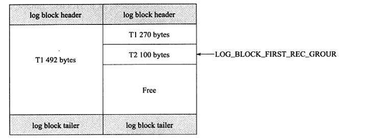
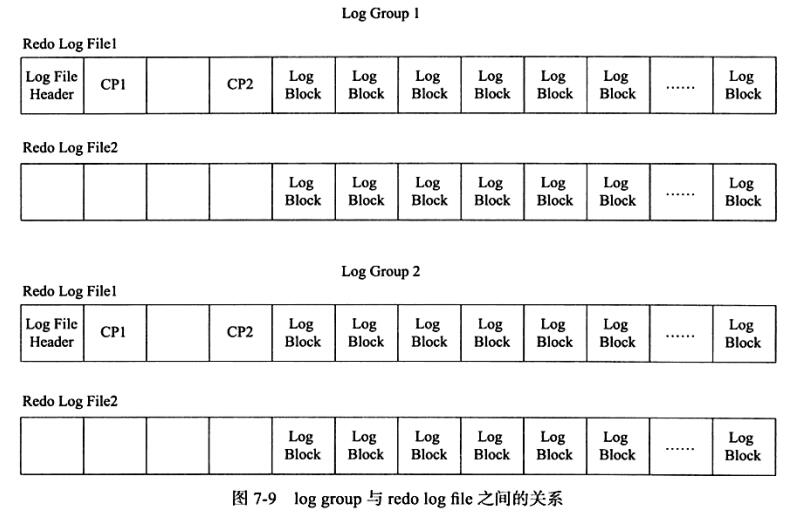

表空间：
数据页：以页的大小，记录表的数据，属于一个表空间，通过SpaceId 和 PageNum, 即表空间id和页号能确定一个数据页

undo log 用来事务回滚及MVCC的功能
redo log 用来保证事务的持久性，一个redo log记录某个数据页中某偏移量处的数据要修改成什么数据


## undo log

## redo log
当数据库对数据做修改的时候，需要把数据页从磁盘读到buffer pool中，然后在buffer pool中进行修改，那么这个时候buffer pool中的数据页就与磁盘上的数据页内容不一致，称buffer pool的数据页为dirty page 脏数据，如果这个时候发生非正常的DB服务重启，那么这些数据还在内存，并没有同步到磁盘文件中，也就是会发生数据丢失，如果这个时候，能够在有一个文件，当buffer pool 中的data page变更结束后，把相应修改记录记录到这个文件，那么当DB服务发生crash的情况，恢复DB的时候，也可以根据这个文件的记录内容，重新将修改的数据更新到磁盘数据页文件，保证数据的完整性。

这个文件就是redo log ，用于记录 数据修改后的记录，顺序记录。它可以带来这些好处：
- 当buffer pool中的dirty page 还没有刷新到磁盘的时候，发生crash，启动服务后，可通过redo log 找到需要重新刷新到磁盘文件的记录
- 如果将buffer pool中的数据直接flush到disk file，是一个随机IO，效率较差，而把buffer pool中的数据记录到redo log，是一个顺序IO，可以提高事务提交的速度

### redo参数
- innodb_log_files_in_group：redo log 文件的个数，命名方式如：ib_logfile0，iblogfile1… iblogfilen。默认2个，最大100个。
- innodb_log_file_size：文件设置大小，默认值为 48M，最大值为512G，注意最大值指的是整个 redo log系列文件之和，即（innodb_log_files_in_group变量值 * innodb_log_file_size ）不能大于最大值512G。
- innodb_log_group_home_dir：文件存放路径
- innodb_log_buffer_size：Redo Log 缓存区，默认8M，可设置1-8M。延迟事务日志写入磁盘，把redo log 放到该缓冲区，然后根据innodb_flush_log_at_trx_commit参数的设置，再把日志从buffer中flush到磁盘中。
- innodb_flush_log_at_trx_commit
  - innodb_flush_log_at_trx_commit=1，每次commit都会把redo log从redo log buffer写入到system，并通过fsync强制刷新到磁盘文件中。
  - innodb_flush_log_at_trx_commit=2，每次事务提交时MySQL会把日志从redo log buffer写入到system，但只写入到file system buffer，由系统内部来fsync到磁盘文件。如果数据库实例crash，不会丢失redo log，但是如果服务器crash，由于file system buffer还来不及fsync到磁盘文件，所以会丢失这一部分的数据。
  - innodb_flush_log_at_trx_commit=0，事务发生过程，日志一直记录在redo log buffer中，跟其他设置一样，但是在事务提交时，不产生redo 写操作，而是MySQL内部每秒操作一次，从redo log buffer，把数据写入到系统中去。如果发生crash，即丢失1s内的事务修改操作。由于进程调度策略问题,这个“每秒执行一次 flush(刷到磁盘)操作”并不是保证100%的“每秒”。

### redo buffer
Redo log文件以ib_logfile_x_命名，Redo log 以顺序的方式写入文件文件，写满时则回溯到第一个文件，进行覆盖写。（但在做redo checkpoint时，也会更新第一个日志文件的头部checkpoint标记，所以严格来讲也不算顺序写）。

实际上redo log有两部分组成：redo log buffer跟redo log file。buffer pool中把数据修改情况记录到redo log buffer，出现以下情况，再把redo log buffer刷下到redo log file：
1. Redo log buffer空间不足
2. 事务提交（依赖innodb_flush_log_at_trx_commit参数设置）
3. 后台线程
4. 做checkpoint
5. 实例shutdown
6. binlog切换

### 一条redo log记录了什么
重做日志格式: 不同的数据库操作会有对应的重做日志格式。此外，由于InnoDB存储引擎的存储管理是基于页的，故其重做日志格式也是基于页的。虽然有着不同的重做日志格式，但他们有着通用的头部格式，通用的头部格式由一下3部分组成
- redo_log_type 重做日志类型
- space: 表空间ID
- page_no 页的偏移量
- redo log body: 根据重做日志类型的不对，会有不同的存储内容

为了应对InnoDB各种各样不同的需求，到MySQL 8.0为止，已经有多达65种的REDO记录。用来记录这不同的信息，恢复时需要判断不同的REDO类型，来做对应的解析。根据REDO记录不同的作用对象，可以将这65中REDO划分为三个大类：作用于Page，作用于Space以及提供额外信息的Logic类型。

1. 作用于Page的REDO: 这类REDO占所有REDO类型的绝大多数，根据作用的Page的不同类型又可以细分为，Index Page REDO，Undo Page REDO，Rtree Page REDO等。比如MLOG_REC_INSERT，MLOG_REC_UPDATE_IN_PLACE，MLOG_REC_DELETE三种类型分别对应于Page中记录的插入，修改以及删除。这里还是以MLOG_REC_UPDATE_IN_PLACE为例来看看其中具体的内容：其中，Type就是MLOG_REC_UPDATE_IN_PLACE类型，Space ID 和 Page Number唯一标识一个Page页，这三项是所有REDO记录都需要有的头信息，后面的是MLOG_REC_UPDATE_IN_PLACE类型独有的，其中Record Offset用给出要修改的记录在Page中的位置偏移，Update Field Count说明记录里有几个Field要修改，紧接着对每个Field给出了Field编号(Field Number)，数据长度（Field Data Length）以及数据（Filed Data）。
2. 作用于Space的REDO：这类REDO针对一个Space文件的修改，如MLOG_FILE_CREATE，MLOG_FILE_DELETE，MLOG_FILE_RENAME分别对应对一个Space的创建，删除以及重命名。由于文件操作的REDO是在文件操作结束后才记录的，因此在恢复的过程中看到这类日志时，说明文件操作已经成功，因此在恢复过程中大多只是做对文件状态的检查，以MLOG_FILE_CREATE来看看其中记录的内容：同样的前三个字段还是Type，Space ID和Page Number，由于是针对Space的操作，这里的Page Number永远是0。在此之后记录了创建的文件flag以及文件名，用作重启恢复时的检查。
3. 提供额外信息的Logic REDO: 除了上述类型外，还有少数的几个REDO类型不涉及具体的数据修改，只是为了记录一些需要的信息，比如最常见的MLOG_MULTI_REC_END就是为了标识一个REDO组，也就是一个完整的原子操作的结束。


### log block
前面说明了在InnoDB存储引擎中一条redo log记录了什么，现在说一下它是如何进行物理存储的管理。

首先一条redo log内容大小是不确定的，但是在写入磁盘时是按固定大小512byte的log block写入的，如果redo log较大会占用多个log block, 较小时一个log block会存有多个redo log。另外redo log buffer、redo log file都是以log block的方式进行保存的。

一个log block块除了存日志本身之外，还由日志块头(log block header)及日志块尾(log block tailer)两部分组成。重做日志头一共占用12字节，重做日志尾占用8字节。故每个重做日志块实际可以存储的大小为492字节(512-12-8)，如图显示重做日志块缓存的结构：


如图显示了重做日志缓存的结果，可以发现，重做日志缓存由每个为512字节大小的日志块所组成，日志块由三部分组成，依次为日志块头(log block header)、日志内容(log body)、日志块尾(log block tailer)。log block header由4部分组成，分别占4、2、2、4字节，共12字节。
- LOG_BLOCK_HDR_NO：log buffer 是由log block组成，在内部log buffer就好似一个数组，因此LOG_BLOCK_HDR_NO用来标记这个数组中的位置，尤其是递增并且循环使用的。占用4个字节。但是由于第一位用来判断是否是flush bit，所以最大值为2G（2的31次方）
- LOG_BLOCK_HDR_DATA_LEN：占用2个字节，表示log block所占用的大小，当log block被写满时，该值为0x200,表示使用全部的log block空间，即占用512字节
- LOG_BLOCK_FIRST_REC_GROUP：占用2个字节，表示log block中第一个日志所在的偏移量，因为存在该log block开头保存有上一个日志剩余数据的情况。如果该值的大小和LOG_BLOCK_HDR_DATA_LEN相同，则表示当前log block不包含新的日志，只保存了之前日志剩余数据的情况。如事务T1的重做日志1占用762字节，事务T2的重做日志占用100字节。由于每个log block实际只能保存492字节，因此其在log buffer的情况应该如图所示：



从图可以观察到，由于事务T1的重做日志占用792字节，因此需要占用两个log block。左侧的log block中 LOG_BLOCK_FIRST_REC_GROUP 为 12，即前12个字节是log block header, 然后第一个存储日志的开始位置，在第二个log block中，由于包含了之前事务T1的重做日志，事务T2的日志才是log block中第一日志，因此该log block的LOG_BLOCK_FIRST_REC_GROUP为（270+12）

- LOG_BLOCK_CHECKPOINT_NO占用4字节，表示该log block最后被写入时的检查点，写Block时的next_checkpoint_number，用来发现文件的循环使用
- log block tailer 只由1个部分组成，且值和LOG_BLOCK_HDR_NO相同，并在函数log_block_init中被初始化 LOG_BLOCK_TRL_NO 大小为4字节

### log group
log group 重做日志组，是一个逻辑的概念，并没有一个实际的物理文件来表示log group信息，log group 由多个重做日志文件组成。每个log group中的日志文件是相同的。

InnoDB存储引擎默认只能有一个log group。

### redo log file
重做日志文件中存储就是之前log buffer中保存的log block。因此其也是根据块的方式进行物理存储的管理，每个块的大小与log block一样，同样为512字节，在InnoDB存储引擎运行过程中，log buffer根据一定的规则将内存中的log block刷新到磁盘。这个规则具体是
- 事务提交时
- 当log buffer中有一半的内存空间已经被使用时
- log checkpoint时

对于log block的写入追加在redo log file最后部分，当一个redo log file写满时，会接着写下一个redo log file，其使用的方式为round-robin。

虽然log block总是在redo log file的最后部分进行写入，有的读者可能以为对redo log file的写入时顺序的，其实不是，因为redo log file除了保存log buffer刷新到磁盘的log block，还保存了一些其他的信息，这些信息一共占用2KB大小，即每个redo log file的前2KB的部分不保存log block信息，对于log group中的第一个redo log file,其前2KB的部分保存4个512字节大小的块，其中存放的内容为


需要特别注意，上述信息仅在每个log group的第一个redo log file中进行存储，log group中的其余redo log file仅保留这些空间，但不保存上述信息。正因为保存了这些信息，就意味着对redo log file 的写入并不是完全顺序的。因为其除了log block的写入操作，还需要更新前2KB部分的信息，这些信息对于InnoDB存储引擎的恢复操作来说非常关键和重要，故log group与redo log file 之间的关系如下



在log filer header 后面的部分为InnoDB存储引擎保存的checkpoint(检查点)值，其设计是交替写入。这样的设计避免了因介质失败而导致无法找到可用的checkpoint的情况

### 表空间
在innodb存储引擎中数据是按照表空间来组织存储的，即表空间是表空间文件，是实际存在的物理文件。

sys表空间：默认情况下，MySQL会初始化一个大小为12MB，名为ibdata1文件，并且随着数据的增多，它会自动扩容。这个ibdata1文件是系统表空间，也是默认的表空间，也是默认的表空间物理文件，也是传说中的共享表空间。

file per table 表空间：如果你想让每一个数据库表都有一个单独的表空间文件的话，可以通过参数innodb_file_per_table设置。这个参数只有在MySQL5.6或者是更高的版本中才可以使用。独立的表空间文件命名规则：表名.ibd。注意：独立表空间文件中仅存放该表对应数据、索引、insert buffer bitmap。其余的诸如：undo信息、insert buffer 索引页、double write buffer 等信息依然放在默认表空间，也就是共享表空间中。

```
# my.cnf   
#配置sys表空间
innodb_data_file_path=/dir1/ibdata1:2000M;/dir2/ibdata2:2000M:autoextend

# file per table 表空间
innodb_file_per_table=ON
```

最后再简述一下这种file per table的优缺点：

优点：
- 提升容错率，表A的表空间损坏后，其他表空间不会收到影响。s
- 使用MySQL Enterprise Backup快速备份或还原在每表文件表空间中创建的表，不会中断其他InnoDB 表的使用

缺点：对fsync系统调用来说不友好，如果使用一个表空间文件的话单次系统调用可以完成数据的落盘，但是如果你将表空间文件拆分成多个。原来的一次fsync可能会就变成针对涉及到的所有表空间文件分别执行一次fsync，增加fsync的次数。


临时表空间：临时表空间用于存放用户创建的临时表和磁盘内部临时表。参数innodb_temp_data_file_path定义了临时表空间的一些名称、大小、规格属性
独享表空间：独享表空间存储方式使用“.ibd”文件来存放数据，且每个表一个“.ibd”文件，文件存放在和MyISAM数据相同的位置。
共享表空间：如果选用共享存储表空间来存放数据，则会使用 ibdata 文件来存放，所有表共同使用一个（或者多个，可自行配置）ibdata文件。
undo表空间：相信你肯定听过说undolog，常见的当你的程序想要将事物rollback时，底层MySQL其实就是通过这些undo信息帮你回滚的。在MySQL的设定中，有一个表空间可以专门用来存放undolog的日志文件。然而，默认配置是会将undolog放置到系统表空间中。如果你的MySQL是新安装的，那你可以通过查看变量：innodb_undo_tablespaces，看看你的MySQL undo表空间的使用情况。

那undo log到底是该使用默认的配置放在系统表空间呢？还是该放在undo表空间呢？
这其实取决服务器使用的存储卷的类型。
如果是SSD存储，那推荐将undo info存放在 undo表空间中。

## 参考资料
> - [http://mysql.taobao.org/monthly/2020/02/01/](http://mysql.taobao.org/monthly/2020/02/01/)
> - [https://blog.csdn.net/linuxheik/article/details/62043450](https://blog.csdn.net/linuxheik/article/details/62043450)
