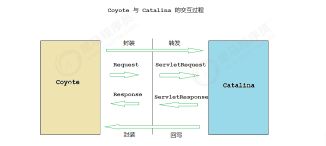
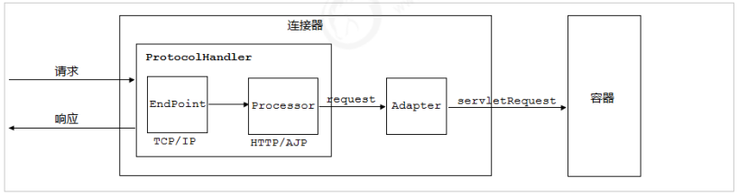
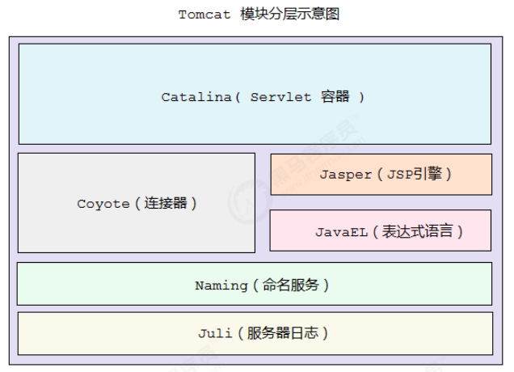
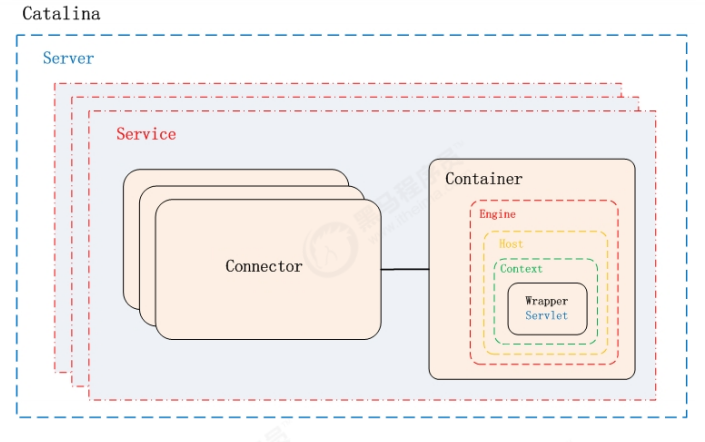
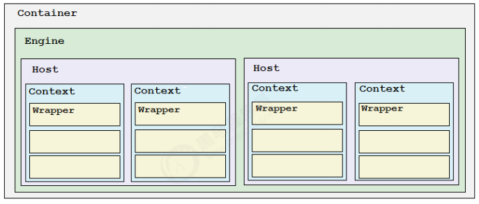
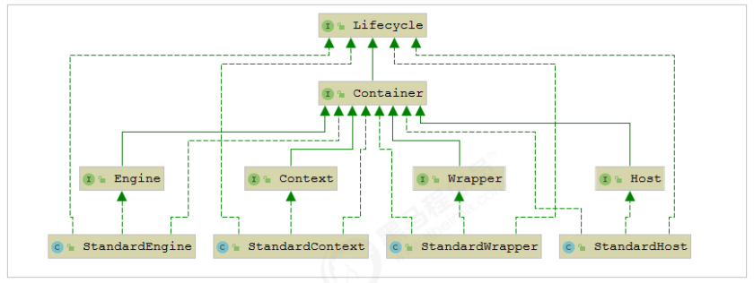
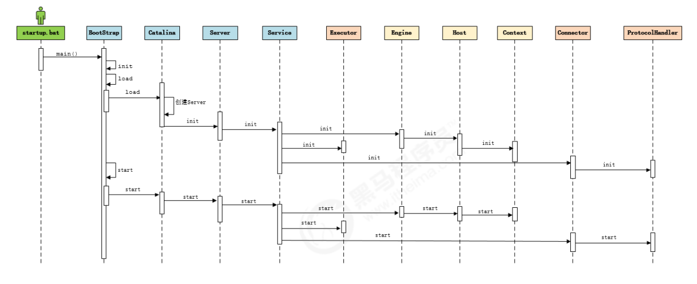
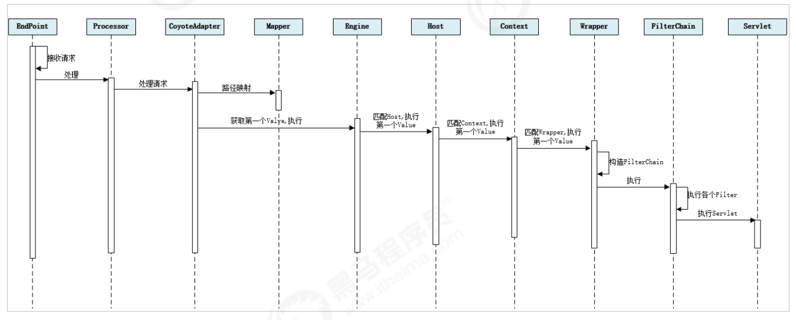
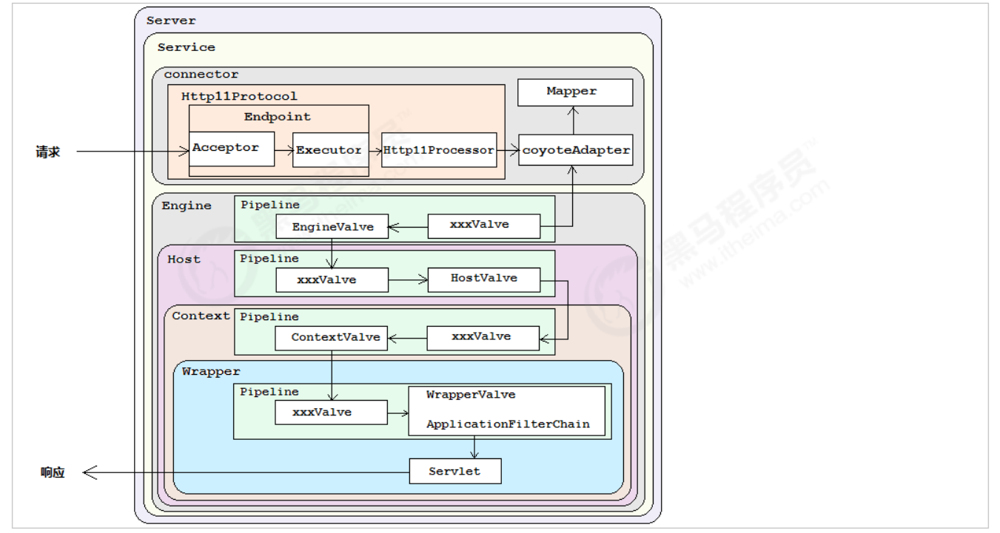

## 常见web服务器软件
- webLogic：oracle公司，大型的JavaEE服务器，支持所有的JavaEE规范，收费的。
- webSphere：IBM公司，大型的JavaEE服务器，支持所有的JavaEE规范，收费的。 
- JBoss：JBOSS公司的，大型的JavaEE服务器，支持所有的JavaEE规范，收费的。 
- Tomcat：Apache基金组织，中小型的JavaEE服务器，仅仅支持少量的JavaEE规范 servlet/jsp。开源的，免费的。

## Tomcat 历史 
1. Tomcat 最初由Sun公司的软件架构师 James Duncan Davidson 开发，名称为 “JavaWebServer”。 
2. 1999年，在 Davidson 的帮助下，该项目于1999年他和 apache 软件基金会旗下的 JServ 项目合并，并发布第一个版本（3.x）, 即是现在的Tomcat，该版本实现了 Servlet2.2 和 JSP 1.1 规范 。
3. 2001年，Tomcat 发布了4.0版本， 作为里程碑式的版本，Tomcat 完全重新设计了 其架构，并实现了 Servlet 2.3 和 JSP1.2规范。 
4. 目前 Tomcat 已经更新到 9.0.x版本 ， 但是目前企业中的Tomcat服务器， 主流版本还是 7.x 和 8.x ， 所以以下基于 8.5 版本进行讲解。

## 整体架构
我们知道如果要设计一个系统，首先是要了解需求，我们已经了解了Tomcat要实现两个 核心功能：
1. 处理Socket连接，负责网络字节流与Request和Response对象的转化。 
2. 加载和管理Servlet，以及具体处理Request请求。 

因此Tomcat设计了两个核心组件连接器（Connector）和容器（Container）来分别做这 两件事情。连接器负责对外交流，容器负责内部处理。


## 连接器 - Coyote 
### 架构介绍 
Coyote 是Tomcat的连接器框架的名称 , 是Tomcat服务器提供的供客户端访问的外部接口。客户端通过Coyote与服务器建立连接、发送请求并接受响应。
Coyote 封装了底层的网络通信（Socket 请求及响应处理），为Catalina 容器提供了统一 的接口，使Catalina 容器与具体的请求协议及IO操作方式完全解耦。Coyote 将Socket 输入转换封装为 Request 对象，交由Catalina 容器进行处理，处理请求完成后, Catalina 通 过Coyote 提供的Response 对象将结果写入输出流。 
Coyote 作为独立的模块，只负责具体协议和IO的相关操作， 与Servlet 规范实现没有直 接关系，因此即便是 Request 和 Response 对象也并未实现Servlet规范对应的接口， 而 是在Catalina 中将他们进一步封装为ServletRequest 和 ServletResponse 。



### IO模型与协议 
在Coyote中 ， Tomcat支持的多种I/O模型和应用层协议，Tomcat 支持的IO模型（自8.5/9.0 版本起，Tomcat 移除了 对 BIO 的支持）：
- NIO 非阻塞I/O，采用Java NIO类库实现。 
- NIO2 异步I/O，采用JDK 7最新的NIO2类库实现。 
- APR 采用Apache可移植运行库实现，是C/C++编写的本地库。如果选择该方案，需要单独安装APR库。

应用层协议如下：
- HTTP/1.1：这是大部分Web应用采用的访问协议。 
- AJP：用于和Web服务器集成（如Apache），以实现对静态资源的优化以及集群部署，当前支持AJP/1.3。 
- HTTP/2：HTTP 2.0大幅度的提升了Web性能。下一代HTTP协议 ， 自8.5以及9.0 版本之后支持。

在 8.0 之前 ， Tomcat 默认采用的I/O方式为 BIO ， 之后改为 NIO。 无论 NIO、NIO2 还是 APR， 在性能方面均优于以往的BIO。 如果采用APR， 甚至可以达到 Apache HTTP Server 的影响性能。

Tomcat中的Service概念：Tomcat为了实现支持多种I/O模型和应用层协议，一个容器可能对接多个连接器，就好比 一个房间有多个门。但是单独的连接器或者容器都不能对外提供服务，需要把它们组装 起来才能工作，组装后这个整体叫作Service组件。这里请你注意，Service本身没有做什 么重要的事情，只是在连接器和容器外面多包了一层，把它们组装在一起。Tomcat内可 能有多个Service，这样的设计也是出于灵活性的考虑。通过在Tomcat中配置多个 Service，可以实现通过不同的端口号来访问同一台机器上部署的不同应用。

### 连接器组件

连接器中的各个组件的作用如下： 

- EndPoint ： Coyote 通信端点，即通信监听的接口，是具体Socket接收和发送处理器，是对传输层的抽象，因此EndPoint用来实现TCP/IP协议的。Tomcat 并没有EndPoint 接口，而是提供了一个抽象类AbstractEndpoint ， 里面定 义了两个内部类：Acceptor和SocketProcessor。Acceptor用于监听Socket连接请求。 SocketProcessor用于处理接收到的Socket请求，它实现Runnable接口，在Run方法里 调用协议处理组件Processor进行处理。为了提高处理能力，SocketProcessor被提交到 线程池来执行。而这个线程池叫作执行器（Executor)，我在后面的专栏会详细介绍 Tomcat如何扩展原生的Java线程池。 
- Processor ： Coyote 协议处理接口 ，如果说EndPoint是用来实现TCP/IP协议的，那么 Processor用来实现HTTP协议，Processor接收来自EndPoint的Socket，读取字节流解 析成Tomcat Request和Response对象，并通过Adapter将其提交到容器处理， Processor是对应用层协议的抽象。 
- ProtocolHandler： Coyote 协议接口， 通过Endpoint 和 Processor ， 实现针对具体协议的处理能力。Tomcat 按照协议和I/O 提供了6个实现类 ： AjpNioProtocol， AjpNio2Protocol ，AjpAprProtocol， Http11NioProtocol ，Http11Nio2Protocol ， Http11AprProtocol。我们在配置tomcat/conf/server.xml 时 ， 至少要指定具体的 ProtocolHandler , 当然也可以指定协议名称， 如 ： HTTP/1.1 ，如果安装了APR，那么 将使用Http11AprProtocol ， 否则使用 Http11NioProtocol 。
- Adapter:  由于协议不同，客户端发过来的请求信息也不尽相同，Tomcat定义了自己的Request类 来“存放”这些请求信息。ProtocolHandler接口负责解析请求并生成Tomcat Request类。 但是这个Request对象不是标准的ServletRequest，也就意味着，不能用Tomcat Request作为参数来调用容器。Tomcat设计者的解决方案是引入CoyoteAdapter，这是 适配器模式的经典运用，连接器调用CoyoteAdapter的Sevice方法，传入的是Tomcat Request对象，CoyoteAdapter负责将Tomcat Request转成ServletRequest，再调用容 器的Service方法。

## 容器 - Catalina 
Tomcat是一个由一系列可配置的组件构成的Web容器，而Catalina是Tomcat的servlet容器。Catalina 是Servlet 容器实现，包含了之前讲到的所有的容器组件，以及后续章节涉及到的安全、会话、集群、管理等Servlet 容器架构的各个方面。它通过松耦合的方式集成 Coyote，以完成按照请求协议进行数据读写。同时，它还包括我们的启动入口、Shell程序等

### Catalina 地位 
Tomcat 的模块分层结构图， 如下：

Tomcat 本质上就是一款 Servlet 容器， 因此Catalina 才是 Tomcat 的核心 ， 其他模块 都是为Catalina 提供支撑的。 比如 ： 通过Coyote 模块提供链接通信，Jasper 模块提供 JSP引擎，Naming 提供JNDI 服务，Juli 提供日志服务。

### Catalina 结构 
Catalina 的主要组件结构如下：


如上图所示，Catalina负责管理Server，而Server表示着整个服务器。Server下面有多个 服务Service，每个服务都包含着多个连接器组件Connector（Coyote 实现）和一个容器 组件Container。在Tomcat 启动的时候， 会初始化一个Catalina的实例。 
Catalina 各个组件的职责：
- Catalina： 负责解析Tomcat的配置文件 , 以此来创建服务器Server组件，并根据 命令来对其进行管理 
- Server： 服务器表示整个Catalina Servlet容器以及其它组件，负责组装并启动 Servlet引擎,Tomcat连接器。Server通过实现Lifecycle接口，提供了 一种优雅的启动和关闭整个系统的方式 
- Service： 服务是Server内部的组件，一个Server包含多个Service。它将若干个 Connector组件绑定到一个Container（Engine）上 
- Connector： 连接器，处理与客户端的通信，它负责接收客户请求，然后转给相关 的容器处理，最后向客户返回响应结果 
- Container： 容器，负责处理用户的servlet请求，并返回对象给web用户的模块

### Container 结构
Tomcat设计了4种容器，分别是Engine、Host、Context和Wrapper。这4种容器不是平 行关系，而是父子关系。， Tomcat通过一种分层的架构，使得Servlet容器具有很好的灵活性。


各个组件的含义 ：
- Engine： 表示整个Catalina的Servlet引擎，用来管理多个虚拟站点，一个Service 最多只能有一个Engine，但是一个引擎可包含多个Host 
- Host： 代表一个虚拟主机，或者说一个站点，可以给Tomcat配置多个虚拟主机地址，而一个虚拟主机下可包含多个Context 
- Context： 表示一个Web应用程序， 一个Web应用可包含多个Wrapper 
- Wrapper： 表示一个Servlet，Wrapper 作为容器中的最底层，不能包含子容器

我们也可以再通过Tomcat的server.xml配置文件来加深对Tomcat容器的理解。Tomcat 采用了组件化的设计，它的构成组件都是可配置的，其中最外层的是Server，其他组件 按照一定的格式要求配置在这个顶层容器中。

```xml
<Server>
    <Service>
        <Connector/>
        <Connector/>

        <Engine>
            <Host>
                <Context>
            </Host>
        <Engine>
    </Service>
</Server>
```
那么，Tomcat是怎么管理这些容器的呢？你会发现这些容器具有父子关系，形成一个树 形结构，你可能马上就想到了设计模式中的组合模式。没错，Tomcat就是用组合模式来 管理这些容器的。具体实现方法是，所有容器组件都实现了Container接口，因此组合模 式可以使得用户对单容器对象和组合容器对象的使用具有一致性。这里单容器对象指的 是最底层的Wrapper，组合容器对象指的是上面的Context、Host或者Engine。



Container 接口中提供了addChild()、getParent()等方法，Container接口扩展了LifeCycle接口，LifeCycle接口用来统一管理各组件的生命周期，后面我也用专门的篇幅去详细介绍。

## 启动流程


1. 启动tomcat ， 需要调用 bin/startup.bat (在linux 目录下 , 需要调用 bin/startup.sh) ， 在startup.bat 脚本中, 调用了catalina.bat。 
2. 在catalina.bat 脚本文件中，调用了org.apache.catalina.startup.Bootstrap 中的main方法。 
3. 在BootStrap 的main 方法中调用了 init 方法 ， 来创建Catalina 及 初始化类加载器。 
4. 在BootStrap 的main 方法中调用了 load 方法 ， 在其中又调用了Catalina的load方法。
5. 在Catalina 的load 方法中 , 需要进行一些初始化的工作, 并需要构造Digester 对象, 用 于解析 XML。 
6. 然后在调用后续组件的初始化操作，加载Tomcat的配置文件，初始化容器组件 ，监听对应的端口号， 准备接受客户端请求

### Lifecycle 
由于所有的组件均存在初始化、启动、停止等生命周期方法，拥有生命周期管理的特性， 所以Tomcat在设计的时候， 基于生命周期管理抽象成了一个接口 Lifecycle ，而组 件 Server、Service、Container、Executor、Connector 组件 ， 都实现了一个生命周期 的接口，从而具有了以下生命周期中的核心方法：
- init（）：初始化组件 
- start（）：启动组件 
- stop（）：停止组件 
- destroy（）：销毁组件

从启动流程图中以及源码中，我们可以看出Tomcat的启动过程非常标准化， 统一按照生 命周期管理接口Lifecycle的定义进行启动。首先调用init() 方法进行组件的逐级初始化操 作，然后再调用start()方法进行启动。 每一级的组件除了完成自身的处理外，还要负责调用子组件响应的生命周期管理方法， 组件与组件之间是松耦合的，因为我们可以很容易的通过配置文件进行修改和替换。

## 请求处理流程
设计了这么多层次的容器，Tomcat是怎么确定每一个请求应该由哪个Wrapper容器里的 Servlet来处理的呢？答案是，Tomcat是用Mapper组件来完成这个任务的。 Mapper组件的功能就是将用户请求的URL定位到一个Servlet，它的工作原理是： Mapper组件里保存了Web应用的配置信息，其实就是容器组件与访问路径的映射关系， 比如Host容器里配置的域名、Context容器里的Web应用路径，以及Wrapper容器里 Servlet映射的路径，你可以想象这些配置信息就是一个多层次的Map。

当一个请求到来时，Mapper组件通过解析请求URL里的域名和路径，再到自己保存的 Map里去查找，就能定位到一个Servlet。请你注意，一个请求URL最后只会定位到一个 Wrapper容器，也就是一个Servlet。

上面只是描述了根据请求的URL如何查找到需要执行的Servlet ， 那么下面我们 再来解析一下 ， 从Tomcat的设计架构层面来分析Tomcat的请求处理。



1. Connector组件Endpoint中的Acceptor监听客户端套接字连接并接收Socket。 
2. 将连接交给线程池Executor处理，开始执行请求响应任务。 
3. Processor组件读取消息报文，解析请求行、请求体、请求头，封装成Request对象。 
4. Mapper组件根据请求行的URL值和请求头的Host值匹配由哪个Host容器、Context容器、Wrapper容器处理请求。 
5. CoyoteAdaptor组件负责将Connector组件和Engine容器关联起来，把生成的 Request对象和响应对象Response传递到Engine容器中，调用 Pipeline。 
6. Engine容器的管道开始处理，管道中包含若干个Valve、每个Valve负责部分处理逻辑。执行完Valve后会执行基础的 Valve--StandardEngineValve，负责调用Host容器的 Pipeline。 
7. Host容器的管道开始处理，流程类似，最后执行 Context容器的Pipeline。 
8. Context容器的管道开始处理，流程类似，最后执行 Wrapper容器的Pipeline。 
9. Wrapper容器的管道开始处理，流程类似，最后执行 Wrapper容器对应的Servlet对象 的 处理方法。



在前面所讲解的Tomcat的整体架构中，我们发现Tomcat中的各个组件各司其职，组件 之间松耦合，确保了整体架构的可伸缩性和可拓展性，那么在组件内部，如何增强组件 的灵活性和拓展性呢？ 在Tomcat中，每个Container组件采用责任链模式来完成具体的 请求处理。 在Tomcat中定义了Pipeline 和 Valve 两个接口，Pipeline 用于构建责任链， 后者代表责 任链上的每个处理器。Pipeline 中维护了一个基础的Valve，它始终位于Pipeline的末端 （最后执行），封装了具体的请求处理和输出响应的过程。当然，我们也可以调用 addValve()方法， 为Pipeline 添加其他的Valve， 后添加的Valve 位于基础的Valve之 前，并按照添加顺序执行。Pipiline通过获得首个Valve来启动整合链条的执行 。


## 参考资料
> - [https://www.bilibili.com/video/BV1dJ411N7Um](https://www.bilibili.com/video/BV1dJ411N7Um)
> - []()
