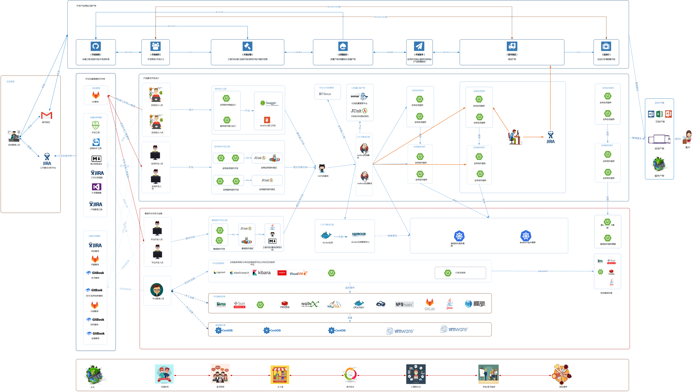
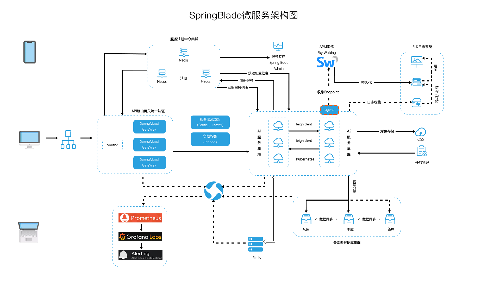

这是 fymingf 的个人 Wiki 站点，主要记录一些自己总结的只言片语的零散知识点。

我一直觉得 **知识不能碎片化，要结构化**，于是希望寻找一种优雅的方式来管理我的知识。

先后了解或尝试过 OneNote、Evernote、Blog、Wiki 等方式，总结了一套觉得比较合理的知识获取吸收管理流程：

1. 通过网页、RSS、微信等网络渠道作为知识获取来源。
2. 通过笔记系统（手写笔记、OneNote、Evernote）初步筛选有价值有针对性的信息，**收藏**信息，**分类整理**，做读后**要点**笔记记录。
3. 自己平时突然想到或总结的一两句话，或很零碎的点子、灵感，初步消化的内容，则用 **Wiki** 记录。
4. 最后当 Wiki 在某版块有一定量后，将这方面笔记和 Wiki 中的内容重读，整理和提炼，二次消化精炼再加上自己的感悟和理解，写成文章发表在 **博客** 上。

在使用中，**笔记系统** 主大块信息的**分类和整理**，**Wiki** 主零碎知识的**积累**，而 **博客** 只在于 **精**。

Wiki 中某一版块刚建时，可能只有很少内容或者就一句话，但是通过这种使用流程，日积月累，这方面的事物接触得多了，零散的知识也就多了，那么 Wiki 中这个版块记录的内容也就会变多了，也就是**通过积累，把原本大量碎片化的知识结构化整理起来了**。

博客的目的是 **分享和展示**，分享自己的知识，展示自己的水平，需要放拿得出手的东西，因此不适合放碎片化的只言片语，更适合放 **一个系列** 的总结或者教程等，是一个十分成体系的知识平台。

>  浮云遮月不分明，谁挽长江一洗放天青

<!--  

有兴趣的可以一起交流

一个深思熟虑的决定|一番夜以继日的付出 | 一些曲折离奇的经历 
---|---|---|---|---
初闻不知曲中意 ， 再听已是曲中人 。 | 本是青灯不归客 ， 却因浊酒恋红尘 。| 一个轮回的对视： 一个是羡慕，一个是好奇，我曾是你，你终会是我。
曲中思念今犹在 ，不见当年梦中人。|  星空不问赶路人 ， 岁月不负有心人。| 往日情怀酿做酒，换我余生长醉不复忧。

> 人们之所以不愿改变，是因为害怕未知。但历史唯一不变的事实，就是一切都会改变。       —— 尤娃尔·赫拉利《未来简史》

另外，还有一个专门写架构方面知识的网站，有兴趣的可以一起交流  ==>  [Just playing arch](http://arch.minfy.cn/)

本文是一个索引帖，方便找到自己感兴趣的文章，你也可以使用左侧的分类及搜索功能。
有新文章时会更新本文，建议大家加入收藏夹中，如果你觉得本站不错，欢迎你转发给朋友。

## 前端
主要围绕Vue生态和ES6语法，也涉及到周边构建工具等的介绍和使用。

## 后端
主要语言是Java，深度解析Spring及Spring Boot。

还有关于并发控制、网络编程、设计模式等系列文章。

> 人们之所以不愿改变，是因为害怕未知。但历史唯一不变的事实，就是一切都会改变。
>                                               —— 尤娃尔·赫拉利《未来简史》
>                                               

自我管理，知识管理，时间管理，阅读，写作，思维导图，Wiz，TimeMeter

推荐博客 | 推荐书籍 
---|---|---|---
[阮一峰](http://www.ruanyifeng.com/) | 未来架构(张亮/吴晟/敖小剑/宋净超) 
[翟永超](http://blog.didispace.com/) | 枪炮、病菌与钢铁([美]贾雷德.戴蒙德) 
[JavaDoop](https://javadoop.com) | 

 -->

<!-- 
推荐博客 | 推荐书籍 | 推荐技术 | 推荐Github
---|---|---|---
[阮一峰](http://www.ruanyifeng.com/) | 未来架构(张亮/吴晟/敖小剑/宋净超) | todo | todo
[翟永超](http://blog.didispace.com/) | | | 
[JavaDoop](https://javadoop.com) | | | 
[徐靖峰](https://www.cnkirito.moe/) | | | 
[纯洁的微笑](http://www.ityouknow.com/spring-boot.html) | | | 

后端 | 前端 | 容器服务 | 大数据
---|---|---|---
Spring Boot |  Vue | Docker | Hadoop
Spring Cloud | webpack | kubernate | Hbase 
Mybatis |  iView | Rancher | Spark
Dubbo |  | |
RabbitMQ | | | 
-->

<!-- ## 后端技术栈
技术 | 名称 | 官网
---|---|---
Spring Boot | you know | https://spring.io/projects/spring-boot
Spring Cloud | 微服务框架 | https://spring.io/projects/spring-cloud
Mybatis | ORM框架 | http://www.mybatis.org/mybatis-3/zh/index.html
Dubbo | RPC框架 | http://dubbo.apache.org/zh-cn/
RabbitMQ | 消息队列 | aa

## 前端技术栈
技术 | 名称 | 官网
---|---|---
Node.js | aa | https://nodejs.org/en/
Vue| aaa | https://vuejs.org/
webpack | aa | https://webpack.js.org/

## 大数据技术栈
技术 | 名称 | 官网
---|---|---
Node.js | aa | https://nodejs.org/en/ -->

