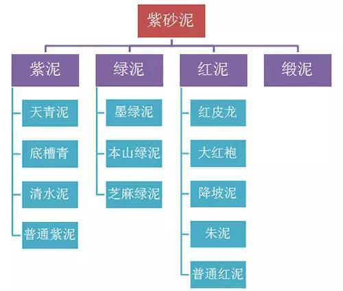
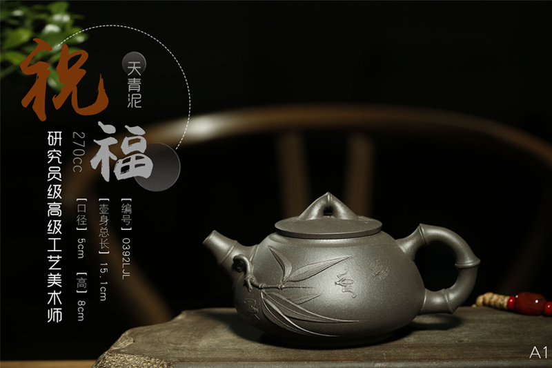
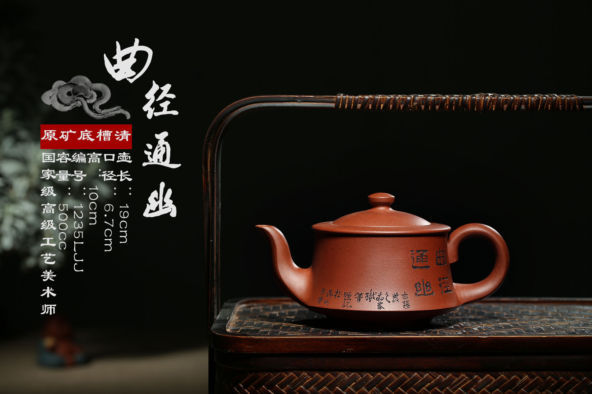
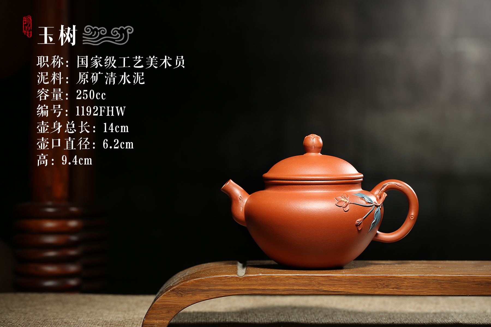

中国有句古语“开门七件事，柴米油盐酱醋茶”，由此可见，茶，对中国人来说是多么的重要。

紫砂所用的泥料呢不是简单的泥土和水，而是经过层层打磨、过筛、搅拌、炼泥等好几道复杂的工序才会变成可以直接制作壶具的材料。而实际上紫砂泥是一种含铁粘土质粉砂岩的统称，也被称为五色土。

总体而言，紫砂泥料传统的分类为：紫泥、绿泥、红泥三大类，缎泥为共生矿，一般未单独分类。紫泥、绿泥、红泥是根据矿岩的基本颜色或者烧成之后的颜色命名，这每一大类中又各有细分，色泽、泥性各有不同。

## 紫泥
- 天青泥：号称泥中极品，古不多见，久已绝迹。

- 底槽青：因通常处于紫泥泥层底部，故名有老嫩之分，矿料一般呈紫褐色致密块状，有青绿色豆斑状（俗称“鸡眼”、“猫眼”），烧成后呈紫红色。

- 清水泥：一般为紫褐色致密块状，有云母碎片，矿料上带淡绿色斑点、斑纹状，烧成后呈紫棕红色，高温呈紫黑、暗青色，一般指单一矿料仅加石黄等练成的紫泥。

- 普通紫泥：一般指拼紫，为紫泥矿料添加少量氧化锰炼制而成。

## 绿泥
- 本山绿泥：一般指黄龙山优质绿泥，呈淡绿色致密块状，烧成后呈浅黄、米黄色，高温泛青绿色。
- 芝麻绿泥：呈青绿色致密块状，烧成后胎质中含黑砂质点较多，故称为“芝麻绿泥”，有白麻子泥、红麻子泥。
- 墨绿泥：因矿料呈墨绿色，故称“墨绿泥”，烧成后呈米黄色、浅黄色，高温透青。

## 红泥

- 红皮龙：一般产于黄龙山浅表碎石层中，也称野山红泥，呈浅暗红色致密块状，烧成后呈红色、暗红色，红皮龙相对石英含量较高，云母杂质也比较多，透气性能好，泡茶易上手，亲和力佳，温度简单易掌握，使用愈久愈发红润，为雅俗共赏之泡茶利器。
- 大红袍：经过窑烧会变成大红色，泥质细腻密度高、高结晶，泡茶柔顺好喝，经过泡茶养成色泽艳红非常讨喜。大红袍红豔夺目，气质高雅，令观者满受瑞气临身，鸿运当头之意；为濒临绝灭之极品朱泥。
- 降坡泥：降坡泥，不属于红泥一类，降坡泥是共生矿。降坡泥系修建陶都路时，在青龙山与黄龙山交界处降坡工程中产出，故名降坡泥，降坡泥是共生矿。
- 朱泥：矿料呈黄色致密块状或团块状，质地均匀细腻，烧成后呈朱砂色、朱砂紫、海棠红等，因收缩变形较大，故有“无朱不皱”之说，适宜做小品。熟泥极细腻，如赵庄“鹅黄朱泥”，因泥粘糯如年糕，也被称为“年糕泥”。
- 普通红泥：有大红泥、小红泥之分，有老、嫩之分，呈浅黄色、青黄色致密块状，烧成后呈红色透黄，高温呈暗红色。

## 缎泥

古称团泥，有人说黄龙山、青龙山之间有团山，产出泥料为团泥，也有人说团泥类矿烧成后多呈黄缎色，故称为缎泥。缎泥一般为共生矿，绿泥与紫泥共生矿，绿泥与红泥共生矿，烧成后有米黄色、棕黄色、赭灰色、褐紫色等，历史上的壶呈古铜、棕黄、冷金黄等色的均为缎泥。

## 参考资料

> - 
> - 
