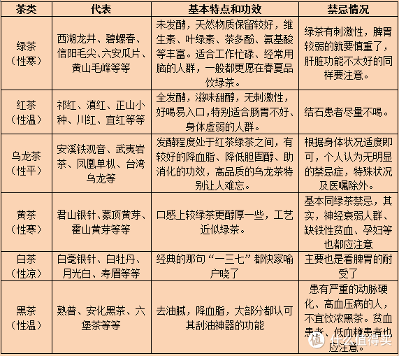

年年岁岁花相似，岁岁年年人不同。618将至，各类大促拉开帷幕。又是夏天，各位在剁手血拼的同时，有喝茶习惯的或者将要加入茶友大军的，不妨关注一下。那么，究竟如何选购茶叶呢？回答这个问题之前，先说明一点，有渠道的完全不用网购。

## 结合需求

#### 自己喝

1. **结合自己身体条件。**这方面，或多或少要注意一下，有的值友本身胃就容易受刺激，或者某段时间胃不舒服，还推荐喝绿茶，那只能适得其反。这里整理一下相关资料，简单汇总，也算是科普了。

2. **结合自身口味要求。**每一个人的口味要求都不一样，不能用统一要求来约束。一般而言，鲜爽自然优先选绿茶，春尝一口鲜嘛；甜醇优先选红茶，尤其是出了金骏眉之后；追求岩韵自然选武夷岩茶，岩骨花香无法替代；馥郁花香甜柔耐泡可能得优先选生普了，口感醇厚顺滑可能得优先选熟普了；喜欢特殊口味的那就自行筛选吧，比如六堡茶里的陈年宝香，有的人喝得来盛赞其红浓艳，有的人却一口都喝不下……

   同时，应该注意这个口味，一般我们都很在乎香气、汤水口感。某种意义上，香气和口感相互交融。其一，闻香，这是嗅觉，送给鼻子的礼物；其二，品香，主要是味觉，舌尖上的盛宴。至于香型，三言两语说不清楚，回头有机会可以慢慢聊聊。但个人认为，不管是哪一类香型，正、清、纯是基础。大部分被认可的香型通常也会被你认可，除非是某一类特别讨厌的香型，举个例子，薯香，有的人就是如何也爱不起来。一般而言，商品描述界面里通常会对香气进行描述，用来参考就好。

3. **结合自己钱包情况。**这个就不用多说了，想喝好茶就得多花钱，每个人的经济情况不一样，对茶的需求不一样，不要过分强求，否则剁手太狠，穷得可能只剩下茶了。茶本身就是农作物，一片叶子的故事演绎，归根结底是成为饮品，供大家品饮，理应理性对待，在自己的范围内认可的才是最好的。不想花钱还想喝天价茶之类的，也有机会，就各种的蹭茶吧，这一类不在选购茶的行列，属另辟蹊径。

#### 送人

还有值友买茶是专门送人的，并非自用。这种情况，尽量选硬货，流通品牌，送与被送的人都明白其价值，品质上也较一般茶有保障。同时，还得适当考虑包装的问题，根据实际情况决定是否应该选用精美包装。关于包装问题，多说几句，虽然明知道几十块钱的包装成本是羊毛出在羊身上，但有时候没有好看的包装盒还真是拿不出手送人。除此之外，还得考虑被送者的爱好与需求，如此这般，不再赘述。

## 考虑品牌

#### 1. 绿茶类

- 西湖龙井：[西湖牌](https://pinpai.smzdm.com/25909/)、狮峰牌、御牌、贡牌、狮牌、卢正浩等
- 碧螺春：吴侬、三万昌、碧螺等
- 信阳毛尖：文新、龙潭、蓝天等
- 安吉白茶：宋茗、芳羽、极白、岙里岙等
- 六安瓜片：徽六、一笑堂、徽将军等
- 太平猴魁：猴坑、六百里等
- 黄山毛峰：徽六、谢四十、汪满田，谢裕大等
- 都匀毛尖：贵天下、贵山等
- 蒙顶甘露：蒙顶山茶、跃华、禹蒙等

#### 2.白茶类

品品香、绿雪芽等

#### 3.黄茶类

君山、抱儿钟秀、徽六、味独珍等

#### 4.乌龙茶类

武夷岩茶：武夷山大红袍官方旗舰店、孝文家、曦瓜、青狮岩、武夷星、正袍等

铁观音：八马、凤山等

凤凰单枞：映聪等

#### 5. 红茶类

- 祁门红茶：润思、天之红、祥源茶等（祁开头的还有好几个公司也不错，包括前面三个在内，祁门香仍不易寻到）

- 滇红：凤牌等

- 正山小种（金骏眉）：正山堂、骏德、山尔堂等

其他品种红茶暂缓推荐，好喝的也不少，但目前市场各种红茶冲击，上面三种喝喝可以的。

#### 6.黑茶类

高马二溪、安化黑茶、中茶六堡茶等

说说普洱，澜沧、斗记、臻字号、雨林、陈升、巅茶、则道等等等，太多了，传统的如大益

说说花茶，以茉莉花茶为典型代表，吴裕泰、张一元老牌子，碧潭飘雪的话价格要有诱惑力才行。

以上均为大品牌，在京东、天猫大部分都有旗舰店，当然中小品牌也有非常不错的，但是618不一定有较大的活动力度，因此也未列举。

## 参考资料
> - 
> - 
