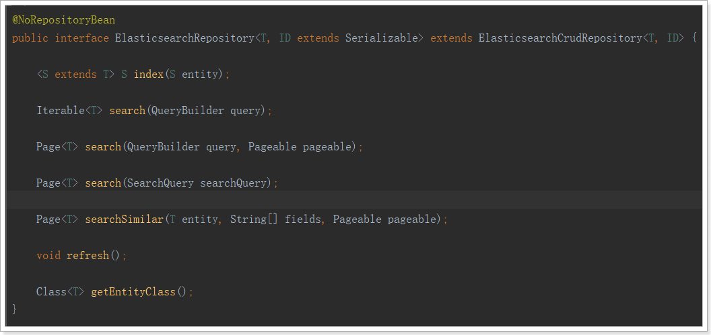
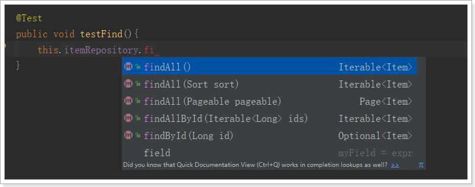
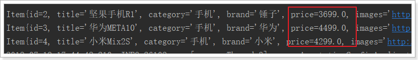
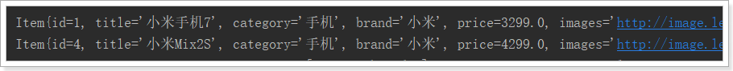
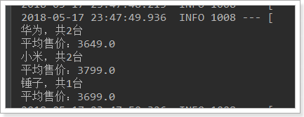

Elasticsearch提供的Java客户端有一些不太方便的地方：

- 很多地方需要拼接Json字符串，在java中拼接字符串有多恐怖你应该懂的
- 需要自己把对象序列化为json存储
- 查询到结果也需要自己反序列化为对象

因此，我们这里就不讲解原生的Elasticsearch客户端API了。

而是使用Spring提供的套件：Spring Data Elasticsearch。

## 简介

Spring Data Elasticsearch是Spring Data项目下的一个子模块。

查看 Spring Data的官网：http://projects.spring.io/spring-data/

Spring Data 的使命是给各种数据访问提供统一的编程接口，不管是关系型数据库（如MySQL），还是非关系数据库（如Redis），或者类似Elasticsearch这样的索引数据库。从而简化开发人员的代码，提高开发效率。这是一个总括项目，其中包含许多特定于给定数据库的子项目。这些令人兴奋的技术项目背后，是由许多公司和开发人员合作开发的。

Spring Data Elasticsearch：https://projects.spring.io/spring-data-elasticsearch/

- 支持Spring的基于`@Configuration`的java配置方式，或者XML配置方式
- 提供了用于操作ES的便捷工具类**`ElasticsearchTemplate`**。包括实现文档到POJO之间的自动智能映射。
- 利用Spring的数据转换服务实现的功能丰富的对象映射
- 基于注解的元数据映射方式，而且可扩展以支持更多不同的数据格式
- 根据持久层接口自动生成对应实现方法，无需人工编写基本操作代码（类似mybatis，根据接口自动得到实现）。当然，也支持人工定制查询

## 基本配置

1. 创建spring boot项目，加如下依赖

```
<dependency>
	<groupId>org.springframework.boot</groupId>
	<artifactId>spring-boot-starter-data-elasticsearch</artifactId>
</dependency>
```

2. application.yml文件配置：

```yaml
spring:
  data:
    elasticsearch:
      cluster-name: elasticsearch
      cluster-nodes: 192.168.56.101:9300
```

## 实体类及注解

首先我们准备好实体类：

```java
public class Item {
    Long id;
    String title; //标题
    String category;// 分类
    String brand; // 品牌
    Double price; // 价格
    String images; // 图片地址
}
```

> 映射

Spring Data通过注解来声明字段的映射属性，有下面的三个注解：

- `@Document` 作用在类，标记实体类为文档对象，一般有两个属性
  - indexName：对应索引库名称
  - type：对应在索引库中的类型
  - shards：分片数量，默认5
  - replicas：副本数量，默认1
- `@Id` 作用在成员变量，标记一个字段作为id主键
- `@Field` 作用在成员变量，标记为文档的字段，并指定字段映射属性：
  - type：字段类型，取值是枚举：FieldType
  - index：是否索引，布尔类型，默认是true
  - store：是否存储，布尔类型，默认是false
  - analyzer：分词器名称

示例：

```java
@Document(indexName = "item",type = "docs", shards = 1, replicas = 0)
public class Item {
    @Id
    private Long id;
    
    @Field(type = FieldType.Text, analyzer = "ik_max_word")
    private String title; //标题
    
    @Field(type = FieldType.Keyword)
    private String category;// 分类
    
    @Field(type = FieldType.Keyword)
    private String brand; // 品牌
    
    @Field(type = FieldType.Double)
    private Double price; // 价格
    
    @Field(index = false, type = FieldType.Keyword)
    private String images; // 图片地址
}
```

## ElasticsearchTemplate

ElasticsearchTemplate提供了创建索引和创建映射的API，基本不用。一般根据实体类的注解信息自动生成索引库和映射。

如下示例采用类的字节码信息自动创建索引和映射：

```
public class IndexTest {

    @Autowired
    private ElasticsearchTemplate elasticsearchTemplate;

    @Test
    public void testCreate(){
        // 创建索引，会根据Item类的@Document注解信息来创建
        elasticsearchTemplate.createIndex(Item.class);
        // 配置映射，会根据Item类中的id、Field等字段来自动完成映射
        elasticsearchTemplate.putMapping(Item.class);
    }
}
```

结果：

```json
GET /item
{
  "item": {
    "aliases": {},
    "mappings": {
      "docs": {
        "properties": {
          "brand": {
            "type": "keyword"
          },
          "category": {
            "type": "keyword"
          },
          "images": {
            "type": "keyword",
            "index": false
          },
          "price": {
            "type": "double"
          },
          "title": {
            "type": "text",
            "analyzer": "ik_max_word"
          }
        }
      }
    },
    "settings": {
      "index": {
        "refresh_interval": "1s",
        "number_of_shards": "1",
        "provided_name": "item",
        "creation_date": "1525405022589",
        "store": {
          "type": "fs"
        },
        "number_of_replicas": "0",
        "uuid": "4sE9SAw3Sqq1aAPz5F6OEg",
        "version": {
          "created": "6020499"
        }
      }
    }
  }
}
```

删除索引的API

```
@Test
public void deleteIndex() {
    esTemplate.deleteIndex("item");
}
```

## ElasticsearchRepository

Spring Data 的强大之处，就在于你不用写任何DAO处理，自动根据方法名或类的信息进行CRUD操作。只要你定义一个接口，然后继承Repository提供的一些子接口，就能具备各种基本的CRUD功能。

```
public interface ItemRepository extends ElasticsearchRepository<Item,Long> {
}
```

来看下Repository的继承关系：


我们看到有一个ElasticsearchRepository接口：



## 新增文档

```java
@Autowired
private ItemRepository itemRepository;

@Test
public void index() {
    Item item = new Item(1L, "小米手机7", " 手机",
                         "小米", 3499.00, "http://image.leyou.com/13123.jpg");
    itemRepository.save(item);
}
```

去页面查询看看：

```
GET /item/_search
```

结果：

```json
{
  "took": 14,
  "timed_out": false,
  "_shards": {
    "total": 1,
    "successful": 1,
    "skipped": 0,
    "failed": 0
  },
  "hits": {
    "total": 1,
    "max_score": 1,
    "hits": [
      {
        "_index": "item",
        "_type": "docs",
        "_id": "1",
        "_score": 1,
        "_source": {
          "id": 1,
          "title": "小米手机7",
          "category": " 手机",
          "brand": "小米",
          "price": 3499,
          "images": "http://image.leyou.com/13123.jpg"
        }
      }
    ]
  }
}
```


## 批量新增

代码：

```java
@Test
public void indexList() {
    List<Item> list = new ArrayList<>();
    list.add(new Item(2L, "坚果手机R1", " 手机", "锤子", 3699.00, "http://image.leyou.com/123.jpg"));
    list.add(new Item(3L, "华为META10", " 手机", "华为", 4499.00, "http://image.leyou.com/3.jpg"));
    // 接收对象集合，实现批量新增
    itemRepository.saveAll(list);
}
```

再次去页面查询：

```json
{
  "took": 5,
  "timed_out": false,
  "_shards": {
    "total": 1,
    "successful": 1,
    "skipped": 0,
    "failed": 0
  },
  "hits": {
    "total": 3,
    "max_score": 1,
    "hits": [
      {
        "_index": "item",
        "_type": "docs",
        "_id": "2",
        "_score": 1,
        "_source": {
          "id": 2,
          "title": "坚果手机R1",
          "category": " 手机",
          "brand": "锤子",
          "price": 3699,
          "images": "http://image.leyou.com/13123.jpg"
        }
      },
      {
        "_index": "item",
        "_type": "docs",
        "_id": "3",
        "_score": 1,
        "_source": {
          "id": 3,
          "title": "华为META10",
          "category": " 手机",
          "brand": "华为",
          "price": 4499,
          "images": "http://image.leyou.com/13123.jpg"
        }
      },
      {
        "_index": "item",
        "_type": "docs",
        "_id": "1",
        "_score": 1,
        "_source": {
          "id": 1,
          "title": "小米手机7",
          "category": " 手机",
          "brand": "小米",
          "price": 3499,
          "images": "http://image.leyou.com/13123.jpg"
        }
      }
    ]
  }
}
```

## 修改文档

修改和新增是同一个接口，区分的依据就是id，这一点跟我们在页面发起PUT请求是类似的。

## 基本查询

ElasticsearchRepository提供了一些基本的查询方法：



```
@Test
public void testFind(){
    // 查询全部，并安装价格降序排序
    Iterable<Item> items = this.itemRepository.findAll(Sort.by(Sort.Direction.DESC,"price"));
    items.forEach(item-> System.out.println(item));
}
```

## 自定义查询方法

Spring Data 的另一个强大功能，是根据方法名称自动实现功能。

比如：你的方法名叫做：findByTitle，那么它就知道你是根据title查询，然后自动帮你完成，无需写实现类。

当然，方法名称要符合一定的约定：

| Keyword               | Sample                                     | Elasticsearch Query String                                   |
| --------------------- | ------------------------------------------ | ------------------------------------------------------------ |
| `And`                 | `findByNameAndPrice`                       | `{"bool" : {"must" : [ {"field" : {"name" : "?"}}, {"field" : {"price" : "?"}} ]}}` |
| `Or`                  | `findByNameOrPrice`                        | `{"bool" : {"should" : [ {"field" : {"name" : "?"}}, {"field" : {"price" : "?"}} ]}}` |
| `Is`                  | `findByName`                               | `{"bool" : {"must" : {"field" : {"name" : "?"}}}}`           |
| `Not`                 | `findByNameNot`                            | `{"bool" : {"must_not" : {"field" : {"name" : "?"}}}}`       |
| `Between`             | `findByPriceBetween`                       | `{"bool" : {"must" : {"range" : {"price" : {"from" : ?,"to" : ?,"include_lower" : true,"include_upper" : true}}}}}` |
| `LessThanEqual`       | `findByPriceLessThan`                      | `{"bool" : {"must" : {"range" : {"price" : {"from" : null,"to" : ?,"include_lower" : true,"include_upper" : true}}}}}` |
| `GreaterThanEqual`    | `findByPriceGreaterThan`                   | `{"bool" : {"must" : {"range" : {"price" : {"from" : ?,"to" : null,"include_lower" : true,"include_upper" : true}}}}}` |
| `Before`              | `findByPriceBefore`                        | `{"bool" : {"must" : {"range" : {"price" : {"from" : null,"to" : ?,"include_lower" : true,"include_upper" : true}}}}}` |
| `After`               | `findByPriceAfter`                         | `{"bool" : {"must" : {"range" : {"price" : {"from" : ?,"to" : null,"include_lower" : true,"include_upper" : true}}}}}` |
| `Like`                | `findByNameLike`                           | `{"bool" : {"must" : {"field" : {"name" : {"query" : "?*","analyze_wildcard" : true}}}}}` |
| `StartingWith`        | `findByNameStartingWith`                   | `{"bool" : {"must" : {"field" : {"name" : {"query" : "?*","analyze_wildcard" : true}}}}}` |
| `EndingWith`          | `findByNameEndingWith`                     | `{"bool" : {"must" : {"field" : {"name" : {"query" : "*?","analyze_wildcard" : true}}}}}` |
| `Contains/Containing` | `findByNameContaining`                     | `{"bool" : {"must" : {"field" : {"name" : {"query" : "**?**","analyze_wildcard" : true}}}}}` |
| `In`                  | `findByNameIn(Collection<String>names)`    | `{"bool" : {"must" : {"bool" : {"should" : [ {"field" : {"name" : "?"}}, {"field" : {"name" : "?"}} ]}}}}` |
| `NotIn`               | `findByNameNotIn(Collection<String>names)` | `{"bool" : {"must_not" : {"bool" : {"should" : {"field" : {"name" : "?"}}}}}}` |
| `Near`                | `findByStoreNear`                          | `Not Supported Yet !`                                        |
| `True`                | `findByAvailableTrue`                      | `{"bool" : {"must" : {"field" : {"available" : true}}}}`     |
| `False`               | `findByAvailableFalse`                     | `{"bool" : {"must" : {"field" : {"available" : false}}}}`    |
| `OrderBy`             | `findByAvailableTrueOrderByNameDesc`       | `{"sort" : [{ "name" : {"order" : "desc"} }],"bool" : {"must" : {"field" : {"available" : true}}}}` |

例如，我们来按照价格区间查询，定义这样的一个方法：

```java
public interface ItemRepository extends ElasticsearchRepository<Item,Long> {

    /**
     * 根据价格区间查询
     * @param price1
     * @param price2
     * @return
     */
    List<Item> findByPriceBetween(double price1, double price2);
}
```

然后添加一些测试数据：

```java
@Test
public void indexList() {
    List<Item> list = new ArrayList<>();
    list.add(new Item(1L, "小米手机7", "手机", "小米", 3299.00, "http://image.leyou.com/13123.jpg"));
    list.add(new Item(2L, "坚果手机R1", "手机", "锤子", 3699.00, "http://image.leyou.com/13123.jpg"));
    list.add(new Item(3L, "华为META10", "手机", "华为", 4499.00, "http://image.leyou.com/13123.jpg"));
    list.add(new Item(4L, "小米Mix2S", "手机", "小米", 4299.00, "http://image.leyou.com/13123.jpg"));
    list.add(new Item(5L, "荣耀V10", "手机", "华为", 2799.00, "http://image.leyou.com/13123.jpg"));
    // 接收对象集合，实现批量新增
    itemRepository.saveAll(list);
}
```


不需要写实现类，然后我们直接去运行：

```java
@Test
public void queryByPriceBetween(){
    List<Item> list = this.itemRepository.findByPriceBetween(2000.00, 3500.00);
    for (Item item : list) {
        System.out.println("item = " + item);
    }
}
```

结果：



虽然基本查询和自定义方法已经很强大了，但是如果是复杂查询（模糊、通配符、词条查询等）就显得力不从心了。此时，我们只能使用原生查询。


## 高级查询

```java
@Test
public void testQuery(){
    // 词条查询
    MatchQueryBuilder queryBuilder = QueryBuilders.matchQuery("title", "小米");
    // 执行查询
    Iterable<Item> items = this.itemRepository.search(queryBuilder);
    items.forEach(System.out::println);
}
```

结果：



Repository的search方法需要QueryBuilder参数，elasticSearch为我们提供了一个对象QueryBuilders，QueryBuilders提供了大量的静态方法，用于生成各种不同类型的查询对象，例如：词条、模糊、通配符等QueryBuilder对象。


## 自定义高级查询

先来看最基本的match query：

```java
@Test
public void testNativeQuery(){
    // 构建查询条件
    NativeSearchQueryBuilder queryBuilder = new NativeSearchQueryBuilder();
    // 添加基本的分词查询
    queryBuilder.withQuery(QueryBuilders.matchQuery("title", "小米"));
    // 执行搜索，获取结果
    Page<Item> items = this.itemRepository.search(queryBuilder.build());
    // 打印总条数
    System.out.println(items.getTotalElements());
    // 打印总页数
    System.out.println(items.getTotalPages());
    items.forEach(System.out::println);
}
```

NativeSearchQueryBuilder：Spring提供的一个查询条件构建器，帮助构建json格式的请求体

`Page<item>`：默认是分页查询，因此返回的是一个分页的结果对象，包含属性：

- totalElements：总条数
- totalPages：总页数
- Iterator：迭代器，本身实现了Iterator接口，因此可直接迭代得到当前页的数据
- 其它属性：


结果：


## 分页查询

利用`NativeSearchQueryBuilder`可以方便的实现分页：

```java
@Test
public void testNativeQuery(){
    // 构建查询条件
    NativeSearchQueryBuilder queryBuilder = new NativeSearchQueryBuilder();
    // 添加基本的分词查询
    queryBuilder.withQuery(QueryBuilders.termQuery("category", "手机"));

    // 初始化分页参数
    int page = 0;
    int size = 3;
    // 设置分页参数
    queryBuilder.withPageable(PageRequest.of(page, size));

    // 执行搜索，获取结果
    Page<Item> items = this.itemRepository.search(queryBuilder.build());
    // 打印总条数
    System.out.println(items.getTotalElements());
    // 打印总页数
    System.out.println(items.getTotalPages());
    // 每页大小
    System.out.println(items.getSize());
    // 当前页
    System.out.println(items.getNumber());
    items.forEach(System.out::println);
}
```

结果：


可以发现，**Elasticsearch中的分页是从第0页开始**。


## 排序

排序也通用通过`NativeSearchQueryBuilder`完成：

```java
@Test
public void testSort(){
    // 构建查询条件
    NativeSearchQueryBuilder queryBuilder = new NativeSearchQueryBuilder();
    // 添加基本的分词查询
    queryBuilder.withQuery(QueryBuilders.termQuery("category", "手机"));

    // 排序
    queryBuilder.withSort(SortBuilders.fieldSort("price").order(SortOrder.DESC));

    // 执行搜索，获取结果
    Page<Item> items = this.itemRepository.search(queryBuilder.build());
    // 打印总条数
    System.out.println(items.getTotalElements());
    items.forEach(System.out::println);
}
```

结果：


## 聚合为桶

桶就是分组，比如这里我们按照品牌brand进行分组：

```java
@Test
public void testAgg(){
    NativeSearchQueryBuilder queryBuilder = new NativeSearchQueryBuilder();
    // 不查询任何结果
    queryBuilder.withSourceFilter(new FetchSourceFilter(new String[]{""}, null));
    // 1、添加一个新的聚合，聚合类型为terms，聚合名称为brands，聚合字段为brand
    queryBuilder.addAggregation(
        AggregationBuilders.terms("brands").field("brand"));
    // 2、查询,需要把结果强转为AggregatedPage类型
    AggregatedPage<Item> aggPage = (AggregatedPage<Item>) this.itemRepository.search(queryBuilder.build());
    // 3、解析
    // 3.1、从结果中取出名为brands的那个聚合，
    // 因为是利用String类型字段来进行的term聚合，所以结果要强转为StringTerm类型
    StringTerms agg = (StringTerms) aggPage.getAggregation("brands");
    // 3.2、获取桶
    List<StringTerms.Bucket> buckets = agg.getBuckets();
    // 3.3、遍历
    for (StringTerms.Bucket bucket : buckets) {
        // 3.4、获取桶中的key，即品牌名称
        System.out.println(bucket.getKeyAsString());
        // 3.5、获取桶中的文档数量
        System.out.println(bucket.getDocCount());
    }

}
```

显示的结果：


关键API：

- `AggregationBuilders`：聚合的构建工厂类。所有聚合都由这个类来构建，可以看看他的静态方法


- AggregatedPage`：聚合查询的结果类。它是`Page<T>`的子接口，`

  

  AggregatedPage`在`Page`功能的基础上，拓展了与聚合相关的功能，它其实就是对聚合结果的一种封装，大家可以对照聚合结果的JSON结构来看。

   

  而返回的结果都是Aggregation类型对象，不过根据字段类型不同，又有不同的子类表示

  

我们看下页面的查询的JSON结果与Java类的对照关系：


##  嵌套聚合求平均值

```java
@Test
public void testSubAgg(){
    NativeSearchQueryBuilder queryBuilder = new NativeSearchQueryBuilder();
    // 不查询任何结果
    queryBuilder.withSourceFilter(new FetchSourceFilter(new String[]{""}, null));
    // 1、添加一个新的聚合，聚合类型为terms，聚合名称为brands，聚合字段为brand
    queryBuilder.addAggregation(
        AggregationBuilders.terms("brands").field("brand")
        .subAggregation(AggregationBuilders.avg("priceAvg").field("price")) // 在品牌聚合桶内进行嵌套聚合，求平均值
    );
    // 2、查询,需要把结果强转为AggregatedPage类型
    AggregatedPage<Item> aggPage = (AggregatedPage<Item>) this.itemRepository.search(queryBuilder.build());
    // 3、解析
    // 3.1、从结果中取出名为brands的那个聚合，
    // 因为是利用String类型字段来进行的term聚合，所以结果要强转为StringTerm类型
    StringTerms agg = (StringTerms) aggPage.getAggregation("brands");
    // 3.2、获取桶
    List<StringTerms.Bucket> buckets = agg.getBuckets();
    // 3.3、遍历
    for (StringTerms.Bucket bucket : buckets) {
        // 3.4、获取桶中的key，即品牌名称  3.5、获取桶中的文档数量
        System.out.println(bucket.getKeyAsString() + "，共" + bucket.getDocCount() + "台");

        // 3.6.获取子聚合结果：
        InternalAvg avg = (InternalAvg) bucket.getAggregations().asMap().get("priceAvg");
        System.out.println("平均售价：" + avg.getValue());
    }

}
```

结果：



## 参考资料

> - []()
> - []()
