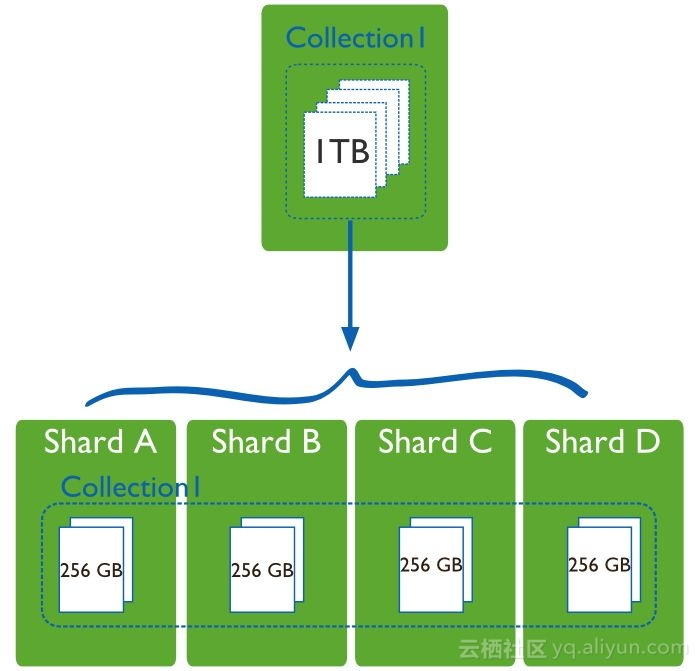
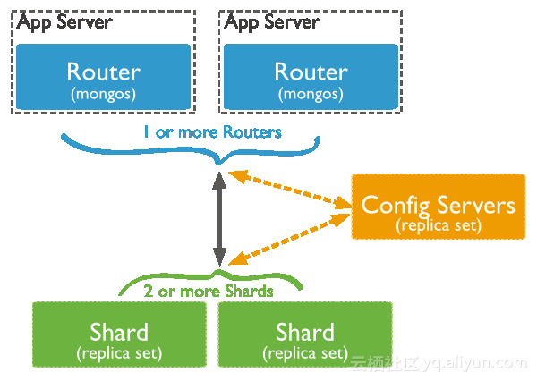
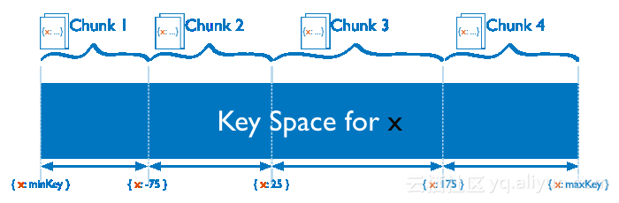
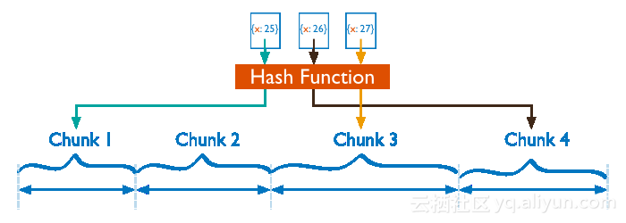

## 为什么需要分片？

当MongoDB复制集遇到下面的业务场景时，你就需要考虑使用Sharded cluster

- 存储容量需求超出单机磁盘容量
- 活跃的数据集超出单机内存容量，导致很多请求都要从磁盘读取数据，影响性能
- 写IOPS超出单个MongoDB节点的写服务能力

如果你没有遇到上述问题，使用 MongoDB 复制集就足够了，管理维护上比 Sharded cluster 要简单很多。

MongoDB目前3大核心优势：『灵活模式』+ 『高可用性』 + 『可扩展性』，通过json文档来实现灵活模式，通过[复制集](https://yq.aliyun.com/go/articleRenderRedirect?spm=a2c4e.11153940.0.0.337120cappHpMU&url=https%3A%2F%2Fyq.aliyun.com%2Farticles%2F64%3Fspm%3D0.0.0.0.9jrPm8)来保证高可用，通过Sharded cluster来保证可扩展性。

如下图所示，Sharding Cluster使得集合的数据可以分散到多个Shard存储，使得MongoDB具备了横向扩展（Scale out）的能力，每个Shard又通过复制集实现高可用容错，丰富了MongoDB的应用场景。

## Sharded cluster架构

Sharded cluster由Shard、Mongos和Config server 3个组件构成。

Mongos作为Sharded cluster的访问入口，所有的请求都由mongos来路由、分发、合并，这些动作对客户端driver透明，用户连接mongos就像连接mongod一样使用。

Mongos本身并不持久化数据，Sharded cluster所有的元数据都会存储到Config Server，而用户的数据则会分散存储到各个shard。Mongos启动后，会从config server加载元数据，开始提供服务，将用户的请求正确路由到对应的Shard。

Mongos会根据请求类型及shard key将请求路由到对应的Shard

## 分片策略

Sharded cluster支持将单个集合的数据分散存储在多个shard上，用户可以指定根据集合内文档的某个字段即shard key来分布数据，目前主要支持2种数据分布的策略，范围分片（Range based sharding）或hash分片（Hash based sharding）。

- 范围分片

如下图所示，集合根据x字段来分片，x的取值范围为[minKey, maxKey]（x为整型，这里的minKey、maxKey为整型的最小值和最大值），将整个取值范围划分为多个chunk，每个chunk（通常配置为64MB）包含其中一小段的数据。

Chunk1包含x的取值在[minKey, -75)的所有文档，而Chunk2包含x取值在[-75, 25)之间的所有文档... 每个chunk的数据都存储在同一个Shard上，每个Shard可以存储很多个chunk，chunk存储在哪个shard的信息会存储在Config server种，mongos也会根据各个shard上的chunk的数量来自动做负载均衡。

范围分片能很好的满足『范围查询』的需求，比如想查询x的值在[-30, 10]之间的所有文档，这时mongos直接能将请求路由到Chunk2，就能查询出所有符合条件的文档。

范围分片的缺点在于，如果shardkey有明显递增（或者递减）趋势，则新插入的文档多会分布到同一个chunk，无法扩展写的能力，比如使用_id作为shard key，而MongoDB自动生成的id高位是时间戳，是持续递增的。

- hash分片

Hash分片是根据用户的shard key计算hash值（64bit整型），根据hash值按照『范围分片』的策略将文档分布到不同的chunk。

Hash分片与范围分片互补，能将文档随机的分散到各个chunk，充分的扩展写能力，弥补了范围分片的不足，但不能高效的服务范围查询，所有的范围查询要分发到后端所有的Shard才能找出满足条件的文档。

- 合理的选择shard key

选择shard key时，要根据业务的需求及『范围分片』和『Hash分片』2种方式的优缺点合理选择，同时还要注意shard key的取值一定要足够多，否则会出现单个jumbo chunk，即单个chunk非常大并且无法分裂（split）；比如某集合存储用户的信息，按照age字段分片，而age的取值非常有限，必定会导致单个chunk非常大。

## 请求处理过程

- 查询请求

查询请求不包含shard key，则必须将查询分发到所有的shard，然后合并查询结果返回给客户端

查询请求包含shard key，则直接根据shard key计算出需要查询的chunk，向对应的shard发送查询请求

- 写请求

写操作必须包含shard key，mongos根据shard key算出文档应该存储到哪个chunk，然后将写请求发送到chunk所在的shard。

- 更新/删除请求

更新、删除请求的查询条件必须包含shard key或者_id，如果是包含shard key，则直接路由到指定的chunk，如果只包含_id，则需将请求发送至所有的shard。

- 其他命令请求

除增删改查外的其他命令请求处理方式都不尽相同，有各自的处理逻辑，比如listDatabases命令，会向每个Shard及Config Server转发listDatabases请求，然后将结果进行合并。

## Tag aware sharding

Tag aware sharding是 Sharded cluster 很有用的一个特性，允许用户自定义一些 chunk 的分布规则。Tag aware sharding 原理如下

1. sh.addShardTag() 给shard 设置标签 A
2. sh.addTagRange() 给集合的某个 chunk 范围设置标签 A，最终 MongoDB 会保证设置标签 A 的 chunk 范围（或该范围的超集）分布设置了标签 A 的 shard 上。

Tag aware sharding可应用在如下场景

- 将部署在不同机房的 shard 设置『机房标签』，将不同 chunk 范围的数据分布到指定的机房
- 将服务能力不通的 shard 设置『服务等级标签』，将更多的 chunk分散到服务能力更强的 shard 上去。

使用 Tag aware sharding 需要注意是, chunk 分配到对应标签的 shard 上『不是立即完成，而是在不断 insert、update 后触发 split、moveChunk后逐步完成的，并且需要保证 balancer 是开启的』。所以你可能会观察到，在设置了 tag range 后一段时间后，写入仍然没有分布到tag 相同的 shard 上去。

## 参考资料

> - 
> - 
