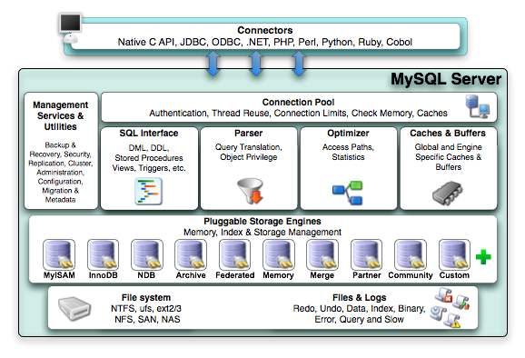

## 重要命令

### show profile
- SHOW PROFILE和SHOW PROFILES语句显示概要信息，该信息指示在当前会话过程中执行的语句的资源使用情况。
- 文档：https://dev.mysql.com/doc/refman/5.7/en/show-profile.html

```
-- 查看是否开启
show variables like '%profiling%';

-- 开启
set profiling=1;

-- 查看最近几次查询 
show profiles;

-- 查看sql具体执行步骤
show profile cpu,block io for query Query_id
```

### explain
- 执行 Explain+SQL语句，可以模拟优化器执行 SQL 查询语句，查看语句的执行计划
- 输出格式说明：https://dev.mysql.com/doc/refman/5.7/en/explain-output.html


## 常用命令

```
//  显示所有字符集
show variables like '%char%'

// 查看某库字符集
show create database 库名

// 创建库时指定字符集
create database 库名 character set utf8

// 修改库的字符集
alter database 库名 character set 'utf8'

// 修改表的字符集
alter table 表名 convert to character set 'utf8'

// 查看是否大小写敏感，0=大小写敏感
// 1=大小写不敏感。创建的表，数据库都是以小写形式存放在磁盘上，对于sql 语句都是转换为小写对表和DB进行查找
// 2=创建的表和 DB 依据语句上格式存放，凡是查找都是转换为小写进行
show variables like '%lower_case_table_names%'

// sql_mode定义了对 MySQL 中 SQL语句语法的校验规则
// 查看sql_mode值有如下两种方式
show variables like 'sql_mode';
select@@sql_mode
```


## sql语句

alter table: 用于在已有的表中添加、删除或修改列。
```
-- 如需在表中添加列，请使用下面的语法
ALTER TABLE table_name ADD column_name datatype

-- 如需删除表中的列，请使用下面的语法
ALTER TABLE table_name DROP COLUMN column_name

-- 改变表中列的数据类型
ALTER TABLE table_name MODIFY COLUMN column_name datatype
```


## 特性
### 索引下推
- 索引下推（index condition pushdown ）简称ICP，在Mysql5.6的版本上推出，用于优化查询。
- 在不使用ICP的情况下，在使用非主键索引（又叫普通索引或者二级索引）进行查询时，存储引擎通过索引检索到数据，然后返回给MySQL服务器，服务器然后判断数据是否符合条件 。
- 在使用ICP的情况下，如果存在某些被索引的列的判断条件时，MySQL服务器将这一部分判断条件传递给存储引擎，然后由存储引擎通过判断索引是否符合MySQL服务器传递的条件，只有当索引符合条件时才会将数据检索出来返回给MySQL服务器 。
- 索引条件下推优化可以减少存储引擎查询基础表的次数，也可以减少MySQL服务器从存储引擎接收数据的次数。


## 逻辑架构
首先分4层：连接层、服务层、引擎层、存储层。
服务层主要组件：解析器、优化器。




#### 连接层

最上层是一些客户端和连接服务，包含本地 sock 通信和大多数基于客户端/服务端工具实现的类似于 tcp/ip 的通信。主要完成一些类似于连接处理、授权认证、及相关的安全方案。在该层上引入了线程池的概念，为通过认证 安全接入的客户端提供线程。同样在该层上可以实现基于 SSL 的安全链接。服务器也会为安全接入的每个客户端验证它所具有的操作权限。

#### 服务层

- Management Serveices & Utilities ： 系统管理和控制工具
- SQL Interface: SQL 接口。接受用户的 SQL 命令，并且返回用户需要查询的结果。
- Parser ：解析器。 SQL 命令传递到解析器的时候会被解析器验证和解析
- Optimizer ：查询优化器。 SQL 语句在查询之前会使用查询优化器对查询进行优化，比如有where 条件时，优化器来决定先投影还是先过滤。
- Cache 和 Buffer ：查询缓存。如果查询缓存有命中的查询结果，查询语句就可以直接去查询缓存中取数据。这个缓存机制是由一系列小缓存组成的。比如表缓存，记录缓存，key 缓存，权限缓存等

#### 引擎层

存储引擎层，存储引擎真正的负责了 MySQL 中数据的存储和提取，服务器通过 API 与存储引擎进行通信。不同的存储引擎具有的功能不同，这样我们可以根据自己的实际需要进行选取。

#### 存储层

数据存储层，主要是将数据存储在运行于裸设备的文件系统之上，并完成与存储引擎的交互。

## 执行流程

1. mysql 客户端通过协议与 mysql 服务器建连接，发送查询语句，先检查查询缓存，如果命中，直接返回结果 
2. 否则进行语法解析器和预处理：首先 mysql 通过关键字将 SQL 语句进行解析，并生成一颗对应的“解析树”。解析器将使用 mysql 语法规则验证和解析查询；预处理器则根据一些 mysql 规则进一步检查解析数是否合法。 
3. 查询优化器当解析树被认为是合法的了，并且由优化器将其转化成执行计划。一条查询可以有很多种执行方式，最后都返回相同的结果。优化器的作用就是找到这其中最好的执行计划。
4. 调用具体执行引擎执行计划。


## 参考资料
> - []()
> - []()
