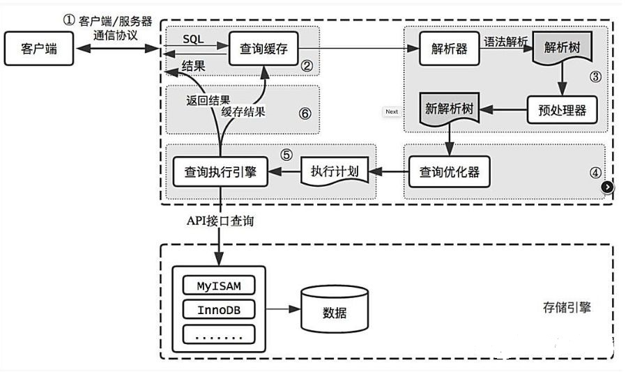

## 走不走索引呢？
```
select * from t where 100 < c and c < 100000;
```
首先明确一点，主键索引叶子节点处存的是整行数据字段，非主键索引存的是主键值。也就是说，我们如果⾛ c 这个字段的索引的话，最后会查询到对应主键的值，然后，再根据主键的值⾛主键索引，查询到整⾏数据返回。

好吧扯了这么多，其实我就是想告诉你，就算你在 c 字段上有索引，系统也并不⼀定会⾛ c 这个字段上的索引，⽽是有可能会直接扫描扫描全表，找出所有符合 100 < c and c < 100000 的数据。

- 为什么会这样呢？

其实是这样的，系统在执⾏这条语句的时候，会进⾏预测：究竟是⾛ c 索引扫描的⾏数少，还是直接扫描全表扫描的⾏数少呢？显然，扫描⾏数越少当然越好了，因为扫描⾏数越少，意味着I/O操作的次数越少。
如果是扫描全表的话，那么扫描的次数就是这个表的总⾏数了，假设为 n；⽽如果⾛索引 c 的话，我们通过索引 c 找到主键之后，还得再通过主键索引来找我们整⾏的数据，也就是说，需要⾛两次索引。⽽且，我们也不知道符合 100 c < and c < 10000 这个条件的数据有多少⾏，万⼀这个表是全部数据都符合呢？这个时候意味着，⾛ c 索引不仅扫描的⾏数是 n，同时还得每⾏数据⾛两次索引。

所以呢，系统是有可能⾛全表扫描⽽不⾛索引的。那系统是怎么判断呢？
判断来源于系统的预测，也就是说，如果要⾛ c 字段索引的话，系统会预测⾛ c 字段索引⼤概需要扫描多少⾏。如果预测到要扫描的⾏数很多，它可能就不⾛索引⽽直接扫描全表了。

那么问题来了，系统是怎么预测判断的呢？这⾥我给你讲下系统是怎么判断的吧，虽然这个时候我已经
写到脖⼦有点酸了。
系统是通过索引的区分度来判断的，⼀个索引上不同的值越多，意味着出现相同数值的索引越少，意味
着索引的区分度越⾼。我们也把区分度称之为基数，即区分度越⾼，基数越⼤。所以呢，基数越⼤，意
味着符合 100 < c and c < 10000 这个条件的⾏数越少。
所以呢，⼀个索引的基数越⼤，意味着⾛索引查询越有优势。
那么问题来了，怎么知道这个索引的基数呢？
系统当然是不会遍历全部来获得⼀个索引的基数的，代价太⼤了，索引系统是通过遍历部分数据，也就
是通过采样的⽅式，来预测索引的基数的。
扯了这么多，重点的来了，居然是采样，那就有可能出现失误的情况，也就是说，c 这个索引的基数实
际上是很⼤的，但是采样的时候，却很不幸，把这个索引的基数预测成很⼩。例如你采样的那⼀部分数
据刚好基数很⼩，然后就误以为索引的基数很⼩。然后就呵呵，系统就不⾛ c 索引了，直接⾛全部扫描
了。
所以呢，说了这么多，得出结论：由于统计的失误，导致系统没有⾛索引，⽽是⾛了全表扫描，⽽这，
也是导致我们 SQL 语句执⾏的很慢的原因。

这⾥我声明⼀下，系统判断是否⾛索引，扫描⾏数的预测其实只是原因之⼀，这条查询语句是否需要使⽤使⽤临时表、是否需要排序等也是会影响系统的选择的。

不过呢，我们有时候也可以通过强制⾛索引的⽅式来查询，例如
```
select * from t force index(a) where c < 100 and c < 100000;
```
## 为什么⽤ B+ 树做索引⽽不⽤哈希表做索引? 
1. 哈希表是把索引字段映射成对应的哈希码然后再存放在对应的位置，这样的话，如果我们要进⾏模
糊查找的话，显然哈希表这种结构是不⽀持的，只能遍历这个表。⽽B+树则可以通过最左前缀原则快速
找到对应的数据。
2. 如果我们要进⾏范围查找，例如查找ID为100 ~ 400的⼈，哈希表同样不⽀持，只能遍历全表。
3. 索引字段通过哈希映射成哈希码，如果很多字段都刚好映射到相同值的哈希码的话，那么形成的索
引结构将会是⼀条很⻓的链表，这样的话，查找的时间就会⼤⼤增加。

## 日志系统
https://blog.csdn.net/u010002184/article/details/88526708

https://blog.csdn.net/weixin_41796257/article/details/108934919

binlog是MySQL Server层记录的日志，

innodb事务日志包括redo log和undo log。

redo log（重做日志）
redo log通常是物理日志，记录的是数据页的物理修改，而不是某一行或某几行修改成怎样，它用来恢复提交后的物理数据页。

undo log（回滚日志）
undo log是逻辑日志，和redo log记录物理日志的不一样。可以这样认为，当delete一条记录时，undo log中会记录一条对应的insert记录，当update一条记录时，它记录一条对应相反的update记录。

事务ACID特性的实现思想
原子性：是使用 undo log来实现的，如果事务执行过程中出错或者用户执行了rollback，系统通过undo log日志返回事务开始的状态。

持久性：使用 redo log来实现，只要redo log日志持久化了，当系统崩溃，即可通过redo log把数据恢复。

隔离性：通过锁以及MVCC,使事务相互隔离开。

一致性：通过回滚、恢复，以及并发情况下的隔离性，从而实现一致性。

## 逻辑架构
首先分4层：连接层、服务层、引擎层、存储层。
服务层主要组件：解析器、优化器、执行器。



## 执行流程
1. mysql 客户端通过协议与 mysql 服务器建连接，发送查询语句，先检查查询缓存，如果命中，直接返回结果 
2. 否则进行语法解析器和预处理：首先 mysql 通过关键字将 SQL 语句进行解析，并生成一颗对应的“解析树”。解析器将使用 mysql 语法规则验证和解析查询；预处理器则根据一些 mysql 规则进一步检查解析数是否合法。 
3. 查询优化器当解析树被认为是合法的了，并且由优化器将其转化成执行计划。一条查询可以有很多种执行方式，最后都返回相同的结果。优化器的作用就是找到这其中最好的执行计划。
4. 调用具体执行引擎执行计划。

## 索引下推
- 索引下推（index condition pushdown ）简称ICP，在Mysql5.6的版本上推出，用于优化查询。
- 在不使用ICP的情况下，在使用非主键索引（又叫普通索引或者二级索引）进行查询时，存储引擎通过索引检索到数据，然后返回给MySQL服务器，服务器然后判断数据是否符合条件 。
- 在使用ICP的情况下，如果存在某些被索引的列的判断条件时，MySQL服务器将这一部分判断条件传递给存储引擎，然后由存储引擎通过判断索引是否符合MySQL服务器传递的条件，只有当索引符合条件时才会将数据检索出来返回给MySQL服务器 。
- 索引条件下推优化可以减少存储引擎查询基础表的次数，也可以减少MySQL服务器从存储引擎接收数据的次数。

## 表分区
分表：指的是通过一定规则，将一张表分解成多张不同的表。比如将用户订单记录根据时间成多个表。
表分区：是指根据一定规则，将数据库中的一张表分解成多个更小的，容易管理的部分。从逻辑上看，只有一张表，但是底层却是由多个物理分区组成。一个表最多只能有1024个分区，不能只对表数据分区而不对索引分区，也不能只对索引分区而不对表分区，也不能只对表的一部分数据分区。
分表与分区的区别在于：分区从逻辑上来讲只有一张表，而分表则是将一张表分解成多张表。

表分区有什么好处？
1. 存储更多数据。分区表的数据可以分布在不同的物理设备上，从而高效地利用多个硬件设备。和单个磁盘或者文件系统相比，可以存储更多数据
2. 优化查询。在where语句中包含分区条件时，可以只扫描一个或多个分区表来提高查询效率；涉及sum和count语句时，也可以在多个分区上并行处理，最后汇总结果。
3. 分区表更容易维护。例如：想批量删除大量数据可以清除整个分区。
4. 避免某些特殊的瓶颈，例如InnoDB的单个索引的互斥访问，ext3问价你系统的inode锁竞争等。

分区表的限制因素：
1. 一个表最多只能有1024个分区
2. 分区表中无法使用外键约束
3. 分区适用于一个表的所有数据和索引，不能只对表数据分区而不对索引分区，也不能只对索引分区而不对表分区，也不能只对表的一部分数据分区。
4. 如果分区字段中有主键或者唯一索引的列，那么多有主键列和唯一索引列都必须包含进来。即：分区字段要么不包含主键或者索引列，要么包含全部主键和索引列。
5. MySQL5.1中，分区表达式必须是整数，或者返回整数的表达式。在MySQL5.5中提供了非整数表达式分区的支持。

MySQL支持的分区类型有哪些？
1. RANGE分区： 这种模式允许将数据划分不同范围。例如可以将一个表通过年份划分成若干个分区
2. LIST分区： 这种模式允许系统通过预定义的列表的值来对数据进行分割。按照List中的值分区，与RANGE的区别是，range分区的区间范围值是连续的。
3. HASH分区 ：这中模式允许通过对表的一个或多个列的Hash Key进行计算，最后通过这个Hash码不同数值对应的数据区域进行分区。例如可以建立一个对表主键进行分区的表。
4. KEY分区 ：上面Hash模式的一种延伸，这里的Hash Key是MySQL系统产生的。


## 存储引擎
存储引擎是针对表的，不是针对库的。也就是说在一个数据库中可以使用不同的存储引擎。但是不建议这样做。

MyISAM：由早期的 ISAM （Indexed Sequential Access Method：有索引的顺序访问方法）所改良
1. 不支持事务，但是每次查询都是原子的；
2. 支持表级锁，即每次操作是对整个表加锁；
3. 一个MYISAM表有三个文件：索引文件、表结构文件、数据文件；
4. 采用非聚集索引，索引文件的数据域存储指向数据文件的指针。辅索引与主索引基本一致，但是辅索引不用保证唯一性。
5. 存储表的总行数，当要查询总行数时只需要读出该变量即可，速度很快；
6. 支持全文索引
   
InnoDb：
1. 支持ACID的事务，支持事务的四种隔离级别；
2. 支持行级锁及外键约束：因此可以支持写并发；
3. 一般使用共享表空间，即所有数据保存在一个单独的表空间里面，而这个表空间可以由很多个文件组成，一个表可以跨多个文件存在，所以其大小限制不再是文件大小的限制，包括这个表的所有索引等其他相关数据。
4. 主键索引采用聚集索引，即索引的数据域存储数据文件本身，辅索引的数据域存储主键的值；因此从辅索引查找数据，需要先通过辅索引找到主键值，再访问辅索引；最好使用自增主键，防止插入数据时，为维持B+树结构，索引文件结构的大调整。
5. 不存储总行数；执行select count(*) from table时需要全表扫描。
6. Innodb不支持全文索引

## 索引
索引按照数据结构来说主要包含B+树和Hash索引。B是指balance，意为平衡。

谈谈对索引的理解回答话术，从以下几个方面回答：存储引擎、数据结构、存储结构

B+树的数据结构：
- 理解B+Tree时，只需要理解其最重要的两个特征即可：第一，所有的关键字（可以理解为数据）都存储在叶子节点（Leaf Page），非叶子节点（Index Page）并不存储真正的数据，所有记录节点都是按键值大小顺序存放在同一层叶子节点上。其次，所有的叶子节点由指针顺序连接，这样方便区间查找。
- 每个节点的大小设置为一个页的整数倍，这样可以利用磁盘预读，使一个节点的数据通过一次IO就能读入内存，减少IO.
- 当子节点满时，会进行页分裂操作，保持树的平衡

为什么用自增列作为主键？
- 定义主键：如果我们定义了主键(PRIMARY KEY)，那么InnoDB会选择主键作为聚集索引。如果没有显式定义主键，则InnoDB会选择第一个不包含有NULL值的唯一索引作为主键索引。如果也没有这样的唯一索引，则InnoDB会选择内置6字节长的ROWID作为隐含的聚集索引(ROWID随着行记录的写入而主键递增，这个ROWID不像ORACLE的ROWID那样可引用，是隐含的)。
- 数据记录本身被存于主索引（一颗B+Tree）的叶子节点上，一个叶子节点大小为一个内存页或磁盘页，如果表使用自增主键，那么每次插入新的记录，记录就会顺序添加到当前索引节点的后续位置，当一页写满，就会自动开辟一个新的页，如果使用非自增主键（如身份证号），由于每次插入主键的值近似于随机，因此每次新纪录都要被插到现有索引页得中间某个位置，此时MySQL不得不为了将新记录插到合适位置而移动数据，甚至目标页面可能已经被回写到磁盘上而从缓存中清掉，此时又要从磁盘上读回来，这增加了很多开销，同时频繁的移动、分页操作造成了大量的碎片，得到了不够紧凑的索引结构，后续不得不通过OPTIMIZE TABLE来重建表并优化填充页面。

B+树索引和哈希索引的区别：
- B+树是一个平衡的多叉树，是左小右大的顺序存储结构，节点只包含id索引列，而叶子节点包含索引列和数据，这种数据和索引在一起存储的索引方式叫做聚簇索引，一张表只能有一个聚簇索引。它找到的只是被查找数据行所在的页，接着数据库会把页读入到内存，再在内存中进行查找，最后得到要查找的数据。假设没有定义主键，InnoDB会选择一个唯一的非空索引代替，如果没有的话则会隐式定义一个主键作为聚簇索引。
- 哈希索引就是采用一定的哈希算法，把键值换算成新的哈希值，检索时不需要类似B+树那样从根节点到叶子节点逐级查找，只需一次哈希算法即可，存储的数据是无序的。
优点：对于等值查询，哈希索引具有绝对优势，前提是：没有大量重复键值，如果大量重复键值时，哈希索引的效率很低，因为存在所谓的哈希碰撞问题。
缺点：不支持范围查询。不支持通过索引完成排序。不支持联合索引的最左前缀匹配规则。

覆盖索引和回表：
- 覆盖索引指的是在一次查询中，如果一个索引包含或者说覆盖所有需要查询的字段的值，我们就称之为覆盖索引，而不再需要回表查询。
- 而要确定一个查询是否是覆盖索引，我们只需要explain sql语句看Extra的结果是否是“Using index”即可。

什么情况下应不建或少建索引？
1. 表记录太少
2. 经常插入、删除、修改的表
3. 数据重复且分布平均的表字段，假如一个表有10万行记录，有一个字段A只有T和F两种值，且每个值的分布概率大约为50%，那么对这种表A字段建索引一般不会提高数据库的查询速度。
4. 经常和主字段一块查询但主字段索引值比较多的表字段

## 事务
事务支持依赖于存储引擎的
Redo Log: 保存某数据块被修改后的值，用于恢复未写入data file的已提交事务更新的数据
Undo Log: 保存某数据块被修改前的值，用于回滚事务

ACID: 原子性(由undo log日志保证，它记录了需要回滚的日志信息)、一致性(由代码层面来保证)、隔离性(由MVCC来保证)、持久性(由内存+redo log来保证)
脏读：读到其他事务未提交的更新数据，并使用了这个数据
不可重复读：多次读取某数据中间，其他事务更新了该数据，导致多次读取的数据不一致
幻读：一个事务修改涉及到所有行，在这期间另一个事务新增数据，导致前一个事务再读时感觉还有没修改的数据，好像出现幻觉

四种隔离级别：
- Serializable (串行化)：可避免脏读、不可重复读、幻读的发生。
- Repeatable read (可重复读)：可避免脏读、不可重复读的发生。
- Read committed (读已提交)：可避免脏读的发生。
- Read uncommitted (读未提交)：最低级别，任何情况都无法保证。

## 锁机制
锁(Locking)是数据库在并发访问时保证数据一致性和完整性的主要机制，不同存储引擎使用不同的加锁方式。

按照粒度分为表锁和行锁：
- 表级锁具有开销小、加锁快的特性；但锁定粒度较大，发生锁冲突的概率高，支持的并发度低；如alter修改表结构的时候会锁表
- 行级锁具有开销大，加锁慢的特性；但锁定粒度较小，发生锁冲突的概率低，支持的并发度高。行锁又可以分为乐观锁和悲观锁，悲观锁可以通过for update实现，乐观锁则通过版本号实现。

也可分为共享锁与排他锁，或称读锁和写锁：
- 共享锁(S)：允许多个事务同时获取这个锁，获得该锁的事务可以读取数据行(读锁)
- 排他锁(X)：同一时刻只允许一个事务获取到排他锁，获得该锁的事务可以更新或删除数据行(写锁)，
- 共享锁和共享锁可以兼容，排他锁和其它锁都不兼容，也就是说只允许读读并发，读写，写读和写写操作都必须阻塞。

MVCC: 全称多版本并发控制，实际上就是保存了数据在某个时间节点的快照。我们每行数实际上隐藏了两列，创建时间版本号，过期(删除)时间版本号，每开始一个新的事务，版本号都会自动递增。另外还依赖Undo log。MVCC的原理是查找创建版本小于或等于当前事务版本，删除版本为空或者大于当前事务版本

间隙锁: 是可重复读级别下才会有的锁，结合MVCC和间隙锁可以解决幻读的问题。

## SQL优化
0. 选择数据类型只要遵循小而简单的原则就好，越小的数据类型通常会更快，占用更少的磁盘、内存
1. 创建索引，但过多的索引可能会导致过高的磁盘使用率以及过高的内存占用，因为修改数据的同时也要更新索引
2. 开启查询缓存，优化查询
3. explain你的select查询，这可以帮你分析你的查询语句或是表结构的性能瓶颈。EXPLAIN 的查询结果还会告诉你你的索引主键被如何利用的，你的数据表是如何被搜索和排序的
4. 当只要一行数据时使用limit 1，MySQL数据库引擎会在找到一条数据后停止搜索，而不是继续往后查少下一条符合记录的数据
5. 为搜索字段建索引
6. 避免多个范围条件
7. 使用覆盖索引，不用回表
8. 定期删除一些长时间未使用过的索引

## 分库分表
首先分库分表分为垂直和水平两个方式，一般来说我们拆分的顺序是先垂直后水平。
垂直分表：对表字段比较多，将不常用的、数据较大的等等做拆分。基于现在微服务拆分来说，都是已经做到了垂直分库了。
水平分表：首先根据业务场景来决定使用什么字段作为分表字段(sharding_key)，比如我们现在日订单1000万，我们大部分的场景来源于C端，我们可以用user_id作为sharding_key，数据查询支持到最近3个月的订单，超过3个月的做归档处理，那么3个月的数据量就是9亿，可以分1024张表，那么每张表的数据大概就在100万左右。比如用户id为100，那我们都经过hash(100)，然后对1024取模，就可以落到对应的表上了。

分表后的ID怎么保证唯一性的呢？
- 设定自增步长，比如1-1024张表我们分别设定1-1024的基础步长，这样主键落到不同的表就不会冲突了。
- 分布式ID，自己实现一套分布式ID生成算法或者使用开源的比如雪花算法这种。
- 分表后不使用主键作为查询依据，而是每张表单独新增一个字段作为唯一主键使用，比如订单表订单号是唯一的，不管最终落在哪张表都基于订单号作为查询依据，更新也一样。

分表后非sharding_key的查询怎么处理呢？
- 可以做一个mapping表，比如这时候商家要查询订单列表怎么办呢？不带user_id查询的话你总不能扫全表吧？所以我们可以做一个映射关系表，保存商家和用户的关系，查询的时候先通过商家查询到用户列表，再通过user_id去查询。
- 打宽表，一般而言，商户端对数据实时性要求并不是很高，比如查询订单列表，可以把订单表同步到离线（实时）数仓，再基于数仓去做成一张宽表，再基于其他如es提供查询服务。
- 数据量不是很大的话，比如后台的一些查询之类的，也可以通过多线程扫表，然后再聚合结果的方式来做。或者异步的形式也是可以的。

## 主从同步流程
1. master提交完事务后，写入binlog
2. slave连接到master，获取binlog
3. master创建dump线程，推送binglog到slave
4. slave启动一个IO线程读取同步过来的master的binlog，记录到relay log中继日志中
5. slave再开启一个sql线程读取relay log事件并在slave执行，完成同步
6. slave记录自己的binglog

由于mysql默认的复制方式是异步的，主库把日志发送给从库后不关心从库是否已经处理，这样会产生一个问题就是假设主库挂了，从库处理失败了，这时候从库升为主库后，日志就丢失了。由此产生两个概念：
- 全同步复制：主库写入binlog后强制同步日志到从库，所有的从库都执行完成后才返回给客户端，但是很显然这个方式的话性能会受到严重影响。
- 半同步复制：和全同步不同的是，半同步复制的逻辑是这样，从库写入日志成功后返回ACK确认给主库，主库收到至少一个从库的确认就认为写操作完成。

## 执行查询流程
0. 客户端向MySQL服务器发送一条查询请求
1. 查询缓存: 
- 在解析一个查询语句前，如果查询缓存是打开的，那么MySQL会检查这个查询语句是否命中查询缓存中的数据。如果当前查询恰好命中查询缓存，在检查一次用户权限后直接返回缓存中的结果。这种情况下，查询不会被解析，也不会生成执行计划，更不会执行。
- MySQL将缓存存放在一个引用表（不要理解成table，可以认为是类似于HashMap的数据结构），通过一个哈希值索引，这个哈希值通过查询本身、当前要查询的数据库、客户端协议版本号等一些可能影响结果的信息计算得来。所以两个查询在任何字符上的不同（例如：空格、注释），都会导致缓存不会命中。
- 如果查询中包含任何用户自定义函数、存储函数、用户变量、临时表、MySQL库中的系统表，其查询结果都不会被缓存。比如函数NOW()或者CURRENT_DATE()会因为不同的查询时间，返回不同的查询结果，再比如包含CURRENT_USER或者CONNECION_ID()的查询语句会因为不同的用户而返回不同的结果，将这样的查询结果缓存起来没有任何的意义。
- 既然是缓存，就会失效，那查询缓存何时失效呢？MySQL的查询缓存系统会跟踪查询中涉及的每个表，如果这些表（数据或结构）发生变化，那么和这张表相关的所有缓存数据都将失效。正因为如此，在任何的写操作时，MySQL必须将对应表的所有缓存都设置为失效。如果查询缓存非常大或者碎片很多，这个操作就可能带来很大的系统消耗，甚至导致系统僵死一会儿。而且查询缓存对系统的额外消耗也不仅仅在写操作，读操作也不例外：任何的查询语句在开始之前都必须经过检查，即使这条SQL语句永远不会命中缓存，如果查询结果可以被缓存，那么执行完成后，会将结果存入缓存，也会带来额外的系统消耗
- 基于此，我们要知道并不是什么情况下查询缓存都会提高系统性能，缓存和失效都会带来额外消耗，只有当缓存带来的资源节约大于其本身消耗的资源时，才会给系统带来性能提升。

2. 语法解析和预处理：MySQL通过关键字将SQL语句进行解析，并生成一颗对应的解析树。这个过程解析器主要通过语法规则来验证和解析。比如SQL中是否使用了错误的关键字或者关键字的顺序是否正确等等。预处理则会根据MySQL规则进一步检查解析树是否合法。比如检查要查询的数据表和数据列是否存在等。
3. 查询优化: 经过前面的步骤生成的语法树被认为是合法的了，并且由优化器将其转化成查询计划。多数情况下，一条查询可以有很多种执行方式，最后都返回相应的结果。优化器的作用就是找到这其中最好的执行计划。MySQL使用基于成本的优化器，它尝试预测一个查询使用某种执行计划时的成本，并选择其中成本最小的一个。在MySQL可以通过查询当前会话的last_query_cost的值来得到其计算当前查询的成本。常见优化策略：使用limit时提前终止查询、优化排序等。
4. 查询执行引擎：在完成解析和优化阶段以后，MySQL会生成对应的执行计划，查询执行引擎根据执行计划给出的指令逐步执行得出结果。整个执行过程的大部分操作均是通过调用存储引擎实现的接口来完成。
5. 返回结果给客户端：查询执行的最后一个阶段就是将结果返回给客户端。即使查询不到数据，MySQL仍然会返回这个查询的相关信息，比如该查询影响到的行数以及执行时间等。如果查询缓存被打开且这个查询可以被缓存，MySQL也会将结果存放到缓存中。

## 其他
在业务系统中,除了使用主键进行的查询,其他的我都会在测试库上测试其耗时,慢查询的统计主要由运维在做,会定期将业务中的慢查询反馈给我们.

### 两阶段提交
MySQL使用两阶段提交主要解决 binlog 和 InnoDB redo log 的数据一致性的问题
- 阶段一：先写redo log, 此时InnoDB进入prepare阶段
- 阶段二：如果redo log写成功，则开始写binlog，成功后则进入commit阶段，提交实际是在redo log末尾写一个记录

### varchar和char有什么区别
区别一：定长和变长：
char 表示定长，长度固定，varchar表示变长，即长度可变。char如果插入的长度小于定义长度时，则用空格填充；varchar小于定义长度时，还是按实际长度存储，插入多长就存多长。例如存储用户MD5加密后的密码,则应该使用char.
因为其长度固定，char的存取速度还是要比varchar要快得多，方便程序的存储与查找；但是char也为此付出的是空间的代价，因为其长度固定，所以会占据多余的空间，可谓是以空间换取时间效率。varchar则刚好相反，以时间换空间。

区别之二：存储的容量不同
对 char 来说，最多能存放的字符个数 255，和编码无关。
而 varchar 呢，最多能存放 65532 个字符。varchar的最大有效长度由最大行大小和使用的字符集确定。整体最大长度是 65,532字节。

### varchar(10)和int(10)代表什么含义?
- varchar的10代表了申请的空间长度,也是可以存储的数据的最大长度,而
- int，占4个字节，非负存值为0到2的32次方，10只是代表了展示的长度,不足10位以0填充,超过的正常显示，int(1)和int(10)所能存储的数字大小以及占用的空间都是相同的,只是在不足10位时展示时补够10位长度展示。

### binlog有有几种录入格式?分别有什么区别?
有三种格式,statement,row和mixed.
- statement模式下,记录单元为语句.即每一个sql造成的影响会记录.由于sql的执行是有上下文的,因此在保存的时候需要保存相关的信息,同时还有一些使用了函数之类的语句无法被记录复制.
- row级别下,记录单元为每一行的改动,基本是可以全部记下来但是由于很多操作,会导致大量行的改动(比如alter table),因此这种模式的文件保存的信息太多,日志量太大.
- mixed. 一种折中的方案,普通操作使用statement记录,当无法使用statement的时候使用row.

### 三个范式
第一范式: 每个列都不可以再拆分. 
第二范式: 非主键列完全依赖于主键,而不能是依赖于主键的一部分. 
第三范式: 非主键列只依赖于主键,不依赖于其他非主键.非主键字段不能相互依赖

在设计数据库结构的时候,要尽量遵守三范式,如果不遵守,必须有足够的理由.比如性能. 事实上我们经常会为了性能而妥协数据库的设计

## 参考资料
> - []()
> - []()
