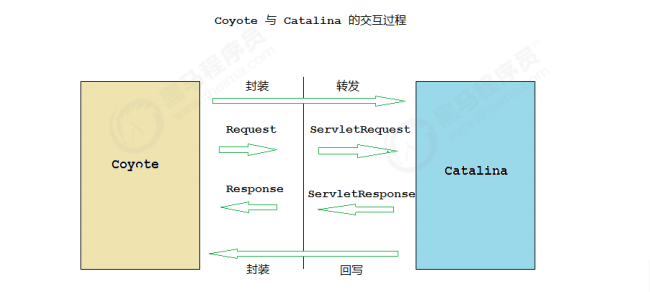
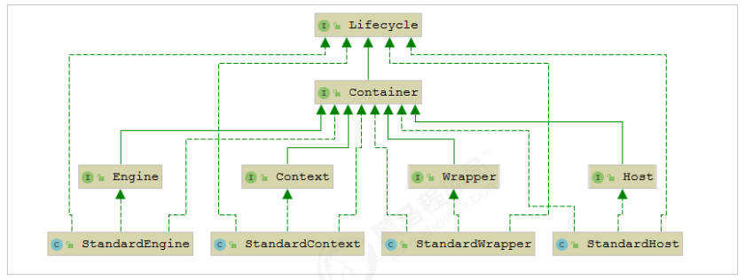
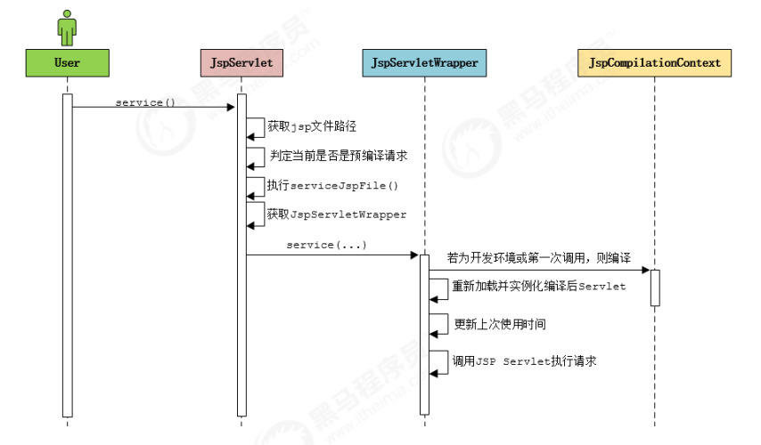

官网：http://tomcat.apache.org/

## 常见web服务器软件
- webLogic：oracle公司，大型的JavaEE服务器，支持所有的JavaEE规范，收费的。
- webSphere：IBM公司，大型的JavaEE服务器，支持所有的JavaEE规范，收费的。 
- JBoss：JBOSS公司的，大型的JavaEE服务器，支持所有的JavaEE规范，收费的。 
- Tomcat：Apache基金组织，中小型的JavaEE服务器，仅仅支持少量的JavaEE规范 servlet/jsp。开源的，免费的。

## Tomcat 历史 
1. Tomcat 最初由Sun公司的软件架构师 James Duncan Davidson 开发，名称为 “JavaWebServer”。 
2. 1999年，在 Davidson 的帮助下，该项目于1999年他和 apache 软件基金会旗下的 JServ 项目合并，并发布第一个版本（3.x）, 即是现在的Tomcat，该版本实现了 Servlet2.2 和 JSP 1.1 规范 。
3. 2001年，Tomcat 发布了4.0版本， 作为里程碑式的版本，Tomcat 完全重新设计了 其架构，并实现了 Servlet 2.3 和 JSP1.2规范。 
4. 目前 Tomcat 已经更新到 9.0.x版本 ， 但是目前企业中的Tomcat服务器， 主流版本还是 7.x 和 8.x ， 所以以下基于 8.5 版本进行讲解。

## 整体架构
我们知道如果要设计一个系统，首先是要了解需求，我们已经了解了Tomcat要实现两个 核心功能：
1. 处理Socket连接，负责网络字节流与Request和Response对象的转化。 
2. 加载和管理Servlet，以及具体处理Request请求。 

因此Tomcat设计了两个核心组件连接器（Connector）和容器（Container）来分别做这 两件事情。连接器负责对外交流，容器负责内部处理。


## 连接器 - Coyote 
### 架构介绍 
Coyote 是Tomcat的连接器框架的名称 , 是Tomcat服务器提供的供客户端访问的外部接口。客户端通过Coyote与服务器建立连接、发送请求并接受响应。
Coyote 封装了底层的网络通信（Socket 请求及响应处理），为Catalina 容器提供了统一 的接口，使Catalina 容器与具体的请求协议及IO操作方式完全解耦。Coyote 将Socket 输入转换封装为 Request 对象，交由Catalina 容器进行处理，处理请求完成后, Catalina 通 过Coyote 提供的Response 对象将结果写入输出流。 
Coyote 作为独立的模块，只负责具体协议和IO的相关操作， 与Servlet 规范实现没有直 接关系，因此即便是 Request 和 Response 对象也并未实现Servlet规范对应的接口， 而 是在Catalina 中将他们进一步封装为ServletRequest 和 ServletResponse 。



### IO模型与协议 
在Coyote中 ， Tomcat支持的多种I/O模型和应用层协议，Tomcat 支持的IO模型（自8.5/9.0 版本起，Tomcat 移除了 对 BIO 的支持）：
- NIO 非阻塞I/O，采用Java NIO类库实现。 
- NIO2 异步I/O，采用JDK 7最新的NIO2类库实现。 
- APR 采用Apache可移植运行库实现，是C/C++编写的本地库。如果选择该方案，需要单独安装APR库。

应用层协议如下：
- HTTP/1.1：这是大部分Web应用采用的访问协议。 
- AJP：用于和Web服务器集成（如Apache），以实现对静态资源的优化以及集群部署，当前支持AJP/1.3。 
- HTTP/2：HTTP 2.0大幅度的提升了Web性能。下一代HTTP协议 ， 自8.5以及9.0 版本之后支持。

在 8.0 之前 ， Tomcat 默认采用的I/O方式为 BIO ， 之后改为 NIO。 无论 NIO、NIO2 还是 APR， 在性能方面均优于以往的BIO。 如果采用APR， 甚至可以达到 Apache HTTP Server 的影响性能。

Tomcat中的Service概念：Tomcat为了实现支持多种I/O模型和应用层协议，一个容器可能对接多个连接器，就好比 一个房间有多个门。但是单独的连接器或者容器都不能对外提供服务，需要把它们组装 起来才能工作，组装后这个整体叫作Service组件。这里请你注意，Service本身没有做什 么重要的事情，只是在连接器和容器外面多包了一层，把它们组装在一起。Tomcat内可 能有多个Service，这样的设计也是出于灵活性的考虑。通过在Tomcat中配置多个 Service，可以实现通过不同的端口号来访问同一台机器上部署的不同应用。

### 连接器组件

连接器中的各个组件的作用如下： 

- EndPoint ： Coyote 通信端点，即通信监听的接口，是具体Socket接收和发送处理器，是对传输层的抽象，因此EndPoint用来实现TCP/IP协议的。Tomcat 并没有EndPoint 接口，而是提供了一个抽象类AbstractEndpoint ， 里面定 义了两个内部类：Acceptor和SocketProcessor。Acceptor用于监听Socket连接请求。 SocketProcessor用于处理接收到的Socket请求，它实现Runnable接口，在Run方法里 调用协议处理组件Processor进行处理。为了提高处理能力，SocketProcessor被提交到 线程池来执行。而这个线程池叫作执行器（Executor)，我在后面的专栏会详细介绍 Tomcat如何扩展原生的Java线程池。 
- Processor ： Coyote 协议处理接口 ，如果说EndPoint是用来实现TCP/IP协议的，那么 Processor用来实现HTTP协议，Processor接收来自EndPoint的Socket，读取字节流解 析成Tomcat Request和Response对象，并通过Adapter将其提交到容器处理， Processor是对应用层协议的抽象。 
- ProtocolHandler： Coyote 协议接口， 通过Endpoint 和 Processor ， 实现针对具体协议的处理能力。Tomcat 按照协议和I/O 提供了6个实现类 ： AjpNioProtocol， AjpNio2Protocol ，AjpAprProtocol， Http11NioProtocol ，Http11Nio2Protocol ， Http11AprProtocol。我们在配置tomcat/conf/server.xml 时 ， 至少要指定具体的 ProtocolHandler , 当然也可以指定协议名称， 如 ： HTTP/1.1 ，如果安装了APR，那么 将使用Http11AprProtocol ， 否则使用 Http11NioProtocol 。
- Adapter:  由于协议不同，客户端发过来的请求信息也不尽相同，Tomcat定义了自己的Request类 来“存放”这些请求信息。ProtocolHandler接口负责解析请求并生成Tomcat Request类。 但是这个Request对象不是标准的ServletRequest，也就意味着，不能用Tomcat Request作为参数来调用容器。Tomcat设计者的解决方案是引入CoyoteAdapter，这是 适配器模式的经典运用，连接器调用CoyoteAdapter的Sevice方法，传入的是Tomcat Request对象，CoyoteAdapter负责将Tomcat Request转成ServletRequest，再调用容 器的Service方法。

## 容器 - Catalina 
Tomcat是一个由一系列可配置的组件构成的Web容器，而Catalina是Tomcat的servlet容器。Catalina 是Servlet 容器实现，包含了之前讲到的所有的容器组件，以及后续章节涉及到的安全、会话、集群、管理等Servlet 容器架构的各个方面。它通过松耦合的方式集成 Coyote，以完成按照请求协议进行数据读写。同时，它还包括我们的启动入口、Shell程序等

### Catalina 地位 
Tomcat 的模块分层结构图， 如下：

Tomcat 本质上就是一款 Servlet 容器， 因此Catalina 才是 Tomcat 的核心 ， 其他模块 都是为Catalina 提供支撑的。 比如 ： 通过Coyote 模块提供链接通信，Jasper 模块提供 JSP引擎，Naming 提供JNDI 服务，Juli 提供日志服务。

### Catalina 结构 
Catalina 的主要组件结构如下：


如上图所示，Catalina负责管理Server，而Server表示着整个服务器。Server下面有多个 服务Service，每个服务都包含着多个连接器组件Connector（Coyote 实现）和一个容器 组件Container。在Tomcat 启动的时候， 会初始化一个Catalina的实例。 
Catalina 各个组件的职责：
- Catalina： 负责解析Tomcat的配置文件 , 以此来创建服务器Server组件，并根据 命令来对其进行管理 
- Server： 服务器表示整个Catalina Servlet容器以及其它组件，负责组装并启动 Servlet引擎,Tomcat连接器。Server通过实现Lifecycle接口，提供了 一种优雅的启动和关闭整个系统的方式 
- Service： 服务是Server内部的组件，一个Server包含多个Service。它将若干个 Connector组件绑定到一个Container（Engine）上 
- Connector： 连接器，处理与客户端的通信，它负责接收客户请求，然后转给相关 的容器处理，最后向客户返回响应结果 
- Container： 容器，负责处理用户的servlet请求，并返回对象给web用户的模块

### Container 结构
Tomcat设计了4种容器，分别是Engine、Host、Context和Wrapper。这4种容器不是平 行关系，而是父子关系。， Tomcat通过一种分层的架构，使得Servlet容器具有很好的灵活性。


各个组件的含义 ：
- Engine： 表示整个Catalina的Servlet引擎，用来管理多个虚拟站点，一个Service 最多只能有一个Engine，但是一个引擎可包含多个Host 
- Host： 代表一个虚拟主机，或者说一个站点，可以给Tomcat配置多个虚拟主机地址，而一个虚拟主机下可包含多个Context 
- Context： 表示一个Web应用程序， 一个Web应用可包含多个Wrapper 
- Wrapper： 表示一个Servlet，Wrapper 作为容器中的最底层，不能包含子容器

我们也可以再通过Tomcat的server.xml配置文件来加深对Tomcat容器的理解。Tomcat 采用了组件化的设计，它的构成组件都是可配置的，其中最外层的是Server，其他组件 按照一定的格式要求配置在这个顶层容器中。

```xml
<Server>
    <Service>
        <Connector/>
        <Connector/>

        <Engine>
            <Host>
                <Context>
            </Host>
        <Engine>
    </Service>
</Server>
```
那么，Tomcat是怎么管理这些容器的呢？你会发现这些容器具有父子关系，形成一个树 形结构，你可能马上就想到了设计模式中的组合模式。没错，Tomcat就是用组合模式来 管理这些容器的。具体实现方法是，所有容器组件都实现了Container接口，因此组合模 式可以使得用户对单容器对象和组合容器对象的使用具有一致性。这里单容器对象指的 是最底层的Wrapper，组合容器对象指的是上面的Context、Host或者Engine。



Container 接口中提供了addChild()、getParent()等方法，Container接口扩展了LifeCycle接口，LifeCycle接口用来统一管理各组件的生命周期，后面我也用专门的篇幅去详细介绍。

## 启动流程


1. 启动tomcat ， 需要调用 bin/startup.bat (在linux 目录下 , 需要调用 bin/startup.sh) ， 在startup.bat 脚本中, 调用了catalina.bat。 
2. 在catalina.bat 脚本文件中，调用了org.apache.catalina.startup.Bootstrap 中的main方法。 
3. 在BootStrap 的main 方法中调用了 init 方法 ， 来创建Catalina 及 初始化类加载器。 
4. 在BootStrap 的main 方法中调用了 load 方法 ， 在其中又调用了Catalina的load方法。
5. 在Catalina 的load 方法中 , 需要进行一些初始化的工作, 并需要构造Digester 对象, 用 于解析 XML。 
6. 然后在调用后续组件的初始化操作，加载Tomcat的配置文件，初始化容器组件 ，监听对应的端口号， 准备接受客户端请求

### Lifecycle 
由于所有的组件均存在初始化、启动、停止等生命周期方法，拥有生命周期管理的特性， 所以Tomcat在设计的时候， 基于生命周期管理抽象成了一个接口 Lifecycle ，而组 件 Server、Service、Container、Executor、Connector 组件 ， 都实现了一个生命周期 的接口，从而具有了以下生命周期中的核心方法：
- init（）：初始化组件 
- start（）：启动组件 
- stop（）：停止组件 
- destroy（）：销毁组件

从启动流程图中以及源码中，我们可以看出Tomcat的启动过程非常标准化， 统一按照生 命周期管理接口Lifecycle的定义进行启动。首先调用init() 方法进行组件的逐级初始化操 作，然后再调用start()方法进行启动。 每一级的组件除了完成自身的处理外，还要负责调用子组件响应的生命周期管理方法， 组件与组件之间是松耦合的，因为我们可以很容易的通过配置文件进行修改和替换。

## 请求处理流程
设计了这么多层次的容器，Tomcat是怎么确定每一个请求应该由哪个Wrapper容器里的 Servlet来处理的呢？答案是，Tomcat是用Mapper组件来完成这个任务的。 Mapper组件的功能就是将用户请求的URL定位到一个Servlet，它的工作原理是： Mapper组件里保存了Web应用的配置信息，其实就是容器组件与访问路径的映射关系， 比如Host容器里配置的域名、Context容器里的Web应用路径，以及Wrapper容器里 Servlet映射的路径，你可以想象这些配置信息就是一个多层次的Map。

当一个请求到来时，Mapper组件通过解析请求URL里的域名和路径，再到自己保存的 Map里去查找，就能定位到一个Servlet。请你注意，一个请求URL最后只会定位到一个 Wrapper容器，也就是一个Servlet。

上面只是描述了根据请求的URL如何查找到需要执行的Servlet ， 那么下面我们 再来解析一下 ， 从Tomcat的设计架构层面来分析Tomcat的请求处理。


1. Connector组件Endpoint中的Acceptor监听客户端套接字连接并接收Socket。 
2. 将连接交给线程池Executor处理，开始执行请求响应任务。 
3. Processor组件读取消息报文，解析请求行、请求体、请求头，封装成Request对象。 
4. Mapper组件根据请求行的URL值和请求头的Host值匹配由哪个Host容器、Context容器、Wrapper容器处理请求。 
5. CoyoteAdaptor组件负责将Connector组件和Engine容器关联起来，把生成的 Request对象和响应对象Response传递到Engine容器中，调用 Pipeline。 
6. Engine容器的管道开始处理，管道中包含若干个Valve、每个Valve负责部分处理逻辑。执行完Valve后会执行基础的 Valve--StandardEngineValve，负责调用Host容器的 Pipeline。 
7. Host容器的管道开始处理，流程类似，最后执行 Context容器的Pipeline。 
8. Context容器的管道开始处理，流程类似，最后执行 Wrapper容器的Pipeline。 
9. Wrapper容器的管道开始处理，流程类似，最后执行 Wrapper容器对应的Servlet对象 的 处理方法。


在前面所讲解的Tomcat的整体架构中，我们发现Tomcat中的各个组件各司其职，组件 之间松耦合，确保了整体架构的可伸缩性和可拓展性，那么在组件内部，如何增强组件 的灵活性和拓展性呢？ 在Tomcat中，每个Container组件采用责任链模式来完成具体的 请求处理。 在Tomcat中定义了Pipeline 和 Valve 两个接口，Pipeline 用于构建责任链， 后者代表责 任链上的每个处理器。Pipeline 中维护了一个基础的Valve，它始终位于Pipeline的末端 （最后执行），封装了具体的请求处理和输出响应的过程。当然，我们也可以调用 addValve()方法， 为Pipeline 添加其他的Valve， 后添加的Valve 位于基础的Valve之 前，并按照添加顺序执行。Pipiline通过获得首个Valve来启动整合链条的执行 。

## Jasper 
### Jasper 简介 
对于基于JSP 的web应用来说，我们可以直接在JSP页面中编写 Java代码，添加第三方的 标签库，以及使用EL表达式。但是无论经过何种形式的处理，最终输出到客户端的都是 标准的HTML页面（包含js ，css...），并不包含任何的java相关的语法。 也就是说， 我 们可以把jsp看做是一种运行在服务端的脚本。 那么服务器是如何将 JSP页面转换为 HTML页面的呢？ Jasper模块是Tomcat的JSP核心引擎，我们知道JSP本质上是一个Servlet。Tomcat使用 Jasper对JSP语法进行解析，生成Servlet并生成Class字节码，用户在进行访问jsp时，会 访问Servlet，最终将访问的结果直接响应在浏览器端 。另外，在运行的时候，Jasper还 会检测JSP文件是否修改，如果修改，则会重新编译JSP文件。

### 运行时编译方式
Tomcat 并不会在启动Web应用的时候自动编译JSP文件， 而是在客户端第一次请求时， 才编译需要访问的JSP文件。 编译过程如下: 

Tomcat 在默认的web.xml 中配置了一个org.apache.jasper.servlet.JspServlet，用于处 理所有的.jsp 或 .jspx 结尾的请求，该Servlet 实现即是运行时编译的入口。

JspServlet 处理流程图：


编译结果:
1. 如果在 tomcat/conf/web.xml 中配置了参数scratchdir ， 则jsp编译后的结果，就会存储在该目录下 。
2. 如果没有配置该选项， 则会将编译后的结果，存储在Tomcat安装目录下的 work/Catalina(Engine名称)/localhost(Host名称)/Context名称。 

### 预编译方式
除了运行时编译，我们还可以直接在Web应用启动时， 一次性将Web应用中的所有的JSP 页面一次性编译完成。在这种情况下，Web应用运行过程中，便可以不必再进行实时编 译，而是直接调用JSP页面对应的Servlet 完成请求处理， 从而提升系统性能。 Tomcat 提供了一个Shell程序JspC，用于支持JSP预编译，而且在Tomcat的安装目录下提 供了一个 catalina-tasks.xml 文件声明了Tomcat 支持的Ant任务， 因此，我们很容易使 用 Ant 来执行JSP 预编译 。（要想使用这种方式，必须得确保在此之前已经下载并安装 了Apache Ant）。

### 编译后的源码文件
todo

### 编译流程
JSP 编译过程如下：


Compiler 编译工作主要包含代码生成 和 编译两部分

代码生成:
1. Compiler 通过一个 PageInfo 对象保存JSP 页面编译过程中的各种配置，这些配置可 能来源于 Web 应用初始化参数， 也可能来源于JSP页面的指令配置（如 page ， include）。 
2. 调用ParserController 解析指令节点， 验证其是否合法，同时将配置信息保存到 PageInfo 中， 用于控制代码生成。 
3. 调用ParserController 解析整个页面， 由于 JSP 是逐行解析， 所以对于每一行会创建一个具体的Node 对象。如 静态文本（TemplateText）、Java代码（Scriptlet）、定制标签（CustomTag）、Include指令（IncludeDirective）。 
4. 验证除指令外其他所有节点的合法性， 如 脚本、定制标签、EL表达式等。 
5. 收集除指令外其他节点的页面配置信息。 
6. 编译并加载当前 JSP 页面依赖的标签
7. 对于JSP页面的EL表达式，生成对应的映射函数。 
8. 生成JSP页面对应的Servlet 类源代码 编译代码生成完成后， Compiler 还会生成 SMAP 信息。 如果配置生成 SMAP 信息， Compiler 则会在编译阶段将SMAP 信息写到class 文件中 。 

编译阶段: Compiler 的两个实现 AntCompiler 和 JDTCompiler 分别调用相关框架的 API 进行源代码编译。 对于 AntCompiler 来说， 构造一个 Ant 的javac 的任务完成编译。 对于 JDTCompiler 来说， 调用 org.eclipse.jdt.internal.compiler.Compiler 完成编译。

## 服务器配置
Tomcat 服务器的配置主要集中于 tomcat/conf 下的 catalina.policy、 catalina.properties、context.xml、server.xml、tomcat-users.xml、web.xml 文件。 

tomcat-users.xml 该配置文件中，主要配置的是Tomcat的用户，角色等信息，用来控制Tomcat中 manager， host-manager的访问权限。
server.xml 是tomcat 服务器的核心配置文件，包含了Tomcat的 Servlet 容器 （Catalina）的所有配置。由于配置的属性特别多，我们在这里主要讲解其中的一部分重要配置。 

### Server
Server标签是server.xml的根元素，用于创建一个Server实例，默认使用的实现类是 org.apache.catalina.core.StandardServer。
它的属性有port : Tomcat 监听的关闭服务器的端口；shutdown： 关闭服务器的指令字符串。 
Server内嵌的子元素为 Listener、GlobalNamingResources、Service。

默认配置的5个Listener 的含义：
```xml
<!‐‐ 用于以日志形式输出服务器 、操作系统、JVM的版本信息 ‐‐> 
<Listener className="org.apache.catalina.startup.VersionLoggerListener" />

<!‐‐ 用于加载（服务器启动） 和 销毁 （服务器停止） APR。 如果找不到APR库， 则会 输出日志， 并不影响Tomcat启动 ‐‐> 
<Listener className="org.apache.catalina.core.AprLifecycleListener" SSLEngine="on" /> 

<!‐‐ 用于避免JRE内存泄漏问题 ‐‐> 
<Listener className="org.apache.catalina.core.JreMemoryLeakPreventionListener" /> 

<!‐‐ 用户加载（服务器启动） 和 销毁（服务器停止） 全局命名服务 ‐‐> 
<Listener className="org.apache.catalina.mbeans.GlobalResourcesLifecycleListener" />

<!‐‐ 用于在Context停止时重建Executor 池中的线程， 以避免ThreadLocal 相关的内 存泄漏 ‐‐> 
<Listener className="org.apache.catalina.core.ThreadLocalLeakPreventionListener" />
```

GlobalNamingResources 中定义了全局命名服务：
```xml
<!‐‐ Global JNDI resources Documentation at /docs/jndi‐resources‐howto.html ‐‐> 
<GlobalNamingResources> 
    <!‐‐ Editable user database that can also be used by UserDatabaseRealm to authenticate users ‐‐> 
    <Resource name="UserDatabase" auth="Container" type="org.apache.catalina.UserDatabase" 
                description="User database that can be updated and saved" 
                factory="org.apache.catalina.users.MemoryUserDatabaseFactory" 
                pathname="conf/tomcat‐users.xml" /> 
</GlobalNamingResources>
```

### Service 
该元素用于创建 Service 实例，默认使用 org.apache.catalina.core.StandardService。 一个Server服务器，可以包含多个Service。
默认情况下，Tomcat 仅指定了Service 的名称， 值为 "Catalina"。
Service 可以内嵌的 元素为 ： Listener、Executor、Connector、Engine
- Listener 用于为Service 添加生命周期监听器
- Executor 用于配置Service 共享线程池
- Connector 用于配置 Service 包含的链接器
- Engine 用于配置Service中链接器对应的Servlet 容器引擎

### Executor 
该标签用来配置共享线程池。默认情况下，Service 并未添加共享线程池配置。如果不配置共享线程池，那么Catalina 各组件在用到线程池时会独立创建。


### Connector 
Connector 用于创建链接器实例。默认情况下，server.xml 配置了两个链接器，一个支 持HTTP协议，一个支持AJP协议。因此大多数情况下，我们并不需要新增链接器配置， 只是根据需要对已有链接器进行优化。

```xml
<Connector port="8080" protocol="HTTP/1.1" connectionTimeout="20000" redirectPort="8443" /> 
<Connector port="8009" protocol="AJP/1.3" redirectPort="8443" />
```

属性说明：
- port： 端口号，Connector 用于创建服务端Socket 并进行监听， 以等待客户端请求 链接。如果该属性设置为0，Tomcat将会随机选择一个可用的端口号给当前Connector 使用。 
- protocol ： 当前Connector 支持的访问协议。 默认为 HTTP/1.1 ， 并采用自动切换机制选择一个基于 JAVA NIO 的链接器或者基于本地APR的链接器（根据本地是否含有 Tomcat的本地库判定）。 如果不希望采用上述自动切换的机制， 而是明确指定协议， 可以使用以下值。 

```
Http协议：
org.apache.coyote.http11.Http11NioProtocol ， 非阻塞式 Java NIO 链接器 
org.apache.coyote.http11.Http11Nio2Protocol ， 非阻塞式 JAVA NIO2 链接器 
org.apache.coyote.http11.Http11AprProtocol ， APR 链接器

AJP协议 ：
org.apache.coyote.ajp.AjpNioProtocol ， 非阻塞式 Java NIO 链接器 
org.apache.coyote.ajp.AjpNio2Protocol ，非阻塞式 JAVA NIO2 链接器 
org.apache.coyote.ajp.AjpAprProtocol ， APR 链接器
```

- connectionTimeOut : Connector 接收链接后的等待超时时间， 单位为 毫秒。 -1 表 示不超时。
- redirectPort：当前Connector 不支持SSL请求， 接收到了一个请求， 并且也符合 security-constraint 约束， 需要SSL传输，Catalina自动将请求重定向到指定的端口。 
- executor ： 指定共享线程池的名称， 也可以通过maxThreads、minSpareThreads 等属性配置内部线程池。 
- URIEncoding : 用于指定编码URI的字符编码， Tomcat8.x版本默认的编码为 UTF-8 , Tomcat7.x版本默认为ISO-8859-1。

### Engine
Engine 作为Servlet 引擎的顶级元素，内部可以嵌入： Cluster、Listener、Realm、 Valve和Host。
属性说明： 
- name： 用于指定Engine 的名称， 默认为Catalina 。该名称会影响一部分Tomcat的存储路径（如临时文件）。 
- defaultHost ： 默认使用的虚拟主机名称， 当客户端请求指向的主机无效时， 将交由默认的虚拟主机处理， 默认为localhost。

### Host 
Host 元素用于配置一个虚拟主机， 它支持以下嵌入元素：Alias、Cluster、Listener、 Valve、Realm、Context。如果在Engine下配置Realm， 那么此配置将在当前Engine下 的所有Host中共享。 同样，如果在Host中配置Realm ， 则在当前Host下的所有Context 中共享。Context中的Realm优先级 > Host 的Realm优先级 > Engine中的Realm优先级。

```xml
<Host name="localhost" appBase="webapps" unpackWARs="true" autoDeploy="true"> ... </Host>
```

属性说明： 
- name: 当前Host通用的网络名称， 必须与DNS服务器上的注册信息一致。 Engine中 包含的Host必须存在一个名称与Engine的defaultHost设置一致。 
- appBase： 当前Host的应用基础目录， 当前Host上部署的Web应用均在该目录下 （可以是绝对目录，相对路径）。默认为webapps。
- unpackWARs： 设置为true， Host在启动时会将appBase目录下war包解压为目录。设置为false， Host将直接从war文件启动。 
- autoDeploy： 控制tomcat是否在运行时定期检测并自动部署新增或变更的web应用。

通过给Host添加别名，我们可以实现同一个Host拥有多个网络名称，配置如下：
```xml
<Host name="www.web1.com" appBase="webapps" unpackWARs="true" autoDeploy="true"> 
    <Alias>www.web2.com</Alias>
</Host>
```
这个时候，我们就可以通过两个域名访问当前Host下的应用（需要确保DNS或hosts中添 加了域名的映射配置）。

### Context 
Context 用于配置一个Web应用信息，一般在web.xml中配置

## Web 应用配置 
web.xml 是web应用的描述文件， 它支持的元素及属性来自于Servlet 规范定义。 
在 Tomcat 中， Web 应用的描述信息包括 tomcat/conf/web.xml 中默认配置 以及 Web 应用 WEB-INF/web.xml 下的定制配置。

### ServletContext 初始化参数
我们可以通过 添加ServletContext 初始化参数，它配置了一个键值对，这样我们可以在 应用程序中使用 javax.servlet.ServletContext.getInitParameter()方法获取参数。
```xml
<context‐param> 
    <param‐name>contextConfigLocation</param‐name> 
    <param‐value>classpath:applicationContext‐*.xml</param‐value> 
    <description>Spring Config File Location</description> 
</context‐param>
```

### 会话配置 
用于配置Web应用会话，包括 超时时间、Cookie配置以及会话追踪模式。它将覆盖 server.xml 和 context.xml 中的配置。

```xml
<session‐config> 
    <session‐timeout>30</session‐timeout> 
    <cookie‐config> 
        <name>JESSIONID</name> 
        <domain>www.itcast.cn</domain> 
        <path>/</path> 
        <comment>Session Cookie</comment> 
        <http‐only>true</http‐only>  <!-- cookie只能通过HTTP方式进行访问，JS无法读取或修改，此项可以增 加网站访问的安全性。 -->
        <secure>false</secure>  <!-- 此cookie只能通过HTTPS连接传递到服务器，而HTTP 连接则不会传递该 信息。注意是从浏览器传递到服务器，服务器端的Cookie对象不受此项影响。 -->
        <max‐age>3600</max‐age> <!-- 以秒为单位表示cookie的生存期，默认为‐1表示是会话Cookie，浏览器 关闭时就会消失。 -->
    </cookie‐config> 
    <tracking‐mode>COOKIE</tracking‐mode> <!-- 用于配置会话追踪模式，Servlet3.0版本中支持的追踪模式： COOKIE、URL、SSL -->
</session‐config>
```

追踪模式：
- COOKIE : 通过HTTP Cookie 追踪会话是最常用的会话追踪机制， 而且 Servlet规范也要求所有的Servlet规范都需要支持Cookie追踪。 
- URL : URL重写是最基本的会话追踪机制。当客户端不支持Cookie时，可以采 用URL重写的方式。当采用URL追踪模式时，请求路径需要包含会话标识信息，Servlet容器 会根据路径中的会话标识设置请求的会话信息。如： http：//www.myserver.com/user/index.html;jessionid=1234567890。 
- SSL : 对于SSL请求， 通过SSL会话标识确定请求会话标识。

### Servlet配置 
Servlet 的配置主要是两部分， servlet 和 servlet-mapping

Servlet 中文件上传时的配置：
```xml
<servlet> 
    <servlet‐name>uploadServlet</servlet‐name> 
    <servlet‐class>cn.xxx.web.UploadServlet</servlet‐class> 
    <multipart‐config> 
        <location>C://path</location> 
        <max‐file‐size>10485760</max‐file‐size>  <!-- 允许上传的文件最大值。 默认值为‐1， 表示没有限制。 -->
        <max‐request‐size>10485760</max‐request‐size>  <!-- 针对该 multi/form‐data 请求的最大数量，默认值为‐1， 表示 无限制。 -->
        <file‐size‐threshold>0</file‐size‐threshold>  <!-- 当数量量大于该值时， 内容会被写入文件。 -->
    </multipart‐config> 
</servlet>
```
### Listener配置 
Listener用于监听servlet中的事件，例如context、request、session对象的创建、修 改、删除，并触发响应事件。
Listener是观察者模式的实现，在servlet中主要用于对 context、request、session对象的生命周期进行监控。
在servlet2.5规范中共定义了8中 Listener。在启动时，ServletContextListener 的执行顺序与web.xml 中的配置顺序一 致， 停止时执行顺序相反。

### Filter配置
filter 用于配置web应用过滤器， 用来过滤资源请求及响应。 经常用于认证、日志、加密、数据转换等操作。

### 欢迎页面配置 
welcome-file-list 用于指定web应用的欢迎文件列表。尝试请求的顺序，从上到下。

```xml
<welcome‐file‐list> 
    <welcome‐file>index.html</welcome‐file> 
    <welcome‐file>index.htm</welcome‐file> 
    <welcome‐file>index.jsp</welcome‐file> 
</welcome‐file‐list>
```

### 错误页面配置 
error-page 用于配置Web应用访问异常时定向到的页面，支持HTTP响应码和异常类两种 形式。
```xml
<error‐page> 
    <error‐code>404</error‐code> 
    <location>/404.html</location> 
</error‐page> 

<error‐page> 
    <error‐code>500</error‐code> 
    <location>/500.html</location> 
</error‐page> 

<error‐page> 
    <exception‐type>java.lang.Exception</exception‐type> 
    <location>/error.jsp</location> 
</error‐page>
```
## Tomcat 管理配置 
从早期的Tomcat版本开始，就提供了Web版的管理控制台，他们是两个独立的Web应 用，位于webapps目录下。Tomcat 提供的管理应用有用于管理的Host的host-manager 和用于管理Web应用的manager。 

### host-manager 
Tomcat启动之后，可以通过 http://localhost:8080/host-manager/html 访问该Web应用。 host-manager 默认添加了访问权限控制，当打开网址时，需要输入用户名和密码 （conf/tomcat-users.xml中配置） 。所以要想访问该页面，需要在conf/tomcat-users.xml 中配置，并分配对应的角色：
- admin-gui：用于控制页面访问权限 
- admin-script：用于控制以简单文本的形式进行访问

```xml
<role rolename="admin‐gui"/> 
<role rolename="admin‐script"/> 
<user username="fuyi" password="123546" roles="admin‐script,admin‐gui"/>
```

### web-manager
manager的访问地址为 http://localhost:8080/manager， 同样， manager也添加了页面访问控制，因此我们需要为登录用户分配角色为：

```xml
<role rolename="admin-gui"/> 
<role rolename="admin-script"/> 
<role rolename="manager-gui"/> 
<role rolename="manager-script"/> 
<role rolename="manager-status" />

<user username="fuyi" password="123456" roles="admin-script,admin-gui,manager-gui,manager-script,manager-status"/>
```

## JVM 配置
最常见的JVM配置当属内存分配，因为在绝大多数情况下，JVM默认分配的内存可能不能够满足我们的需求，特别是在生产环境，此时需要手动修改Tomcat启动时的内存参数分配。


## 参考资料
> - [https://www.bilibili.com/video/BV1dJ411N7Um](https://www.bilibili.com/video/BV1dJ411N7Um)
> - []()
