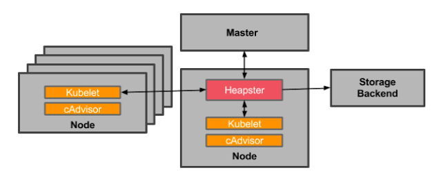

相较于zabbix等传统监控工具，cAdvisor与prometheus都是容器时代的产物。

- cAdvisor+heapster+influxdb的组合显然更契合与k8s框架。
- prometheus更适合于通用的各种复杂情景的监控。

以下会对两种组合从不同方面进行对比

## 工具简要说明

cAdvisor：docker的采集器

Heapster：以cAdvisor作伟数据源的k8s的监控工具

Influxdb：时序数据库

Grafana：页面展示工具，与heapster与Prometheus均可集成

Prometheus：集成采集、存储、页面展示、告警与一体的监控工具

## 对比1：设计思想的不同

- cAdvisor+Heapster+influxdb

cAdvisor 是Google用来分析运行中的Docker容器的资源占用以及性能特性的工具, cAdvisor部署为一个运行中的daemon，它会收集、聚集、处理并导出运行中容器的信息。这些信息能够包含容器级别的资源隔离参数、资源的历史使用状况、反映资源使用和网络统计数据完整历史状况。对docker的监控能力非常强大。cAdvior功能已经被集成到了kubelet组件中，也就是说，安装好kubernetes后，cAdvisor就已经安装到了每一个计算节点上。

Heapster同样是Google提供的，用于对k8s集群的监控。Heapster可以通过容器启动，传入kubernetes master的地址，heapster会通过调用kubernetes api获取所有kubernetes计算节点，然后通过kubelet的外部调用端口号（默认为10250）调用kubelet的http api，kubelet会进行调用cAdvisor接口获取当前计算节点上的容器数据以及当前主机的性能数据，返回给heapter。这样heapster就收集到了kubernetes集群的所有容器数据以及主机数据。Heapster支持数据传输到Influxdb中进行存储。

- Prometheus

Prometheus 是google力捧的监控方案，社区非常活跃，发展很是迅速，功能在不断的飞速补充和完善。一个监控范围覆盖容器、主机、存储、数据库、各种中间件，同时还具体完善的时序数据存储、告警中心等能力。

## 对比2：采集范围的不同
1. cAdvisor

容器级别的资源隔离参数、资源的历史使用状况、反映资源使用和网络统计数据完整历史状况、主机数据等。

2. Prometheus

提供多维的数据模型，借助这种多维性所提供的灵活查询语言，所以理论上服务支持Prometheus端点或是提供http端口的转换器都可以手动拉取数据，既适用于面向服务器等硬件指标的监控，也适用于高动态的面向服务架构的监控。

## **对比3：功能的不同**

1. cAdvisor+Heapster+influxdb

可以提供基本的采集、处理与存储；

2. Prometheus

除了提供基本的采集、处理与存储外，还提供了报警功能与页面的展示功能

## 对比4：应用场景的不同
1. cAdvisor+Heapster+influxdb

基于cAdvisor与Heapster的设计初衷，对于k8s集群能够完美的适应，适合于监控k8s集群中各容器的信息。

2. Prometheus

Prometheus它的价值在于可靠性，甚至在很恶劣的环境下，你都可以随时访问它和查看系统服务各种指标的统计信息。如果你对统计数据需要100%的精确，它并不适用，例如：它不适用于实时计费系统。

## 各自缺点
1. cAdvisor+Heapster+influxdb

监控的数据范围有限，只能监控到主机级别和容器级别，显然对容器中的服务监控无能为力。

2. Prometheus

对于Prometheus的使用者来说，所有的公制端点都必须是可达的，这意味着一个更加复杂的安全网络配置，在大型部署中，扩展成为一个问题。

## 参考资料
> - 
> - 
