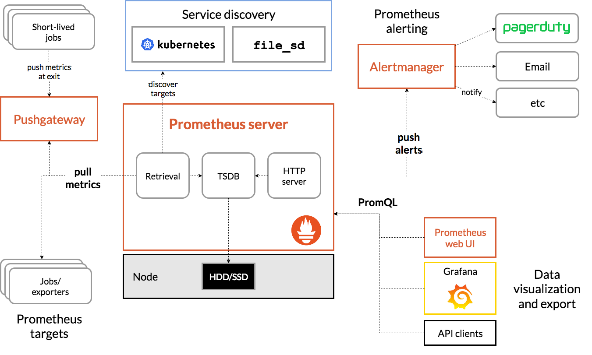

Prometheus是由SoundCloud开发的开源监控报警系统和时序列数据库(TSDB)。Prometheus使用Go语言开发，是Google BorgMon监控系统的开源版本。

2016年由Google发起Linux基金会旗下的云原生基金会(Cloud Native Computing Foundation), 将Prometheus纳入其下第二大开源项目。Prometheus目前在开源社区相当活跃。

Prometheus和Heapster相比功能更完善、更全面。Heapster是K8S的一个子项目，用于获取集群的性能数据。Prometheus性能也足够支撑上万台规模的集群。

官网地址：https://prometheus.io/

## 基本原理

Prometheus的基本原理是通过HTTP协议周期性抓取被监控组件的状态，任意组件只要提供对应的HTTP接口就可以接入监控。不需要任何SDK或者其他的集成过程。这样做非常适合做虚拟化环境监控系统，比如VM、Docker、Kubernetes等。输出被监控组件信息的HTTP接口被叫做exporter 。目前互联网公司常用的组件大部分都有exporter可以直接使用，比如汇报机器数据的 node_exporter, 汇报 MongoDB 信息的 MongoDB exporter 等等。





## 监控过程

1. Prometheus Daemon负责定时去目标上抓取metrics(指标)数据，每个抓取目标需要暴露一个http服务的接口给它定时抓取。Prometheus支持通过配置文件、文本文件、Zookeeper、Consul、DNS SRV Lookup等方式指定抓取目标。Prometheus采用PULL的方式进行监控，即服务器可以直接通过目标PULL数据或者间接地通过中间网关来Push数据。

2. Prometheus在本地存储抓取的所有数据，并通过一定规则进行清理和整理数据，并把得到的结果存储到新的时间序列中。

3. Prometheus通过PromQL和其他API可视化地展示收集的数据。Prometheus支持很多方式的图表可视化，例如Grafana、自带的Promdash以及自身提供的模版引擎等等。Prometheus还提供HTTP API的查询方式，自定义所需要的输出。

4. PushGateway支持Client主动推送metrics到PushGateway，而Prometheus只是定时去Gateway上抓取数据。

5. Alertmanager是独立于Prometheus的一个组件，可以支持Prometheus的查询语句，提供十分灵活的报警方式。


## 安装Prometheus Server

1. 新建配置文件prometheus.yml

```
global:
  scrape_interval:     15s # 默认抓取间隔, 15秒向目标抓取一次数据。
  external_labels:
    monitor: 'codelab-monitor' # 这里表示抓取对象的配置
scrape_configs:  # 表示在这个配置内的时间序例，每一条都会自动添加上这个{job_name:"prometheus"}的标签
  - job_name: 'prometheus'
    scrape_interval: 5s # 重写了全局抓取间隔时间，由15秒重写成5秒
    static_configs:
      - targets: ['localhost:9090']
```

2. 创建服务

```
docker run --name=prometheus -d \
-p 9090:9090 \
-v /root/prometheus/prometheus.yml:/etc/prometheus/prometheus.yml \
-v /root/prometheus/rules.yml:/etc/prometheus/rules.yml \
prom/prometheus:v2.7.2 \
--config.file=/etc/prometheus/prometheus.yml \
--web.enable-lifecycle
```

参数说明:  

- --web.enable-lifecycle   启用远程热加载配置文件功能，调用指令是curl -X POST http://localhost:9090/-/reload

3. 访问http://ip:9090进入prometheus管理页面

默认prometheus会抓取自己的/metrics接口，可以访问http://ip:9090/metrics查看到采集的数据，也可以在Graph选项已经可以看到监控的数据


## 安装node exporter提供metrics

1. 创建服务

```
docker run -d \
--name=node-exporter \
-p 9100:9100 \
prom/node-exporter
```

2. 在prometheus.yml中配置target，注意修改ip为node-exporter容器ip

```
global:
  scrape_interval:     15s # 默认抓取间隔, 15秒向目标抓取一次数据。
  external_labels:
    monitor: 'codelab-monitor' # 这里表示抓取对象的配置
scrape_configs:  # 表示在这个配置内的时间序例，每一条都会自动添加上这个{job_name:"prometheus"}的标签
  - job_name: 'prometheus'
    scrape_interval: 5s # 重写了全局抓取间隔时间，由15秒重写成5秒
    static_configs:
      - targets: ['localhost:9090']
      - targets: ['172.18.0.13:9100']
        labels:
          group: 'client-node-exporter'
```

3. 重新载入配置   curl -X POST http://localhost:9090/-/reload
4. 可以查看管理端的status标签下的target列表是否正常
5. 可以在Graph选项已经可以看到监控的数据，node前缀的都是node exporter提供的指标

prometheus还提供了各种exporter工具，感兴趣小伙伴可以去研究一下


## 安装push gateway

Push gateway是为了允许临时作业和批处理作业公开他们的指标。由于这类作业的存在时间可能不够长，Prometheus默认采集数据是用的pull也就是拉模型，这从我们刚才设置的采集间隔5秒参数就能看出来，这些数据并不适合采用pull的方式，对这样的数据可以使用Push Gateway服务，让它们可以主动将指标推送到Push gateway中。它就相当于一个缓存，稍后由Prometheus再pull过来。

1. 创建服务

```
docker run -d -p 9091:9091 --name pushgateway prom/pushgateway
```

2. 访问ip:9091看到pushgateway已经运行起来了
3. 接下来我们就可以往pushgateway推送数据了，prometheus提供了多种语言的sdk，最简单的方式就是通过shell

- 推送一个指标

```
echo "cqh_metric 100" | curl --data-binary @- http://ip:9091/metrics/job/cqh
```

- 推送多个指标

```
cat <<EOF | curl --data-binary @- http://ip:9091/metrics/job/cqh/instance/test
# 锻炼场所价格
muscle_metric{label="gym"} 8800
# 三大项数据 kg
bench_press 100
dead_lift 160
deep_squal 160
EOF
```

4. 将pushgateway配置到prometheus.yml中的target里

```
global:
  scrape_interval:     15s # 默认抓取间隔, 15秒向目标抓取一次数据。
  external_labels:
    monitor: 'codelab-monitor' # 这里表示抓取对象的配置
scrape_configs:  # 表示在这个配置内的时间序例，每一条都会自动添加上这个{job_name:"prometheus"}的标签
  - job_name: 'prometheus'
    scrape_interval: 5s # 重写了全局抓取间隔时间，由15秒重写成5秒
    static_configs:
      - targets: ['localhost:9090']
      - targets: ['172.18.0.13:9100']
        labels:
          group: 'client-node-exporter'
      - targets: ['172.18.0.14:9091']
        labels:
          group: 'pushgateway'
```

5. 重新载入配置   curl -X POST http://localhost:9090/-/reload
6. 可以查看管理端的status标签下的target列表是否正常
7. 可以在Graph选项已经可以看到bench_press、dead_lift、deep_squal三项监控指标

## 安装AlterManager

Pormetheus的警告由独立的两部分组成：

1. Prometheus服务中的触发警告规则，发送警告到Alertmanager。
2. Alertmanager管理这些警告。包括silencing, inhibition, aggregation，以及通过一些方法发送通知，例如：email，PagerDuty和HipChat。


建立警告和通知的主要步骤：

1. 创建和配置Alertmanager

2. 启动Prometheus服务时，通过-alertmanager.url标志配置Alermanager地址，以便Prometheus服务能和Alertmanager建立连接。

## 参考资料

> - []()
> - []()
