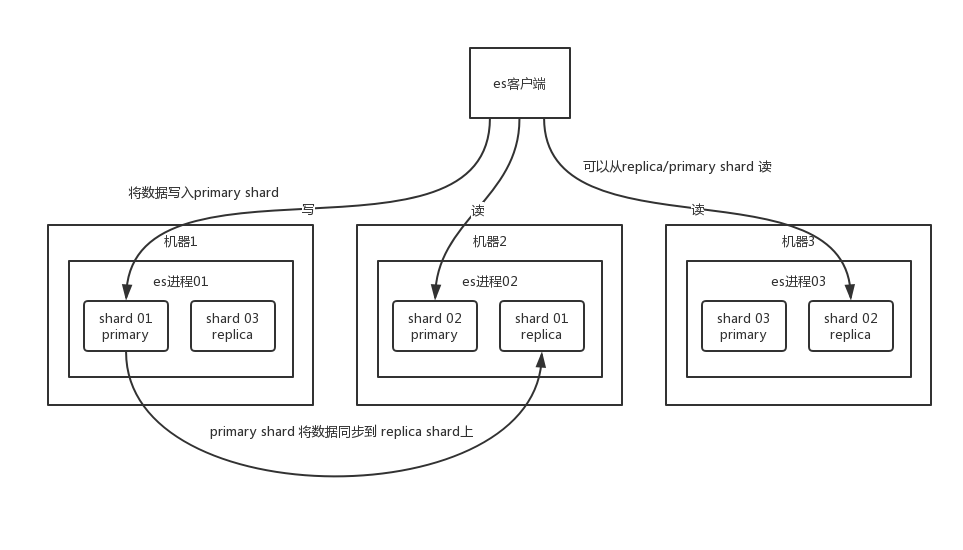

ElasticSearch 设计的理念就是分布式搜索引擎，底层其实还是基于 lucene 的。核心思想就是在多台机器上启动多个 es 进程实例，组成了一个 es 集群。

## 逻辑结构

- Index

es 中存储数据的**基本单位是索引**，比如说你现在要在 es 中存储一些订单数据，你就应该在 es 中创建一个索引 `order_idx`，所有的订单数据就都写到这个索引里面去，一个索引差不多就是相当于是 mysql 里的一张表。

```
index -> type -> mapping -> document -> field
```

这样吧，为了做个更直白的介绍，我在这里做个类比。但是切记，不要划等号，类比只是为了便于理解。

- Type

index 相当于 mysql 里的一张表。而 type 没法跟 mysql 里去对比，一个 index 里可以有多个 type，每个 type 的字段都是差不多的，但是有一些略微的差别。假设有一个 index，是订单 index，里面专门是放订单数据的。就好比说你在 mysql 中建表，有些订单是实物商品的订单，比如一件衣服、一双鞋子；有些订单是虚拟商品的订单，比如游戏点卡，话费充值。就两种订单大部分字段是一样的，但是少部分字段可能有略微的一些差别。

所以就会在订单 index 里，建两个 type，一个是实物商品订单 type，一个是虚拟商品订单 type，这两个 type 大部分字段是一样的，少部分字段是不一样的。

很多情况下，一个 index 里可能就一个 type，但是确实如果说是一个 index 里有多个 type 的情况（**注意**，`mapping types`这个概念在 ElasticSearch 7.X 已被完全移除，详细说明可以参考[官方文档](https://github.com/elastic/elasticsearch/blob/6.5/docs/reference/mapping/removal_of_types.asciidoc)），你可以认为 index 是一个类别的表，具体的每个 type 代表了 mysql 中的一个表。

- Mapping

每个 type 有一个 mapping，如果你认为一个 type 是具体的一个表，index 就代表多个 type 同属于的一个类型，而 mapping 就是这个 type 的**表结构定义**，你在 mysql 中创建一个表，肯定是要定义表结构的，里面有哪些字段，每个字段是什么类型。

- Document

实际上你往 index 里的一个 type 里面写的一条数据，叫做一条 document，一条 document 就代表了 mysql 中某个表里的一行。

- Field

每个 document 有多个 field，每个 field 就代表了这个 document 中的一个字段的值。


## 存储结构

- shard

你搞一个索引，这个索引可以拆分成多个 `shard`，每个 shard 存储部分数据。拆分多个 shard 是有好处的，一是**支持横向扩展**，比如你数据量是 3T，3 个 shard，每个 shard 就 1T 的数据，若现在数据量增加到 4T，怎么扩展，很简单，重新建一个有 4 个 shard 的索引，将数据导进去；二是**提高性能**，数据分布在多个 shard，即多台服务器上，所有的操作，都会在多台机器上并行分布式执行，提高了吞吐量和性能。

接着就是这个 shard 的数据实际是有多个备份，就是说每个 shard 都有一个 `primary shard`，负责写入数据，但是还有几个 `replica shard`。`primary shard` 写入数据之后，会将数据同步到其他几个 `replica shard` 上去。

通过这个 replica 的方案，每个 shard 的数据都有多个备份，如果某个机器宕机了，没关系啊，还有别的数据副本在别的机器上呢。高可用了吧。

- master

es 集群多个节点，会自动选举一个节点为 master 节点，这个 master 节点其实就是干一些管理的工作的，比如维护索引元数据、负责切换 primary shard 和 replica shard 身份等。要是 master 节点宕机了，那么会重新选举一个节点为 master 节点。

如果是非 master节点宕机了，那么会由 master 节点，让那个宕机节点上的 primary shard 的身份转移到其他机器上的 replica shard。接着你要是修复了那个宕机机器，重启了之后，master 节点会控制将缺失的 replica shard 分配过去，同步后续修改的数据之类的，让集群恢复正常。

说得更简单一点，就是说如果某个非 master 节点宕机了。那么此节点上的 primary shard 不就没了。那好，master 会让 primary shard 对应的 replica shard（在其他机器上）切换为 primary shard。如果宕机的机器修复了，修复后的节点也不再是 primary shard，而是 replica shard。




## 写数据过程

1. 客户端随机选择集群中的一个 node 发送请求过去，这个 node 就是 `coordinating node`（协调节点）。

2. `coordinating node `对 document 进行**路由**，将请求转发给目标索引对应的 node（有 primary shard）。

3. 实际的 node 上的 `primary shard` 处理请求，然后将数据同步到 `replica node`。

4. `coordinating node` 如果发现 `primary node` 和所有 `replica node` 都搞定之后，就返回响应结果给客户端。


## 读数据过程

1. 客户端发送请求到**任意**一个 node，成为 `coordinate node`。

2. `coordinate node` 对 `doc id` 进行哈希路由，将请求转发到对应的 node，此时会使用 `round-robin` **随机轮询算法**，在 `primary shard` 以及其所有 replica 中随机选择一个，让读请求负载均衡。

3. 接收请求的 node 返回 document 给 `coordinate node`。

4. `coordinate node` 返回 document 给客户端。


## 搜索数据过程

你根据 `java` 关键词来搜索，将包含 `java`的 `document` 给搜索出来。

1. 客户端发送请求到一个 `coordinate node`。

2. 协调节点将搜索请求转发到**所有**的 shard 对应的 `primary shard` 或 `replica shard`，都可以。

3. query phase：每个 shard 将自己的搜索结果（其实就是一些 `doc id`）返回给协调节点，由协调节点进行数据的合并、排序、分页等操作，产出最终结果。

4. fetch phase：接着由协调节点根据 `doc id` 去各个节点上**拉取实际**的 `document` 数据，最终返回给客户端。


## 写数据底层原理

1. 先写入内存 buffer，在 buffer 里的时候数据是搜索不到的
2. 每隔 1 秒，会将 buffer 中的数据刷新到os cache，此时数据就能被搜索到，所以我们才说 es 从写入到能被搜索到，中间有 1秒 的延迟。然后同时写入一个**新的** `segment file`。这个过程就是 `refresh`。但是如果 buffer 里面此时没有数据，那当然不会执行 refresh 操作，如果 buffer 里面有数据，默认 1 秒钟执行一次 refresh 操作，刷入一个新的 segment file 中。可以通过 es 的 `restful api` 或者 `java api`，**手动**执行一次 refresh 操作，就是手动将 buffer 中的数据刷入 `os cache`中，让数据立马就可以被搜索到。数据写入 segment file 之后，同时就建立好了倒排索引。
3. 每隔 5秒，会将os cache数据写入 translog 文件（这样如果机器宕机，内存数据全没，最多会有 5s 的数据丢失），translog 大到一定程度，或者默认每隔 30mins，会触发 commit 操作。这个 commit 操作叫做 `flush`。我们可以通过 es api，手动执行 flush 操作，手动将 os cache 中的数据 fsync 强刷到磁盘上去。
4. commit 操作发生第一步，就是将 buffer 中现有数据 `refresh` 到 `os cache` 中去，清空 buffer。然后，将一个 `commit point` 写入磁盘文件，里面标识着这个 `commit point` 对应的所有 `segment file`，同时强行将 `os cache` 中目前所有的数据都 `fsync` 到磁盘文件中去。最后**清空** 现有 translog 日志文件，重启一个 translog，此时 commit 操作完成。


## 删除/更新数据底层原理

如果是删除操作，commit 的时候会生成一个 `.del` 文件，里面将某个 doc 标识为 `deleted` 状态，那么搜索的时候根据 `.del` 文件就知道这个 doc 是否被删除了。

如果是更新操作，就是将原来的 doc 标识为 `deleted` 状态，然后新写入一条数据。

## 合并segment file

buffer 每 refresh 一次，就会产生一个 `segment file`，所以默认情况下是 1 秒钟一个 `segment file`，这样下来 `segment file` 会越来越多，此时会定期执行 merge。

每次 merge 的时候，会将多个 `segment file` 合并成一个，同时这里会将标识为 `deleted` 的 doc 给**物理删除掉**，然后将新的 `segment file` 写入磁盘，这里会写一个 `commit point`，标识所有新的 `segment file`，然后打开 `segment file` 供搜索使用，同时删除旧的 `segment file`。


## 倒排索引 

在搜索引擎中，每个文档都有一个对应的文档 ID，文档内容被表示为一系列关键词的集合。例如，文档 1 经过分词，提取了 20 个关键词，每个关键词都会记录它在文档中出现的次数和出现位置。

那么，倒排索引就是**关键词到文档** ID 的映射，每个关键词都对应着一系列的文件，这些文件中都出现了关键词。

举个栗子，有以下文档：

| DocId | Doc                                            |
| ----- | ---------------------------------------------- |
| 1     | 谷歌地图之父跳槽 Facebook                      |
| 2     | 谷歌地图之父加盟 Facebook                      |
| 3     | 谷歌地图创始人拉斯离开谷歌加盟 Facebook        |
| 4     | 谷歌地图之父跳槽 Facebook 与 Wave 项目取消有关 |
| 5     | 谷歌地图之父拉斯加盟社交网站 Facebook          |

对文档进行分词之后，得到以下**倒排索引**。

| WordId | Word     | DocIds    |
| ------ | -------- | --------- |
| 1      | 谷歌     | 1,2,3,4,5 |
| 2      | 地图     | 1,2,3,4,5 |
| 3      | 之父     | 1,2,4,5   |
| 4      | 跳槽     | 1,4       |
| 5      | Facebook | 1,2,3,4,5 |
| 6      | 加盟     | 2,3,5     |
| 7      | 创始人   | 3         |
| 8      | 拉斯     | 3,5       |
| 9      | 离开     | 3         |
| 10     | 与       | 4         |
| ..     | ..       | ..        |

另外，实用的倒排索引还可以记录更多的信息，比如文档频率信息，表示在文档集合中有多少个文档包含某个单词。

那么，有了倒排索引，搜索引擎可以很方便地响应用户的查询。比如用户输入查询 `Facebook`，搜索系统查找倒排索引，从中读出包含这个单词的文档，这些文档就是提供给用户的搜索结果。

要注意倒排索引的两个重要细节：

- 倒排索引中的所有词项对应一个或多个文档；
- 倒排索引中的词项**根据字典顺序升序排列**

## 参考资料

> - []()
> - []()
