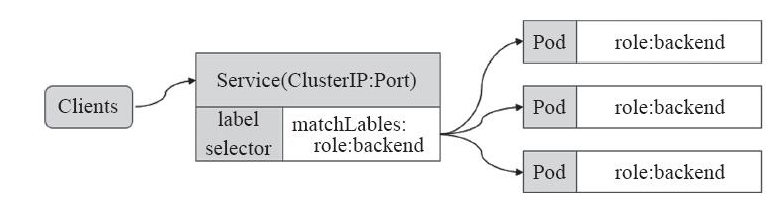
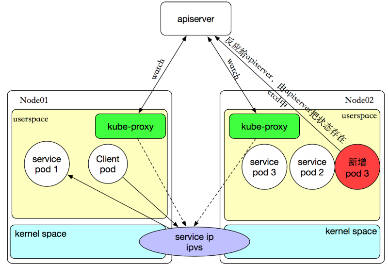

## Service的概念

Pod存在生命周期，有销毁，有重建，无法提供一个固定的访问接口给客户端。并且为了同类的Pod都能够实现工作负载的价值，由此Service资源出现了，可以为一类Pod资源对象提供一个固定的访问接口和负载均衡，类似于阿里云的负载均衡或者是LVS的功能。

Service资源基于标签选择器将一组Pod定义成一个逻辑组合，并通过自己的IP地址和端口调度代理请求到组内的Pod对象，如下图所示，它向客户端隐藏了真实的，处理用户请求的Pod资源，使得从客户端上看，就像是由Service直接处理并响应一样，是不是很像负载均衡器呢！



Service对象的IP地址也称为Cluster IP，它位于为Kubernetes集群配置指定专用的IP地址范围之内，是一种虚拟的IP地址，它在Service对象创建之后保持不变，并且能够被同一集群中的Pod资源所访问。Service端口用于接受客户端请求，并将请求转发至后端的Pod应用的相应端口，这样的代理机制，也称为端口代理，它是基于TCP/IP协议栈的传输层。

如果Service要提供外网服务，需指定NodePort，或外部负载均衡器。

## Service的实现模型

在 Kubernetes 集群中，每个 Node 运行一个 `kube-proxy` 进程。`kube-proxy` 负责为 `Service` 实现了一种 VIP（虚拟 IP）的形式。  

- 在 Kubernetes v1.0 版本，代理完全在 userspace。
- 在 Kubernetes v1.1 版本，新增了 iptables  代理，但并不是默认的运行模式。
- 从 Kubernetes v1.2 起，默认就是 iptables 代理。
- 在Kubernetes  v1.8.0-beta.0中，添加了ipvs代理。

在 Kubernetes v1.0 版本，`Service` 是 “4层”（TCP/UDP over IP）概念。 在 Kubernetes v1.1 版本，新增了 `Ingress` API（beta 版），用来表示 “7层”（HTTP）服务。后续会单独说明。

kube-proxy 这个组件始终监视着apiserver中有关service的变动信息，获取任何一个与service资源相关的变动状态，通过watch监视，一旦有service资源相关的变动和创建，kube-proxy都要转换为当前节点上的能够实现资源调度规则（例如：iptables、ipvs）




## **service的类型**

对一些应用（如 Frontend）的某些部分，可能希望通过外部（Kubernetes 集群外部）IP 地址暴露 Service。

Kubernetes `ServiceTypes` 允许指定一个需要的类型的 Service，默认是 `ClusterIP` 类型。

`Type` 的取值以及行为如下：

- **ClusterIP：**通过集群的内部 IP 暴露服务，选择该值，服务只能够在集群内部可以访问，这也是默认的 `ServiceType`。
- **NodePort：**通过每个 Node 上的 IP 和静态端口（`NodePort`）暴露服务。`NodePort` 服务会路由到 `ClusterIP` 服务，这个 `ClusterIP` 服务会自动创建。通过请求 `<NodeIP>:<NodePort>`，可以从集群的外部访问一个 `NodePort` 服务。
- **LoadBalancer：**使用云提供商的负载均衡器，可以向外部暴露服务。外部的负载均衡器可以路由到 `NodePort` 服务和 `ClusterIP` 服务。
- **ExternalName：**通过返回 `CNAME` 和它的值，可以将服务映射到 `externalName` 字段的内容（例如， `foo.bar.example.com`）。 没有任何类型代理被创建，这只有 Kubernetes 1.7 或更高版本的 `kube-dns` 才支持。


##  ClusterIP的service类型

```
[root@k8s-master mainfests]# cat redis-svc.yaml 
apiVersion: v1
kind: Service
metadata:
  name: redis
  namespace: default
spec:
  selector:　　#标签选择器，必须指定pod资源本身的标签
    app: redis
    role: logstor
  type: ClusterIP　　#指定服务类型为ClusterIP
  ports: 　　#指定端口
  - port: 6379　　#暴露给服务的端口
  - targetPort: 6379　　#容器的端口
[root@k8s-master mainfests]# kubectl apply -f redis-svc.yaml 
service/redis created
[root@k8s-master mainfests]# kubectl get svc
NAME         TYPE        CLUSTER-IP       EXTERNAL-IP   PORT(S)    AGE
kubernetes   ClusterIP   10.96.0.1        <none>        443/TCP    36d
redis        ClusterIP   10.107.238.182   <none>        6379/TCP   1m

[root@k8s-master mainfests]# kubectl describe svc redis
Name:              redis
Namespace:         default
Labels:            <none>
Annotations:       kubectl.kubernetes.io/last-applied-configuration={"apiVersion":"v1","kind":"Service","metadata":{"annotations":{},"name":"redis","namespace":"default"},"spec":{"ports":[{"port":6379,"targetPort":6379}...
Selector:          app=redis,role=logstor
Type:              ClusterIP
IP:                10.107.238.182　　#service ip
Port:              <unset>  6379/TCP
TargetPort:        6379/TCP
Endpoints:         10.244.1.16:6379　　#此处的ip+端口就是pod的ip+端口
Session Affinity:  None
Events:            <none>
```

从上演示可以总结出：service不会直接到pod，service是直接到endpoint资源，就是地址加端口，再由endpoint再关联到pod。

service只要创建完，就会在dns中添加一个资源记录进行解析，添加完成即可进行解析。资源记录的格式为：SVC_NAME.NS_NAME.DOMAIN.LTD.
	
默认的集群service 的A记录：svc.cluster.local.

redis服务创建的A记录：redis.default.svc.cluster.local.

## NodePort的service类型 

　　NodePort即节点Port，通常在部署Kubernetes集群系统时会预留一个端口范围用于NodePort，其范围默认为：30000~32767之间的端口。定义NodePort类型的Service资源时，需要使用.spec.type进行明确指定。

```
[root@k8s-master mainfests]# kubectl get pods --show-labels |grep myapp-deploy
myapp-deploy-69b47bc96d-4hxxw   1/1       Running   0          12m       app=myapp,pod-template-hash=2560367528,release=canary
myapp-deploy-69b47bc96d-95bc4   1/1       Running   0          12m       app=myapp,pod-template-hash=2560367528,release=canary
myapp-deploy-69b47bc96d-hwbzt   1/1       Running   0          12m       app=myapp,pod-template-hash=2560367528,release=canary
myapp-deploy-69b47bc96d-pjv74   1/1       Running   0          12m       app=myapp,pod-template-hash=2560367528,release=canary
myapp-deploy-69b47bc96d-rf7bs   1/1       Running   0          12m       app=myapp,pod-template-hash=2560367528,release=canary

[root@k8s-master mainfests]# cat myapp-svc.yaml #为myapp创建service
apiVersion: v1
kind: Service
metadata:
  name: myapp
  namespace: default
spec:
  selector:
    app: myapp
    release: canary
  type: NodePort
  ports: 
  - port: 80
    targetPort: 80
    nodePort: 30080
[root@k8s-master mainfests]# kubectl apply -f myapp-svc.yaml 
service/myapp created
[root@k8s-master mainfests]# kubectl get svc
NAME         TYPE        CLUSTER-IP       EXTERNAL-IP   PORT(S)        AGE
kubernetes   ClusterIP   10.96.0.1        <none>        443/TCP        36d
myapp        NodePort    10.101.245.119   <none>        80:30080/TCP   5s
redis        ClusterIP   10.107.238.182   <none>        6379/TCP       28m

[root@k8s-master mainfests]# while true;do curl http://192.168.56.11:30080/hostname.html;sleep 1;done
myapp-deploy-69b47bc96d-95bc4
myapp-deploy-69b47bc96d-4hxxw
myapp-deploy-69b47bc96d-pjv74
myapp-deploy-69b47bc96d-rf7bs
myapp-deploy-69b47bc96d-95bc4
myapp-deploy-69b47bc96d-rf7bs
myapp-deploy-69b47bc96d-95bc4


[root@k8s-master mainfests]# while true;do curl http://192.168.56.11:30080/;sleep 1;done
 Hello MyApp | Version: v1 | <a href="hostname.html">Pod Name</a>
 Hello MyApp | Version: v1 | <a href="hostname.html">Pod Name</a>
 Hello MyApp | Version: v1 | <a href="hostname.html">Pod Name</a>
 Hello MyApp | Version: v1 | <a href="hostname.html">Pod Name</a>
 Hello MyApp | Version: v1 | <a href="hostname.html">Pod Name</a>
 Hello MyApp | Version: v1 | <a href="hostname.html">Pod Name</a>
```

 

从以上例子，可以看到通过NodePort方式已经实现了从集群外部端口进行访问，访问链接如下：http://192.168.56.11:30080/。实践中并不鼓励用户自定义使用节点的端口，因为容易和其他现存的Service冲突，建议留给系统自动配置。

## Pod的会话保持

Service资源还支持Session  affinity（粘性会话）机制，可以将来自同一个客户端的请求始终转发至同一个后端的Pod对象，这意味着它会影响调度算法的流量分发功用，进而降低其负载均衡的效果。因此，当客户端访问Pod中的应用程序时，如果有基于客户端身份保存某些私有信息，并基于这些私有信息追踪用户的活动等一类的需求时，那么应该启用session  affinity机制。

Service  affinity的效果仅仅在一段时间内生效，默认值为10800秒，超出时长，客户端再次访问会重新调度。该机制仅能基于客户端IP地址识别客户端身份，它会将经由同一个NAT服务器进行原地址转换的所有客户端识别为同一个客户端，由此可知，其调度的效果并不理想。Service  资源 通过. spec. sessionAffinity 和. spec. sessionAffinityConfig 两个字段配置粘性会话。  spec. sessionAffinity 字段用于定义要使用的粘性会话的类型，它仅支持使用“ None” 和“ ClientIP”  两种属性值。

sessionAffinity支持ClientIP和None 两种方式，默认是None（随机调度） ClientIP是来自于同一个客户端的请求调度到同一个pod中。

```
[root@k8s-master mainfests]# vim myapp-svc.yaml 
apiVersion: v1
kind: Service
metadata:
  name: myapp
  namespace: default
spec:
  selector:
    app: myapp
    release: canary
  sessionAffinity: ClientIP
  type: NodePort
  ports: 
  - port: 80
    targetPort: 80
    nodePort: 30080
[root@k8s-master mainfests]# kubectl apply -f myapp-svc.yaml 
service/myapp configured
[root@k8s-master mainfests]# kubectl describe svc myapp
Name:                     myapp
Namespace:                default
Labels:                   <none>
Annotations:              kubectl.kubernetes.io/last-applied-configuration={"apiVersion":"v1","kind":"Service","metadata":{"annotations":{},"name":"myapp","namespace":"default"},"spec":{"ports":[{"nodePort":30080,"port":80,"ta...
Selector:                 app=myapp,release=canary
Type:                     NodePort
IP:                       10.101.245.119
Port:                     <unset>  80/TCP
TargetPort:               80/TCP
NodePort:                 <unset>  30080/TCP
Endpoints:                10.244.1.18:80,10.244.1.19:80,10.244.2.15:80 + 2 more...
Session Affinity:         ClientIP
External Traffic Policy:  Cluster
Events:                   <none>
[root@k8s-master mainfests]# while true;do curl http://192.168.56.11:30080/hostname.html;sleep 1;done
myapp-deploy-69b47bc96d-hwbzt
myapp-deploy-69b47bc96d-hwbzt
myapp-deploy-69b47bc96d-hwbzt
myapp-deploy-69b47bc96d-hwbzt
myapp-deploy-69b47bc96d-hwbzt
myapp-deploy-69b47bc96d-hwbzt
myapp-deploy-69b47bc96d-hwbzt
myapp-deploy-69b47bc96d-hwbzt
```

也可以使用打补丁的方式进行修改yaml内的内容，如下：

```
kubectl patch svc myapp -p '{"spec":{"sessionAffinity":"ClusterIP"}}'  #session保持，同一ip访问同一个pod

kubectl patch svc myapp -p '{"spec":{"sessionAffinity":"None"}}'    #取消session 
```


## 参考资料

> - []()
> - []()
