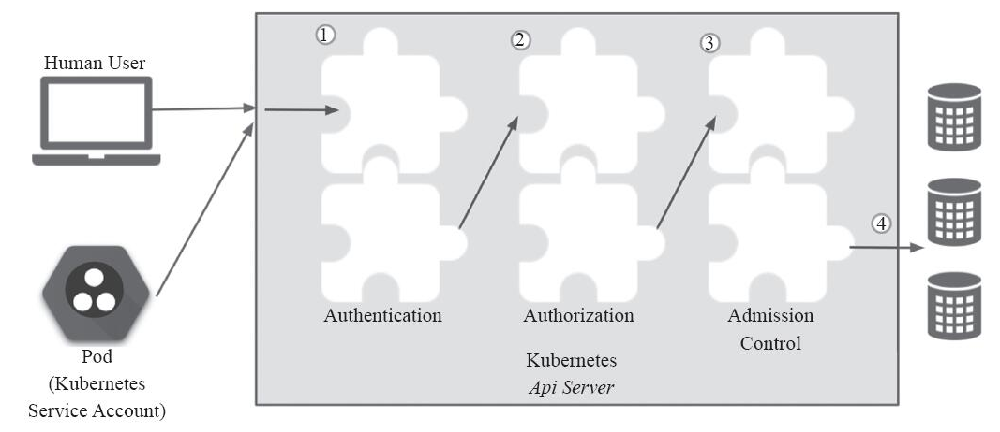
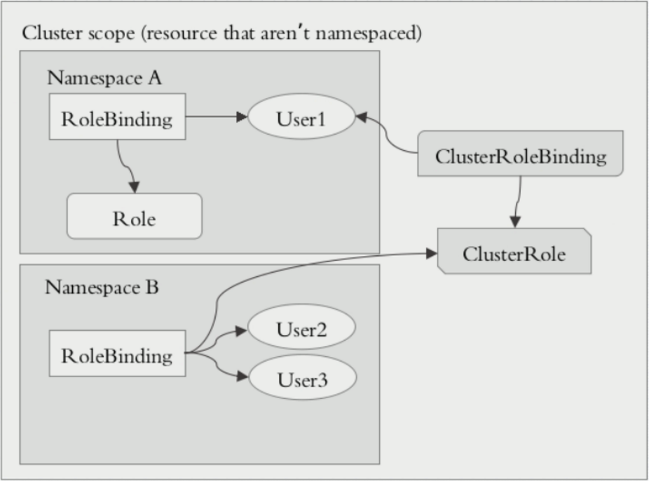
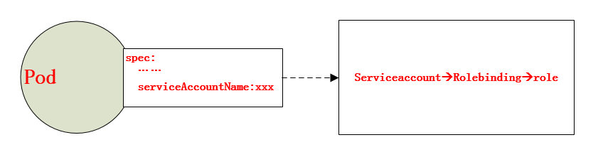

API Server作为Kubernetes网关，是访问和管理资源对象的唯一入口，其各种集群组件访问资源都需要经过网关才能进行正常访问和管理。每一次的访问请求都需要进行合法性的检验，其中包括身份验证、操作权限验证以及操作规范验证等，需要通过一系列验证通过之后才能访问或者存储数据到etcd当中。如下图：




## ServiceAccount简介

Service account是为了方便Pod里面的进程调用Kubernetes API或其他外部服务而设计的。它与User account不同

- User account是为人设计的，而service account则是为Pod中的进程调用Kubernetes API而设计；
- User account是跨namespace的，而service account则是仅局限它所在的namespace；
- 每个namespace都会自动创建一个名叫default的 service account，同时也会创建一个关联的default-token-*** 令牌，保存着与apiserver通信的认证信息
- 开启ServiceAccount Admission Controller后 
  - 每个Pod在创建后都会自动设置spec.serviceAccount为default（除非指定了其他ServiceAccout）
  - 验证Pod引用的service account已经存在，否则拒绝创建
  - 如果Pod没有指定ImagePullSecrets，则把service account的ImagePullSecrets加到Pod中
  - 每个container启动后都会挂载该service account的token和ca.crt到/var/run/secrets/kubernetes.io/serviceaccount/

```
## 查看serviceAccount
[root@k8s-master ~]# kubectl get sa
NAME      SECRETS   AGE
default   1         50d

## 查看secret
[root@k8s-master ~]# kubectl get secret
NAME                    TYPE                                  DATA      AGE
default-token-j5pf5     kubernetes.io/service-account-token   3         50d
mysecret                Opaque                                2         1d
tomcat-ingress-secret   kubernetes.io/tls  

## 查看pod关联的serviceAccount是default
[root@k8s-master ~]# kubectl get pods/myapp-0 -o yaml |grep "serviceAccountName"
  serviceAccountName: default
  
## 查看到default的serviceAccount关联的token作为卷挂载到pod中
[root@k8s-master ~]# kubectl describe pods myapp-0
Name:               myapp-0
Namespace:          default
......
Volumes:
  ......
  default-token-j5pf5:
    Type:        Secret (a volume populated by a Secret)
    SecretName:  default-token-j5pf5
    Optional:    false
```

从上面可以看到每个Pod无论定义与否都会有个存储卷，这个存储卷为default-token-*** token令牌，这就是pod和serviceaccount认证信息。

通过secret进行定义，由于认证信息属于敏感信息，所以需要保存在secret资源当中，并以存储卷的方式挂载到Pod当中。从而让Pod内运行的应用通过对应的secret中的信息来连接apiserver，并完成认证。

每个 namespace 中都有一个默认的叫做 default 的 service account 
资源。进行查看名称空间内的secret，也可以看到对应的default-token。让当前名称空间中所有的pod在连接apiserver时可以使用的预制认证信息，从而保证pod之间的通信。


## ServiceAccount创建

而默认的service account 仅仅只能获取当前Pod自身的相关属性，无法观察到其他名称空间Pod的相关属性信息。如果想要扩展Pod，假设有一个Pod需要用于管理其他Pod或者是其他资源对象，是无法通过自身的名称空间的serviceaccount进行获取其他Pod的相关属性信息的，此时就需要进行手动创建一个serviceaccount，并在创建Pod时进行定义。那么serviceaccount该如何进行定义呢？？？实际上，service
accout也属于一个k8s资源，如下查看service account的定义方式：

```
[root@k8s-master ~]# kubectl explain sa
[root@k8s-master mainfests]# kubectl create serviceaccount mysa -o yaml --dry-run #不执行查看定义方式
apiVersion: v1
kind: ServiceAccount
metadata:
  creationTimestamp: null
  name: mysa

[root@k8s-master mainfests]# kubectl create serviceaccount mysa -o yaml --dry-run > serviceaccount.yaml  #直接导出为yaml定义文件，可以节省敲键盘的时间
[root@k8s-master mainfests]# kubectl apply -f serviceaccount.yaml 
serviceaccount/mysa created
[root@k8s-master mainfests]# kubectl get sa 
NAME      SECRETS   AGE
default   1         16d
mysa      1         6s
[root@k8s-master mainfests]# kubectl get secret
NAME                    TYPE                                  DATA   AGE
default-token-2pbv8     kubernetes.io/service-account-token   3      16d
mysa-token-j2d6l        kubernetes.io/service-account-token   3      33s
```

看到一个 mysa-token-j2d6l已经被自动创建，并被 mysa的service account 引用。

## ServiceAccount使用

设置非默认的 service account，只需要在 pod 的`spec.serviceAccountName` 字段中将name设置为您想要用的 service account 名字即可。在 pod 创建之初 service account 就必须已经存在，否则创建将被拒绝。需要注意的是不能更新已创建的 pod 的 service account。

```
apiVersion: v1
kind: Pod
metadata:
  name: pod-sa-demo
  namespace: default
  labels:
    app: myapp
    tier: frontend
spec:
  containers:
  - name: myapp
    image: ikubernetes/myapp:v1
    ports:
    - name: http
      containerPort: 80
  serviceAccountName: mysa
```

## kubeconfig配置

在K8S集群当中，每一个用户对资源的访问都是需要通过apiserver进行通信认证才能进行访问的，那么在此机制当中，对资源的访问可以是token，也可以是通过配置文件的方式进行保存和使用认证信息，可以通过kubectl config进行查看配置，如下：

```
[root@k8s-master mainfests]# kubectl config view
apiVersion: v1
clusters:  #集群列表
- cluster:
    certificate-authority-data: REDACTED
    server: https://192.168.56.11:6443
  name: kubernetes
contexts:  #上下文列表
- context: #定义哪个集群被哪个用户访问
    cluster: kubernetes
    user: kubernetes-admin
  name: kubernetes-admin@kubernetes
current-context: kubernetes-admin@kubernetes  #当前上下文
kind: Config
preferences: {}
users:   #用户列表
- name: kubernetes-admin
  user:
    client-certificate-data: REDACTED
    client-key-data: REDACTED
```

其中Config也是K8S的标准资源之一，在上面的配置文件当中，定义了集群、上下文以及用户。

- 集群列表，指定的集群可以有多个；
- 用户列表也可以有多个，指明集群中的用户；
- 上下文列表，是进行定义可以使用哪个用户对哪个集群进行访问
- 当前上下文，指使用上下文列表中哪一个

如下新建一个用户示例：

```
## 1. 生成fuyi.key
[root@master auth]# (umask 077;openssl genrsa -out fuyi.key 2048)
Generating RSA private key, 2048 bit long modulus
......+++
..................................................................................................................................+++
e is 65537 (0x10001)

## 2. 生成fuyi.csr，证书签署请求
[root@master auth]# openssl req -new -key fuyi.key -out fuyi.csr -subj "/CN=fuyi"

## 3. 使用ca.crt进行签署
[root@master auth]# openssl x509 -req -in fuyi.csr -CA /etc/kubernetes/pki/ca.crt -CAkey /etc/kubernetes/pki/ca.key -CAcreateserial -out fuyi.crt -days 365
Signature ok
subject=/CN=fuyi
Getting CA Private Key

## 4. 查看证书内容
[root@master auth]# openssl x509 -in fuyi.crt -text -noout

## 5. 创建fuyi用户
[root@master auth]# kubectl config set-credentials fuyi --client-certificate=./fuyi.crt --client-key=./fuyi.key --embed-certs=true
User "fuyi" set.

## 6. 创建上下文，即关联fuyi和kubernetes集群
[root@master auth]# kubectl config set-context fuyi@kubernetes --cluster=kubernetes --user=fuyi
Context "fuyi@kubernetes" created.

## 7. 设置当前上下文为fuyi@kubernetes
[root@master auth]# kubectl config use-context fuyi@kubernetes
Switched to context "fuyi@kubernetes".

## 8. 获取pods列表
[root@master auth]# kubectl get pods
Error from server (Forbidden): pods is forbidden: User "fuyi" cannot list resource "pods" in API group "" in the namespace "default"
```

从上面的演示，当切换成fuyi用户进行访问集群时，由于fuyi该账户没有管理集群的权限，所以在获取pods资源信息时，会提示Forrbidden。那么下面就再来了解一下怎么对账户进行授权！！！

## 基于角色的访问控制

 Kubernetes的授权是基于插件形式的，其常用的授权插件有以下几种：

- Node（节点认证）
- ABAC(基于属性的访问控制)
- RBAC（基于角色的访问控制）
- Webhook（基于http回调机制的访问控制）

基于角色的访问控制（Role-Based Access Control, 即”RBAC”）使用”rbac.authorization.k8s.io” API Group实现授权决策，允许管理员通过Kubernetes API动态配置策略。

在k8s的授权机制当中，采用RBAC的方式进行授权，其工作逻辑是把对对象的操作权限定义到一个角色当中，再将用户绑定到该角色，从而使用户得到对应角色的权限。此种方式仅作用于名称空间当中，这是什么意思呢？当User1绑定到Role角色当中，User1就获取了对该NamespaceA的操作权限，但是对NamespaceB是没有权限进行操作的，如get，list等操作。

另外，k8s为此还有一种集群级别的授权机制，就是定义一个集群角色（ClusterRole），对集群内的所有资源都有可操作的权限，从而将User2，User3通过ClusterRoleBinding到ClusterRole，从而使User2、User3拥有集群的操作权限。

但是这里有2种绑定ClusterRoleBinding、RoleBinding。也可以使用RoleBinding去绑定ClusterRole。当使用这种方式进行绑定时，用户仅能获取当前名称空间的所有权限。为什么这么绕呢？？举例有10个名称空间，每个名称空间都需要一个管理员，而该管理员的权限都是一致的。那么此时需要去定义这样的管理员，使用RoleBinding就需要创建10个Role，这样显得更加繁重。为此当使用RoleBinding去绑定一个ClusterRole时，该User仅仅拥有对当前名称空间的集群操作权限，换句话说，此时只需要创建一个ClusterRole就解决了以上的需求。

Role、RoleBinding、ClusterRole和ClusterRoleBinding的关系如下图：




## User --> Rolebinding --> Role

示例：fuyi用户只能查看本命名空间的pod列表

一个Role资源对象只能属于一个命名空间的，所以只能授予该命名空间的访问权限。

- #### **角色的创建**

```
[root@k8s-master ~]# kubectl create role -h   #查看角色创建帮助

Usage:
  kubectl create role NAME --verb=verb --resource=resource.group/subresource [--resource-name=resourcename] [--dry-run] [options]
使用kubectl create进行创建角色，指定角色名称，--verb指定权限，--resource指定资源或者资源组，--dry-run单跑模式并不会创建

## 干跑模式查看role的定义
[root@k8s-master ~]# kubectl create role pods-reader --verb=get,list,watch --resource=pods --dry-run -o yaml 
apiVersion: rbac.authorization.k8s.io/v1
kind: Role #资源类型
metadata:
  creationTimestamp: null
  name: pods-reader
rules:
- apiGroups:  #对那些api组内的资源进行操作
  - ""
  resources:  #对那些资源定义
  - pods
  verbs:      #操作权限定义
  - get
  - list
  - watch
  
## 保存下配置文件
[root@k8s-master mainfests]# kubectl create role pods-reader --verb=get,list,watch --resource=pods --dry-run -o yaml > role-demo.yaml

## 角色创建
[root@k8s-master mainfests]# kubectl apply -f role-demo.yaml 
role.rbac.authorization.k8s.io/pods-reader created

## 查看
[root@k8s-master mainfests]# kubectl get role
NAME          AGE
pods-reader   3s
[root@k8s-master mainfests]# kubectl describe role pods-reader
Name:         pods-reader
Labels:       <none>
Annotations:  kubectl.kubernetes.io/last-applied-configuration={"apiVersion":"rbac.authorization.k8s.io/v1","kind":"Role","metadata":{"annotations":{},"name":"pods-reader","namespace":"default"},"rules":[{"apiGroup...
PolicyRule:
  Resources  Non-Resource URLs  Resource Names  Verbs
  ---------  -----------------  --------------  -----
  pods       []                 []              [get list watch]  #此处已经定义了pods-reader这个角色对pods资源拥有get、list、watch的权限
```

- #### **角色的绑定**

RoleBinding可以引用在同一命名空间内定义的Role对象。

```
[root@k8s-master ~]# kubectl create rolebinding -h  #角色绑定创建帮助

Usage:
  kubectl create rolebinding NAME --clusterrole=NAME|--role=NAME [--user=username] [--group=groupname]
[--serviceaccount=namespace:serviceaccountname] [--dry-run] [options]
使用kubectl create进行创建角色绑定，指定角色绑定的名称，--role|--clusterrole指定绑定哪个角色，--user指定哪个用户

## 保存配置文件
[root@k8s-master mainfests]# kubectl create rolebinding fuyi-read-pods --role=pods-reader --user=fuyi --dry-run -o yaml > rolebinding-demo.yaml

## 查看
[root@master auth]# cat rolebinding-demo.yaml 
apiVersion: rbac.authorization.k8s.io/v1
kind: RoleBinding
metadata:
  creationTimestamp: null
  name: fuyi-read-pods
roleRef:
  apiGroup: rbac.authorization.k8s.io
  kind: Role
  name: pods-reader
subjects:
- apiGroup: rbac.authorization.k8s.io
  kind: User
  name: fuyi
  
## 创建角色绑定
[root@k8s-master mainfests]# kubectl apply -f rolebinding-demo.yaml

## 查看角色绑定的信息，这里可以看到user：fuyi绑定到了pods-reader这个角色上
[root@k8s-master mainfests]# kubectl describe rolebinding fuyi-read-pods
```

- 测试

```
## 切换fuyi这个用户，并使用get获取pods资源信息
[root@k8s-master ~]# kubectl config use-context fuyi@kubernetes 

## 获取当前命名空间pod，正常
root@k8s-master ~]# kubectl get pods

## 获取kube-system命名空间pod，禁止
root@k8s-master ~]# kubectl get pods -n kube-system
```


## User --> Clusterrolebinding --> Clusterrole

示例：对fuyi用户进行集群角色绑定，fuyi用户将会获取对集群内pod的查看权限


- **集群角色的创建**

`ClusterRole`对象可以授予与`Role`对象相同的权限，但由于它们属于集群范围对象， 也可以使用它们授予对以下几种资源的访问权限：

1. 集群范围资源（例如节点，即node）

2. 非资源类型endpoint（例如”/healthz”）

3. 跨所有命名空间的命名空间范围资源（例如pod，需要运行命令`kubectl get pods --all-namespaces`来查询集群中所有的pod）

```
## 切换会kubernetes-admin用户
[root@k8s-master mainfests]# kubectl config use-context kubernetes-admin@kubernetes  
Switched to context "kubernetes-admin@kubernetes".
[root@k8s-master mainfests]# kubectl create clusterrole cluster-read --verb=get,list,watch --resource=pods -o yaml > clusterrole-demo.yaml

## 定义clusterrole和权限
[root@k8s-master mainfests]# vim clusterrole-demo.yaml 
apiVersion: rbac.authorization.k8s.io/v1
kind: ClusterRole
metadata:
  name: cluster-read
rules:
- apiGroups:
  - ""
  resources:
  - pods
  verbs:
  - get
  - list
  - watch
  
## 创建clusterrole
[root@k8s-master mainfests]# kubectl apply -f clusterrole-demo.yaml  
clusterrole.rbac.authorization.k8s.io/cluster-read configured
```

- **集群角色的绑定**

新建个ik8s用户，拷贝配置，切换到k8s用户为fuyi

```
[root@k8s-master ~]# useradd ik8s
[root@k8s-master ~]# cp -rp .kube/ /home/ik8s/
[root@k8s-master ~]# chown -R ik8s.ik8s /home/ik8s/
[root@k8s-master ~]# su - ik8s
[ik8s@k8s-master ~]$ kubectl config use-context fuyi@kubernetes
Switched to context "fuyi@kubernetes".
[ik8s@k8s-master ~]$ kubectl config view
```


```
## 在kubernetes-admin用户上删除之前的角色绑定,再在fuyi用户上获取pod列表，发现禁止
[root@k8s-master mainfests]# kubectl delete rolebinding fuyi-read-pods

## 创建clusterrolebinding
[root@k8s-master mainfests]# kubectl create clusterrolebinding fuyi-read-all-pods --clusterrole=cluster-read --user=fuyi --dry-run -o yaml > clusterrolebinding-demo.yaml

[root@k8s-master mainfests]# cat clusterrolebinding-demo.yaml 
apiVersion: rbac.authorization.k8s.io/v1beta1
kind: ClusterRoleBinding
metadata:
  creationTimestamp: null
  name: fuyi-read-all-pods
roleRef:
  apiGroup: rbac.authorization.k8s.io
  kind: ClusterRole
  name: cluster-read
subjects:
- apiGroup: rbac.authorization.k8s.io
  kind: User
  name: fuyi
  
## 创建
[root@k8s-master mainfests]# kubectl apply -f  clusterrolebinding-demo.yaml

## 查看
[root@k8s-master mainfests]# kubectl get clusterrolebinding
```

在fuyi用户上操作

```
## 查询正常
[ik8s@k8s-master ~]$ kubectl get pods

## 查询其他命名空间也正常
[ik8s@k8s-master ~]$ kubectl get pods -n kube-system

## 但是进行删除pod就无法进行，因为在授权时是没有delete权限的
```


## User --> Rolebinding --> Clusterrole

将fuyi通过rolebinding到集群角色fuyi-read-pods当中，此时，fuyi仅作用于当前名称空间的所有pods资源的权限


在kubernetes-admin用户下

```
## 删除之前的clusterrolebinding 
kubectl delete clusterrolebinding fuyi-read-all-pods

## 创建集群绑定
kubectl create rolebinding fuyi-read-pods --clusterrole=cluster-read --user=fuyi --dry-run -o yaml > rolebinding-clusterrole-demo.yaml

kubectl apply -f rolebinding-clusterrole-demo.yaml
```


在fuyi用户下

```
## 获取本命名空间下pod正常
kubectl get pods

## 获取kube-system下pod禁止
kubectl get pods -n kube-system
```


## RBAC对ServiceAccount的授权

RBAC不仅仅可以对user进行访问权限的控制，还可以通过group和serviceaccount进行访问权限控制。当我们想对一组用户进行权限分配时，即可将这一组用户归并到一个组内，从而通过对group进行访问权限的分配，达到访问权限控制的效果。

从前面serviceaccount我们可以了解到，Pod可以通过  spec.serviceAccountName来定义其是以某个serviceaccount的身份进行运行，当我们通过RBAC对serviceaccount进行访问授权时，即可以实现Pod对其他资源的访问权限进行控制。也就是说，当我们对serviceaccount进行rolebinding或clusterrolebinding，会使创建Pod拥有对应角色的权限和apiserver进行通信。如图：



## 参考资料

> - []()
> - []()
