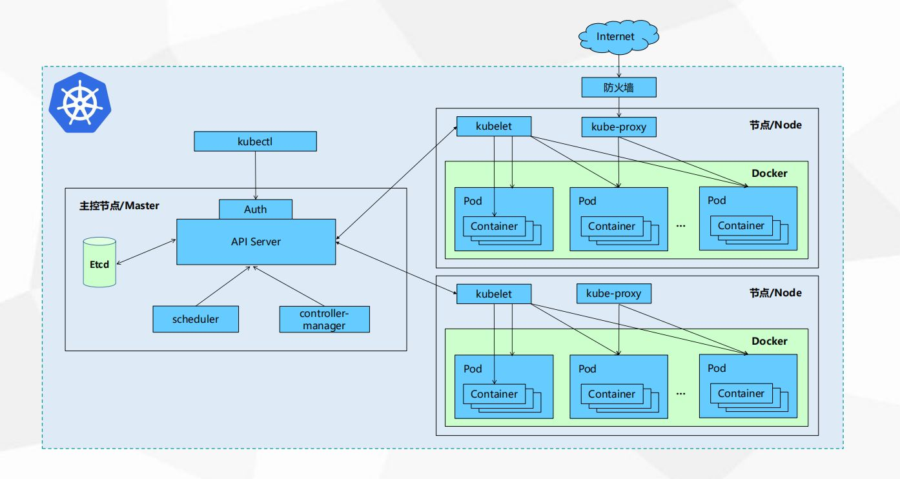

## 

## k8s架构

> 先从一张大图来观看一下K8S是如何运作的，再具体去细化K8S的概念、组件以及网络模型。

从上图，我们可以看到K8S组件和逻辑及其复杂，但是这并不可怕，我们从宏观上先了解K8S是怎么用的，再进行庖丁解牛。从上图我们可以看出：

- Kubernetes集群主要由Master和Node两类节点组成
- Master的组件包括：apiserver、controller-manager、scheduler和etcd等几个组件，其中apiserver是整个集群的网关。
- Node主要由kubelet、kube-proxy、docker引擎等组件组成。kubelet是K8S集群的工作与节点上的代理组件。
- 一个完整的K8S集群，还包括CoreDNS、Prometheus（或HeapSter）、Dashboard、Ingress  Controller等几个附加组件。其中cAdivsor组件作用于各个节点（master和node节点）之上，用于收集及收集容器及节点的CPU、内存以及磁盘资源的利用率指标数据，这些统计数据由Heapster聚合后，可以通过apiserver访问。

## 核心附件

- **KubeDNS**

在K8S集群中调度并运行提供DNS服务的Pod，同一集群内的其他Pod可以使用该DNS服务来解析主机名。K8S自1.11版本开始默认使用CoreDNS项目来为集群提供服务注册和服务发现的动态名称解析服务。

- **Dashboard**

K8S集群的全部功能都要基于Web的UI，来管理集群中的应用和集群自身。

- **Heapster**

容器和节点的性能监控与分析系统，它收集并解析多种指标数据，如资源利用率、生命周期时间，在最新的版本当中，其主要功能逐渐由Prometheus结合其他的组件进行代替。

- **Ingress Controller**

Service是一种工作于4层的负载均衡器，而Ingress是在7层应用层实现的HTTP(S)的负载均衡。不过，Ingress资源自身并不能进行流量的穿透，它仅仅是一组路由规则的集合，这些规则需要通过Ingress控制器（Ingress Controller）发挥作用。目前该功能项目大概有：Nginx-ingress、Traefik、Envoy和HAproxy等。

## 网络模型

K8S的网络中主要存在4种类型的通信：

- 同一Pod内的容器间通信
- 各个Pod彼此间的通信
- Pod和Service间的通信
- 集群外部流量和Service之间的通信

K8S为Pod和Service资源对象分别使用了各自的专有网络，Pod网络由K8S的网络插件配置实现，而Service网络则由K8S集群进行指定。

K8S使用的网络插件需要为每个Pod配置至少一个特定的地址，即Pod IP。Pod IP地址实际存在于某个网卡（可以是虚拟机设备）上。

而Service的地址却是一个虚拟IP地址，没有任何网络接口配置在此地址上，它由Kube-proxy借助iptables规则或ipvs规则重定向到本地端口，再将其调度到后端的Pod对象。Service的IP地址是集群提供服务的接口，也称为Cluster  IP。

Pod网络和IP由K8S的网络插件负责配置和管理，具体使用的网络地址可以在管理配置网络插件时进行指定，如10.244.0.0/16网络。而Cluster网络和IP是由K8S集群负责配置和管理，如10.96.0.0/12网络。

从上图进行总结起来，一个K8S集群包含是三个网络。

- **节点网络：**各主机（Master、Node、ETCD等）自身所属的网络，地址配置在主机的网络接口，用于各主机之间的通信，又称为节点网络。
- **Pod网络：**专用于Pod资源对象的网络，它是一个虚拟网络，用于为各Pod对象设定IP地址等网络参数，其地址配置在Pod中容器的网络接口上。Pod网络需要借助kubenet插件或CNI插件实现。
- **Service网络：**专用于Service资源对象的网络，它也是一个虚拟网络，用于为K8S集群之中的Service配置IP地址，但是该地址不会配置在任何主机或容器的网络接口上，而是通过Node上的kube-proxy配置为iptables或ipvs规则，从而将发往该地址的所有流量调度到后端的各Pod对象之上。

## 参考资料
> - 
> - 
