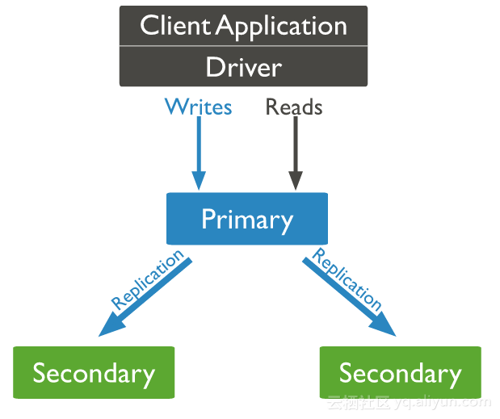

## 简介

Mongodb复制集是将数据同步到多个服务器的过，复制集提供了数据的冗余备份，并在多个服务器上存储数据副本，提高了数据的可用性， 并可以保证数据的安全性。

Mongodb复制集由一组Mongod实例（进程）组成，包含一个Primary节点和多个Secondary节点，Mongodb Driver（客户端）的所有数据都写入Primary，Secondary从Primary同步写入的数据，以保持复制集内所有成员存储相同的数据集，提供数据的高可用。

下图（图片源于Mongodb官方文档）是一个典型的Mongdb复制集，包含一个Primary节点和2个Secondary节点。

## Primary选举

复制集通过replSetInitiate命令（或mongo shell的rs.initiate()）进行初始化，初始化后各个成员间开始发送心跳消息，并发起Priamry选举操作，获得『大多数』成员投票支持的节点，会成为Primary，其余节点成为Secondary。

- 『大多数』的定义

假设复制集内投票成员（后续介绍）数量为N，则大多数为 N/2 + 1，当复制集内存活成员数量不足大多数时，整个复制集将无法选举出Primary，复制集将无法提供写服务，处于只读状态。

复制集成员间默认每2s会发送一次心跳信息，如果10s未收到某个节点的心跳，则认为该节点已宕机；如果宕机的节点为Primary，Secondary（前提是可被选为Primary）会发起新的Primary选举。

正常情况下，复制集的Seconary会参与Primary选举（自身也可能会被选为Primary），并从Primary同步最新写入的数据，以保证与Primary存储相同的数据。

Secondary可以提供读服务，增加Secondary节点可以提供复制集的读服务能力，同时提升复制集的可用性。另外，Mongodb支持对复制集的Secondary节点进行灵活的配置，以适应多种场景的需求，以下会介绍不同场景下的Secondary节点。

## Arbiter

Arbiter节点只参与投票，不能被选为Primary，并且不从Primary同步数据。

比如你部署了一个2个节点的复制集，1个Primary，1个Secondary，任意节点宕机，复制集将不能提供服务了（无法选出Primary），这时可以给复制集添加一个Arbiter节点，即使有节点宕机，仍能选出Primary。

Arbiter本身不存储数据，是非常轻量级的服务，当复制集成员为偶数时，最好加入一个Arbiter节点，以提升复制集可用性。

## Priority0

Priority0节点的选举优先级为0，不会被选举为Primary

比如你跨机房A、B部署了一个复制集，并且想指定Primary必须在A机房，这时可以将B机房的复制集成员Priority设置为0，这样Primary就一定会是A机房的成员。（注意：如果这样部署，最好将『大多数』节点部署在A机房，否则网络分区时可能无法选出Primary）

## Vote0

Mongodb 3.0里，复制集成员最多50个，参与Primary选举投票的成员最多7个，其他成员（Vote0）的vote属性必须设置为0，即不参与投票。

## Hidden

Hidden节点不能被选为主（Priority为0），并且对Driver不可见。

因Hidden节点不会接受Driver的请求，可使用Hidden节点做一些数据备份、离线计算的任务，不会影响复制集的服务。

## Delayed

Delayed节点必须是Hidden节点，并且其数据落后与Primary一段时间（可配置，比如1个小时）。

因Delayed节点的数据比Primary落后一段时间，当错误或者无效的数据写入Primary时，可通过Delayed节点的数据来恢复到之前的时间点。

## 数据同步

Primary与Secondary之间通过oplog来同步数据，Primary上的写操作完成后，会向特殊的local.oplog.rs特殊集合写入一条oplog，Secondary不断的从Primary取新的oplog并应用。

因oplog的数据会不断增加，local.oplog.rs被设置成为一个capped集合，当容量达到配置上限时，会将最旧的数据删除掉。另外考虑到oplog在Secondary上可能重复应用，oplog必须具有幂等性，即重复应用也会得到相同的结果。

## 参考资料
> - 
> - 
