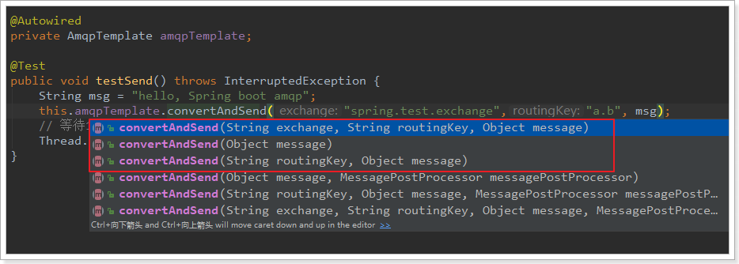

Sprin有很多不同的项目，其中就有对AMQP的支持。

Spring AMQP的页面：http://spring.io/projects/spring-amqp

Spring-amqp是对AMQP协议的抽象实现，而spring-rabbit 是对协议的具体实现，也是目前的唯一实现。底层使用的就是RabbitMQ。


## 基本配置

1. 添加依赖

```
<dependency>
    <groupId>org.springframework.boot</groupId>
    <artifactId>spring-boot-starter-amqp</artifactId>
</dependency>
```


1. application.yml配置

```
spring:
  rabbitmq:
    host: localhost # rabbitmq的连接地址
    port: 5672 # rabbitmq的连接端口号
    virtual-host: /mall # rabbitmq的虚拟host
    username: mall # rabbitmq的用户名
    password: mall # rabbitmq的密码
    publisher-confirms: true #如果对异步消息需要回调必须设置为true
```

## 监听者

在SpringAmqp中，对消息的消费者进行了封装和抽象，一个普通的JavaBean中的普通方法，只要通过简单的注解，就可以成为一个消费者。

```
@Component
public class Listener {

    @RabbitListener(bindings = @QueueBinding(
            value = @Queue(value = "spring.test.queue", durable = "true"),
            exchange = @Exchange(
                    value = "spring.test.exchange",
                    ignoreDeclarationExceptions = "true",
                    type = ExchangeTypes.TOPIC
            ),
            key = {"#.#"}))
    public void listen(String msg){
        System.out.println("接收到消息：" + msg);
    }
}
```

- `@Componet`：类上的注解，注册到Spring容器
- `@RabbitListener`：方法上的注解，声明这个方法是一个消费者方法，需要指定下面的属性：
  - `bindings`：指定绑定关系，可以有多个。值是`@QueueBinding`的数组。`@QueueBinding`包含下面属性：
    - `value`：这个消费者关联的队列。值是`@Queue`，代表一个队列
    - `exchange`：队列所绑定的交换机，值是`@Exchange`类型
    - `key`：队列和交换机绑定的`RoutingKey`

类似listen这样的方法在一个类中可以写多个，就代表多个消费者。

## 发送者

Spring最擅长的事情就是封装，把他人的框架进行封装和整合。

Spring为AMQP提供了统一的消息处理模板：AmqpTemplate，非常方便的发送消息，其发送方法：



红框圈起来的是比较常用的3个方法，分别是：

- 指定交换机、RoutingKey和消息体
- 指定消息
- 指定RoutingKey和消息，会向默认的交换机发送消息

默认交换机可在如下配置：

```yaml
spring:
  rabbitmq:
    host: 192.168.56.101
    username: mall
    password: mall
    virtual-host: /mall
    template:
      exchange: mall.item.exchange
    publisher-confirms: true
```

- template：有关`AmqpTemplate`的配置
  - retry：失败重试
    - enabled：开启失败重试
    - initial-interval：第一次重试的间隔时长
    - max-interval：最长重试间隔，超过这个间隔将不再重试
    - multiplier：下次重试间隔的倍数，此处是2即下次重试间隔是上次的2倍
  - exchange：缺省的交换机名称，此处配置后，发送消息如果不指定交换机就会使用这个
- publisher-confirms：生产者确认机制，确保消息会正确发送，如果发送失败会有错误回执，从而触发重试


注意： 发消息时所有异常都try起来，不能让消息的发送影响到正常的业务逻辑

## 参考资料

> - []()
> - []()
