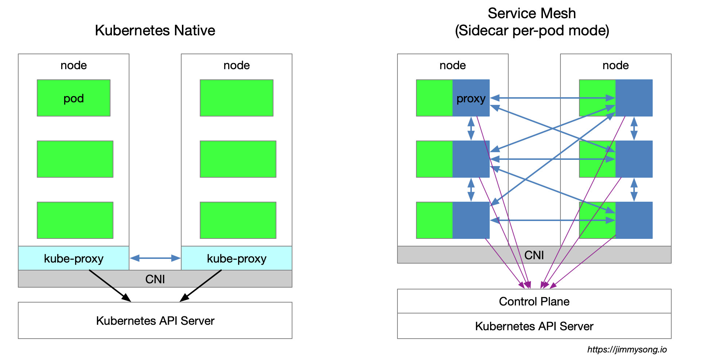

## 简介

Service mesh 又译作 “服务网格”，作为微服务时代下服务间通信的基础设施层。它负责在复杂的服务拓扑中可靠的传递请求，通常通过一组轻量级的透明代理实现，这些代理与应用程序代码一起部署，而不需要感知应用程序本身。

服务网格这个术语通常也用于描述构成这些应用程序的微服务网络以及应用之间的交互。随着规模和复杂性的增长，服务网格越来越难以理解和管理。它的需求包括服务发现、负载均衡、故障恢复、指标收集和监控以及通常更加复杂的运维需求，例如A/B 测试、金丝雀发布、限流、访问控制和端到端认证等。

服务网格有如下几个特点：

- 应用程序间通讯的中间层
- 轻量级网络代理
- 应用程序无感知
- 解耦应用程序的重试/超时、监控、追踪和服务发现

如果用一句话来解释什么是服务网格，可以将它比作是应用程序或者说微服务间的  TCP/IP，负责服务之间的网络调用、限流、熔断和监控。对于编写应用程序来说一般无须关心 TCP/IP 这一层（比如通过 HTTP 协议的  RESTful 应用），同样使用服务网格也就无须关心服务之间的那些原来是通过应用程序或者其他框架实现的事情，比如 Spring  Cloud、Netflix OSS，现在只要交给服务网格就可以了。

## k8s和Service Mesh的关系

使用 Service Mesh 并不是说与 Kubernetes 决裂，而是水到渠成的事情。

- Kubernetes 的本质是通过声明式配置对应用进行生命周期管理，具体来说就是扩缩容、发布，为微服务应用提供了可扩展、高弹性的部署和管理平台。
- ServiceMech的本质是透明代理，通过代理拦截微服务应用间流量后再通过控制平面配置微服务的行为，为微服务应用间提供流量和安全性管理和可观察性。

目前两款流行的服务网格开源软件 [Linkerd](https://linkerd.io) 和 [Istio](https://Istio.io) 都可以直接在 Kubernetes 中集成，其中 Linkerd 已经成为 CNCF 成员，Istio 在 2018年7月31日宣布 [1.0](https://istio.io/zh/blog/2018/announcing-1.0/)。

下图展示了单用k8s和使用service mesh时的架构：

单使用k8s时，集群每个节点都部署了一个 `kube-proxy` 组件，该组件会与 Kubernetes API Server 通信，获取集群中的service信息，然后设置 iptables 规则，直接将对某个 service 的请求发送到对应的 Endpoint（属于同一组 service 的 pod）上。

Istio Service Mesh 使用一个透明代理，以 sidecar 容器的形式部署在每个应用服务的 pod 中，这些 proxy 都需要请求 Control Plane 来同步代理配置，该过程 kube-proxy 组件一样需要拦截流量，只不过 `kube-proxy` 拦截的是进出 Kubernetes 节点的流量，而 sidecar proxy 拦截的是进出该 Pod 的流量。

## Sidecar模式

中文译为  “边车模式” 在服务网格出现之前该模式就一直存在，尤其是当微服务出现后开始盛行。就如 Sidecar 连接着摩托车一样，类似地在软件架构中， Sidecar 应用是连接到父应用并且为其扩展或者增强功能。Sidecar 应用与主应用程序松散耦合。

每个微服务都需要具有可观察性、监控、日志记录、配置、断路器等功能。所有这些功能都是根据一些行业标准的第三方库在每个微服务中实现的。但再想一想，这不是多余吗？它不会增加应用程序的整体复杂性吗？如果你的应用程序是用不同的语言编写时会发生什么——如何合并那些特定用于 .Net、Java、Python 等语言的第三方库。

在Service Mesh中通过Sidecar模式抽象出与功能相关的共同基础设施到一个不同层降低了微服务代码的复杂度，因为你不再需要编写相同的第三方组件配置文件和代码，同时也降低应用程序代码和底层平台的耦合度。

在 Kubernetes 的 Pod 中，在原有的应用容器旁边运行一个 Sidecar 容器，它接管进出应用容器的所有流量，进而实现微服务的监控，断路器等等基础能力。

## Service Mesh工作流程

下面以 Istio 为例讲解服务网格如何在 Kubernetes 中工作。

1. Istio 将服务请求路由到目的地址，根据其中的参数判断是到生产环境、测试环境还是 staging 环境中的服务（服务可能同时部署在这三个环境中），是路由到本地环境还是公有云环境？所有的这些路由信息可以动态配置，可以是全局配置也可以为某些服务单独配置。
2. 当 Istio 确认了目的地址后，将流量发送到相应服务发现端点，在 Kubernetes 中是 service，然后 service 会将服务转发给后端的实例。
3. Istio 根据它观测到最近请求的延迟时间，选择出所有应用程序的实例中响应最快的实例。
4. Istio 将请求发送给该实例，同时记录响应类型和延迟数据。
5. 如果该实例挂了、不响应了或者进程不工作了，Istio 将把请求发送到其他实例上重试。
6. 如果该实例持续返回 error，Istio 会将该实例从负载均衡池中移除，稍后再周期性的重试。
7. 如果请求的截止时间已过，Istio 主动以失败的方式结束该请求，而不是再次尝试添加负载。
8. Istio 以 metric 和分布式追踪的形式捕获上述行为的各个方面，这些追踪信息将发送到集中 metric 系统。

## Service Mesh的优劣势

- 优势

1. `kube-proxy` 的设置都是全局生效的，无法对每个服务做细粒度的控制，而 Service Mesh 通过 sidecar proxy 的方式将 Kubernetes 中对流量的控制从 service 一层抽离出来，放进Pod中，可以做更多的扩展和灵活性。

- 劣势

1. 因为 Kubernetes 每个节点上都会运行众多的 Pod，将原先 `kube-proxy` 方式的路由转发功能置于每个 pod 中，将导致大量的配置分发、同步和最终一致性问题。为了细粒度地进行流量管理，必将添加一系列新的抽象，从而会进一步增加用户的学习成本，但随着技术的普及，这样的情况会慢慢地得到缓解。
2. Kube-proxy 实现了流量在 Kubernetes service 多个 pod 实例间的负载均衡，但是如何对这些 service 间的流量做细粒度的控制，比如按照百分比划分流量到不同的应用版本（这些应用都属于同一个 service，但位于不同的 deployment 上），做金丝雀发布（灰度发布）和蓝绿发布，这些是不方便的。尽管Kubernetes 社区给出了 使用 Deployment 做金丝雀发布的方法，该方法本质上就是通过修改 pod 的 label来将不同的 pod 划归到 Deployment 的 Service 上。

## Service Mesh架构

服务网格中分为**控制平面**和**数据平面**，当前流行的两款开源的服务网格 Istio 和Linkerd 实际上都是这么划分，只不过 Istio 的划分更清晰。

控制平面的特点：

- 不直接解析数据包
- 与数据平面中的代理通信，下发策略和配置
- 负责网络行为的可视化
- 通常提供 API 或者命令行工具可用于配置版本化管理，便于持续集成和部署

数据平面的特点：

- 通常是按照无状态目标设计的，但实际上为了提高流量转发性能，需要缓存一些数据，因此无状态也是有争议的
- 直接处理入站和出站数据包，转发、路由、健康检查、负载均衡、认证、鉴权、产生监控数据等
- 对应用来说透明，即可以做到无感知部署

Istio和Linkerd的实现：

- Istio控制平面包括Mixer、Pilot、Citadel
- Istio数据平面默认是Envoy
- Linkerd控制平面是namerd 
- Linkerd数据平面是Linkerd

## 参考资料
> - 
> - 
