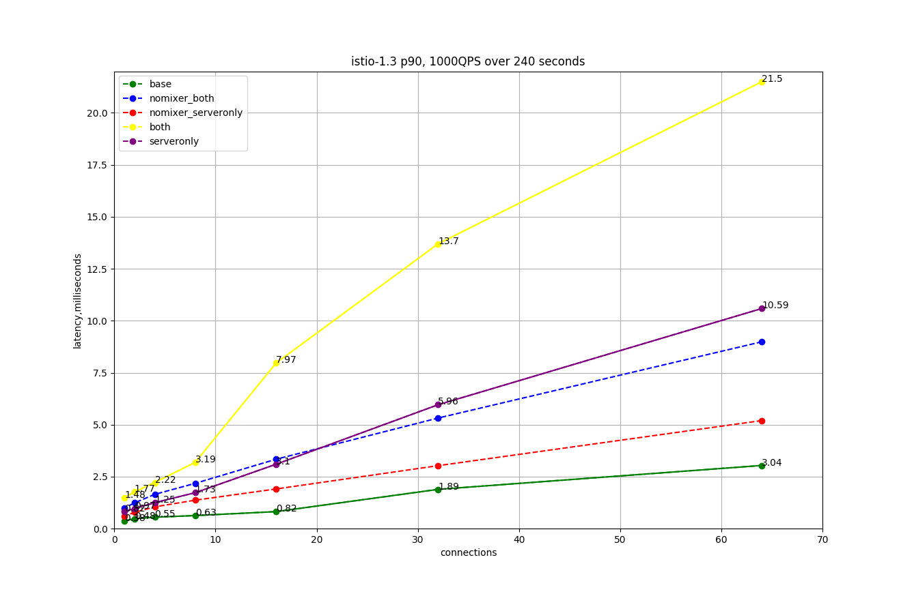

Istio可以轻松创建具有丰富路由，负载平衡，服务到服务的身份验证，监视等功能的已部署服务网络-所有这些都无需更改应用程序代码。 Istio致力于以最小的资源开销提供这些好处，并旨在以高请求率支持非常大的网格，同时增加最小的延迟。

Istio数据平面组件Envoy代理处理流经系统的数据。 Istio控制平面组件Pilot，Galley和Citadel用于配置数据平面。数据平面和控制平面具有明显的性能问题。

## Istio 1.3.3的性能摘要

Istio负载测试网格由1000个服务和2000个侧面车组成，每秒有70,000个网格范围的请求。使用Istio 1.3.3运行测试后，我们得到以下结果： 

- Envoy代理使用0.6个vCPU和50 MB内存每秒钟处理1000个请求通过代理。
-  `istio-telemetry` 服务使用0.6个vCPU每秒钟 处理 1000个网格范围的请求。
- Pilot使用1个vCPU和1.5 GB内存。 
- Envoy代理服务器将90ms的延迟增加了8毫秒。

## 控制平面性能

Pilot根据用户编写的配置文件和系统的当前状态来配置Sidecar代理。在Kubernetes环境中，自定义资源定义（CRD）和deployment构成了系统的配置和状态。 Istio配置对象（如网关和虚拟服务）提供用户授权的配置。为了生成代理的配置，Pilot处理来自Kubernetes环境和用户创作的配置的组合配置和系统状态。

控制平面支持成千上万的服务，这些服务分布在成千上万个Pod中，并具有类似数量的用户编写的虚拟服务和其他配置对象。Pilot的CPU和内存要求随配置数量和可能的系统状态而定。 CPU消耗取决于以下因素： 

- 部署变化率。 
- 配置变化率。 
- 连接到Pilot的代理数量。

但是，这部分本质上是水平可伸缩的。

启用名称空间隔离后，单个Pilot实例可以支持1000个服务，具有1个vCPU和1.5 GB内存的2000个Sidecar。您可以增加Pilot实例的数量，以减少配置到达所有代理所需的时间。

## 数据平面性能

数据平面性能取决于许多因素，例如：

- 客户端连接数 
- 目标请求率 
- 请求大小和响应大小 
- 代理工作线程数 
- 协议 
- CPU核心 
- 代理过滤器的数量和类型，特别是混合器过滤器。

延迟，吞吐量以及代理的CPU和内存消耗均根据上述因素进行衡量。

#### CPU和内存

由于Sidecar代理在数据路径上执行其他工作，因此会占用CPU和内存。从Istio 1.1开始，代理每秒钟每1000个请求消耗约0.6个vCPU。

代理的内存消耗取决于代理拥有的总体配置状态。大量的侦听器，集群和路由会增加内存使用率。 Istio 1.1引入了名称空间隔离，以限制发送到代理的配置范围。在大型命名空间中，代理消耗大约50 MB的内存。

由于代理通常不会缓存通过的数据，因此请求速率不会影响内存消耗。

#### 延迟

由于Istio在数据路径上注入了sidecar代理，因此延迟是一个重要的考虑因素。 Istio将身份验证和Mixer筛选器添加到代理。每个附加的过滤器都会增加代理内部的路径长度，并影响延迟。

在将响应发送到客户端之后，Envoy代理收集原始遥测数据。为请求收集原始遥测所花费的时间不会影响完成该请求所花费的总时间。但是，由于该工作人员正忙于处理该请求，因此该工作人员不会立即开始处理下一个请求。此过程将增加下一个请求的队列等待时间，并影响平均和尾部延迟。实际的尾部等待时间取决于流量模式。

在网格内部，请求先遍历客户端代理，然后遍历服务器端代理。数据路径上的这两个代理每秒1000个请求时，90%请求增加7ms延迟。仅服务器端代理就使90％的延迟增加了2ms。

#### Istio-1.3.3的延迟

Istio 1.3.3的默认配置使基线上数据平面的第90个百分位延迟增加了7ms。我们使用针对http / 1.1协议的Istio基准测试获得了这些结果，使用16个客户端连接，2个代理工作器和启用了TLS，以每秒1000个请求的速度提供1 kB的负载。

在即将发布的Istio版本中，我们会将istio-policy和istio-telemetry功能作为MixerV2移入代理。这将减少流经系统的数据量，进而减少CPU使用率和延迟。

- baseline:  客户端Pod直接调用服务器Pod，无sidecar代理出现。
- server-sidecar仅存在服务器sidecar。 
- both-sidecars  客户端和服务器都有sidecar。这是网格内部的默认情况。 
- nomixer-both 与不带Mixer的both-sidecars相同。 MixerV2延迟配置文件将类似。 
- nomixer-server与不带Mixer的server-sidecar相同。 MixerV2延迟配置文件将类似。

#### 性能工具

Istio使用以下工具进行基准测试

- fortio.org-恒定吞吐量的负载测试工具。 
- blueperf-一个现实的云原生应用程序。 
- isotope-具有可配置拓扑的合成应用程序。

## 参考资料
> - 
> - 
