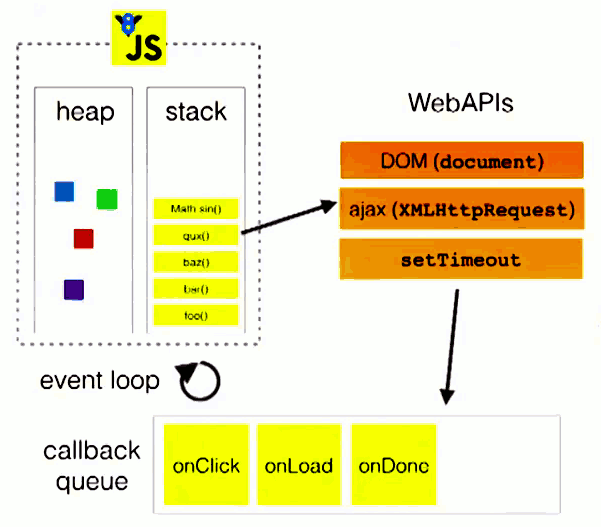

众所周知，JavaScript是单线程的，也就是任何时刻同时只能有一个线程堆栈在执行，那么对于下面这段代码可能有同学会疑惑这，这个是怎么执行的：
```
console.log("A");

setTimeout(function timeout() {
    console.log("B");
}, 10);

console.log("C");

....//biz code

console.log("D");
```
最初的想法是我们设置了一个定时任务，10ms之后执行，如果在biz code处的code需要执行20ms以上，那么timeout怎么能够顺利执行呢，而且单线程是如何做到既执行下面的biz code又执行timeout的呢。事实上如果biz code的部分如果执行时间大于10ms，那么timeout并不会立即准时执行的。要明白其中的原因，我们可以从一张图来理解JavaScript的单线程模型：



首先简单理解下eventloop机制，即一个线程在执行完主线程后会不断轮询callback队列，取出就绪任务执行，每个循环称为一个tick。因为JavaScript只有一个线程执行，因此也只有一个线程堆栈，结合上面的code实例接单说明一下对应堆栈的变动：

1. console.log("A")入栈执行，输出"A"，console.log("A")出栈。
2. setTimeout入栈，WebAPIs后台不断检查timeout对象的超时时间是否已经到达，如果到达则会将对于的callback也即timeout放入callback队列。
3. 接下来console.log("C")会入栈执行，输出"C"，然后出栈。
4. 最后console.log("D")会入栈执行，输出"D"，然后出栈。
5. 主区域代码执行完毕线程会不断轮询callback队列来查询是否有就绪callback，如果有则取出执行，如果没有则继续轮询。

而对于超时或者是我们使用ajax的callback，后台会根据IO操作或超时时间是否完毕来决定是否将callback放入callback队列，这就是EventLoop机制。Node的单线程EventLoop模型相比于JavaScript的单线程EventLoop模型类似，但是更复杂一些，整体模型可以作为参考去理解。