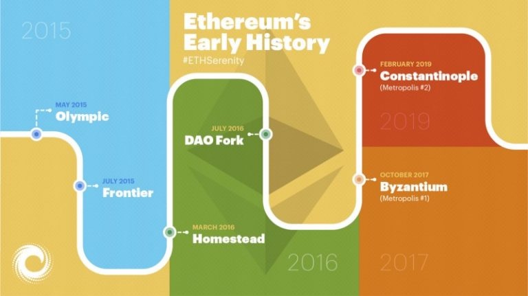

## 四个阶段

第一阶段，边境（Frontier ）（2015年7月）：以太坊的第一次版本发布，允许开发人员对以太坊进行挖矿，并基于以太坊进行dAPP与工具软件的开发。

第二阶段，家园（Homestead）（2016年3月）：发布了第一个生产环境版本，对许多协议进行了优化改进，为之后的升级奠定了基础，并且加快了交易速度。

第三阶段，大都会（Metropolis）（2017年10月）：第三阶段分为两个版本，分别命名为拜占庭（2017年10月）和君士坦丁堡（时间待定，预计2018年），将会使得以太坊更轻量、更快速、更安全。

第四阶段，宁静（Serenity）（时间待定）：这个版本将会使用期待已久的持有量证明（PoS），其中将会使用Casper共识算法。

所有这些更新将有助于以太坊实现更大的规模化，也意味着更快的交易速度和更低的费用。如我们所见的那样，以太坊团队在交易扩展方面做得非常不错。





## 概述

时至今日当我们鸟瞰区块链技术的发展，它仍旧算得上是一个新事物。尽管有关区块链的基础核心概念（例如密码学、去中心化及点对点网络和交易）的研究已经进行了数十年，但可以说是直到 2008 年比特币的滥觞，这些零散的概念才被整合起来创造出了一个功能性产品。直到 2015 年，以太坊逐渐走入人们的视线。至此，以太坊区块链得以成型并且实际可用。尽管计划内升级的日期和细节发生了变化，但以太坊仍坚持不断对协议进行升级，以确保提高其可用性、安全性、功能性和去中心化。


在今年2019  年 2 月的**君士坦丁堡（Constantinople）升级**完成之后，以太坊目前正处于**宁静（Serenity， 也称为以太坊 2.0）**阶段的风口浪尖，Serenity 升级需要通过一系列更新方能达成。然而，居安当思归来源，我们不能忘记自己从哪里来，如此方知来者之可追。以下时间线着眼于以太坊计划内（或计划外）的硬分叉和升级历史，为其下一阶段的升级做好准备。


## 奥林匹克（Olympic） |2015 年 5 月 9 日

以太坊区块链于 2015 年 7 月正式向用户开放使用。[以太坊](https://learnblockchain.cn/2017/11/20/whatiseth/)在此之前开放了九个版本的开放测试网络以进行概念证明，其中最后一个版本便是**奥林匹克**，供开发人员提前探索以太网区块链开放以后的运作方式。Vitalik 曾[宣布](https://blog.ethereum.org/2015/05/09/olympic-frontier-pre-release/)向耗费时间精力对以太坊网络进行压力测试的开发人员提供总额为 25,000 ETH 的奖励。测试要求很明确：尝试使网络过载，并对网络状态进行极限测试，以便深入了解协议如何处理流量巨大的情况。开发人员需要对四个方面进行测试：交易活动、[虚拟机](https://learnblockchain.cn/2019/04/09/easy-evm/)使用、挖矿方式和惩罚机制。

## 边疆（Frontier） | 2015 年 7 月 30 日

经过几个月的压力测试，以太坊网络已准备好发布官方公共主网。7 月 20 日，以太坊的创世区块产生，社区开始逐渐壮大。在 Frontier 发布前几个月，Vinay Gupta 发表了关于以太坊开发过程的说明。该说明的大部分内容虽然十分令人振奋，但同时也发出了对潜在用户的警示。Gupta 表示，Frontier 是 “处于最初始形态” 的以太坊版本，开发者应该谨慎行事。Frontier 发布前几天，Stephen Taul 对开发者作出了与 Gupta 类似的提醒：“目前的开发者就如同美国边疆扩张时期的拓荒者一般，他们和自己的同伴在开辟新家园时将获得无穷的机会，但同时也将面临许多危险。”

**“边疆（Frontier）” 协议包含了以下一系列关键特征：**

- 区块奖励：在以太坊区块链上，当矿工成功挖掘出一个新区块并使其存在得到确认之后，他们会得到 ETH 形式的奖励。在此阶段，奖励被定为每个新区快 5 个 ETH。
- [Gas](https://media.consensys.net/a-guide-to-gas-12b40d03605d)：在 “边疆” 诞生之初，每个区块的 gas 上限被硬编码为 5000。这个数量基本上意味着以太坊网络不支持进一步开发。此阶段 Gas 上限的制定旨在为矿工提供一段缓冲时间，以帮助他们在以太坊网络上的操作走上正轨，同时使得早期开发者安装他们的客户端。几天之后，gas 上限被自动移除，以太坊网络能按预期处理交易和智能合约。
- 金丝雀合约（Canary Contracts）：金丝雀合约被引入 “边疆” 的目的是提醒用户存在不正当或易受攻击的某条链。它给出的数值只能是 0 或 1。有问题的合约会被赋值为 1，因此客户端就能进行识别，避免在无效链上进行挖矿。金丝雀合约的重要意义在于它使得以太坊核心开发团队能够及时制止网络中出现错误的操作或交易。在以太坊发展初期，金丝雀合约虽然显得十分中心化，但却是不可或缺的保护机制。
- 可用性：所有开发人员的操作都是经由命令行实现，因为完全不存在图形用户界面。虽然可以在以太坊网络中进行操作，但是其用户界面还十分粗糙，它的使用者也在很大程度上局限于具有以太坊背景知识和经验的专业人士。

## 家园（Homestead） |2016 年 3 月 14 日

“家园” 是以太坊网络的首次硬分叉计划，于 2016 年 3 月 14 日发生在第 1,150,000 个区块上。总的来说，“家园” 版本主要为以太坊带来了三大主要更新。第一，取消了金丝雀合约功能，去除了网络中的中心化成分。第二，在以太坊编程语言 [Solidity](https://learnblockchain.cn/docs/solidity/) 中引入了新代码。第三，上线 Mist 钱包，使用户能够持有或交易 ETH、编写或部署[智能合约](https://learnblockchain.cn/2018/01/04/understanding-smart-contracts/)。

“家园” 升级是最早的以太坊改进提案（EIP）实施案例之一。EIPs 是面向社区提出的改进建议，一旦获得批准，则会囊括在网络升级中。

**“家园” 升级包括三个 EIPs：**

- **EIP-2：“家园” 阶段主要更新**

```
EIP 2.1：通过交易创建智能合约的成本被提高至21,000至53,000个[gas](https://learnblockchain.cn/2019/06/11/gas-mean/)。通过一个合约创建另一个合约（首选方式）的成本高于通过交易创建合约。通过提高以交易形式创建智能合约的成本，EIP2.1鼓励用户转向以合约创建合约的方式。

EIP 2.2：“s值大于secp256k1n/2的所有交易签名均视为无效。ECDSA恢复预编译合同保持不变并保持接收高s值；这个功能在某些情境下将发挥作用，例如某合同恢复旧的比特币签名。”

EIP 2.3：当合约创建过程中没有足够的gas用以完成操作，该合约将“作废”而非创建一个空白合约。之前的交易可能输出结果包括[成功] [失败]或者[空白]，这一改进则删除了[空白]结果。

EIP 2.4：取消用户挖掘稍高难度区块的激励，即增加可挖掘的区块。此升级将新区快产生的时间稳定在每10-20秒之间，并将网络恢复至每块约15秒的总目标时间。
```

- **EIP-7**

  “在 0xf4 添加一个新的操作码，DELEGATECALL，它与 CALLCODE 的理念类似，不同之处在于前者将发送方和发送值从父范围扩散到子范围，即创建的调用与原始调用具有相同的发送方和发送值。”

- **EIP-8：面向未来升级**

  EIP-8 是一项着眼于未来网络升级计划的改进提案。这一改进旨在确保以太坊上的所有客户端软件都能适应未来的网络协议更新。


## DAO 分叉 | 2016 年 7 月 20 日

在以太坊计划内的升级和硬分叉历史中，计划外的 [DAO 事件](https://learnblockchain.cn/2019/04/07/dao/)值得记录。2016 年，一个名为 [The DAO 的去中心化自治组织](https://media.consensys.net/the-dao-heist-faq-ef95a7f310f0)通过发售通证募集了 1.5 亿美元的资金。同年 6 月，the DAO 遭到黑客入侵，价值 5 千万美元的 ETH 被一未知黑客窃取。以太坊社区的大部分成员决定实行硬分叉，将资金返还到原钱包并修复漏洞。然而，这次硬分叉却引来了争议，以太坊社区的小部分成员选择继续在原链上进行挖矿和交易。未返还被盗资金的原链则演变成了以太坊经典（ETC），久而久之受到削弱的原链成为了容易被侵入的对象 (注：前不久遭受了 [51% 攻击](https://learnblockchain.cn/2019/01/09/consensus-security-51/))。而大多数社区成员和核心开发人员选择了分叉链（被盗资金返还至原持有者），这就是我们现在所知的以太坊区块链。


## 大都会（Metropolis）：拜占庭硬分叉（Byzantium） | 2017 年 10 月 16 日

以太坊路线图的下一阶段被称为 “大都会”，它将分两个阶段进行：拜占庭（Byzantium）和君士坦丁堡（Constantinople）。拜占庭将于 2017 年在第 4,370,000 个区块上激活。
**其中包括 9 个 EIPs：**

- **EIP 100**

  调整公式以评估将叔块考虑在内的区块难度。新公式为保证了区块产生速度的稳定性，确保无法通过操纵叔块来强制增加区块高度。

- **EIP 658**

```
对于拜占庭硬分叉升级后的区块，交易收据包括了一个状态字段，用于表示成功（由1表示）或失败（由0表示）。
```

- **EIP 649**

  “难度炸弹”(Difficulty Bomb) 是这样一种机制：一旦被激活，将增加挖掘新区块所耗费的成本（即 “难度”），直到难度系数变为不可能或者没有新区块等待挖掘。此时，以太坊网络将处于 “冻结” 状态。“难度炸弹” 机制最初于 2015 年 9 月被引入以太坊网络。它的目的是为以太坊最终从工作量证明 (PoW) 转向权益证明 (PoS) 提供支持。从理论上来说，未来在 PoS 机制下，矿工仍然可以选择在旧的 PoW 链上作业，而这种行为将导致社区分裂，从而形成两条独立的链：PoS 链由验证人 (stakers) 维护，PoW 条则由矿工维护。为了预防这种情况的发生，“难度炸弹” 机制应运而生。通过增加难度，它将最终淘汰 PoW 挖矿，并催使网络完全过渡到 PoS 机制，并且在这个过程中避免了产生具有争议的硬分叉。在此建议中，也被称作 “冰河时期” 的 “难度炸弹” 时期将延迟一年，并且区块奖励从 5 ETH 减少到 3 ETH。

了解其他拜占庭硬分叉 EIPs（140, 196, 197, 198, 211, 214）可以查看[这里](https://github.com/ethereum/wiki/wiki/Byzantium-Hard-Fork-changes).

## 大都会：君士坦丁堡（Constantinople）硬分叉 |2019 年 2 月 28 日

“大都会” 升级的第二阶段被称作 “君士坦丁堡”，计划于 2019 年 1 月中旬在第 7,080,000 个区块上执行。1 月 15 日，一家名为 ChainSecurity 的独立安全审计公司发布了一份报告，该报告指出五大主要系统升级其中之一可能会使攻击者有机可乘，以窃取资金。针对该报告，以太坊核心开发者和社区其他成员投票决定推迟升级，直到该安全漏洞得以修复。当月末，以太坊核心开发者宣布升级将于第 7,280,000 个区块上进行。2 月 28 日，区块高度达到 7,280,000，君士坦丁堡硬分叉升级如期执行。目前的以太坊网络处于君士坦丁堡阶段。

**其中主要的 EIPs 包括：**

- **EIP 145：按位移动指令**
  在[以太坊虚拟机 (EVM)](https://learnblockchain.cn/2019/04/09/easy-evm/) 上增加按位移动指令。这个指令允许二进制信息左右移动。这个改进意味着智能合约的变更执行将便宜 10 倍。

- **EIP 1052：智能合约验证**

  允许智能合约只需通过检查另一个智能合约的哈希值来验证彼此。在君士坦丁堡升级之前，智能合约必须提取另一个合约的整个代码才能进行验证，而这样的验证方式需要花费大量时间和精力。

- **EIP 1014：智能合约函数 CREATE2**
  使得[状态信道](https://media.consensys.net/the-state-of-scaling-ethereum-b4d095dbafae)更易实现。状态信道是基于 “链下”(off-chain) 交易的以太坊扩容解决方案。

- **EIP 1283：SSTORE 操作码**
  减少 SStore 操作码的 GAS 耗费。这使得交易中多个更新操作的价格更加友好。

- **EIP 1234：区块奖励 & 难度炸弹**

  此改进提案包含两大内容：减少区块奖励和延迟难度炸弹。

  > **减少区块奖励：**
  > 将区块采矿奖励从每块 3 ETH 减少到 2 ETH。这个改变也被称作 “[Thirdening](https://media.consensys.net/the-thirdening-what-you-need-to-know-df96599ad857)”，即以太坊第三次区块奖励减半。
  >
  > **推迟 “难度炸弹”：**
  > EIP 1234 将 “难度炸弹” 时期推迟 12 个月，届时将会进行再次投票。


## 未来可期： 伊斯坦布尔（Istanbul） 及 宁静 (Serenity)

放眼未来，“宁静”(Serenity) 是以太坊区块链的终极目的地，但在这之前还将经历伊斯坦布尔硬分叉和 “以太坊 1.x” 阶段。伊斯坦布尔硬分叉将主要由围绕着 ProgPoW (Programmatic Proof-of-Work) 共识算法展开。“宁静”(Serenity) 的主要内容包括从工作量证明 (PoW) 到权益证明 (PoS) 的完全转变，同时也将完成其他重要的升级：引入信标链 (beacon chain)、分片 (sharding) 概念；以及用 eWASM (Ethereum-flavored Web Assembly) 替代以太坊虚拟机 (EVM)。Serenity 的所有升级都将分阶段实现，在此期间，以太坊 1.x 也将持续得到完善，以确保原始 PoW 链的延续。要了解即将到来的硬分叉和 Serenity，欢迎阅读下一篇文章：以太坊 2.0 路线图

## 参考资料

> - []()
> - []()
