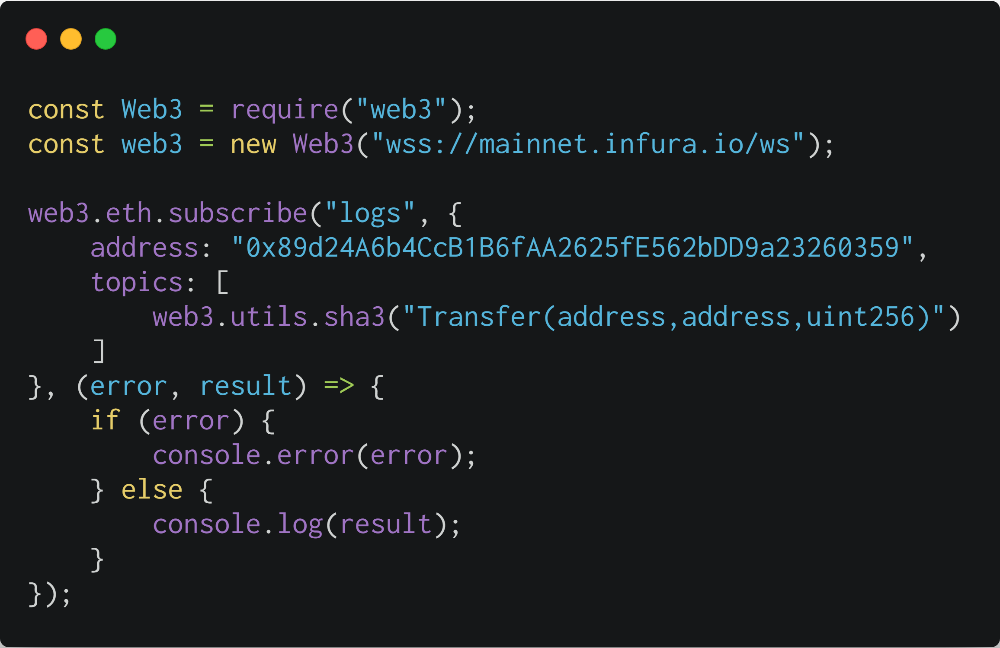

## 什么是事件
事件是以太坊提供的一种链内链外沟通的一种机制。通过触发事件，智能合约可以通知链外组件某个交易完成了什么事儿。
下面是一个 ERC20 合约里常见的 Transfer 事件定义，通过 event 关键字表明这是一个事件定义声明。
```
event Transfer(address indexed from, address indexed to, uint256 value);
```

在 transfer 方法的实现中，我们会像下面代码里展示的这样通过 emit 关键字触发事件的发生。
```
 function transfer(address _to, uint256 _value) public returns (bool) {
    ...
    emit Transfer(msg.sender, _to, _value);
    return true;
  }

```

## 什么是日志
在以太坊的语境里，日志代表对事件的存储。下面是我从 ropsten 测试网上读取的交易回执，在里面我们可以看到 logs 数据项，这个就是我们这里所说的日志，合约执行时每触发一次事件，在交易回执里的 logs 数据项数组里就会多一个日志条目出来。
```
> eth.getTransactionReceipt("0xe03fac05ff4dde83fc9267184fd8c08bd78599f950e817dbf7fa4a4d4d319ce2");
{
  blockHash: "0x7eaf6abe64592d10828e136635aa6be6f4d09da3bb5b9fddf87773ee152d657c",
  blockNumber: 4654718,
  contractAddress: null,
  cumulativeGasUsed: 52464,
  from: "0x076979a0b3c87334e5d72e3afcafaa80f7888cac",
  gasUsed: 52464,
  logs: [{
      address: "0x73c2a5b1a32fa8e33101a6ab119203f4417feae4",
      blockHash: "0x7eaf6abe64592d10828e136635aa6be6f4d09da3bb5b9fddf87773ee152d657c",
      blockNumber: 4654718,
      data: "0x0000000000000000000000000000000000000000000000056bc75e2d63100000",
      logIndex: 0,
      removed: false,
      topics: ["0xddf252ad1be2c89b69c2b068fc378daa952ba7f163c4a11628f55a4df523b3ef", "0x000000000000000000000000076979a0b3c87334e5d72e3afcafaa80f7888cac", "0x000000000000000000000000cd9f286ba6a3d2df7885f4a2be267fc524d32bd3"],
      transactionHash: "0xe03fac05ff4dde83fc9267184fd8c08bd78599f950e817dbf7fa4a4d4d319ce2",
      transactionIndex: 0
  }],
  logsBloom: "0x20000000000000000000000000000000000000000000000000000000000000000000000000000000000000000000000000000000000000000000000000000000000000000000000080000008000000000400000000000000000000000000000000000000040000000000000000100000000000000000000000000010000000000000000000000000000000000000000000000000000000000000000000000000000000000000000000000000000000000000000200000000000000000000000200000002000000000000000000000000000000000000000000000000000000000000000000000000000000000000000000000000000040000000000000000400",
  status: "0x1",
  to: "0x73c2a5b1a32fa8e33101a6ab119203f4417feae4",
  transactionHash: "0xe03fac05ff4dde83fc9267184fd8c08bd78599f950e817dbf7fa4a4d4d319ce2",
  transactionIndex: 0
}
```
在这个日志里，我们可以看到很多和事件触发上下文相关的信息，比如 合约地址 address、所在区块哈希 blockHash、所在区块号 blockNumber、所属交易哈希 transactionHash 等等。

这里面最核心的就两个数据：topics 和 data。我们这里看到 topics 是个数组，这个数组的第一个元素就代表所触发的事件，是个 256 位的数字，用 16 进制表示。只是看这么个字符串，我们并不能确定这是哪个事件，这时候就需要借助于合约的 ABI 文件。在 ABI 文件中找出 type 为 event 的那些元素，如下面所示：
```
{
      "anonymous": false,
      "inputs": [
        {
          "indexed": true,
          "name": "owner",
          "type": "address"
        },
        {
          "indexed": true,
          "name": "spender",
          "type": "address"
        },
        {
          "indexed": false,
          "name": "value",
          "type": "uint256"
        }
      ],
      "name": "Approval",
      "type": "event"
    },
    {
      "anonymous": false,
      "inputs": [
        {
          "indexed": true,
          "name": "from",
          "type": "address"
        },
        {
          "indexed": true,
          "name": "to",
          "type": "address"
        },
        {
          "indexed": false,
          "name": "value",
          "type": "uint256"
        }
      ],
      "name": "Transfer",
      "type": "event"
    }
```
为了找出 topic 所对应的事件，我们需要计算每个事件的签名并找到匹配的签名。 签名是事件名和输入参数类型的 sha3 散列，参数名被忽略。 对于事件 Transfer(address indexed from, address indexed to, uint256 value)，签名将是 sha3 ('Transfer(address,address,uint256)')，这些都是可以从 ABI 中获得。
```
> web3.sha3("Transfer(address,address,uint256)")
"0xddf252ad1be2c89b69c2b068fc378daa952ba7f163c4a11628f55a4df523b3ef"

> web3.sha3("Approval(address,address,uint256)")
"0x8c5be1e5ebec7d5bd14f71427d1e84f3dd0314c0f7b2291e5b200ac8c7c3b925"
```
很明显可以看出，"Transfer(address,address,uint256)" 这个事件的签名和上面提到过的 topics 的第一个数据元素是一致的，说明这个日志就是对应的 Transfer 事件。

现在我们知道了，日志里面 topics 数组里的第一个数据元素就是事件的签名。那么 topics 里其它的元素是什么呢？会看上面截取的 ABI，我们可以看到在事件元素的 inputs 数据项中，有的 indexed 的值为 true，有的为 false，我们在声明一个事件时，也可以指定事件的参数是否 indexed。所以topics 里的其它数据元素就是被索引收录的事件参数值，所有在 topics 里的内容，都是被索引收录，可以通过 bloom filter 进行过滤的。

日志里还有一个关键内容就是 data，这个比较容易理解，就是触发事件的时候传给事件的实际参数值，值得注意的是这里面只包含未索引的数据项。

所以对于Transfer(address indexed from, address indexed to, uint256 value)事件，topics 数组中的三个值分别为事件签名、from值、to值，data中的值是value的值。

## 有什么作用
最大的作用就是进行检索了，以太坊提供了基于 http 的 JSON-RPC 和 基于 websockets 事件订阅监听 。我们可以提供相应的 topics 对某个事件或事件数据进行检索。这在对 dApp 开发是很有帮助的。

让我们看一些示例，看看主题，数据和日志记录是如何使用的。
```
event Transfer(address indexed from, address indexed to, uint256 value);
```

如上由于前两个参数声明为 indexed，因此被视为主题。最后一个参数没有 indexed ，它将作为数据。这意味着我们可以进行这样的搜索：查找所有从地址 0x0000...（搜索条件）到地址 0x0000…（搜索条件）的转账日志，或者是“所有转账到地址 0x0000…（搜索条件）的日志”，但没法搜索“转账金额为 x（搜索条件）的转账。

通过使用 web3 JavaScript 库，可用于与本地或远程以太坊节点进行交互，我们能够订阅新的事件日志，如下每当发生新的 SAI 代币转账时，此代码都会通知我们，接收到事件通知，这对很多应用程序都很有用。例如，一旦你在以太坊地址上收到代币，钱包界面就可以提醒你。其中address是 SAI 代币合约地址。



## EVM实现
EVM 当前有 5 个操作码用于触发事件日志：LOG0，LOG1 ， LOG2 ， LOG3 和 LOG4。这些操作码可用于创建“日志记录”。每一条日志记录都包含“主题(topics)”和“数据(data)”。主题是32字节(256位)的，用于描述事件中发生的事情。不同的操作码(LOG0…LOG4)来描述需要包含在日志记录中的主题数。例如，“LOG1”包括“一个主题”，而“ LOG4”包括“四个主题”。因此，单个日志记录中可以包含的最大主题数是四个。

日志记录的第一部分由一组主题组成。这些主题用于描述事件。第一个主题通常为事件名称及其参数类型的签名的keccak256 哈希。一个例外是触发“匿名事件”没有事件签名。由于主题只能容纳 32 个字节的数据，因此无法将数组或字符串等（可能超过 32 个字节）的内容用作主题。而是应将其作为数据包括在日志记录中，而不是作为主题。如果要尝试包含大于 32 个字节的主题，则该主题需要被 hash 计算。因此，仅当你知道原始输入时，才可以知道此哈希表示的内容。总之，主题应该仅用于需要搜索查询的数据。可以将主题视为事件的索引键，它们都映射到相同的值，接下来将讨论。

日志记录的第二部分包含额外的数据。主题和数据在一起组成日志记录，主题和数据各自有其优点和缺点。例如，主题是可搜索的，但数据却不能。而数据比主题“便宜得多”。此外，尽管主题最多有 4 个（限制在 4 * 32 字节），但数据却没有限制，这意味着它可以包括大量或复杂数据，例如数组或字符串。因此，事件数据(如果有)可以视为值。

根据黄皮书、日志的基础成本是 375 gas 。另外每个的主题需要额外支付 375 gas 的费用。最后，每个字节的数据需要 8 个 gas。这实际上是很便宜！可以计算一下一个 ERC-20 代币转移事件的成本。首先，基本成本为 375 gas 。其次，“转移”事件包含 3 个主题，这是另外的 375 * 3 =1125 gas。最后，我们为所包含的每个数据字节添加 8 gas 。由于数据仅包含 ERC-20 转账的数量，最大为 32 字节，因此用于记录日志数据所需的最大 gas 量为 8 * 32 =256 gas 。所以最大总 gas 成本为1756 gas = 375 + 1125 + 256。作为对比参考，标准的以太币(非代币)转账要花费 21000 gas ，是事件成本的十倍以上了！如果我们假设 gas 价格为 1 gwei，那么操作的总成本将为 1756 gwei，相当于 0.000001756 ETH。如果以太坊的当前价格在 200 美元左右，那么总计为 $0.0003512。请记住，这是在全球范围内将数据永久存储的费用。PS：这只是日志记录操作本身的成本。任何以太坊交易至少需要 21000 gas，并且交易的输入数据每字节最多花费 16 gas。通常，要转账和日志记录 ERC-20 代币，费用在 40,000–60,000 gas 。

日志是一种以少量价格将少量数据存储在以太坊区块链上的优雅方法。具体来说，事件日志有助于让其他人知道发生了什么事情，而无需他们单独查询合约。

## 参考资料
> - []()
> - []()
