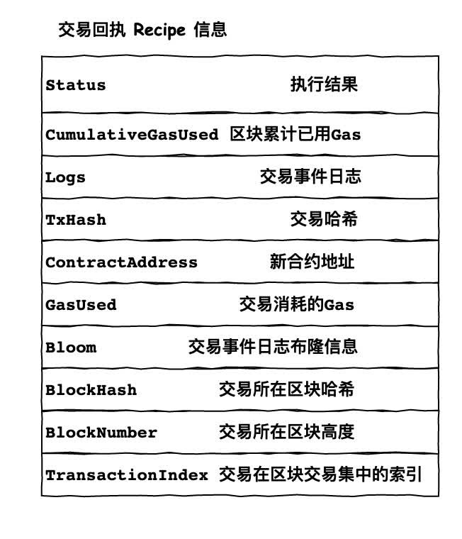
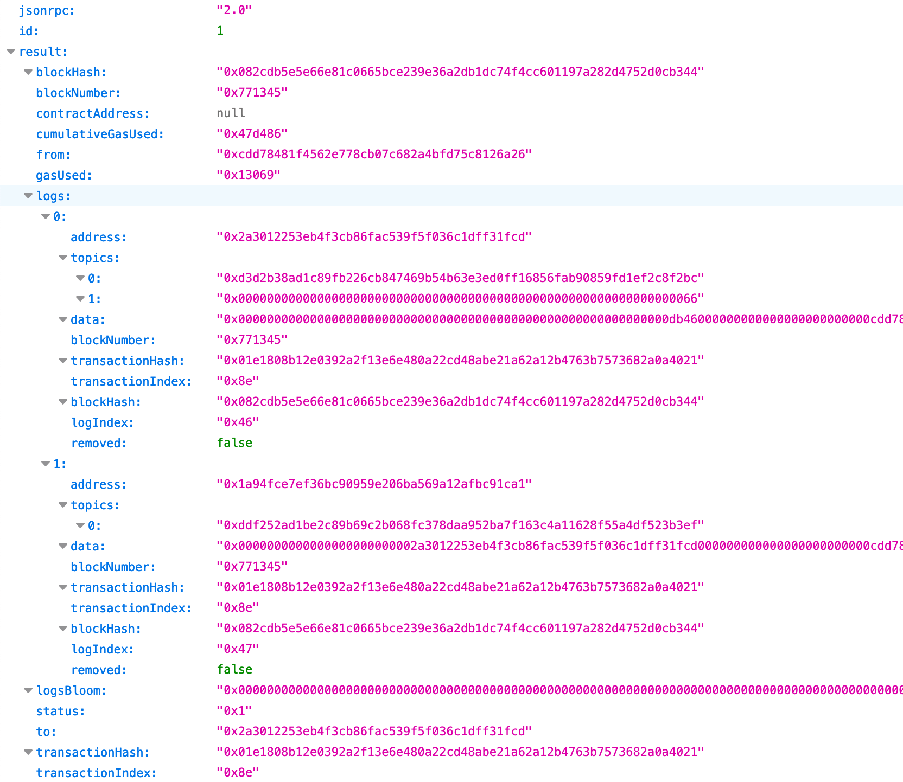
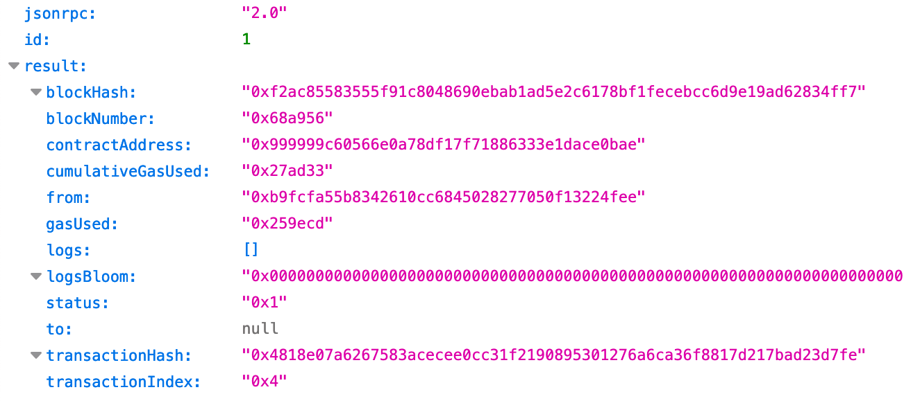
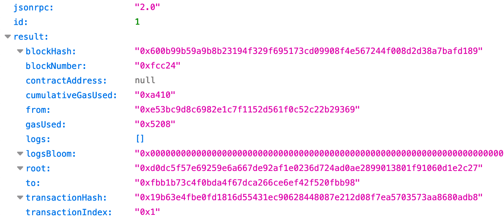
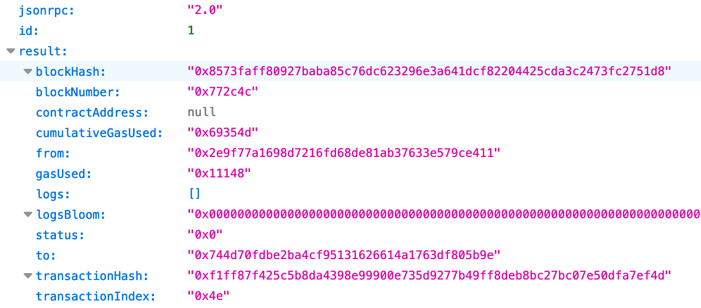

不同于比特币，以太坊作为智能合约平台。每一笔交易作为消息在以太坊虚拟机中执行时，均会获得一个交易回执信息(Receipt)。形同在银行转账后，可以获得关于这笔转账的交易电子回单。同样，在以太坊中一份交易回执记录了关于此笔交易的处理结果信息：

回执信息分为三部分：共识信息、交易信息、区块信息。下面分别介绍各类信息。

## 共识信息
共识意味在在校验区块合法性时，这部分信息也参与校验。这些信息参与校验的原因是确保交易必须在区块中的固定顺序中执行，且记录了交易执行后的状态信息。这样可强化交易顺序。
- Status： 成功与否，1 表示成功，0 表示失败。注意在高度 1035301 前，并非 1 或 0，而是 StateRoot，表示此交易执行完毕后的以太坊状态。
- CumulativeGasUsed： 区块中已执行的交易累计消耗的 Gas，包含当前交易。
- Logs: 当前交易执行所产生的智能合约事件列表。
- Bloom：是从 Logs 中提取的事件布隆过滤器，用于快速检测某主题的事件是否存在于 Logs 中。

## 交易信息
这部分信息记录的是关于回执所对应的交易信息，有：
- TxHash： 交易回执所对应的交易哈希。
- ContractAddress： 当这笔交易是部署新合约时，记录新合约的地址。
- GasUsed: 这笔交易执行所消耗的 Gas 燃料。

## 区块信息
这部分信息完全是为了方便外部读取交易回执，不但知道交易执行情况，还能方便的指定该交易属于哪个区块中第几笔交易。
- BlockHash: 交易所在区块哈希。
- BlockNumber: 交易所在区块高度。
- TransactionIndex： 交易在区块中的序号。

这三项信息，主要是在数据库 Leveldb 中读取交易回执时，实时指定。

## 交易回执示例
上面讲完交易回执内容与构造和存储，下面我从 etherscan 上查找三中不同类型的交易回执数据，供大家找找感觉。

### 一笔包含日志的交易回执
交易 0x01e1808b12e0392a2f13e6e480a22cd48abe21a62a12b4763b7573682a0a4021 执行成功，且包含了两个事件日志。
地址：https://etherscan.io/tx/0x01e1808b12e0392a2f13e6e480a22cd48abe21a62a12b4763b7573682a0a4021

### 一笔成功部署合约的交易回执
如果是部署合约的交易，可以看到 contractAddress 有值。

### 一笔含 StateRoot 的交易回执
和其他交易回执内容不同，在高度 1035301 前的交易并无 status 字段，而是 root 字段。是在后续改进中去除 root 采用 status 的。

### 一笔交易失败的交易回执
如果是失败的交易，则 status 为 0。

## 参考资料
> - 
> - 
