以太坊虚拟机，简称 EVM，是用来执行以太坊上的交易的。

## 固定油费（Intrinsic Gas）
每笔交易过来，不管三七二十一先需要收取一笔固定油费，计算方法如下：

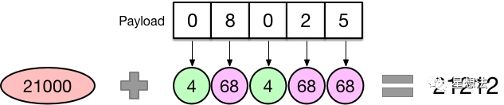

如果你的交易不带额外数据（Payload），比如普通转账，那么需要收取 21000 的油费。

如果你的交易携带额外数据，那么这部分数据也是需要收费的，具体来说是按字节收费：字节为 0 的收 4 块，字节不为 0 收 68 块，所以你会看到很多做合约优化的，目的就是减少数据中不为 0 的字节数量，从而降低油费gas消耗。

## 创建合约
如果某一笔交易的 to 地址为 nil，则表明该交易是用于创建智能合约的。

首先需要创建合约地址，采用下面的计算公式：`Keccak(RLP(call_addr, nonce))[12:]`。也就是说，对交易发起人的地址和 nonce 进行 RLP 编码，再算出 Keccak 哈希值，取后 20 个字节作为该合约的地址。

下一步就是根据合约地址创建对应的 `stateObject`，然后存储交易中包含的合约代码。该合约的所有状态变化会存储在一个 `storage trie` 中，最终以 `Key-Value` 的形式存储到 StateDB 中。代码一经存储则无法改变，而 `storage trie` 中的内容则是可以通过调用合约进行修改的，比如通过 SSTORE 指令。

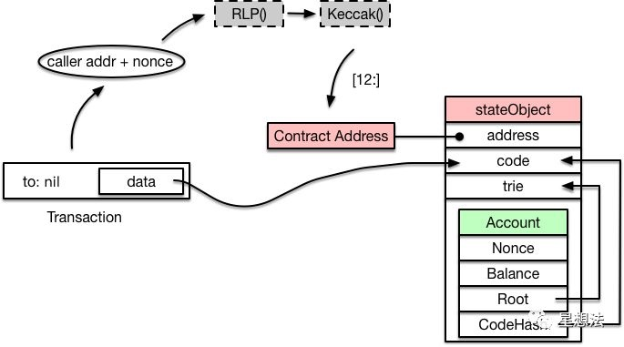

## 交易开始
输入一笔交易，内部会转换成一个 Message 对象，传入 EVM 执行。业务流程如下图：

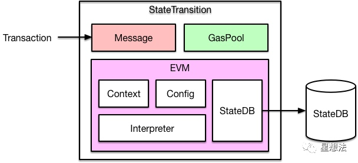

如果是一笔普通转账交易，那么直接修改 `StateDB` 中对应的账户余额即可。如果是智能合约的创建或者调用，则通过 EVM 中的解释器加载和执行字节码，执行过程中可能会查询或者修改 StateDB。

## 生成 Contract 对象
交易会被转换成一个 Message 对象传入 EVM，而 EVM 则会根据 Message 生成一个 Contract 对象以便后续执行：

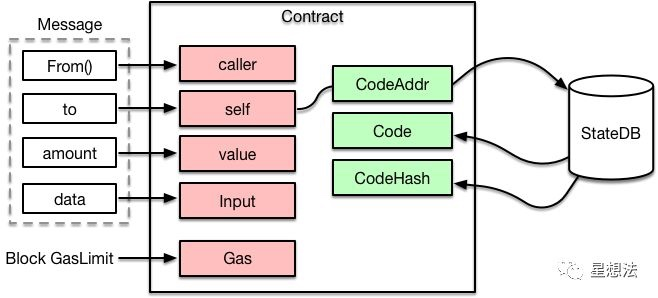

可以看到，Contract 中会根据合约地址，从 `StateDB` 中加载对应的代码，后面就可以送入解释器执行了。

另外，执行合约能够消耗的油费有一个上限，就是节点配置的每个区块能够容纳的 `GasLimit`。

## 3. 送入解释器执行
代码跟输入都有了，就可以送入解释器执行了。EVM 是基于栈的虚拟机，解释器中需要操作四大组件：
- PC：类似于 CPU 中的 PC 寄存器，指向当前执行的指令
- Stack：执行堆栈，位宽为 256 bits，最大深度为 1024
- Memory：内存空间
- Gas：油费池，耗光邮费则交易执行失败

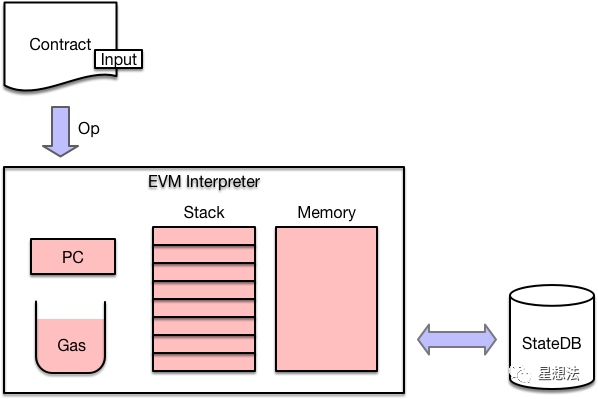

EVM 的每条指令称为一个 OpCode，占用一个字节，所以指令集最多不超过 256，具体描述参见：[https://ethervm.io](https://ethervm.io/) 。比如下图就是一个示例（PUSH1=0x60, MSTORE=0x52）：


首先 PC 会从合约代码中读取一个 OpCode，然后从一个 JumpTable 中检索出对应的 operation，也就是与其相关联的函数集合。接下来会计算该操作需要消耗的油费，如果油费耗光则执行失败，返回 ErrOutOfGas 错误。如果油费充足，则调用 execute () 执行该指令，根据指令类型的不同，会分别对 Stack、Memory 或者 StateDB 进行读写操作。具体**解释执行的流程**参见下图：

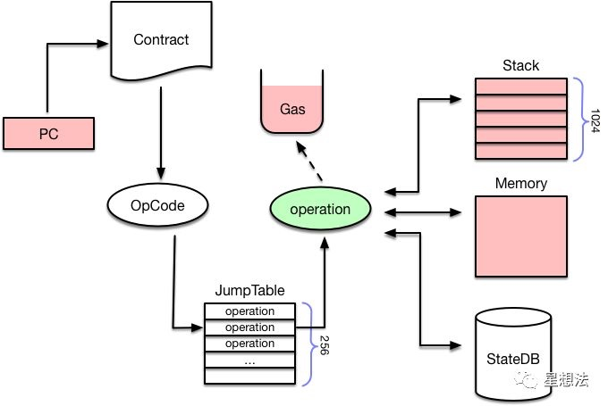

## 4. 调用合约函数
前面分析完了 EVM 解释执行的主要流程，可能有些同学会问：那么 EVM 怎么知道交易想调用的是合约里的哪个函数呢？别急，前面提到跟合约代码一起送到解释器里的还有一个 Input，而这个 Input 数据是由交易提供的。

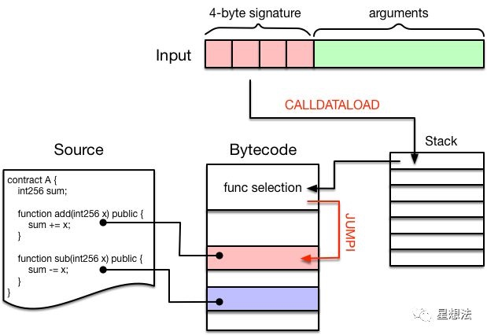

Input 数据通常分为两个部分：
- 前面 4 个字节被称为 “4-byte signature”，是某个函数签名的 Keccak 哈希值的前 4 个字节，作为该函数的唯一标识。（可以在该网站[查询目前所有的函数签名](https://www.4byte.directory/)）
- 后面跟的就是调用该函数需要提供的参数了，长度不定。

举个例子：我在部署完 A 合约后，调用 add (1) 对应的 Input 数据是

```
0x87db03b70000000000000000000000000000000000000000000000000000000000000001
```

而在我们编译智能合约的时候，编译器会自动在生成的字节码的最前面增加一段函数选择逻辑：

首先通过 `CALLDATALOAD` 指令将 “4-byte signature” 压入堆栈中，然后依次跟该合约中包含的函数进行比对，如果匹配则调用 JUMPI 指令跳入该段代码继续执行。

这么讲可能有点抽象，我们可以看一看上图中的合约对应的反汇编代码就一目了然了：

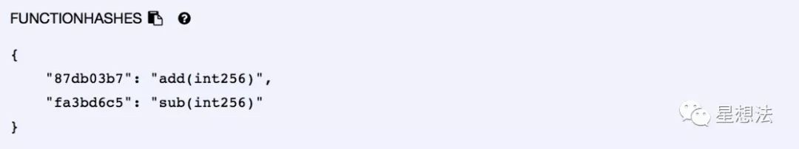

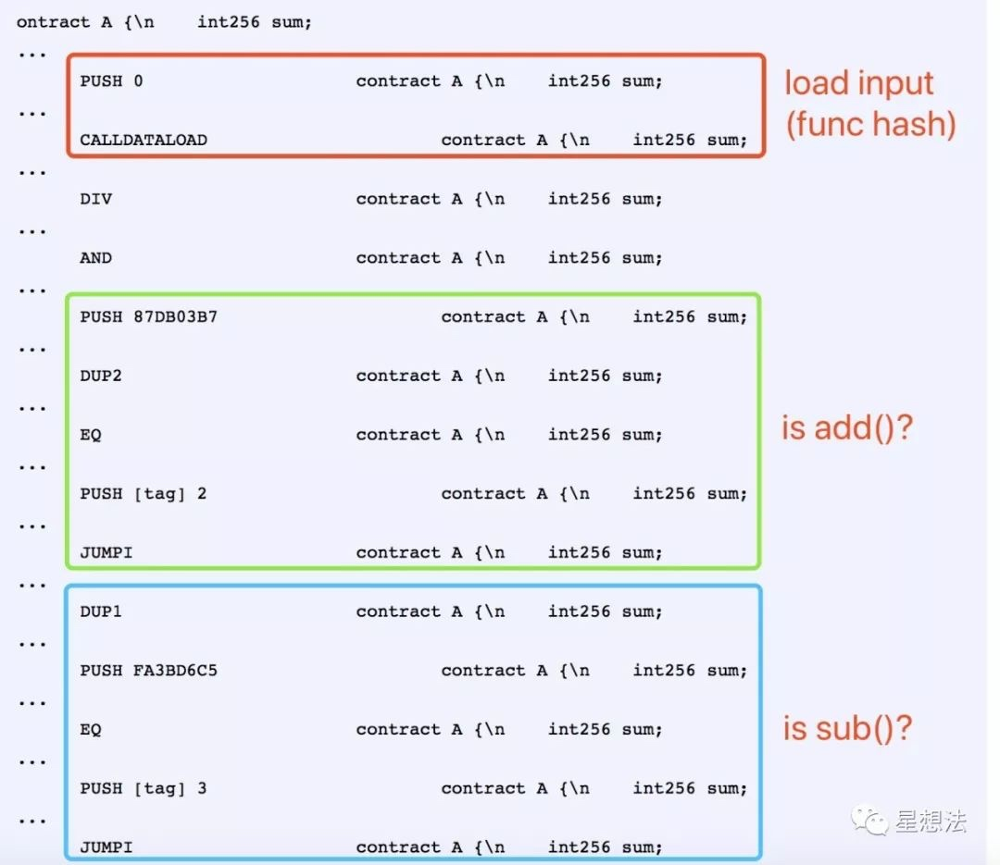

这里提到了 `CALLDATALOAD`，就顺便讲一下数据加载相关的指令，一共有 4 种：

- CALLDATALOAD：把输入数据加载到 Stack 中
- CALLDATACOPY：把输入数据加载到 Memory 中
- CODECOPY：把当前合约代码拷贝到 Memory 中
- EXTCODECOPY：把外部合约代码拷贝到 Memory 中

最后一个 EXTCODECOPY 不太常用，一般是为了审计第三方合约的字节码是否符合规范，消耗的 gas 一般也比较多。这些指令对应的操作如下图所示：

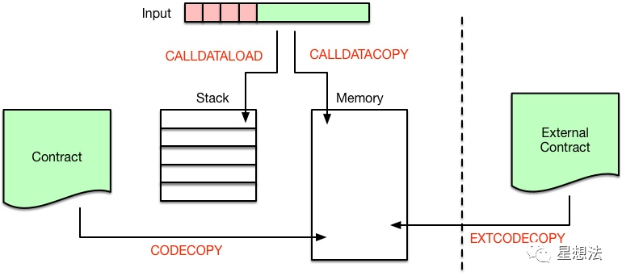

## 合约调用合约
在中大型的项目中，我们不可能在一个智能合约中实现所有的功能，而且这样也不利于分工合作。一般情况下，我们会把代码按功能划分到不同的库或者合约中，然后提供接口互相调用。

在 `Solidity` 中，如果只是为了代码复用，我们会把公共代码抽出来，部署到一个 library 中，后面就可以像调用 C 库、Java 库一样使用了。但是 library 中不允许定义任何 storage 类型的变量，这就意味着 library 不能修改合约的状态。如果需要修改合约状态，我们需要部署一个新的合约，这就涉及到合约调用合约的情况。

合约调用合约有下面 4 种方式：

- CALL
- CALLCODE
- DELEGATECALL
- STATICCALL

## CALL
调用流程如下图所示：

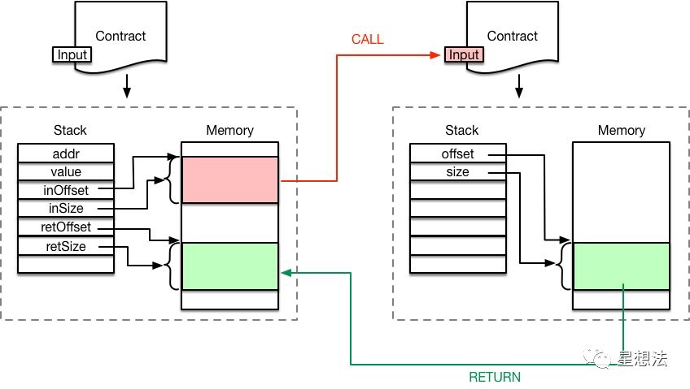

可以看到，调用者把调用参数存储在内存中，然后执行 CALL 指令。

CALL 指令执行时会创建新的 Contract 对象，并以内存中的调用参数作为其 Input。

解释器会为新合约的执行创建新的 `Stack` 和 `Memory`，从而不会破环原合约的执行环境。

新合约执行完成后，通过 RETURN 指令把执行结果写入之前指定的内存地址，然后原合约继续向后执行。

## CALL vs. CALLCODE
CALL 和 CALLCODE 的区别在于：代码执行的上下文环境不同。

具体来说，CALL 修改的是**被调用者**的 storage，而 CALLCODE 修改的是**调用者**的 storage。

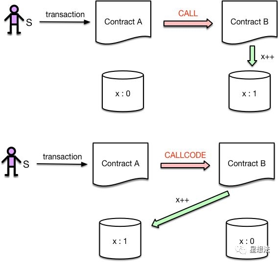


我们写个合约验证一下我们的理解：

```
pragma solidity ^0.4.25;

contract A {
  int public x;

  function inc_call(address _contractAddress) public {
      _contractAddress.call(bytes4(keccak256("inc()")));
  }
  function inc_callcode(address _contractAddress) public {
      _contractAddress.callcode(bytes4(keccak256("inc()")));
  }
}

contract B {
  int public x;

  function inc() public {
      x++;
  }
}
```

我们先调用一下 `inc_call()`，然后查询合约 A 和 B 中 x 的值有什么变化，可以发现，合约 B 中的 x 被修改了，而合约 A 中的 x 还等于 0。

我们再调用一下 `inc_callcode()` 试试，可以发现，这次修改的是合约 A 中 x，合约 B 中的 x 保持不变。

## CALLCODE vs. DELEGATECALL

实际上，可以认为 DELEGATECALL 是 CALLCODE 的一个 bugfix 版本，官方已经不建议使用 CALLCODE 了。

CALLCODE 和 DELEGATECALL 的区别在于：`msg.sender` 不同。

具体来说，DELEGATECALL 会一直使用原始调用者的地址，而 CALLCODE 不会。

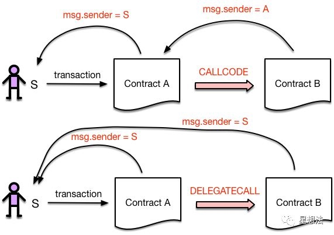

我们还是写一段代码来验证我们的理解：

```
pragma solidity ^0.4.25;

contract A {
  int public x;

  function inc_callcode(address _contractAddress) public {
      _contractAddress.callcode(bytes4(keccak256("inc()")));
  }
  function inc_delegatecall(address _contractAddress) public {
      _contractAddress.delegatecall(bytes4(keccak256("inc()")));
  }
}

contract B {
  int public x;

  event senderAddr(address);
  function inc() public {
      x++;
      emit senderAddr(msg.sender);
  }
}
```

我们首先调用一下 inc_callcode ()，观察一下 log 输出，可以发现，msg.sender 指向合约 A 的地址，而非交易发起者的地址。

我们再调用一下 inc_delegatecall ()，观察一下 log 输出，可以发现，msg.sender 指向的是交易的发起者。

## STATICCALL

STATICCALL 放在这里似乎有滥竽充数之嫌，因为目前 Solidity 中并没有一个 low level API 可以直接调用它，仅仅是计划将来在编译器层面把调用 view 和 pure 类型的函数编译成 STATICCALL 指令。

view 类型的函数表明其不能修改状态变量，而 pure 类型的函数则更加严格，连读取状态变量都不允许。

目前是在编译阶段来检查这一点的，如果不符合规定则会出现编译错误。如果将来换成 STATICCALL 指令，就可以完全在运行时阶段来保证这一点了，你可能会看到一个执行失败的交易。


## 参考资料
> - []()
> - []()
