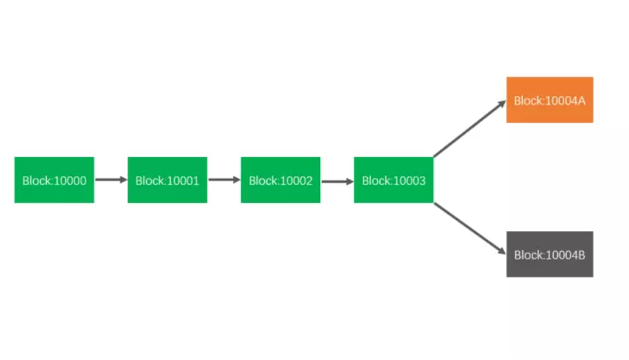
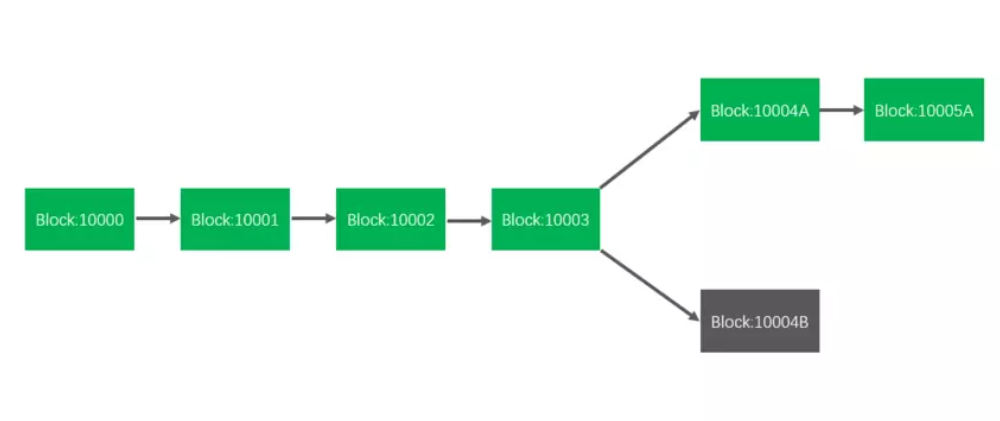
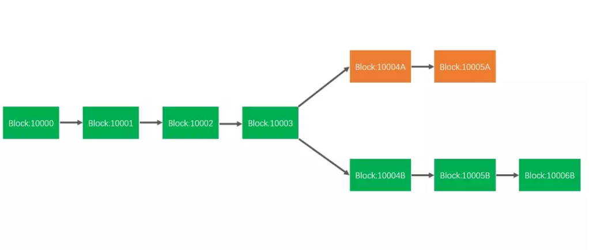
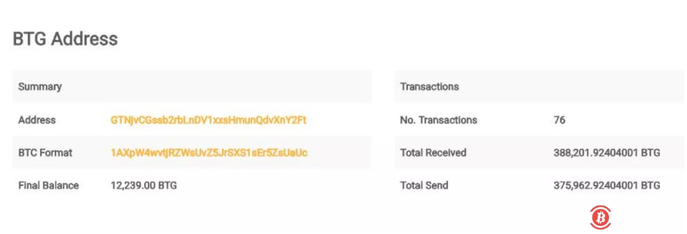

无论工作量证明的 PoW，还是权益证明 PoS，还是委托权益证明 DPoS，只要在共识问题里面，理论上讲都无法避免出现 51% 攻击，攻击者通过 51% 可逆转区块，控制主网，导致双花。本文将详细介绍 PoW 机制，51% 攻击过程，以及安全解决方案。

区块链作为一种去中心化的分布式公共数据存储系统，其并没有中央管理机构进行管理工作，而是通过分布式节点共同利用密码学协议共同维护，而各个节点在维护整个系统的时候要通过底层的共识协议来保证账本的一致性。区块链在不同的现实场景中发挥的实际用途不同，比如公链，私链，联盟链，不同的链使用的共识算法也有所不同，比如比特币使用的 PoW 共识，以太坊使用的 PoW 共识，EOS 使用的 DPoS 共识，而不同的共识算法所涉及的安全性又有所区别。

下文将详细介绍比特币和以太坊使用的 PoW 共识协议中存在的攻击风险。

首先让我们来看看什么是 PoW 共识协议。从去中心化账本系统的角度看，每个加入这个系统的节点都要保存一份完整的账本，但每个节点却不能同时记账，因为节点处于不同的环境，接收到不同的信息，因此需要有共识来达成哪个节点有权记账。比特币和以太坊区块链通过竞争记账的方式解决去中心化的记账系统的一致性问题，即以每个节点的计算能力即 “算力” 来竞争记账权的机制，在竞争记账权的过程就是 “挖矿”。然而，在一个去中心化的系统中，谁有权判定竞争的结果呢？比特币和以太坊区块链系统是通过一个称为 “工作量证明”（Proof of Work，PoW）的共识机制完成的。PoW (Proof of Work)，即” 工作量证明”，简单地说，PoW 就是一份确认工作端做过一定量工作的证明。工作端需要做一定难度的工作得出一个结果，验证方能轻松通过结果来检查工作端是不是做了相应的工作。

双花攻击，简单来说就是指将一个代币通过多次支付手段发起的攻击，也就是指同一个货币被花费了多次。发起双花攻击的方式有很多，包括以下几种形式：51% 攻击、种族攻击、Vector 76 攻击、替代历史攻击。51% 攻击也就是说如果攻击者掌握了全网超过 50% 的计算能力时，可通过 51% 攻击实施双花。这里我们只分析 51% 攻击过程。

51% 攻击，又被称为 Majority attack。这种攻击是通过控制网络算力实现双花。如果攻击者控制了网络中 50% 以上的算力，那么在他控制算力的这段时间，他可以将区块逆转，进行反向交易，实现双花。

在 PoW 共识协议里，区块链系统同时允许存在多条分叉链，而每一条链都可以对外申明自己是正确的，但是在区块链的设计理念中有一个最长有效原理：“不论在什么时候，最长的链会被认为是拥有最多工作的主链。”

下面我们简单模拟一下 51% 的攻击过程：如果存在这样一个攻击者，它刻意把第一笔交易向一半网络进行广播，把第二笔交易向另一半网络广播，然后两边正好有两个矿工几乎同时取得记账权，把各自记账的 block 广播给大家，此时选择任意一个账本都可以，这时候原来统一的账本出现了分叉，如下图：

接下来，下一个矿工选择在 A 基础上继续记账的话，A 分支就会比 B 分支更长，根据区块链的规则，最长的分支会被认可，短的分支会被放弃，账本还是会回归为一个，交易也只有一笔有效，如下图：

此时 A 分支被认可，相应交易确认，如果攻击者拿到商品之后，立刻自己变身矿工，争取到连续两次记账权，然后在 B 分支上联系增加两个 block，如下图所示：

于是 B 分支成为认可的分支，此时 A 分支被舍弃，A 分支中的交易不再成立，攻击者在 A 分支的支付货币重新有效，但攻击者已经拿到商品，至此成功完成一次双花攻击。虽然在 B 分支落后的情况下要强行让它超过 A 分支，现实中难度很大，成功的概率很低，但是，攻击者如果掌握了全网 50% 以上的计算力，那么，即使落后很多，他追上也只是时间问题，这就是上面所说的 “51% 攻击”。

## 比特币黄金 51% 攻击案例分析
在区块链的现实世界里发送过很多次因为 51% 攻击导致的双花。比如比特币黄金 Bitcoin Gold (BTG 币) 发生的双花问题就属于 51% 攻击，攻击过程如下：
1. 攻击者控制 Bitcoin Gold 网络上 51% 以上的算力，在控制算力的期间，他把一定数量的 BTG 发给自己在交易所的钱包，这条分支我们命名为分支 A。
2. 同时，他又把这些 BTG 发给另一个自己控制的钱包，这条分支我们命名为分支 B。
3. 分支 A 上的交易被确认后，攻击者立马卖掉 BTG，拿到现金。这时候，分支 A 成为主链。
4. 然后，攻击者在分支 B 上进行挖矿，由于其控制了 51% 以上的算力，那么攻击者获得记账权的概率很大，于是很快分支 B 的长度就超过了主链 (也就是分支 A 的长度)，那么分支 B 就会成为主链，分支 A 上的交易就会被回滚，将数据恢复到上一次正确的状态位置。
5. 也就是说，分支 A 恢复到攻击者发起第一笔交易之前的状态，攻击者之前换成现金的那些 BTG 又回到了自己手里。
6. 最后，攻击者把这些 BTG，发到自己的另一个钱包。就这样，攻击者凭借 51% 以上的算力控制，实现同一笔 token 的 “双花”。

据此次攻击区块链数据报道，攻击者成功逆转了 22 个区块，涉及此次攻击的比特币黄金地址已收到超过 388200 个 BTG，假设所有这些交易都与双花相关，攻击者可能已经从交易所窃取了价值高达 1860 万美元的资金，涉及此次攻击的比特币黄金记录如下图所示：

除了 Bitcoin Gold 发生的双花问题之外，还有很多由于 51% 攻击导致的双花攻击案例：

- 匿名数字货币 `verge` 曾在短短几个小时内恶意挖掘了超过 3500 万个 XVG，价值约 175 万美元。
- 日本加密货币 `monacoin` 在一名矿工获得高达 57％的网络算力后明显遭到扣块攻击。
- 莱特币现金（LCC）官方消息，LCC 曾遭到了 51% 攻击。
- 数字货币 `ZEN` 也遭受到了 51% 攻击。
- 近日以太坊经典 `ETC` 遭受 51% 攻击。

来说说近日以太坊经典 ETC 的 51% 攻击，据区块链安全情报显示，一个地址以 0x3ccc8f74 开头的私人矿池算力发生了较大波动，这个私人矿池的算力目前占比 ETC 整个网络算力的 63%。也就是说，该矿池目前控制 ETC 网络的大部分算力，这是 51％攻击的先决条件。coinbase说在 1 月 5 号监测到第 1 次双花攻击，之后又发现了 8 次双花攻击，总共涉及到 88,500 枚 ETC (约 $460,000)，但是文章中未说明这次双花攻击的目标是谁，以及是谁发起了这次双花攻击。

根据以往发生的 51% 攻击案例，51% 攻击一旦成为真实场景下的成熟攻击方法，各个公链都需要小心，虽然通过 51% 攻击需要很大代价，但是在小币种公链网络中呢？况且，即使没有 50% 以上的算力，依然还是有机会成功的，只是概率低而已。无论工作量证明的 PoW，还是权益证明 PoS，还是委托权益证明 DPoS，只要在共识问题里面，理论上讲都无法避免出现 51% 攻击情况，在不同共识机制的实现中还可能存在各种其他问题，而且在熊市的这段时间里，算力下降，币价大跌，主网相对更加脆弱的，更容易出现 51% 攻击问题。

针对 51% 攻击的解决方案主要有如下几种：

- 提高确认次数。比如近日的以太坊经典 ETC 51% 攻击中建议将确认次数提高为 500 个以上。
- 在共识机制方面改善。比如 当时莱特币 LCC 受到 51% 攻击之后官方表示引入 PoS 机制。
- 升级新的算法。比如 Bitcoin Gold 遭受 51% 攻击之后表示，将开发新的 PoW 算法以替代原有的 Equihash 算法。
- 与交易所实时沟通信息对称。比如 Bitcoin Gold 遭受 51% 攻击之后立即与合作交易所合作，阻断黑客的套现渠道。
- 通过第三方专业区块链安全团队应急处理。

## 参考资料
> - 
> - 
