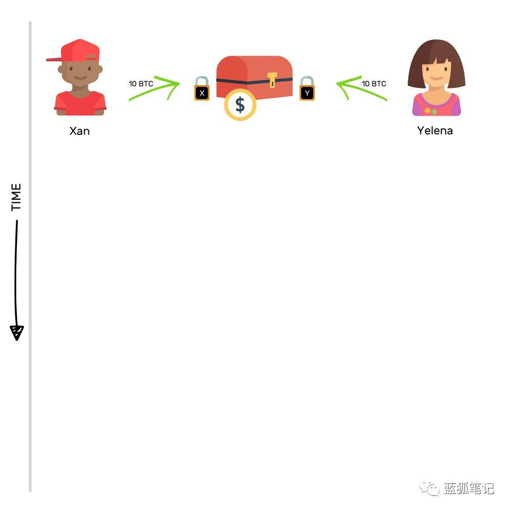
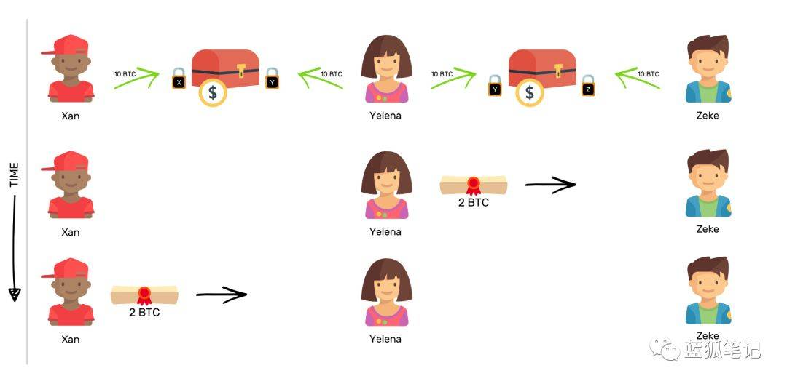

区块链很慢，也很贵。如要转出比特币，接收方需要花好几个小时候才能收到，且发送人还需要支付很高的交易费用。就这样的情况，区块链还怎么接管世界？

任何试图解决区块链扩展性问题的想法都值得关注，并花费时间和精力。闪电网络也是其中之一。但在我们理解它之前，首先来看看问题在哪里。

如果你对这些问题已经熟知，可以直接跳过，进入下个章节。

## 为什么区块链很慢？

> “我是缓慢的行者，但我从不回头。” ——阿伯拉罕·林肯

可以将区块链看作为登记的账簿，而这个账簿包含多个页面，在这里的页面类似于区块，每个页面都有多个交易。一旦一个页面填满交易，它就需要添加进入账簿，之后才能继续在下一个页面里记录交易。

在页面被增添到账簿（链）之前，还有一些程序需要完成，这样才能确保每个人都同意页面上包含的内容。对于比特币区块链来说，每个区块的处理过程大约需要10分钟。

想象一下，你发送1btc给你的朋友Joe。

除了其他事项，交易包含发送人、接收人、金额以及交易费用信息。

 

## 等一下，交易费？

> “顾问可以帮助其客户省钱，省下的钱足够支付顾问费。” ——Arnold H. Glasow

是的，会有额外费用。通过支付费用，可以激励矿工尽快打包你的交易。没有固定的价格，主要取决于你愿意花费多少费用来加速交易。费用越高，交易得到的处理就越快。

在任何特定时间，都有一些交易记录在当前的页面上。

矿工，也就是那些在区块链网络中工作的计算机，必须决定在当前的区块中包含哪些可用的交易。在做决定时，他们会查看哪些交易能带来更多回报，也就是说，费用越高的交易会被优先打包进入区块。

如果其他人的交易费用比你的高，你只能排队等候。等待的时间从几分钟到几个小时不等。有时甚至会花上几天时间。你支付的交易费用越多，你的交易越快完成。

这就是为什么区块链很慢的原因，因此，对于使用者来说，费用也不便宜。理想情况下，区快链会走向主流人群的采用，但这意味着会发生更多的交易，不过问题是，随着交易数量的增加，网络将趋于缓慢，这个反过来会阻碍主流人群的采用。这是一个悖论！

闪电网络是解决这个问题的一个潜在方案

 

## 那么，什么是闪电网络？

> “雷声很好，它让人印象深刻；但真正工作的是闪电。” ——马克·吐温

闪电网络背后的想法是，并不是所有的交易都需要在记录在区块链上。

想象一下，你和我之间进行多次交易。在这种场景下，我们可以绕过区块链上的交易记录，在链外完成交易即可。

用最简单的话来说它是如何运作的？

在我们之间打开“支付通道”，并在区块链上记录它。那么，现在，通过这个“支付通道”我们就可以进行多次交易，并且在任意时间保持开放。只有当我们想关闭通道时，才会重新跟区块链发生接触。然后，我们把链外通道交易的最终状态记录在区块链上。

使用这种支付通道的概念，我们可以创建一个支付通道网络，这样只需少部分交易发生在链上。可以想象一下，有三个人——Xan，Yelena和Zeke。

如果Xan和Yelena之间打开了支付通道，Yelena和Zeke之间有一个打开的支付通道，那么，Xan可以通过Yelena向Zeke转帐。

假设Xan想发给Zeke2BTC，Yelena将向Zeke发送2BTC，而Xan将偿还2BTC给Yelena。

这是闪电网络的理念。因为你不会经常在区块链上发生交易，那么，交易可以像闪电一样快速。这个速度都是拜支付通道所赐。

## 那么，支付通道又是什么？

> “一个人只是一滴水。合在一起，我们就是海洋。” ——Ryunosuke Satoro

它就像一个安全的存款箱，两个人把相同金额的钱存进去，每个人给它一把锁。

在同一个箱子存入相同数额的金钱，这种行为会在区块链上记录下来，以“开盘交易”的形式记录，如此这般，支付通道就在两个人之间打开了。（蓝狐笔记译注：开盘交易，这里是说起始的交易。）

在同一个箱子存入钱想法的背后是，没有任何一方可以在不经另外一方同意的情况下花费箱子里的钱。箱子中的钱用于两者之间的交易。

想象一下，Xan和Yelena在同一箱子中各存入10BTC。假如现在，Xan想给Yelena发送2BTC，他会怎么做？

要成功实现转账，他会承诺把自己在箱子中的2BTC所有权转给Yelena。在转让承诺完成后，如果箱子解锁，那么，Xan可以从箱子中取走8BTC，而Yelena能够取走12BTC。

不过他们暂时不会打开箱子，因为他们还想继续进行交易。这正是这种安排的美妙之处。

现在，如果第二天，Yelena不得不向Xan发送1BTC，她也会做相同的事情，就是把其中1BTC的所有权承诺转让给Xan。在这两笔交易之后，如果箱子打开，那么，Xan可以取走9BTC，而Yelena可以取走11BTC。

概括来说，支付通道只不过是把一些资金汇集在一起，然后按照商定的方式把池中资金的所有权进行承诺转让。如果Xan或Yelena想要关闭通道，他们可以关闭。

关闭支付通道只是意味着打开存款箱，并把里面的钱取走。存款箱的打开记录在区块链上，它会记录谁在存款箱有多少钱，这些记录会永久保存。

这就是支付通道的运作方式。但它还远没有揭示其真正的潜力。当两个或多个支付通道共同组成一个支付网络时，它的力量才会真正释放出来。

## 那么，它实际上是如何工作的？

> “伟大的事情是由一系列小事情组合做成的。” ——文森特·梵高

闪电网络实现价值转移的方式是把比特币所有权转移转变为对比特币所有权承诺的转让来实现。

这种转变是巨大的。我们通过例子来说明这一点。假设有三个人，Xan、Yelena和Zeke，在Xan和Yelena之间有打开的支付通道，同时，Yelena和Zeke之间也打开了支付通道。请注意，Zeke和Xan之间并无支付通道。

在这种情况下，如果Xan想向Zeke发送2BTC，他可以利用Yelena和Zeke的支付通道来实现转账。这看起来是什么样的？

Xan请求Yelena在Yelena-Zeke的支付通道转移2BTC给Zeke的承诺，然后，他在Xan-Yelena通道偿还Yelena 2 BTC。

通过这样的支付通道网络，可以在链外进行大量的交易，因此，可以释放区块链的带宽。使用支付通道网络，可以发生数百万笔的交易，而且交易费用也不贵。

这就是大白话版的闪电网络。

## 参考资料
> - [巴比特-蓝狐](<https://www.8btc.com/article/375131>)
> - 
