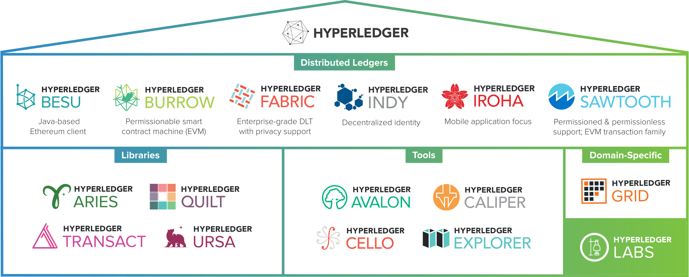

官网：https://www.hyperledger.org/

Github：<https://github.com/hyperledger>

Hyperledger项目属于Linux基金会，生态包含如下项目

## 分布式账本

- Besu：是一个以太坊客户端，旨在对公共和私有许可的网络用例都具有企业友好性。它也可以在Rinkeby，Ropsten和Görli等测试网络上运行。 Besu包含几种共识算法，包括PoW和PoA（IBFT，IBFT 2.0，Etherhash和Clique）。其全面的许可方案是专门为在联盟环境中使用而设计的。
- Burrow：是一个完整的单二进制区块链发行版，专注于简单性，速度和开发人员人体工程学。它支持基于EVM和WASM的智能合约，并通过Tendermint算法使用BFT共识。它具有复杂的事件系统，可以维护链上数据的关系数据库映射。治理和许可是内置的，可以通过链上的提案交易进行修改。它针对公共许可的权益证明用例进行了优化，但也可以用于私有/联盟网络。
- Fabric：旨在作为开发具有模块化体系结构的应用程序或解决方案的基础。 Fabric允许即插即用的组件（例如共识和MSP）。其模块化和通用设计满足了广泛的行业用例。它提供了一种独特的共识方法，可在保持隐私的同时实现大规模性能。
- Indy：提供工具，库和可重用组件，以提供基于区块链或其他分布式分类帐的数字身份，从而使它们可在管理域，应用程序和任何其他孤岛上互操作。 Indy可与其他区块链互操作，或可独立使用以推动身份去中心化。
- Iroha：是一个易于使用的模块化分布式区块链平台，具有自己独特的共识和排序服务算法，丰富的基于角色的权限模型以及多签名支持。
- Sawtooth：提供了灵活的模块化体系结构，将核心系统与应用程序域分开，因此智能合约可以为应用程序指定业务规则，而无需了解核心系统的底层设计。 Sawtooth支持多种共识算法，包括实用的拜占庭容错PBFT和PoET。

## 库

- Aries：提供了一个共享的，可重复使用的，可互操作的工具包，该工具包专门用于旨在创建，传输和存储可验证数字凭证的计划和解决方案。它是用于以区块链为基础的对等交互的基础架构。该项目使用了Hyperledger Ursa提供的加密支持，以提供安全的秘密管理和去中心化的密钥管理功能。
- Quilt：是Interledger协议的Java实现，可在任何付款网络（法定或加密货币）上进行付款。Quilt提供了以与账本无关的方式发送和接收付款所需的所有核心原语的实现，允许开发人员编写一次应用程序付款逻辑，同时获得对启用了Interledger的任何其他付款系统的访问权限。
- Transact：的目的是通过提供一种用于执行智能合约的标准接口来减少编写分布式分类帐软件的开发工作，该接口与分布式分类帐实现方式是分开的。 Hyperledger Transact采用可扩展的方法来实现称为“智能合约引擎”的新智能合约语言，该语言实现了处理智能合约的虚拟机或解释器。
- Ursa：是一个共享的密码库，它使实现能够避免重复其他密码工作，并有望提高流程的安全性。该库是用于存放和使用加密货币的可选存储库（适用于Hyperledger和非Hyperledger项目）。 Hyperledger Ursa由子项目组成，这些子项目是密码代码或密码代码接口的内聚实现。

## 工具

- Avalon：是企业以太坊联盟发布的可信计算规范的账本独立实施。它旨在使区块链处理从主链安全转移到专用计算资源。 Avalon旨在帮助开发人员获得计算信任的好处并减轻其缺点。
- Caliper：是一个区块链基准测试工具，它允许用户使用一组预定义的用例来衡量特定区块链实施的性能。
- Cello：旨在将按需“即服务”部署模型引入区块链生态系统，以减少创建，管理和终止区块链所需的工作量。
- Explorer：可以查看，调用，部署或查询块，交易和相关数据，网络信息，链码和交易族，以及存储在分类帐中的任何其他相关信息。

## 特定领域

- Grid旨在提供以供应链为中心的数据类型，数据模型和基于智能合约的业务逻辑的参考实现-所有这些都基于现有的开放标准和行业最佳实践。它以真实可行的方式展示了如何将Hyperledger堆栈中的组件组合成一个有效的业务解决方案。

## 参考资料
> - 
> - 
