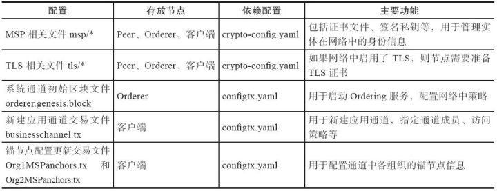

## 准备工作

- docker
- docker-compose
- go语言环境
- git


## 安装流程
1. fabric源码下载

```
## 新建GOPATH目录
mkdir ~/go/src/github.com/hyperledger/

## 进入目录
cd ~/go/src/github.com/hyperledger/

## 克隆代码
git clone https://github.com/hyperledger/fabric.git

## 切换到1.0分支
git checkout -b release-1.0 remotes/origin/release-1.0
```

2. 下载镜像

```
## 进入目录
cd ~/go/src/github.com/hyperledger/examples/e2e_cli/

## 下载镜像
sudo sh ./download-dockerimages.sh -c x86_64-1.0.0 -f x86_64-1.0.0

## 查看镜像
sudo docker iamges
```

3. 运行e2e_cli例子

```
## 进入目录
cd ~/go/src/github.com/hyperledger/examples/e2e_cli/

## 启动
sudo ./network_setup.sh up
```

4. 关闭fabric网络

```
sudo ./network_setup.sh down
```

## 测试网络

以现在安装好的Example02为例，在官方例子中，channel名字是mychannel，链码的名字是mycc。

1. 进入cli容器

```
sudo docker exec -it cli bash
```

2. 查询a账户的余额，可以看到余额是90

```
peer chaincode query -C mychannel -n mycc -c '{"Args":["query","a"]}'
```

3. 把a账户的余额再转20元给b账户，正常会显示200状态码

```
peer chaincode invoke -o orderer.example.com:7050 --tls true --cafile /opt/gopath/src/github.com/hyperledger/fabric/peer/crypto/ordererOrganizations/example.com/orderers/orderer.example.com/msp/tlscacerts/tlsca.example.com-cert.pem -C mychannel -n mycc -c '{"Args":["invoke","a","b","20"]}'
```

4. 再查询一下a账户的余额，应该只剩余70


## network_setup.sh脚本解析

1. 执行./network_setup.sh up时会执行network_setup.sh脚本中的如下方法：

```
function networkUp () {
    if [ -f "./crypto-config" ]; then
      echo "crypto-config directory already exists."
    else
      #Generate all the artifacts that includes org certs, orderer genesis block,
      # channel configuration transaction
      source generateArtifacts.sh $CH_NAME
    fi

    if [ "${IF_COUCHDB}" == "couchdb" ]; then
      CHANNEL_NAME=$CH_NAME TIMEOUT=$CLI_TIMEOUT docker-compose -f $COMPOSE_FILE -f $COMPOSE_FILE_COUCH up -d 2>&1
    else
      CHANNEL_NAME=$CH_NAME TIMEOUT=$CLI_TIMEOUT docker-compose -f $COMPOSE_FILE up -d 2>&1
    fi
    if [ $? -ne 0 ]; then
        echo "ERROR !!!! Unable to pull the images "
        exit 1
    fi
    docker logs -f cli
}
```

2. 先判断./crypto-config目录是否存在，不存在则执行generateArtifacts.sh生成相关配置文件

- MSP相关文件（msp/*）
- TLS相关文件（tls/*）
- 系统通道初始区块（orderer.genesis.block）
- 新建应用通道交易文件（businesschannel.tx）
- 锚节点配置更新交易文件Org1MSPanchors.tx和Org2MSPanchors.tx）

3. 默认不采用couchdb，则通过docker-compose执行docker-compose-cli.yaml，该文件中定义了fabric网络中各个组件容器配置，并挂载2步骤中生成的相关配置文件，docker-compose-cli.yaml文件中又引用了base目录下的文件。


## 配置文件介绍

目前Fabric节点在启动时主要支持通过本地配置文件或环境变量指定配置的方式，同时结合命令行参数。

用户既可以将所有配置提前设置好，写入到本地配置文件供节点使用；也可以在配置文件中仅指定通常情况下的默认值，结合使用环境变量指定的动态方式，实现更为灵活的配置管理。

默认情况下，Fabric节点的主配置路径为FABRIC_CFG_PATH环境变量所指向路径，一般指向到/etc/hyperledger/fabric路径。所有资源在不显式指定配置路径时，会尝试从系统默认的主配置路径下查找与自己相关的配置文件。

Fabric网络在启动之前，需要提前生成一些用于启动的配置文件。各类型文件的功能如下图所示：



以上只是介绍了一下我们需要准备的配置文件。那么，这些文件需要怎么准备呢？

当然不需要我们来手动来建立那么多的配置文件了，我们要做的只需要编写以依赖配置文件，也就是**crypto-config.yaml**和**configtx.yaml**文件。然后利用工具**cryptogen**和**configtxgen**来根据以上两个配置文件，自动生成我们需要的各项配置文件。


> **如何理解文件的命名？**
>
> crypto 的意思是加密。crypto-config,即加密配置。在Fabric中，和加密相关的组件有TLS、MSP等。故crypto-config.yaml文件主要是配置TLS以及MSP等功能。
>
> transaction的英文缩写是TX，表示交易。configtx,表示交易配置。所以和交易相关的配置，如应用通道、锚节点、Ordering服务等，都是在config.tx文件中配置的。
>
> **总结：**
> 在规范的代码开过程中，一般都会对变量以及文件的命令，有一定的要求，以期达到见名之意的效果。所以，在学习一些框架的过程中，我们最好弄懂每个变量以及文件名字的含义，这样可以更好的帮助我们理解和消化知识点。  

#### crypto-config.yaml

crypto-config.yaml是MSP和TLS相关文件的依赖配置文件。该文件的主要作用：

- 指定网络的拓扑结构
- 通过配置模板信息，来定义组织成员对应的结构。
- cryptogen可以快速根据该配置文件自动批量生成所需要的密钥和证书文件。

它的内容主要包括OrdererOrgs以及PeerOrgs两部分，OrdererOrgs的配置如下：

```yaml
OrdererOrgs:
  - Name: Orderer # 节点名称
    Domain: example.com # 节点域名
    Specs:
      - Hostname: orderer # 不带域名的主机名列表
```

PeerOrgs:对于peer节点的组织定义，有两种写法: 

- 一种是利用编辑配置文件中的一组Specs规范条目，每个规范条目由两个字段组成：Hostname和CommonName，如下：

```
PeerOrgs:
  - Name: Org1
    Domain: org1.example.com
    EnableNodeOUs: true
    Specs:
       - Hostname: foo
         CommonName: foo27.org5.example.com 
       - Hostname: bar
       - Hostname: baz
```

Hostname表示组织中节点的主机名称。CommonName是一个可选参数，可以通过重写来指定节点的名称。如果不指定CommonName，则其节点默认的名称为{{.Hostname}}.{{.Domain}},即bar和baz这两个节点文件目录和域名分别为http://bar.org1.example.com和http://baz.org1.example.com。

- 另一种是官方配置文件中的写法，使用模板来定义：

```
- Name: Org2 # 组织名称
    Domain: org2.alibaba.com # 域名
    EnableNodeOUs: true 
    Template: # 模板信息
      Count: 4
    Users:
      Count: 6
```

在该配置文件中，有指定**组织名称**、**域名**和**模板信息**。Template下的Count指的是该组织下组织节点的个数.Users指的是该组织中除了Admin之外的用户的个数。根据上述配置，生成的org2组织下的peer节点证书和user证书文件夹如下：


org2. alibaba. com/peers的目录下，有四个peer节点的配置文件：


org2. alibaba. com/users的目录下，有一个admin用户和6个User用户：


- e2e_cli中的crypto-config.yaml文件内容如下：

```
OrdererOrgs:
  - Name: Orderer
    Domain: example.com
    Specs:
      - Hostname: orderer
PeerOrgs:
  - Name: Org1
    Domain: org1.example.com
    Template:
      Count: 2
    Users:
      Count: 1
  - Name: Org2
    Domain: org2.example.com
    Template:
      Count: 2
    Users:
      Count: 1
```


#### configtx.yaml

该文件的主要作用：

- 配置一系列通道配置模板，包括Orderer系统通道模板和应用通道类型模板；
- 一系列组织结构定义，被其他部分引用。这里的组织结构，要和*crypto-config.yaml*中定义的组织结构一致。因为每一个组织都要靠前者生成一套证书和密钥文件。
- 定义Orderer系统通道相关配置，包括Orderer服务配置和参与Ordering服务的组织信息。
- 定义应用通道相关配置，主要包括参与应用网络的可用组织信息。

在configtx.yaml文件，主要以下个部分组成:

- **Profile:** 不同配置的概要文件可以在这里进行编码，将 Profile参数指定为configtxgen工具的参数。
- **Organizationtions:**定义了不同的组织标志，这些标志将在Profile部分被引用。
- **Orderer:**定义了排序服务的相关参数，这些参数将用于创建创世区块。
- **Application：**该部分定义了交易配置相关的值，以及包含和创世区块相关的值。
- **Channel：**
- **Capabilities：**该部分用户定义Fabric网络的功能。

e2e_cli中的configtx.yaml

```
## &用来建立锚点（defaults），<<表示合并到当前数据，*用来引用锚点。
Profiles:

    TwoOrgsOrdererGenesis:
        Orderer:
            <<: *OrdererDefaults
            Organizations:
                - *OrdererOrg
        Consortiums:
            SampleConsortium:
                Organizations:
                    - *Org1
                    - *Org2
    TwoOrgsChannel:
        Consortium: SampleConsortium
        Application:
            <<: *ApplicationDefaults
            Organizations:
                - *Org1
                - *Org2

## 组织定义，稍后会被引用
Organizations:

    # SampleOrg defines an MSP using the sampleconfig.  It should never be used
    # in production but may be used as a template for other definitions
    - &OrdererOrg
        # DefaultOrg defines the organization which is used in the sampleconfig
        # of the fabric.git development environment
        Name: OrdererOrg

        # ID to load the MSP definition as
        ID: OrdererMSP

        # MSPDir is the filesystem path which contains the MSP configuration
        MSPDir: crypto-config/ordererOrganizations/example.com/msp

    - &Org1
        # DefaultOrg defines the organization which is used in the sampleconfig
        # of the fabric.git development environment
        Name: Org1MSP

        # ID to load the MSP definition as
        ID: Org1MSP

        MSPDir: crypto-config/peerOrganizations/org1.example.com/msp

        AnchorPeers:
            # AnchorPeers defines the location of peers which can be used
            # for cross org gossip communication.  Note, this value is only
            # encoded in the genesis block in the Application section context
            - Host: peer0.org1.example.com
              Port: 7051

    - &Org2
        # DefaultOrg defines the organization which is used in the sampleconfig
        # of the fabric.git development environment
        Name: Org2MSP

        # ID to load the MSP definition as
        ID: Org2MSP

        MSPDir: crypto-config/peerOrganizations/org2.example.com/msp

        AnchorPeers:
            # AnchorPeers defines the location of peers which can be used
            # for cross org gossip communication.  Note, this value is only
            # encoded in the genesis block in the Application section context
            - Host: peer0.org2.example.com
              Port: 7051

## 该部分定义了要编码进配置交易或初始区块的orderer相关参数
Orderer: &OrdererDefaults

    # Orderer Type: The orderer implementation to start
    # Available types are "solo" and "kafka"
    OrdererType: solo

    Addresses:
        - orderer.example.com:7050

    # Batch Timeout: The amount of time to wait before creating a batch
    BatchTimeout: 2s

    # Batch Size: Controls the number of messages batched into a block
    BatchSize:

        # Max Message Count: The maximum number of messages to permit in a batch
        MaxMessageCount: 10

        # Absolute Max Bytes: The absolute maximum number of bytes allowed for
        # the serialized messages in a batch.
        AbsoluteMaxBytes: 98 MB

        # Preferred Max Bytes: The preferred maximum number of bytes allowed for
        # the serialized messages in a batch. A message larger than the preferred
        # max bytes will result in a batch larger than preferred max bytes.
        PreferredMaxBytes: 512 KB

    Kafka:
        # Brokers: A list of Kafka brokers to which the orderer connects
        # NOTE: Use IP:port notation
        Brokers:
            - 127.0.0.1:9092

    # Organizations is the list of orgs which are defined as participants on
    # the orderer side of the network
    Organizations:

## 该部分定义了要编码进配置交易或初始区块的application相关参数
Application: &ApplicationDefaults

    # Organizations is the list of orgs which are defined as participants on
    # the application side of the network
    Organizations:
```

上面的 profile 定义了系统通道和应用通道两种不同类型的通道。系统通道必须定义 Orderer 和 Consortiums 两部分，应用通道必须定义 Application 和 Consortium 两部分。 

如下会生成如下四个文件：

- genesis.block： 系统通道初始区块，用于启动Orderer服务
- channel.tx：新建应用通道交易文件，用于新建应用通道，配置通道成员和访问策略
- Org1MSPanchors.tx和Org2MSPanchors.tx：锚节点配置更新交易文件，用于配置通道中各组织的锚节点配置


## 配置文件生成工具

Fabric中提供了一系列辅助工具，包括

- **cryptogen-**生成组织身份配置

在Fabric网络中，需要通过证书和密钥来管理和鉴别成员身份，经常需要进行证书生成和配置操作。通常这些操作可以使用PKI服务或者OpenSSL工具来手动实现单个证书的签发。

为了提高对负责组织结构和批量证书进行管理的效率，基于Go语言的crypto库，Fabric提供了cryptogen（Crypto Generator）工具。

cryptogen可以快速地根据配置自动批量生成所需要的密钥和证书文件，或者查看配置模板信息，主要实现代码在common/tools/cryptogen包下。

- **configtxgen-**生成通道配置

由于区块链系统自身的分布式特性，对其中配置进行更新和管理是一件很有挑战的任务。一旦出现不同节点之间配置不一致，就可能导致整个网络功能异常。

在Fabric网络中，通过采用配置交易（Configuration Transaction，ConfigTX）这一创新设计来实现对通道相关配置的更新。配置更新操作如果被执行，也要像应用交易一样经过网络中节点的共识确认。

configtxgen（Configuration Transaction Generator）工具是一个很重要的辅助工具，它可以配合cryptogen生成的组织结构身份文件使用，离线生成跟通道有关的配置信息，相关的实现在common/configtx包下。

主要功能有如下三个：

1. 生成启动Orderer需要的初始区块，并支持检查区块内容；
2. 生成创建应用通道需要的配置交易，并支持检查交易内容；
3. 生成锚点Peer的更新配置交易。

默认情况下，configtxgen工具会依次尝试从$FABRIC_CFG_PATH环境变量指定的路径，当前路径和/etc/hyperledger/fabric路径下查找configtx.yaml配置文件并读入，作为默认的配置。环境变量中以CONFIGTX_前缀开头的变量也会被作为配置项。

- **configtxlator**-转换配置

configtxgen工具可以用来生成通道相关的配置交易和系统通道初始区块等并进行简单的查看。但是如果想对这些配置进行修改，就比较困难了，因为无论配置交易文件还是初始区块文件都是二进制格式（严格来说，是Protobuf消息数据结构导出到本地文件），无法直接进行编辑。

configtxlator工具可以将这些配置文件在二进制格式和方便阅读编辑的Json格式之间进行转换，方便用户更新通道的配置。

configtxlator工具自身是个比较简单的RESTful服务程序，启动后默认监听在7059端口。支持通过--hostname=<addr>来指定服务监听地址，通过--port int来指定服务端口。

例如采用如下命令启动configtxlator服务，并且监听在7059端口：

```text
$ configtxlator start --hostname="0.0.0.0" --port 7059
[configtxlator] main -> INFO 001 Serving HTTP requests on 0.0.0.0:7059
```


## 常见问题

> Timeout expired while starting chaincode mycc

用docker images查看chaincode的镜像在，但就是执行超时，删除dev-peer0.org2.example.com-mycc-1.0的image，重新启动


## 参考资料
> - []()
> - []()
