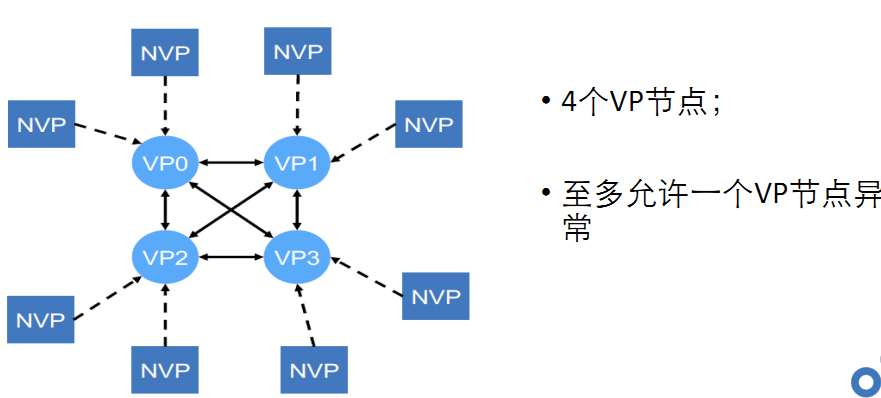
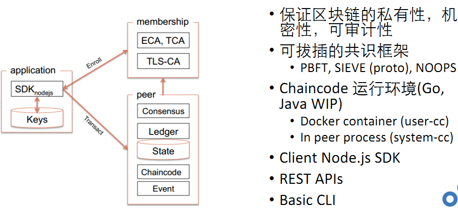
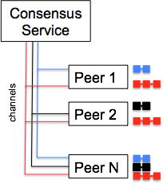

## v0.6特性

- 结构简单：应用-成员管理-Peer的三角形关系，主要业务功能都集中在Peer节点
- 架构问题：由于peer节点承担了太多的功能，所以带来扩展性、可维护性、安全性、业务隔离等方面的诸多问题，所以0.6版本在推出后，并没有大规模被行业使用

- 网络结构

- 运行时架构

## v1.0特性

- 分拆Peer功能：共识服务从Peer中抽离出来，支持可插拔的共识实现，如solo,kafka
- 实现多通道：即包含Peer节点、账本、Order节点的一个逻辑结构，不同通道间数据是隔离的，一个Peer可以加入多个通道

1. peer 1,2和N订阅红色通道，并共同维护红色账本
2. peer 1和N订阅蓝色通道并维护蓝色账本
3. peer 2和peer N在黑色通道上并维护黑色账本

在这个例子中，peer N在订阅了所有通道，我们看到每个通道都有一个相关的账本。 一般来说，我们称不涉及所有peer的账本为子账本，另一种是系统账本，即全账本。

通道和账本的组合是一个虚拟链，因此一个区块链网络可以具有1个共识服务的多个链。 系统通道和全账本构成系统链。 每个区块链网络只有1个系统链。如果交易是公开的，区块链网络可能永远不需要多个链; 所有的交易对所有Peers成员都可见。 然而，在成员间进行私密交易（例如双边合同），单独的链是隔离数据、提供保密的方式。

## v1.1特性

- 增加了Node.js开发Chaincode的支持，原先支持Golang和java开发Chaincode
- 给Chaincode增加了加密套件，这个东西还是比较重要的，方便用户对上链数据进行灵活的加密
- 基于属性的权限控制。简单说就是在Ecert中加入特定的属性，让chaincode可以根据这个属性进行更加丰富的权限控制。
- 新增了GetCreator接口方法用来获取交易发起者的信息，方便进行权限控制。

## v1.2特性

- 隐私数据集合 （ Private Data Collections ）
- 服务发现 （ Service Discovery ）
- 权限控制 （ Access control ）
- 可插拔的背书和验证 （ Pluggable endorsement and validation ）

关于隐私数据集合：

如果在通道上的一群组织中，有几个组织需要将该通道上的数据保持为私有，那么它们可以选择创建一个新通道，仅由需要访问数据的组织组成。然而，在每一种情况下创建单独的通道会产生额外的管理开销(维护链码版本、策略、msp等)，并且，这种方法无法实现，所有加入通道的成员在保持部分数据私密的同时，还能够查看交易。

这就是为什么，从v1.2开始，Fabric提供了创建私有数据集合的能力，它允许定义一个组织子集在通道上支持、提交或查询私有数据，而不需要创建单独的通道。它是在通道成员之间保持数据/事务私密性的一种方法。这种方法可以在不创建通道的情况下，来实现特定组织成员数据之间的共享。

> **关于Private Data的代码层面的定义和使用**，参考：[Private data architecture document](https://link.zhihu.com/?target=https%3A//hyperledger-fabric.readthedocs.io/en/release-1.2/private-data/private-data.html)
> **关于Private Data 的使用案例**，参考 [Private data -Cases](https://link.zhihu.com/?target=https%3A//hyperledger-fabric.readthedocs.io/en/release-1.2/private-data/private-data.html)

关于服务发现：

为了在Peer节点上执行链码，向Order排序节点提交事务，应用程序需要连接到SDK的API。然而，SDK需要收集大量的信息才能使得应用程序连接到相关的网络节点。除了需要通道上的orderers和Peer节点的CA和TLS证书之外，还需要各节点之间的IP地址和端口号。而且，SDK还需要知道通道的相关的支持策略以及哪些对等点安装了chaincode。

在1.2版本之前，这些信息是静态编码的。但是，这个实现并不是动态地对网络变化做出反应。例如添加了安装了链码的Peer节点，或者临时掉线的Peer节点。静态配置也不允许应用程序对背书策略本身的更改做出反应。

此外，Client application 无法知道哪些对等节点更新了总账，哪些没有进行更新。因此，应用程序可能会将提案提交给未进行账本更新的节点，导致事务提交时无效，从而浪费资源。

**发现服务**通过让Peer节点动态地计算所需的信息并以可消耗的方式将其呈现给SDK，从而改进了这个过程。

> 关于 Service Discovery 详细的工作流程可参考：[How service discovery works in Fabric](https://link.zhihu.com/?target=https%3A//hyperledger-fabric.readthedocs.io/en/release-1.2/discovery-overview.html)

## v1.3特性

- 使用Identity Mixer实现MSP：通过使用零知识证明来保持身份匿名和不可链接的方法
- 设置密钥级认可策略：允许每个密钥认可策略覆盖默认的链代码级认可策略
- 使用分页查询CouchDB状态数据库：客户端现在可以从链代码查询中翻阅结果集，从而可以支持具有高性能的大型结果集。
- Chaincode for Developers：作为对Go和node.js编写的链代码的当前Fabric支持的补充，现在支持Java。
- 基于对等通道的事件服务：基于对等通道的事件服务本身并不是新的（它首先在v1.1中首次出现），但v1.3版本标志着旧事件中心的结束。 在升级到v1.3之前，使用旧事件中心的应用程序必须切换到新的基于对等通道的事件服务。

## v1.4特性

- 首个长期支持版本，生产推荐版本
- 核心功能没有变化，主要围绕运维相关，监控管理等
- v1.4.1提供了基于raft共识的raft排序服务

## v2.0特性

- 去中心化的链码治理：新的链码的生命周期中，只有多个组织达成了共识，链码和账本才可以进行交互
- CouchDB中使用了状态数据库缓存来提高性能

废除：

- solo共识过时
- kafka共识过时
- 不支持在通道配置全局指定orderer端点
- 不支持configtxgen命令的 --outputAnchorPeersUpdate参数

## 参考资料

> - 
> - 
