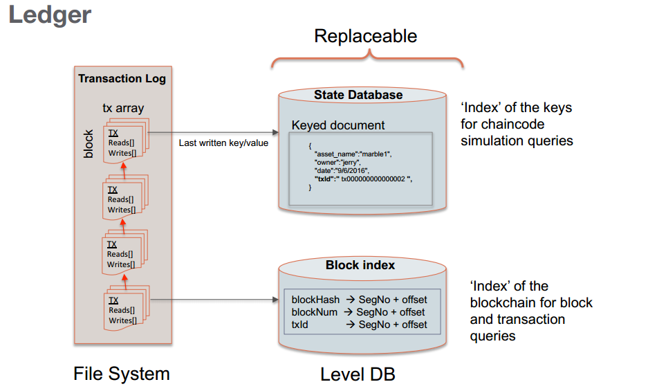
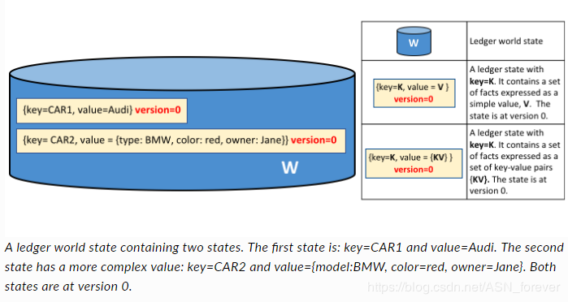
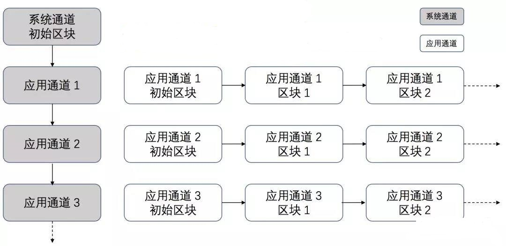

## 账本

账本由**世界状态**和**区块链**两部分组成：

- 世界状态

世界状态存储的是账本当前值，作用是能够快速获取账本最新值，该值还有一个属性版本号，版本号从0开始，每当状态更新时版本号就递增，状态更新时会首先检查版本号，确保当前状态的版本与背书时的版本一致，避免并发更新。

世界状态可以根据区块链推导出来，因此当创建一个peer节点时，此节点会自动生成世界状态。

世界状态存储在数据库中，默认实现为LevelDB，可选替换CouchDB。

- 区块链

区块链是一个交易日志，记录着导致当前世界状态的所有操作（不管交易有没有效，都会记录到区块链中）。

区块链被构造成互连区块的顺序日志，每个区块中包含一系列的交易，每个交易代表着query或update世界状态。

区块链是以文件系统的方式实现的，这与使用数据库实现的世界状态不同。这种设计非常巧妙，因为区块链数据结构严重偏向于一小组简单操作。 附加到区块链的末尾是主要操作，查询当前是一个相对不频繁的操作。

## 区块

区块由三个部分组成，分别是区块头、区块数据和区块元数据

- 区块头

区块头包含三个属性（区块号、当前区块哈希、前一个区块的哈希），当一个区块被创建时写入。

- 区块数据

区块数据包含的是排序后的交易列表。当区块被orderer创建时写入。

- 区块元数据

区块元数据包括区块的写入时间，以及区块写入者的证书、公钥和签名。

## 交易

交易在fabric中指的就是对链码（即智能合约）的操作。

调用交易指的是运行链代码，链代码执行时可能会修改相应的状态，并返回输出。

一个交易主要包含交易头、交易签名、交易提案、交易响应以及一个背书列表5个属性（还有其他不重要的属性）

- 交易头：包含交易的元数据，如链码名称、版本等

- 交易签名：包含由客户端应用程序创建的加密签名，作用是判断交易是否被篡改

- 交易提案：作用是对由应用程序提供给智能合约的输入参数进行编码。当智能合约运行时，提案负责将参数传递过去

- 交易响应：是智能合约的输出，包含的是世界状态在交易前后的值，以读写集的形式展示。

- 背书列表：目前背书是指Peer节点的数字签名

## 交易的完整流程

1. 首先，客户端从CA获取合法的身份证书来加入网络内的应用通道。
2. 然后，将交易的提案发送给配置文件里指定的背书节点，即指定调用链码的方法和参数
3. 背书节点检查交易是否合法，通过则模拟运行链码，只是构造读写集合并不提交到本地账本，然后对结果进行背书签名并返回结果给客户端。
4. 客户端收集到满足背书策略的背书后将结果发给Orderer节点
5. 排序节点为网络中所有合法交易进行全局排序，并将一批排序后的交易组合生成区块结构，然后发给提交节点
6. 提交节点各自验证区块交易并提交到本地账本中，然后广播该最新区块，全网同步数据

其中背书节点和提交节点可以同时由Peer节点担任

在链码实例化时，每个链码都需要ESCC和VSCC关联，如果用户不选择一个，默认的内置逻辑将被隐式选择

- ESCC：背书系统链码，决定如何对提议进行背书
- VSCC：验证系统链码，验证背书签名的正确性

## 通道

通道是两个或多个特定网络成员之间的通信的私有“子网”，用于进行需要数据保密的交易。在Fabric中，建立一个通道相当于建立了一个个子链。它实质是由排序节点划分和管理的私有原子广播通道，排序节点提供Peer节点供订阅的主题，每个主题是一个通道，Peer可以在订阅多个通道，并且只能访问订阅通道上的交易。

一般情况下，一个区块链网络中的子链是按照“**1个通道+ 1个账本+ N个成员** ”的基本组成。每个交易都是和唯一的通道关联的。创建通道是为了限制信息传播的范围，是和某一个账本关联的。

目前通道分为系统通道（System Channel）和应用通道（Application Channel）。排序节点通过系统通道来管理应用通道，用户的交易信息通过应用通道传递。对一般用户来说，通道是指应用通道。系统通道与应用通道的关系如下图所示：

应用通道由排序节点负责管理，同时排序节点还负责排序应用通道中的交易。在应通道中一般包含有若干成员（组织），若两个网络实体的身份证书能够追溯到同一个根CA，则认为这两个实体属于同一组织。此外，应用通道中的每个组织都会有一个或以上的“锚节点”，它负责与其他组织交换共享账本的数据。

- 通道的配置

应用通道账本的首个区块一定是配置区块，也称为初始区块（Genesis Block）。通道的配置信息都被打包到一个区块中，并存放在通道的共享账本中。该区块除了配置信息外不包含其他交易信息，称之为通道的配置区块（Configuration Block）。通道可以使用配置区块来更新配置，因此在账本中每新添加一个配置区块，通道就按照最新配置区块的定义来修改配置，因为这样如果能添加一个区块，说明该通道内成员都同意的。

## MSP的作用

一个**MSP**可以自己定义身份、身份的管理与认证（生成与验证签名）的规则。也就是说，在一个运行的fabric系统网络中有众多的参与者，MSP就是为了管理这些参与者，可以辨识验证哪些人有资格，哪些人没资格，既维护某一个参与者的权限，也维护参与者之间的关系。

一个Fabric区块链网络可以由一个或多个MSPs控制。这提供了成员操作的模块化，以及跨不同成员标准和体系结构的互操作性。

MSP在Fabric中的作用是对用户进行管理。那么，它是怎么实现用户管理与权限认证的呢？

1. 生成相关的证书和签名
2. 在Peer，Orderer等组件的配置文件设置关于msp的相关信息

在实际的操作中如下：

1. 编写crypto-config.yaml配置文件指定网络的拓扑结构和组织结构。
2. cryptogen工具根据crypto-config.yaml文件生成MSP相关的秘钥和证书文件。
3. 编写configtx.yaml，在该文件中为每个网络组件配置MSP相关文件路径位置，该文件中也包含网络拓扑结构和组织结构的定义，需要与crypto-config.yaml中保持一致。
4. configtxgen工具根据configtx.yaml生成系统通道配置，在这个过程中，会生成系统通道的创世纪块。该创世纪块（genesis block）中包含所有MSP的验证元素。
5. 在Peer节点和Order节点配置MSP相关的信息

## 参考资料

> - 
> - 
