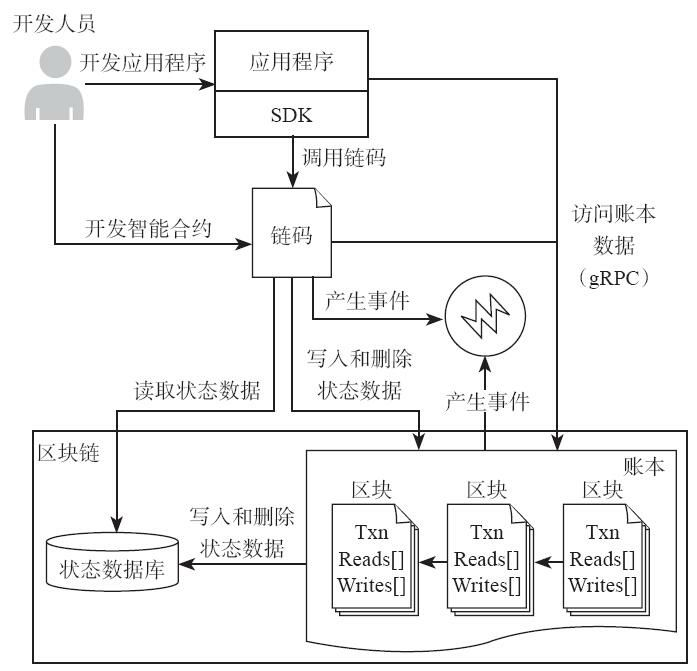

## **应用开发模型**

对于业务开发人员而言，开发工作主要分为应用程序的开发和chaincode的开发。chaincode的开发一般是Go语言，应用程序的开发需要SDK，一般主要有Node.js和Go两种，本文主要介绍Node.js实现的SDK。

在正式开始介绍SDK之前，我们先从程序开发角度来看看各个模块的交互。首先应用程序接收用户的请求，然后可能调用智能合约，也可能直接访问区块链。智能合约在执行的过程中可能对区块链进行操作，并产生事件。Hyperledger Fabric 1.0的应用开发模型如下图所示：

## **SDK的功能**

我们都知道，HyperLedger Fabric 是一个企业级的权限控制区块链系统。我们可以开发应用程序与区块链网络进行交互。SDK提供的API可以实现以下操作：

- 创建通道
- 将一个Peer节点加入到通道中
- 在背书节点中安装ChainCode
- 在通道中实例化ChainCode
- 通过调用智能合约来发起交易
- 查询区块或者交易的账本

## fabric-sdk-node组成

在HyperLedger Node SDK的设计中，将SDK设计成了两个隔离的npm pakages.

- `fabric-client` FabricClient是应用程序的入口模块，提供通道管理、链码管理、数据存储、密码学相关的功能。每个FabricClient实例对应一个区块链的网络，包括记账节点、排序节点等。如果应用程序需要访问多个网络，可以建立多个FabricClient的实例，不同的实例对应不同的网络。
- `fabric-ca-client` FabricCAClient组件允许应用程序让peer节点和应用程序用户在区块链网络上建立可信的身份。它还支持使用交易证书的匿名交易提交。主要提供注册新用户，登记拥有Fabric CA签署的注册证书的用户，注销一个已存在的用户等等。如果目标区块链网络配置为信任锚的标准证书颁发机构，则应用程序不需要使用这个包，因此，这个包是可选的。

在这两个pakages中，由不同的模块组成。

FabricClient模块：FabricClient是应用程序的入口模块，提供通道管理、链码管理、数据存储、密码学相关的功能。每个FabricClient实例对应一个区块链的网络，包括记账节点、排序节点等。如果应用程序需要访问多个网络，可以建立多个FabricClient的实例，不同的实例对应不同的网络。

Config模块：初始化FabricClient的时候需要离线获取配置信息，包括可信的根证书、排序服务节点证书和IP地址、记账节点证书和IP地址等，配置模块Config读取后传递给FabricClient。配置信息是动态传递的，SDK不会持久化存储，应用程序负责维护这些配置信息。

Channel模块：通道是排序服务创建的隔离不同链上交易的实例，加入到不同通道的节点接收到的是不同的交易。通道在配置了排序服务节点和Peer节点后需要初始化，初始化的时候给排序服务节点发送获取配置区块的请求。

Peer模块：Peer节点是发送背书请求、交易查询的节点。Peer实例包含了节点名称、地址、角色、注册证书（ECert）等信息。

Orderer模块：Orderer节点是发送交易进行排序的节点。Orderer实例包含了排序服务节点地址信息，定义了发送原子广播请求和获取区块的接口。

User模块：User代表了已经生成注册证书和签名密钥的实体，注册证书必须是区块链网络信任的CA颁发的证书，只有生成了注册证书的实体才能进行部署链码、提交交易和查询交易等操作。注册证书可以从第三方CA获取，也可以通过fabric-ca模块获取。用户身份（User Identity）和节点身份（Peer Identity）是有区别的。在SDK里面，用户身份能访问私钥信息，是可以进行签名的。而节点身份不能访问私钥，只能验证签名。

KeyValueStore模块：提供给应用程序保存敏感信息的功能，比如用户私钥、证书信息等。

EventHub模块：封装了与Peer节点交互的事件流，接收Peer的各种异步通知事件。

Logger模块：Logger是日志模块，提供了不同的日志接口，基本都是日常开发过程中用到的通用日志模块

## 参考资料

> - 
> - 
