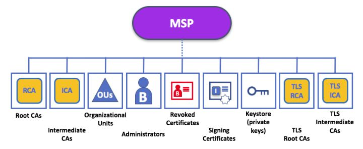

## **基本概念**

MSP是Membership Service Provider的缩写，直译为**成员关系服务提供者**。为了更好的理解MSP，这里首先介绍MSP中的要用到的一些术语。

#### **certificate 证书**

证书（certificate）是Fabric中权限管理的基础。目前采用了基于ECDSA算法的非对称加密算法来生成公钥和私钥，证书格式则采用了X.509的标准规范。

Fabric中采用单独的Fabric CA项目来管理证书的生成。每一个实体、组织都可以拥有自己的身份证书，并且证书也遵循了组织结构，方便基于组织实现灵活的权限管理。

#### **Member 成员**

拥有**网络唯一根证书**的合法独立实体。

在Fabric区块链中，peer节点和app client这样的网络组件实际上就是一个Member。

 #### **Organization 组织**

组织（organization）代表一组**拥有共同信任的根证书**（可以为根CA证书或中间CA证书）的成员。

这些成员由于共享同样的信任根，彼此之间信任度很高，可以相互交换比较敏感的内容。同一个组织的成员节点在网络中可以被认为是同一个身份，代表组织进行签名。组织中成员可以为普通成员角色或者管理员角色，后者拥有更高的权限，可以对组织配置进行修改。

组织一般包括名称、ID、MSP信息、管理策略、认证采用的密码库类型、一组锚点节点位置等信息。通常情况下，多个组织为了进行数据沟通，可以加入到同一个通道中。

#### **Consortium** **联盟**

联盟由若干组织构成的集合，是联盟链场景所独有的结构形式。联盟一般用于多个组织相互合作的场景，例如某联盟中指定需要所有参与方同时对交易背书，才允许在网络中进行执行。

**联盟中的组织成员会使用同一个排序服务**，并且遵循相同的通道创建策略，因为联盟中的某几个成员会因业务需加入一个通道，所以会创建通道。**通道创建策略**可以为ALL、MAJORITY或者ANY（默认值）。通道在创建时也必须指定所绑定的联盟信息。例如，某个联盟内可能定义必须要所有成员都同意才能创建新的通道；或者任何成员都可以自行创建新的通道。

在设置联盟时候，每个组织都需要指定自己的ID信息，该信息必须要跟该组织所关联的MSP ID一致。

## 什么是MSP

成员服务提供者（MSP）是一个提供抽象化成员操作框架的组件。MSP将颁发与校验证书，以及用户认证背后的所有密码学机制与协议都抽象了出来。

一个**MSP**可以自己定义身份、身份的管理与认证（生成与验证签名）的规则。也就是说，在一个运行的fabric系统网络中有众多的参与者，MSP就是为了管理这些参与者，可以辨识验证哪些人有资格，哪些人没资格，既维护某一个参与者的权限，也维护参与者之间的关系。

一个Fabric区块链网络可以由一个或多个MSPs控制。这提供了成员操作的模块化，以及跨不同成员标准和体系结构的互操作性。

## MSP结构

基于MSP可以实现对不同资源进行基于身份证书的权限验证。

一个资源实体的MSP结构中往往包括**签名和验证算法**，以及一组符合X.509格式的证书，这些证书最后都需要追溯到同一个信任的根。

Fabric中MSP相关**实现代码**都在msp目录下，目前采用了bccspmsp结构来代表一个成员身份结构，并且采用了MSPConfig（主要是其成员FabricMSPConfig）结构来代表跟该实体相关的证书信息。

MSP中各实体资源的证书**必须被证书信任树上的叶子节点签名**。中间层签名的证书会被认为是非法实体证书。

以下是一个MSP结构中常见的组成部分：

- **一组信任的根证书**，是整个组织证书信任的基础，根证书可以签发中间层证书；
- **MSP的管理员的身份证书，**管理员可以对MSP中证书进行管理；
- **组织单元（Organizational Unit）列表（**可选）；
- **一组信任的中间证书，**中间证书由根证书签发（可选）；
- **证书撤销列表，**代表被吊销的证书名单（可选）。

#### **Root CAs | 根证书列表**

此文件夹包含，由此MSP代表的组织信任的Root CA，自签名X.509证书列表。此MSP文件夹中必须至少有一个Root CA X.509证书。这是最重要的文件夹，因为它标识了所有其它证书。

####  **Intermediate CAs | 中间证书列表**

此文件夹包含此组织信任的Intermediate CA的X.509证书列表。每个证书都必须由MSP中的一个Root CA签署，或者由 Intermediate CA 签署。

Intermediate CA可以表示组织的不同细分或组织本身（例如，如果商业CA用于组织的身份管理）。在前一种情况下，可以使用CA层次结构中，较低的其他Intermediate CA来表示组织细分。请注意，可能有一个没有任何中间CA的功能网络，在这种情况下，此文件夹将为空。

与Root CA文件夹一样，此文件夹定义了中间证书。只有拥有了这些证书，才能被系统视为组织成员的CA。

####  **Organizational Units (OUs) | 组织单元列表**

可选的

####  **Administrators | 管理员身份证书**

该文件夹包含一个身份列表，用于定义具有该组织管理员角色的参与者。对于标准MSP类型，此列表中应该有一个或多个X.509证书。

####  **Revoked Certificates | 撤销证书列表**

可选的

####  **KeyStore for Private Key | 私钥库**

该文件夹为peer 或 orderer节点（或客户端的local MSP）的local MSP定义，并包含节点的signing key（签名密钥）。 此密钥用于**签署数据**，作为认可阶段的一部分。

该文件夹对Local MSP是必须的，并且必须包含一个私钥。 很明显，访问这个文件夹，只能由，对此peer有管理权限的用户。

Channel MSP的配置不包括此部分，因为Channel MSP旨在提供纯粹的身份验证功能，而不是签署能力。

#### **TLS Root CA | TLS根证书列表**

此文件夹包含，此组织为TLS通信所信任的Root CA的自签名X.509证书列表。 **TLS通信的一个例子是，peer需要连接到orderer以便它可以接收ledger更新。**

MSP TLS信息涉及网络内的节点，即对peers 和 the orderers，此文件夹中必须至少有一个TLS Root CA X.509证书。

#### **TLS Intermediate CA | TLS中间证书**

此文件夹包含由此MSP代表的，组织信任的用于TLS通信的Intermediate CA证书列表。当商业CA用于组织的TLS证书时，此文件夹特别有用。 它是可选的。

## **MSP实践**

MSP在Fabric中的作用是对用户进行管理。那么，它是怎么实现用户管理与权限认证的呢？

1. 生成相关的证书和签名
2. 在Peer，Orderer等组件的配置文件设置关于msp的相关信息

在实际的操作中如下：

1. 编写crypto-config.yaml配置文件指定网络的拓扑结构和组织结构。
2. cryptogen工具生成秘钥和证书文件，快速地根据配置自动批量生成所需要的密钥和证书文件。
3. 编写依赖配置文件configtx.yaml，该文件包含网络的定义，并给出了网络组件的每个网络实体的加密配置的存储位置。
4. configtxgen工具生成通道配置，在这个过程中，会生成系统channel的创世纪块。该创世纪块（genesis block）中包含所有MSP的验证元素。回忆一下，MSP验证元素有MSP身份标识（MSP identifier），root CAs，intermediate CAs，admin CAs，OU List，CRLs。
>
> \5. **在Peer节点和Order节点配置MSP相关的信息**。

## 参考资料

> - 
> - 
