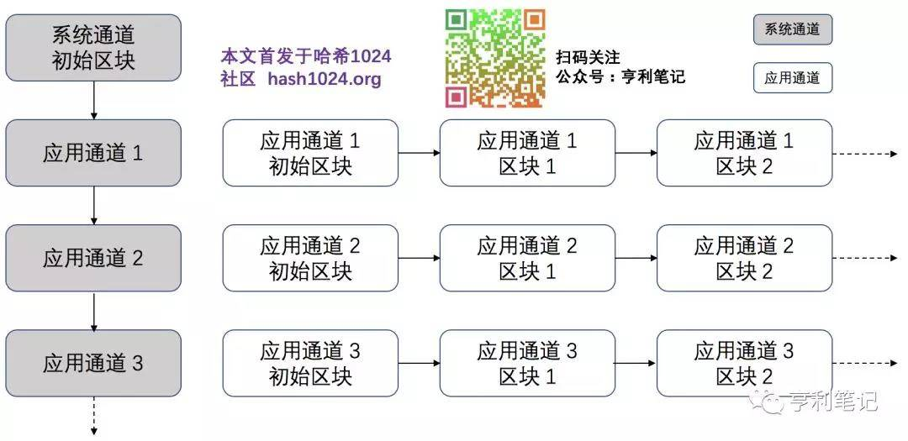

通道是Fabric中非常重要的概念，它实质是由排序节点划分和管理的私有原子广播通道，目的是对通道的信息进行隔离，使得通道外的实体无法访问通道内的信息，从而实现交易的隐私性。

目前通道分为系统通道（System Channel）和应用通道（Application Channel）。排序节点通过系统通道来管理应用通道，用户的交易信息通过应用通道传递。对一般用户来说，通道是指应用通道。系统通道与应用通道的关系如图10-5所示：

应用通道由排序节点负责管理，同时排序节点还负责排序应用通道中的交易。在应通道中一般包含有若干成员（组织），若两个网络实体的身份证书能够追溯到同一个根CA，则认为这两个实体属于同一组织。此外，应用通道中的每个组织都会有一个或以上的“锚节点”，它负责与其他组织交换共享账本的数据。

## 通道的配置

通道的配置信息都被打包到一个区块中，并存放在通道的共享账本中。该区块除了配置信息外不包含其他交易信息，称之为通道的配置区块（Configuration Block）。通道可以使用配置区块来更新配置，因此在账本中每新添加一个配置区块，通道就按照最新配置区块的定义来修改配置，因为这样如果能添加一个区块，说明该通道内成员都同意的。通道账本的首个区块一定是配置区块，也称为初始区块（Genesis Block）。

## 使用多通道

命令行下peer channel 支持包括create、fetch、join、list、update等子命令。各个命令的功能如下所示：

- create：创建一个新的应用通道
- join：将本Peer节点加入到某个应用通道中
- list：列出本Peer已加入的所有的应用通道
- fetch：从Ordering服务获取指定应用通道的配置区块
- update：更新通道的配置信息，如锚节点配置

可以通过peer channel <subcommand> --help来查看具体的命令使用说明。

#### 创建通道

## 参考资料
> - 
> - 
