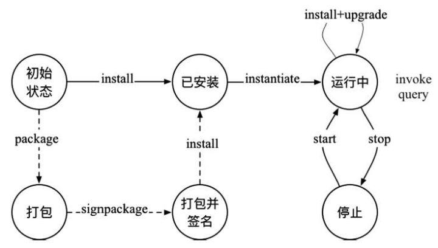

链上代码，简称链码，分为用户链码和系统链码。

链码被部署在Fabric网络节点上，运行在隔离沙盒中，目前是Docker容器中，并通过gRPC协议与相应的Peer节点进行交互，以操作分布式帐本中的数据。

启动Fabric网络后，可以通过命令或SDK进行链码操作，验证网络运行是正常。


## 用户链码

用户链码对应用开发者来说十分重要，它提供了基于区块链分布式账本的状态处理逻辑，基于它可以开发出多种复杂的应用。在超级账本Fabric项目中，用户可以使用Go语言来开发链码，未来还将支持包括Java、JavaScript在内的多种高级语言。

用户链码相关的代码都在core/chaincode路径下。其中core/chaincode/shim包中的代码主要是供链码容器侧调用使用，其他代码主要是Peer侧使用。系统链码

负责Fabric节点自身的处理逻辑, 包括系统配置、背书、校验等工作，系统链码仅支持Go语言, 在Peer节点启动时会自动完成注册和部署，系统链码共有五种类型:

#### 配置系统链码(CSCC)
CSCC: Configuration System Chaincode

负责账本和链的配置管理

#### 背书管理系统链码(ESCC)
ESCC: Endorsement System Chaincode

负责背书(签名)过程, 并可以支持对背书策略进行管理，对传入的链码提案的模拟运行结果进行签名, 之后创建响应消息返回给客户端

#### 生命周期系统链码(LSCC)
LSCC: Lifecycle System Chaincode

负责对用户链码的生命周期进行管理

链码生命周期包括安装、部署、升级、权限管理、获取信息等环节.

#### 查询系统链码(QSCC)
QSCC: Query System Chaincode

负责提供账本和链的信息查询功能

#### 验证系统链码(VSCC)
VSCC: Verification System Chaincode

交易提交前根据背书策略进行检查

验证过程:

1. 首先解析出交易结构, 并对交易结构格式进行校验
2. 检查交易的读集合中元素版本跟本地账本中版本一致
3. 检查带有合法的背书信息(主要是检查签名信息)
4. 通过则返回正确, 否则返回错误消息

## 链码生命周期

管理Chaincode的生命周期四个命令：安装(install), 实例化(instantiate), 升级(upgrade), 打包(package), 签名未来还会支持stop和start命令, 来禁用和重新启用链代码。

链代码成功安装和实例化后，链代码处于活动状态（正在运行），可通过invoke命令调用处理事务链代码可以在安装后随时升级。



#### 打包链码-package

在区块链中，将链码安装到Peer节点，与我们安装普通程序不一样。Fabric对链码的安装有严格的验证和安全机制。

安装好的链码，谁有资格实例化？

又该使用什么样的背书策略来调用ChainCode呢？

这一切，都需要在安装之前，将它们规定好。我们把这些附加信息+ChainCode源码统称为ChainCode包。

一般而言，ChainCode包由以下三个部分组成：

- chaincode本身，其由`ChaincodeDeploymentSpec`（Chaincode部署规范）来定义。ChaincodeDeploymentSpec，以下简称**CDS**。CDS是根据代码及一些其他属性（名称，版本等）来定义chaincode。
- 一个可选的实例化策略，该策略可被 **背书策略** 描述。
- 一组表示chaincode**所有权的签名**。

打包的过程，就是将这三部分信息打包成一个整体。一般来说，打包chaincode有两种方式：

1. 当你想要让chaincode有多个所有者的时候，此时就需要让chaincode包被多个所有者签名。这种情况下需要我们创建一个被签名的chaincode包（`SignedCDS`），这个包依次被每个所有者签名。

2. 让chaincode有一个所有者的时候，此时只要被一个人签名即可。

要创建一个签名过的chaincode包，请用下面的指令：

```
peer chaincode package -n mycc -p github.com/hyperledger/fabric/examples/chaincode/go/chaincode_example02 -v 0 -s -S -i "AND('OrgA.admin')" ccpack.out
```

选项说明：

- `-s`：选项创建了一个可被多个所有者签名的包，而非简单地创建一个CDS。如果使用`-s`，那么当其他所有者要签名的时候，`-s`也必须同时使用。否则，该过程将创建一个仅包含实例化策略的签名chaincode包（**SignedCDS**）。
- `-S`选项可以使在`core.yaml`文件中被`localMspid`相关属性值定义好的MSP对包进行签名。该选项是可选的。不过，如果我们创建了一个没有签名的包，那么它就不能被任何其他所有者用`signpackage`指令进行签名。
- `-i`选项也是可选的，它允许我们为chaincode指定实例化策略。实例化策略与背书策略格式相同，它指明谁可以实例化chaincode。


  #### 签名并打包-signpackage 

一个在创建时就被签名的chaincode包可以交给其他所有者进行检查与签名。具体的工作流程支持通道外对chaincode包签名。

**ChaincodeDeploymentSpec** 可以选择被全部所有者签名并创建一个 **SignedChaincodeDeploymentSpec**（SignedCDS），SignedCDS包含三个部分：

- CDS包含chaincode的源码、名称与版本
- 一个chaincode实例化策略，其表示为背书策略
- chaincode所有者的列表，由Endorsement定义

一个chaincode所有者可以对一个之前创建好的带签名的包进行签名，具体使用如下指令：

```text
peer chaincode signpackage ccpack.out signedccpack.out
```

指令说明：

- 指令中的`ccpack.out`和`signedccpack.out`分别是输入与输出包。
- `signedccpack.out`则包含一个用本地MSP对包进行的附加签名。

#### 安装链码-install

install的过程会将chaincode的源码以一种被称ChaincodeDeploymentSpec（CDS）的规定格式打包，并把它安装在一个将要运行该chaincode的peer节点上。在Fabric网络中，我们需要在一个channel上每一个要运行你chaincode的背书节点上安装你的chaincode。

Chaincode应该仅仅被安装于chaincode所有者的背书节点上，以使该chaincode逻辑对整个网络的其他成员保密。其他没有chaincode的成员将无权成为chaincode影响下的交易的认证节点（endorser）。对于认证节点来说，他们不能执行chaincode。不过，他们仍可以验证交易并提交到账本上。

使用CLI安装一个存放在sacc目录下的chaincode时，命令如下

```text
peer chaincode install -n asset_mgmt -v 1.0 -p sacc
```

选项说明：

- -n：name 对链码命名
- -v: version 指定chaincode的版本
- -p: path 指明chainCode的路径

在CLI内部会为sacc创建SignedChaincodeDeploymentSpec，并将其发送到本地peer节点。这些节点会调用LSCC上的`Install`方法。

peer节点解析后一般会保存在$CORE_PEER_FILESYSTEMPATH/chaincodes目录下。

安装链码只需要与Peer交互。

#### 实例化链码-instantiate

instantiate命令通过构造生命周期管理系统链码（LSCC）的交易，将安装过的链码在指定通道上进行实例化调用，在节点上创建容器启动，并执行初始化操作。实例化链码需要同时跟Peer和Order打交道。

执行instantiate命令的用户身份必须满足实例化的策略，并且在所指定的通道上拥有写权限。可通过-P参数指定链码的背书策略，不满足背书策略的链码调用将在Commit阶段被作废。

使用CLI去实例化 名为mycc 的chaincode，指令具体如下：

```
peer chaincode instantiate -n mycc -v 1.0 -c '{"Args":["john","0"]}' -P "OR ('Org1.member','Org2.member')"
```

选项说明：

- -n 实例化链码的名称
- -c --ctor，链码的具体执行参数，为json格式
- -P --Policy 指定实例化策略


#### 升级链码-upgrade

当需要修复链码漏洞或进行功能拓展时，可以对链码进行升级，部署新版本的链码。支持在保留现有状态的前提下对链码进行升级。

一段chaincode可以通过更改它的版本（SignedCDS的一部分）来随时进行更新。至于SignedCDS的其他部分，比如所有者及实例化策略，都是可选的。不过，chaincode的名称必须一致，否则它会被当做完全不同的另一段chaincode。

在升级之前，chaincode的新版本必须**安装**在需要它的背书节点上。升级是一个类似于实例化交易的交易，它会将新版本的chaincode与channel绑定。其他与旧版本绑定的channel则仍旧运行旧版本的chaincode。换句话说，升级交易只会一次影响一个提交它的channel。


#### 停止与启动链码-stop&star

注意，停止与启动生命周期交易的功能还没实现。不过，你可以通过移除chaincode容器以及从每个背书节点删除SignedCDS包来停止chaincode。具体而言，就是删除所有主机或虚拟机上peer节点运行于其中的chaincode的容器，随后从每个背书节点删除SignedCDS。

#### 调用链码

通过invoke命令可以调用运行中的链码的方法。“-c”参数指定的函数名和参数会被传入到链码的Invoke()方法进行处理。调用链码操作需要同时跟Peer和Order打交道。


#### 查询链码

查询链码可以通过query命令进行。执行过程与invoke命令类似，实际上同样是将-c指定的命令参数发送经链码中的Invoke()方法执行。与invoke操作的区别在于，query操作只能查询Peer上账本状态，不生成交易，也不需要与Order打交道。


## 多次安装，一次实例化

ChainCode要在区块链网络中运行，需要经过**链码安装**和**链码实例化**两个步骤，其中需要多次安装，只用一次实例化，在一个区块链子链中，该网络是由“1账本+1通道+N个peer节点”组成。如果我们要手动来搭建Fabric网络的话，即通过命令行的形式来进行ChainCode的安装与实例化。也就是说，对于整个Fabric网络来说，假设有X个背书节点，那么，我们需要给每个背书节点安装ChainCode，但是在整个网络搭建过程中只需要instance ChainCode一次。因为install 针对的是背书节点，instance 针对的是通道。

install 链码的对象是背书节点，主要目的是方便背书节点对运行链码，对交易进行模拟。
instance 链码的对象是channel，主要目的是为了将安装过的链码在指定通道上进行实例化调用，在节点上创建容器启动，并执行初始化操作。实例化的过程中，需要指定背书策略，来确定通道上哪些节点执行的交易才能添加到账本中。

安装的过程其实就是对指定的代码进行编译打包，并把打包好的文件发送到Peer，等待接下来的实例化。其实，这就是我们接下来要讲解的**链码的生命周期**这一部分。

实例化链上代码主要是在Peer所在的机器上对前面安装好的链上代码进行包装，生成对应Channel的Docker镜像和Docker容器。并且**在实例化时我们可以指定背书策略**。ChainCode运行在一个受保护的Docker容器当中，与背书节点的运行互相隔离，可通过应用提交的交易对账本状态初始化并进行管理。


## 链码运行流程

在Fabric中交易的处理过程，客户端将提案首先发送到背书节点，背书节点检提案的合法性。如果合法的话，背书节点将通过交易所属的链码临时执行一个交易，并执行背书节点在本地持有的状态副本。

**Chaincode**应该**仅仅被安装于chaincode所有者的背书节点上**，链码运行在节点上的沙盒（Docker容器）中，并通过gRPC协议与相应的Peer节点进行交互，以使该chaincode逻辑对整个网络的其他成员保密。

请务必在一条channel上每一个要运行你chaincode的**背书节点**上安装你的chaincode，其他没有chaincode的成员将无权成为chaincode影响下的交易的背书节点。也就是说，他们不能执行chaincode。不过，他们仍可以验证交易并提交到账本上。

## 参考资料
> - []()
> - []()
