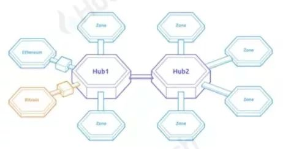
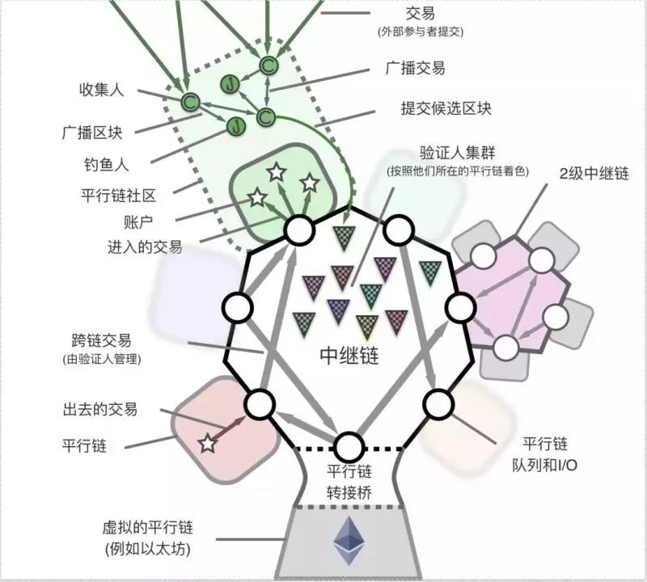

如果说区块链的发展，每年评选一个年度币种的话

- 2009-2016 毫无疑问[比特币](http://www.btb8.com/btc/)
- 2017 - [以太坊](http://www.btb8.com/eth/)？
- 2018 - [EOS](http://www.btb8.com/eos/)？
- 2019 - Cosmos？ or Polkadot？

2019这两个名字相信无需多说，老铁们都知道是干嘛的。区块链历经十年发展，终于来到了“万链互联”关卡的起始阶段，而这一关的两位重要NPC，无疑是**Cosmos**与**Polkadot**。

换句话说，除非你是信奉“万链归一”理论的投资者，否则，你不可能绕过这两个项目，去谈区块链的未来。它们，即未来。

市面上论述两个项目跨链技术实现的文章已经有很多，所以笔者不打算再次累赘，这篇文章，我更多会从两者的**核心特点**，**开发者角度**，**投资者****角度**三个维度，来跟你讲讲两者到底有什么不同。究竟，一山可否容二虎？

## 核心特点角度对比

在说到核心技术特点之前，你首先要知道，跨链这个概念意味着什么，为什么Polkadot和Cosmos是里面真正的全明星选手。跨链的概念其实早几年前就有，包括[BTC](http://www.btb8.com/btc/)上的闪电网络，[ETH](http://www.btb8.com/eth/)上的侧链，还有一些所谓的“跨链”项目，都可以算作跨链。但这种跨链，更多是通过双向锚定，或是原子交换，来进行资产的跨链，换句话说，这种跨链，一是功能简单，二是更多局限于“现有链之间互相跨”。**而这么多年过去，大家却发现，有DAPP的链，无非ETH，EOS，TRON三条，真正可以算作“资产”的链，无非比特门罗，就这么几条链，真的需要互相跨来跨去么**？

而下一个阶段的跨链，也就是Cosmos和Polkadot引领的“万链互联”时代，所谓的跨链，更多的是“发链”。还记得Gavin Wood在Web 3峰会上，15分钟从无到有构建出一条新的区块链的“神奇壮举”么？

Cosmos的造链工具叫做Cosmos SDK，Polkadot叫做Substrate，两者都给与开发者“快速造链”的能力，通过这些协议生成的链，天然可以互通，同时，两个项目也提供了给予现有公有链接入的方法。

好了，说完背景，说正事，两个的核心技术特点，有什么不一样。

## **1. 架构** 

Cosmos：更简洁 

Polkadot：更复杂

从两者的结构图上便一眼可以看得出：

这个是Cosmos的 - 简单明了，一个Hub就是一条链，其他接入的Zone为此Hub侧链，HUB之间可以互联 。**最近挺火的项目IRIS就是一个Cosmos的一个HUB**。

这个是Polkadot的，结构是星型， 中心是 Polkadot R[ELA](http://www.btb8.com/ela/)y 中继链，外围是众多Parachain 平行链，网络上有Validator 验证人、Nominator 提名人、Collator 收集人或者核对人，Fisherman 钓鱼人等诸多角色

## **2. 安全**

Cosmos - 更像联合国

Polkadot - 更像北约

Cosmos简洁的代价是安全性略有下降，毕竟鱼与熊掌不可兼得。如果中心Hub与区域Zone各是不同国家，那么每个国家都有自己的军队与主权来维护安全。

安全性最高的肯定能是Cosmos HUB，毕竟在所有HUB里，Cosmos原生代币ATOM的市值一定会最高，基于POS Staking的安全模型，**当然是市值越大，攻击成本越高，也就越安全**。其他各个Hub安全性各不相同。

Polkadot则是类似北约，统一分配军事力量和部署，中心Relaychain与区域Parachain的军事力量（验证人节点）统一由Polkadot系统随机挑选并分配。话句话说，**Polkadot主网安全，所有链接进来的平行链便都是安全的**。

## 　　**3. 自主性与灵活性**

Cosmos - 更像安卓

Polkadot - 更像苹果

自主性与灵活性，其实就是结构与安全性不同所导致的最终结果。

Cosmos接入门槛更低，正如在安卓上开发一样，只要使用他的IBC标准，随时可以接入Hub下载，但安全性自负。这也是为什么安卓上程序更多，病毒也更多的原因。

Polkadot接入门槛更高，除了使用他的Substrate开发之外，**2020年，中继链的平行链接入插槽据说只有24个，要拍卖，可谓狼多肉少**，当然，安全性什么的你也不必操心。正如IOS上的Apple [STO](http://www.btb8.com/s/sto/)re，东西没有安卓商店多，但每一款都可以放心使用。

## 开发者角度

其实，比拼跨链技术，重要，也不重要。因为决定区块链未来的，不是所谓的资本巨鲸，更不是你我这些散户，甚至也不是cosmos或是Polkadot这样的项目方。**真正的决定力量，是来自世界各地的区块链开发者**，只有他们开发出普通人“真正能用”的链或是DAPP来，区块链才算是真的改造世界，迎向未来。

过去十年，真正落地的项目，**严格意义来讲， 只有BTC一个**。未来十年，才是“区块链”这个概念，真正开花结果的十年。那么现如今一切公链竞争的本质，其实都是在抢夺开发者，而非用户。

如果你是一个开发者，打算做一款爆款DAPP，那么综合成本最低，最容易推广，效用最大化的选择会是谁呢？

其实很简单，如果你是一个打算入驻电商的商家，在中国，你首先会考虑的平台，一定是淘宝，京东，拼多多这三家。

而区块链的世界，在2019年之后，开发者首选的平台，则一定是以太坊，Cosmos，Polkadot这三条链。原因很简单：

1. 以太坊拥有当前最强的开发者社区，同时拥有巨大的先发优势，Solidity已经成为区块链入门的普及语言，拥有庞大的生态。而劣势同样明显，当前性能的巨大瓶颈，以及最终版本“宁静（Serenity）”的遥遥无期，而且非常可怕的一点是，ETH2.0能做到的事，Polkadot基本上都可以做到。
2. Cosmos在三者里拥有最佳的时间优势，而且原本这个优势可以更大一点（Cosmos的主网原定于2017年底上线，后来一直推迟到2019年），虽然推迟了近两年之久，但Cosmos仍然是第一个主网上线的跨链明星。在Polkadot主网上线之前以及ETH2.0最终成型之前，Cosmos也许会是新项目开发人员的最佳选择，没有之一。币安Dex选择基于Cosmos开发，就是一个最好的范例。
3. Polkadot主网还未上线，但Gavin利用Substrate 15分钟构建一条链的视频让人印象太过深刻，加上Gavin Wood本人的巨大声誉，Polkadot上线之后，开发者蜂拥而至，项目竞争24个平行链插槽的火热场面相信不难看到。

Polkadot的开发成本应该相对Cosmos更高，但同样，安全性和互操作性也更好。正如苹果与安卓各有各的用户，也各有各的开发群体，本质上并不冲突。ETH，Cosmos，Polkadot不出意外，也会在某一天相互连通。所以一山容二三虎的局面，还是极有可能的！

## 投资人角度

前段时间Cosmos主网上线，笔者隔三差五的便会被朋友问到，“3美金的Atom能不能接啊，毕竟30倍了已经……”，“雾草，5美金了！50倍！**好纠结！到底要不要上车啊**！”

在笔者撰写此文之时，Cosmos代币通证Atom的[价格](http://www.btb8.com/analysis/)是4美金，排名17位，市值7亿美金。这也符合全明星币种的一贯特性，上交易所，则直接空降前20。那么问题来了，当前的价格和排名，投资潜力如何？是否已然潜力释放殆尽，只剩接盘了呢？

**这取决于你投资，或者说投机的时间！**

如果是按天或者周来，那么近期来说，除非大盘暴涨，否则近期再次飙升的可能性不大，在主网刚刚上线，生态还未建立之时，当前的市值与排名，实在是不低。然而若是以月甚至年来看，如果你坚信万链互联是区块链下一阶段的必然趋势的话，开始定投Cosmos会是很不错的选择。要相信一个词 - 强者恒强！不要被当前几十倍或是几亿的市值所吓倒，看看莱特，以太，EOS，这些不同时期区块链代表作的项目，便知道，Cosmos的未来，前十可期。

再来看Polkadot，如果没猜错的话，Polkadot上线，**应该可以直接空降前15**。毕竟，很多人并不认识Cosmos的创始人，而Polkadot创始人的名气，在圈内几乎仅次于[中本聪](http://www.btb8.com/celebrity/1809/12901.html)与[V神](http://www.btb8.com/celebrity/1809/12902.html)  - 以太坊前CTO，以太坊黄皮书作者，Solidity发明人之一，Parity客户端发明人，Web 3基金会创始人兼总裁，Polkadot创始人……太多耀眼的光环加身，更过分的是：Gavin还帅的没边……

Polkadot几乎是唯一一个还未上市，便获得了资本共识，精英共识，与韭菜共识三大共识于一身的项目，第一轮2017年爱西欧成本30美金，近期第二轮估值一百美金，而在Tokok交易所上的期货价格更是高达300美金。**如果按照第二轮价格来看，单价100美金，总量1000万颗，全部解锁的话10亿市值，正好和当前第14名的达世，市值持平**。

如果Cosmos维持在4-5美金，也就是8-10美金市值这个区间，那么polkadot第二轮的价格100美金，其实也并不贵，依旧有着不错的向上空间。毕竟也是未来几乎必然跻身前十的币种，而如果拿Cosmos来做参考，**笔者个人观点，Polkadot市值应该保持高出Cosmos2-3倍**。原因如下：

1. Cosmos 当前能够实现跨链通证转移，而 Polkadot 的设计是实现任意形式的 DApp 互操作，所以但就功能上来讲，Polkadot的更为强大，当然这个强大也同时存在开发成本高以及架构更复杂的代价。

2. 刚才说了，**Polkadot的创始人有光环加成**，这个加成，通常会直接体现在币价上。

3. Cosmos代币Atom的功能，在Stake之后，只能实现Cosmos HUB自我安全，并不能对其他HUB做出安全贡献。而Polkadot的代币DOT，却是负责所有接入中继链的平行链的安全，所以即便两者功能，创始人光环，开发者生态全部类似，这种安全模型的设计区别，也导致DOT的市值“必须”要高于Atom才行。

4. Polkadot上线的时间是19年底，如果不出意外，19年底的[行情](http://www.btb8.com/analysis/)应该比现在要好很多，毕竟2020-2021年牛市几乎是目前所有人的共识，所以在未来几个月，[加密货币](http://www.btb8.com/token/)整体市值翻一倍，应该不是难事，届时，无论是ATOM，还是DOT，应该都不是当前的价格。

你也许会问我，其他的跨链项目能投么？这个问题我很难回答，我只能说，短期来看，也许一些小市值的跨链项目短期的投资回报率会更高，但长远来看，最头部的明星选手，才是最安全，最长远的。看看13年到19年区块链排行榜上那些消失的，和依旧存活的币种，你就知道我在说什么。

还有一点，不要忘记，Cosmos和Polkadot的出现，对于当前，包括未来，所有还没有形成生态的底层公链和跨链项目，也许会是毁灭性的“降维打击”，不信？让我们明年，拭目以待……

## 参考资料

> - 
> - 
