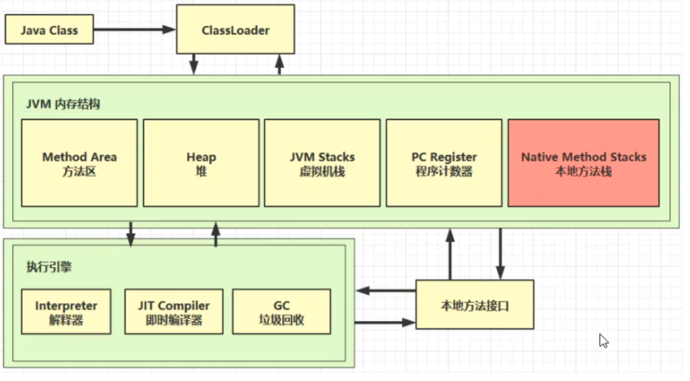
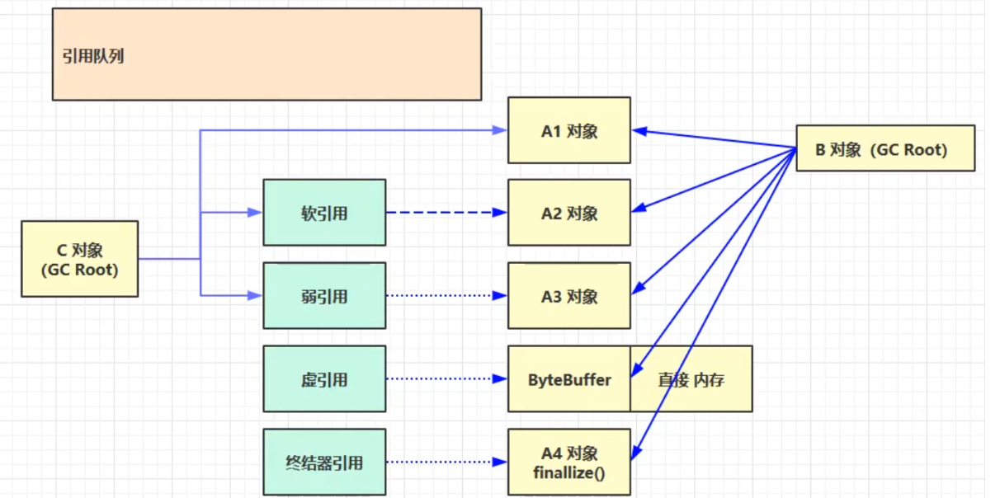
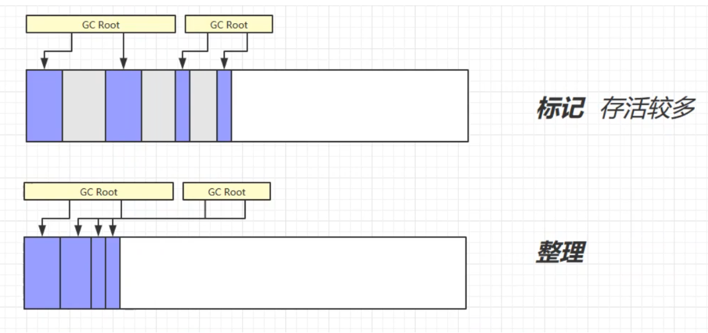
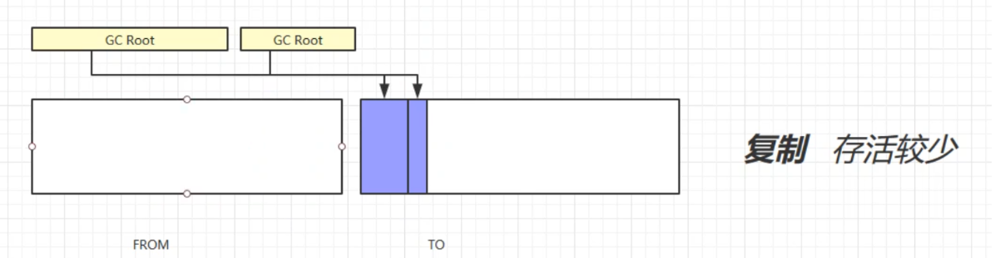
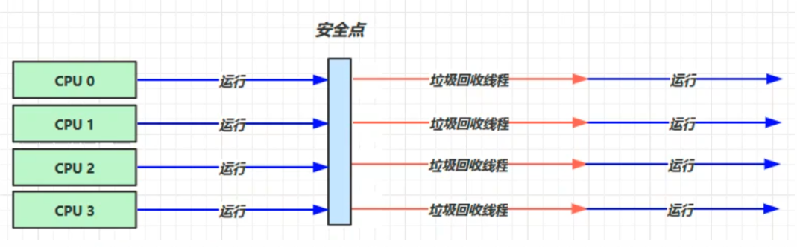
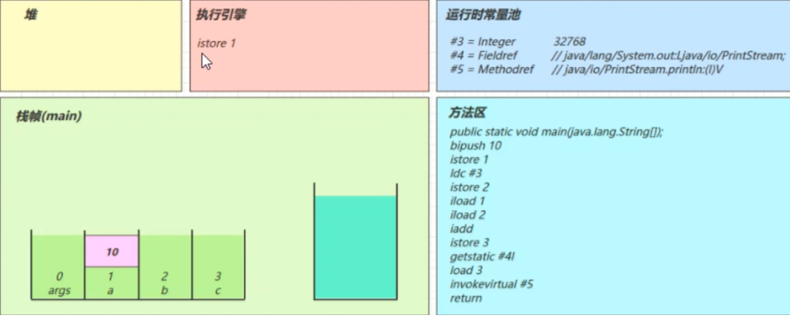
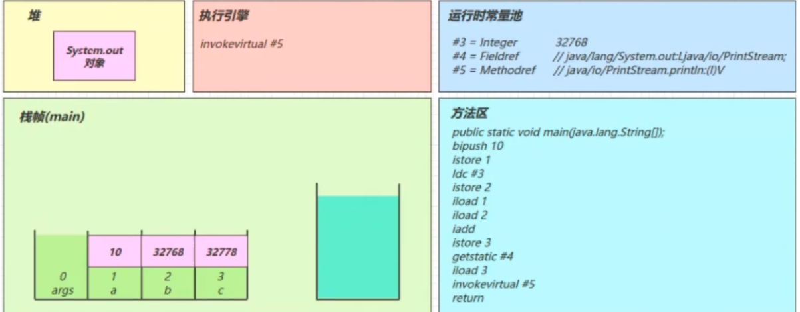

JVM, 全称Java Virtual Machine, 是Java程序的运行环境，相比其他语言有如下好处：
- 一次编写，到处运行，实现了跨平台
- 自动内存管理，垃圾回收机制
- 数组下标越界检查，像C/C++等数组越界会直接破坏越界内存地址的数据

JVM JRE JDK的区别：


## 内存结构


### 程序计数器
作用：用于保存JVM中下一条所要执行的指令的地址，线程私有的，即每个线程都会有一个，因为CPU会为每个线程分配时间片，当当前线程的时间片使用完以后，CPU就会去执行另一个线程中的代码，当另一个线程的时间片用完，又返回来执行当前线程的代码时，通过程序计数器可以知道继续执行哪一句指令

是唯一个在JVM规范中没有规定内存溢出的。

### 虚拟机栈
栈帧: Java程序从Main方法开始单线程中顺序执行，同时伴随着方法的调用，执行到每个方法内时，它们都有自己的环境，这样的每个方法环境称为栈帧。

虚拟机栈内存用来以栈的数据结构存储栈帧，每调用一个方法会发生一次栈帧的入栈，方法执行完毕，该栈帧出栈。方法的调用链可能会很深，但总是只有栈顶的栈帧处于执行状态，称为当前栈帧，该栈帧关联的方法称为当前方法，执行引擎执行的字节码指令只对当前栈帧执行操作。每个栈帧中包含方法局部变量表，操作数栈，动态链接，返回地址。编译时，方法内的局部变量及操作都已确定，所以当进入调用到该方法时，栈帧中的局部变量表的大小，操作数栈的大小都能确定，进而栈帧的大小也能确定。

每开启一个新线程，会伴随分配一块虚拟机栈内存，用来执行该线程的代码，所以它是每个线程一份。

栈内存溢出：Java.lang.stackOverflowError 

### 本地方法栈
JVM中用来调用本地原生Native方法时分配使用的栈内存。因为JAVA有时候没法直接和操作系统底层交互，所以需要用到本地方法去调用本地的C或者C++方法。

HotSpot虚拟机之间将该内存区域和Java栈合并。

### 堆内存
- JVM内存中最大的一块
- 通过new关键字创建的对象都会被放在堆内存
- 所有线程共享
- 堆内存中的对象都需要考虑线程安全问题
- 有垃圾回收机制，根据垃圾收集器的实现不同，又会细分为，新生代区、老生代区、永久代区
- 堆内存溢出：java.lang.OutofMemoryError

### 方法区/非堆内存/永久代
* 类字节码：运行Java程序时，会加载类的class字节码文件到内存中，会存储在这个区。
* 常量，如：字符串常量
* 类的静态成员变量
* 编译器编译后的类的方法的定义代码

JDK8,改名叫 Native Memory, 即Metaspace空间

> 常见问题

垃圾回收是否涉及栈内存？ 不需要。因为虚拟机栈中是由一个个栈帧组成的，在方法执行完毕后，对应的栈帧就会被弹出栈。所以无需通过垃圾回收机制去回收内存。
栈内存的分配越大越好吗？不是。因为物理内存是一定的，栈内存越大，可以支持更多的递归调用，但是可执行的线程数就会越少。
方法内的局部变量是否是线程安全的？如果方法内局部变量没有逃离方法的作用范围，则是线程安全的。如果如果局部变量引用了对象，并逃离了方法的作用范围，则需要考虑线程安全问题

## 垃圾回收
1. 如何判断对象可以回收
2. 垃圾回收算法
3. 分代垃圾回收
4. 垃圾回收器
5. 垃圾回收调优

JVM中，程序计数器、虚拟机栈、本地方法栈都是跟随着线程的生命周期，随着线程的结束，内存会被自动回收，而栈帧也是随着方法的调用进入和结束，内存同时也被回收。但堆内存和方法区内存是动态分配和使用的，所以垃圾收集主要处理JVM堆内存和方法区。

### 如何判断对象可以回收
引用计数法: 对象每被引用一次，引用计数加一，引用释放减一，为0时，即没有变量引用它，则会被回收。会存在循环引用问题，即循环引用时，两个对象的计数都为1，导致两个对象都无法被释放

可达性分析算法:  扫描堆中的对象，看能否沿着GC Root对象为起点的引用链找到该对象，如果找不到，则表示可以回收

可以作为GC Root的对象:
- 虚拟机栈（栈帧中的本地变量表）中引用的对象。　
- 方法区中类静态属性引用的对象
- 方法区中常量引用的对象
- 本地方法栈中JNI（即一般说的Native方法）引用的对象

### 查看GC Root对象
内存分析工具：http://www.eclipse.org/mat/

```
public class TestGCRoot {
    public static void main(String[] args) throws Exception {
        List<String> list = new ArrayList<>();
        list.add("a");
        list.add("b");
        System.out.println(1);
        System.in.read();

        list = null;
        System.out.println(2);
        System.in.read();
        System.out.println("end...");
    }
}
```

1. 运行上面代码，会停在第一个read()处
2. 用jmap抓取内存快照1：jmap -dump:format=b,live,file=1.bin pid,  pid值可用jps获取，参数可用jmap -help查看帮助说明
3. 输入任意字符，使代码运行到第二个read()处
4. 用jmap抓取内存快照2：jmap -dump:format=b,live,file=2.bin pid
5. 下载并运行mat内存分析工具，然后加载内存快照1.bin和2.bin
6. 打开GC Root视图查看：Open Query Browser -> Java Basic -> GC Roots

## 五种引用


如上图所示：
- GC Root对象C直接引用A1对象、软引用对象、弱引用对象
- GC Root对象B直接引用A1对象、A2对象、A3对象、ByteBuffer、A4对象
- 软引用对象引用A2对象
- 弱引用对象引用A3对象

引用可以理解为引用对象的值是被引用对象的地址
注意，这些引用对象也都是对象，所以也需要被回收， 引用对象的回收要通过引用队列

### 强引用
只有GC Root都不引用该对象时，才会回收强引用对象

如上图B、C对象都不引用A1对象时，A1对象才会被回收

配置最大堆内存20M，运行如下代码，即使报内存溢出，也不能回收强引用对象内存，因为list作为一个GC Root引用了4个bytes数组。
```
/**
  * -Xmx20m -XX:+PrintGCDetails -verbose:gc
  **/
public class Demo2_3 {

    private static final int _4MB = 4 * 1024 * 1024;

    public static void main(String[] args) throws IOException {
        List<byte[]> list = new ArrayList<>();
        for (int i = 0; i < 5; i++) {
            list.add(new byte[_4MB]);
        }

        System.in.read();
    }
}
```

### 软引用
当GC Root指向软引用对象时，在内存不足时，会回收软引用所引用的对象

如上图如果B对象不再引用A2对象且内存不足时，软引用所引用的A2对象就会被回收，但软引用本身不会被清理，如果想要清理软引用，需要使用引用队列。

如下代码引用链为：list --> SoftReference --> byte数组，当内存不足时，byte数组内存会被回收，而不会报内存溢出。通过查看运行结果可知部分byte数组为null。

应用场景：byte数组为从网络获得的图片字节流，可能占用内存较大，内存不足时可回收，然后可重新获取，不致于导致内存溢出报错。
```
/**
 * 演示软引用
 * -Xmx20m -XX:+PrintGCDetails -verbose:gc
 */
public class Demo2_3 {

    private static final int _4MB = 4 * 1024 * 1024;

    public static void main(String[] args) throws IOException {
        // list --> SoftReference --> byte[]

        List<SoftReference<byte[]>> list = new ArrayList<>();
        for (int i = 0; i < 5; i++) {
            SoftReference<byte[]> ref = new SoftReference<>(new byte[_4MB]);
            System.out.println(ref.get());
            list.add(ref);
            System.out.println(list.size());
        }
        
        System.out.println("循环结束：" + list.size());
        for (SoftReference<byte[]> ref : list) {
            System.out.println(ref.get());
        }
    }
}
```

软引用所引用的对象被回收时，软引用本身不会被清理，如果想要清理软引用，需要在创建软引用对象时，给其关联一个引用队列
然后查看引用队列中有无软引用，如果有，则将该软引用从存放它的集合中移除（这里为一个list集合）
```
/**
 * 演示软引用, 配合引用队列
 */
public class Demo2_4 {
    private static final int _4MB = 4 * 1024 * 1024;

    public static void main(String[] args) {
        List<SoftReference<byte[]>> list = new ArrayList<>();

        // 引用队列
        ReferenceQueue<byte[]> queue = new ReferenceQueue<>();

        for (int i = 0; i < 5; i++) {
            // 关联了引用队列， 当软引用所关联的 byte[]被回收时，软引用自己会加入到 queue 中去
            SoftReference<byte[]> ref = new SoftReference<>(new byte[_4MB], queue);
            System.out.println(ref.get());
            list.add(ref);
            System.out.println(list.size());
        }

        // 从队列中获取无用的 软引用对象，并移除
        Reference<? extends byte[]> poll = queue.poll();
        while( poll != null) {
            list.remove(poll);
            poll = queue.poll();
        }

        System.out.println("===========================");
        for (SoftReference<byte[]> reference : list) {
            System.out.println(reference.get());
        }

    }
}
```

### 弱引用
只有弱引用引用该对象时，在垃圾回收时，无论内存是否充足，都会回收弱引用所引用的对象

如上图如果B对象不再引用A3对象，在垃圾回收时，则A3对象会被回收

另外，也需要通过引用队列回收弱引用对象。
```
/**
 * 演示弱引用
 * -Xmx20m -XX:+PrintGCDetails -verbose:gc
 */
public class Demo2_5 {
    private static final int _4MB = 4 * 1024 * 1024;

    public static void main(String[] args) {
        //  list --> WeakReference --> byte[]
        List<WeakReference<byte[]>> list = new ArrayList<>();
        for (int i = 0; i < 10; i++) {
            WeakReference<byte[]> ref = new WeakReference<>(new byte[_4MB]);
            list.add(ref);
            for (WeakReference<byte[]> w : list) {
                System.out.print(w.get()+" ");
            }
            System.out.println();

        }
        System.out.println("循环结束：" + list.size());
    }
}
```

### 虚引用
当虚引用对象所引用的对象被回收以后，虚引用对象就会被放入引用队列中，调用虚引用的方法

虚引用的一个体现是释放直接内存所分配的内存，当它引用的对象ByteBuffer被垃圾回收以后，虚引用对象Cleaner就会被放入引用队列中，然后调用Cleaner的clean方法来释放直接内存

如上图，B对象不再引用ByteBuffer对象，ByteBuffer就会被回收。但是直接内存中的内存还未被回收。这时需要将虚引用对象Cleaner放入引用队列中，然后调用它的clean方法来释放直接内存

### 终结器引用
所有的类都继承自Object类，Object类有一个finalize方法。当某个对象不再被其他的对象所引用时，会先将终结器引用对象放入引用队列中，然后根据终结器引用对象找到它所引用的对象，然后调用该对象的finalize方法。调用以后，该对象就可以被垃圾回收了

如上图，B对象不再引用A4对象。这是终结器对象就会被放入引用队列中，引用队列会根据它，找到它所引用的对象。然后调用被引用对象的finalize方法。调用以后，该对象就可以被垃圾回收了

### 引用队列
软引用和弱引用可以配合引用队列： 在弱引用和软引用所引用的对象被回收以后，会将这些引用放入引用队列中，方便一起回收这些软/弱引用对象

虚引用和终结器引用必须配合引用队列：虚引用和终结器引用在使用时会关联一个引用队列

## 垃圾回收算法

### 标记清除MarkSweep
定义：标记清除算法顾名思义，是指在虚拟机执行垃圾回收的过程中，先采用标记算法确定可回收对象，然后垃圾收集器根据标识清除相应的内容，给堆内存腾出相应的空间

PS: 这里的腾出内存空间并不是将内存空间的字节清0，而是记录下这段内存的起始结束地址，下次分配内存的时候，会直接覆盖这段内存

缺点：容易产生大量的内存碎片，可能无法满足大对象的内存分配，一旦导致无法分配对象，那就会导致jvm启动gc，一旦启动gc，我们的应用程序就会暂停，这就导致应用的响应速度变慢


### 标记整理MarkCompact
会将不被GC Root引用的对象回收，清除其占用的内存空间。然后整理剩余的对象，可以有效避免因内存碎片而导致的问题，但是因为整体需要消耗一定的时间，所以效率较低



### 复制Copy
将内存分为等大小的两个区域，FROM和TO（TO中为空）。先将被GC Root引用的对象（即存活的对象）从FROM放入TO中，再回收不被GC Root引用的对象。然后交换FROM和TO。这样也可以避免内存碎片的问题，但是只会利用一半内存空间。





## 分代垃圾回收


- 对象首先分配在伊甸园区域
- 新生代空间不足时，触发 minor gc，伊甸园和 from 存活的对象使用 copy 复制到 to 中，存活的对象年龄加 1并且交换 from to
- minor gc 会引发 stop the world，暂停其它用户的线程，等垃圾回收结束，用户线程才恢复运行
- 当对象寿命超过阈值时，会晋升至老年代，最大寿命是15（4bit）
- 当老年代空间不足，会先尝试触发 minor gc，如果之后空间仍不足，那么触发 full gc，STW的时间更长

大对象处理策略：当遇到一个较大的对象时，就算新生代的伊甸园为空，也无法容纳该对象时，会将该对象直接晋升为老年代

线程内存溢出：某个线程的内存溢出了而抛异常（out of memory），不会让其他的线程结束运行，这是因为当一个线程抛出OOM异常后，它所占据的内存资源会全部被释放掉，从而不会影响其他线程的运行，进程依然正常

## 垃圾回收器
目前主要分三类：串行、吞吐量优先、响应时间优先。

垃圾回收的参数配置文档，注意下有些在JDK8中有效的，可能在JDK16中被标为过时：
- JDK16: https://docs.oracle.com/en/java/javase/16/docs/specs/man/java.html#advanced-garbage-collection-options-for-java
- JDK8: https://docs.oracle.com/javase/8/docs/technotes/tools/unix/java.html#BABFAFAE

### 串行
单线程，堆内存较小，适合个人电脑，因为是串行的，所以只有一个垃圾回收线程，且在该线程执行回收工作时，其他线程进入阻塞状态


安全点：让其他线程都在这个点停下来，以免垃圾回收时移动对象地址，使得其他线程找不到被移动的对象

Serial 收集器：Serial收集器是最基本的、发展历史最悠久的收集器
特点：单线程、简单高效（与其他收集器的单线程相比），采用复制算法。对于限定单个CPU的环境来说，Serial收集器由于没有线程交互的开销，专心做垃圾收集自然可以获得最高的单线程手机效率。收集器进行垃圾回收时，必须暂停其他所有的工作线程，直到它结束（Stop The World）

ParNew 收集器：ParNew收集器其实就是Serial收集器的多线程版本
特点：多线程、ParNew收集器默认开启的收集线程数与CPU的数量相同，在CPU非常多的环境中，可以使用-XX:ParallelGCThreads参数来限制垃圾收集的线程数。和Serial收集器一样存在Stop The World问题

Serial Old 收集器：Serial Old是Serial收集器的老年代版本
特点：同样是单线程收集器，采用标记-整理算法

-XX:+UseSerialGC 配置该参数相当于 Serial + SerialOld

### 吞吐量优先
多线程，堆内存较大，多核 cpu，让单位时间内，STW 的时间最短，垃圾回收时间占比最低，这样就称吞吐量高


Parallel Scavenge 收集器：与吞吐量关系密切，故也称为吞吐量优先收集器
特点：属于新生代收集器也是采用复制算法的收集器（用到了新生代的幸存区），又是并行的多线程收集器（与ParNew收集器类似）

该收集器的目标是达到一个可控制的吞吐量。还有一个值得关注的点是：GC自适应调节策略（与ParNew收集器最重要的一个区别）
GC自适应调节策略：Parallel Scavenge收集器可设置-XX:+UseAdaptiveSizePolicy参数。当开关打开时不需要手动指定新生代的大小（-Xmn）、Eden与Survivor区的比例（-XX:SurvivorRatio）、晋升老年代的对象年龄（-XX:MaxTenuringThreshold）等，虚拟机会根据系统的运行状况收集性能监控信息，动态设置这些参数以提供最优的停顿时间和最高的吞吐量，这种调节方式称为GC的自适应调节策略。
- -XX:MaxGCPauseMillis=500: GC最大停顿时间，这是一个软参数，JVM会尽力去实现，单位是毫秒，此例期望停顿时间为500毫秒
- 

Parallel Old 收集器：是Parallel Scavenge收集器的老年代版本
特点：多线程，采用标记-整理算法（老年代没有幸存区）

-XX:+UseParallelGC 配置表示启用Parallel Scavenge 收集器，文档中有说明如果该配置启用-XX:+UseParallelOldGC自动启用，即Parallel Old 收集器启用，二者配合使用

### 响应时间优先
多线程，堆内存较大，多核 cpu，尽可能让单次 STW 的时间最短


CMS 收集器：Concurrent Mark Sweep，一种以获取最短回收停顿时间为目标的老年代收集器
特点：基于标记-清除算法实现。并发收集、低停顿，但是会产生内存碎片
应用场景：适用于注重服务的响应速度，希望系统停顿时间最短，给用户带来更好的体验等场景下。如web程序、b/s服务

CMS收集器的运行过程分为下列4步：
- 初始标记：标记GC Roots能直接到的对象。速度很快但是仍存在Stop The World问题
- 并发标记：进行GC Roots Tracing 的过程，找出存活对象且用户线程可并发执行
- 重新标记：为了修正并发标记期间因用户程序继续运行而导致标记产生变动的那一部分对象的标记记录。仍然存在Stop The World问题
- 并发清除：对标记的对象进行清除回收

CMS收集器的内存回收过程是与用户线程一起并发执行的

### G1/Garbage First
2004 论文发布
2009 JDK 6u14 体验
2012 JDK 7u4 官方支持
2017 JDK 9 默认

适用场景： 同时注重吞吐量（Throughput）和低延迟（Low latency），默认的暂停目标是 200 ms

实现：超大堆内存，会将堆划分为多个大小相等的 Region，整体上是 标记+整理 算法，两个区域之间是 复制 算法

## GC调优
一个Java程序的调优领域有如下，GC只是其中一个：
- 内存
- 锁竞争
- CPU占用
- IO
- GC

GC调优从以下几个方面考虑

1. 确定目标: 低延迟 or 高吞吐量？ 选择合适的垃圾收集器
2. 最快的GC是不发生GC：首先排除减少因为自身编写的代码而引发的内存问题
3. 新生代调优
4. 幸存区调优：幸存区需要能够保存 当前活跃对象+需要晋升的对象，晋升阈值配置得当，让长时间存活的对象尽快晋升
5. 老年代调优

## 类加载和字节码
1. 类文件结构
2. 字节码指令
3. 编译期处理
4. 类加载阶段
5. 类加载器
6. 运行期优化


## 类文件结构
JVM规范文档的对类文件结构的定义: https://docs.oracle.com/javase/specs/jvms/se8/html/jvms-4.html

下面以一个简单的 HelloWorld.java 示例解析类文件结构
```
public class HelloWorld { 
    public static void main(String[] args) { 
        System.out.println("hello world"); 
    } 
}
```
执行 javac -parameters -d . HellowWorld.java, 编译为 HelloWorld.class 后，以16进制查看是这个样子的：
```
[root@localhost ~]# od -t xC HelloWorld.class
0000000 ca fe ba be 00 00 00 34 00 23 0a 00 06 00 15 09 
0000020 00 16 00 17 08 00 18 0a 00 19 00 1a 07 00 1b 07 
0000040 00 1c 01 00 06 3c 69 6e 69 74 3e 01 00 03 28 29 
0000060 56 01 00 04 43 6f 64 65 01 00 0f 4c 69 6e 65 4e 
0000100 75 6d 62 65 72 54 61 62 6c 65 01 00 12 4c 6f 63 
0000120 61 6c 56 61 72 69 61 62 6c 65 54 61 62 6c 65 01 
0000140 00 04 74 68 69 73 01 00 1d 4c 63 6e 2f 69 74 63 
0000160 61 73 74 2f 6a 76 6d 2f 74 35 2f 48 65 6c 6c 6f 
0000200 57 6f 72 6c 64 3b 01 00 04 6d 61 69 6e 01 00 16 
0000220 28 5b 4c 6a 61 76 61 2f 6c 61 6e 67 2f 53 74 72 
0000240 69 6e 67 3b 29 56 01 00 04 61 72 67 73 01 00 13 
0000260 5b 4c 6a 61 76 61 2f 6c 61 6e 67 2f 53 74 72 69 
0000300 6e 67 3b 01 00 10 4d 65 74 68 6f 64 50 61 72 61 
0000320 6d 65 74 65 72 73 01 00 0a 53 6f 75 72 63 65 46 
0000340 69 6c 65 01 00 0f 48 65 6c 6c 6f 57 6f 72 6c 64
0000360 2e 6a 61 76 61 0c 00 07 00 08 07 00 1d 0c 00 1e 
0000400 00 1f 01 00 0b 68 65 6c 6c 6f 20 77 6f 72 6c 64 
0000420 07 00 20 0c 00 21 00 22 01 00 1b 63 6e 2f 69 74 
0000440 63 61 73 74 2f 6a 76 6d 2f 74 35 2f 48 65 6c 6c 
0000460 6f 57 6f 72 6c 64 01 00 10 6a 61 76 61 2f 6c 61 
0000500 6e 67 2f 4f 62 6a 65 63 74 01 00 10 6a 61 76 61 
0000520 2f 6c 61 6e 67 2f 53 79 73 74 65 6d 01 00 03 6f 
0000540 75 74 01 00 15 4c 6a 61 76 61 2f 69 6f 2f 50 72 
0000560 69 6e 74 53 74 72 65 61 6d 3b 01 00 13 6a 61 76 
0000600 61 2f 69 6f 2f 50 72 69 6e 74 53 74 72 65 61 6d 
0000620 01 00 07 70 72 69 6e 74 6c 6e 01 00 15 28 4c 6a 
0000640 61 76 61 2f 6c 61 6e 67 2f 53 74 72 69 6e 67 3b 
0000660 29 56 00 21 00 05 00 06 00 00 00 00 00 02 00 01 
0000700 00 07 00 08 00 01 00 09 00 00 00 2f 00 01 00 01 
0000720 00 00 00 05 2a b7 00 01 b1 00 00 00 02 00 0a 00 
0000740 00 00 06 00 01 00 00 00 04 00 0b 00 00 00 0c 00 
0000760 01 00 00 00 05 00 0c 00 0d 00 00 00 09 00 0e 00 
0001000 0f 00 02 00 09 00 00 00 37 00 02 00 01 00 00 00 
0001020 09 b2 00 02 12 03 b6 00 04 b1 00 00 00 02 00 0a 
0001040 00 00 00 0a 00 02 00 00 00 06 00 08 00 07 00 0b 
0001060 00 00 00 0c 00 01 00 00 00 09 00 10 00 11 00 00 
0001100 00 12 00 00 00 05 01 00 10 00 00 00 01 00 13 00 
0001120 00 00 02 00 14
```
根据 JVM 规范，类文件结构如下
```
u4             magic
u2             minor_version;    
u2             major_version;    
u2             constant_pool_count;    
cp_info        constant_pool[constant_pool_count-1];    
u2             access_flags;    
u2             this_class;    
u2             super_class;   
u2             interfaces_count;    
u2             interfaces[interfaces_count];   
u2             fields_count;    
field_info     fields[fields_count];   
u2             methods_count;    
method_info    methods[methods_count];    
u2             attributes_count;    
attribute_info attributes[attributes_count];
```

魔数：u4 magic, 对应字节码文件的0~3个字节
0000000 <ca fe ba be> 00 00 00 34 00 23 0a 00 06 00 15 09

版本: u2 minor_version; u2 major_version; 如下34H = 52，代表JDK8
0000000 ca fe ba be <00 00 00 34> 00 23 0a 00 06 00 15 09

### 常量池
8-9 字节，表示常量池长度，00 23 （十进制数值为35） 表示常量池有 #1~#34项，注意 #0 项不计入，也没有值
0000000 ca fe ba be 00 00 00 34 <00 23> 0a 00 06 00 15 09

查看常量池中数据项的类型：https://docs.oracle.com/javase/specs/jvms/se8/html/jvms-4.html#jvms-4.4

第#1项 0a 表示一个 Method 信息，00 06 和 00 15（21） 表示它引用了常量池中 #6 和 #21 项来获得这个方法的【所属类】和【方法名】
0000000 ca fe ba be 00 00 00 34 00 23 <0a> <00 06 00 15> 09

第#2项 09 表示一个 Field 信息，00 16（22）和 00 17（23） 表示它引用了常量池中 #22 和 # 23 项来获得这个成员变量的【所属类】和【成员变量名】
0000000 ca fe ba be 00 00 00 34 00 23 0a 00 06 00 15 <09>
0000020 <00 16 00 17> 08 00 18 0a 00 19 00 1a 07 00 1b 07

第#3项 08 表示一个字符串常量名称，00 18（24）表示它引用了常量池中 #24 项
0000020 00 16 00 17 <08> <00 18> 0a 00 19 00 1a 07 00 1b 07

第#4项 0a 表示一个 Method 信息，00 19（25） 和 00 1a（26） 表示它引用了常量池中 #25 和 #26项来获得这个方法的【所属类】和【方法名】
0000020 00 16 00 17 08 00 18 0a 00 19 00 1a 07 00 1b 07

第#5项 07 表示一个 Class 信息，00 1b（27） 表示它引用了常量池中 #27 项
0000020 00 16 00 17 08 00 18 0a 00 19 00 1a 07 00 1b 07

第#6项 07 表示一个 Class 信息，00 1c（28） 表示它引用了常量池中 #28 项
0000020 00 16 00 17 08 00 18 0a 00 19 00 1a 07 00 1b 07
0000040 00 1c 01 00 06 3c 69 6e 69 74 3e 01 00 03 28 29

第#7项 01 表示一个 utf8 串，00 06 表示长度，3c 69 6e 69 74 3e 是【 \<init\> 】,可查看ASCII表,如\<对应十六进制为3c
0000040 00 1c 01 00 06 3c 69 6e 69 74 3e 01 00 03 28 29

第#8项 01 表示一个 utf8 串，00 03 表示长度，28 29 56 是【()V】其实就是表示无参、无返回值
0000040 00 1c 01 00 06 3c 69 6e 69 74 3e 01 00 03 28 29
0000060 56 01 00 04 43 6f 64 65 01 00 0f 4c 69 6e 65 4e

第#9项 01 表示一个 utf8 串，00 04 表示长度，43 6f 64 65 是【Code】
0000060 56 01 00 04 43 6f 64 65 01 00 0f 4c 69 6e 65 4e

第#10项 01 表示一个 utf8 串，00 0f（15） 表示长度，4c 69 6e 65 4e 75 6d 62 65 72 54 61 62 6c 65是【LineNumberTable】
0000060 56 01 00 04 43 6f 64 65 01 00 0f 4c 69 6e 65 4e
0000100 75 6d 62 65 72 54 61 62 6c 65 01 00 12 4c 6f 63

第#11项 01 表示一个 utf8 串，00 12（18） 表示长度，4c 6f 63 61 6c 56 61 72 69 61 62 6c 65 54 61 62 6c 65是【LocalVariableTable】
0000100 75 6d 62 65 72 54 61 62 6c 65 01 00 12 4c 6f 63
0000120 61 6c 56 61 72 69 61 62 6c 65 54 61 62 6c 65 01

第#12项 01 表示一个 utf8 串，00 04 表示长度，74 68 69 73 是【this】
0000120 61 6c 56 61 72 69 61 62 6c 65 54 61 62 6c 65 01
0000140 00 04 74 68 69 73 01 00 1d 4c 63 6e 2f 69 74 63

第#13项 01 表示一个 utf8 串，00 1d（29） 表示长度，是【Lcn/itcast/jvm/t5/HelloWorld;】
0000140 00 04 74 68 69 73 01 00 1d 4c 63 6e 2f 69 74 63
0000160 61 73 74 2f 6a 76 6d 2f 74 35 2f 48 65 6c 6c 6f
0000200 57 6f 72 6c 64 3b 01 00 04 6d 61 69 6e 01 00 16

第#14项 01 表示一个 utf8 串，00 04 表示长度，74 68 69 73 是【main】
0000200 57 6f 72 6c 64 3b 01 00 04 6d 61 69 6e 01 00 16

第#15项 01 表示一个 utf8 串，00 16（22） 表示长度，是【([Ljava/lang/String;)V】其实就是参数为字符串数组，无返回值
0000200 57 6f 72 6c 64 3b 01 00 04 6d 61 69 6e 01 00 16
0000220 28 5b 4c 6a 61 76 61 2f 6c 61 6e 67 2f 53 74 72
0000240 69 6e 67 3b 29 56 01 00 04 61 72 67 73 01 00 13

第#16项 01 表示一个 utf8 串，00 04 表示长度，是【args】
0000240 69 6e 67 3b 29 56 01 00 04 61 72 67 73 01 00 13

第#17项 01 表示一个 utf8 串，00 13（19） 表示长度，是【[Ljava/lang/String;】
0000240 69 6e 67 3b 29 56 01 00 04 61 72 67 73 01 00 13 0000260 5b 4c 6a 61 76 61 2f 6c 61 6e
67 2f 53 74 72 69 0000300 6e 67 3b 01 00 10 4d 65 74 68 6f 64 50 61 72 61

第#18项 01 表示一个 utf8 串，00 10（16） 表示长度，是【MethodParameters】
0000300 6e 67 3b 01 00 10 4d 65 74 68 6f 64 50 61 72 61
0000320 6d 65 74 65 72 73 01 00 0a 53 6f 75 72 63 65 46

第#19项 01 表示一个 utf8 串，00 0a（10） 表示长度，是【SourceFile】
0000320 6d 65 74 65 72 73 01 00 0a 53 6f 75 72 63 65 46
0000340 69 6c 65 01 00 0f 48 65 6c 6c 6f 57 6f 72 6c 64

第#20项 01 表示一个 utf8 串，00 0f（15） 表示长度，是【HelloWorld.java】
0000340 69 6c 65 01 00 0f 48 65 6c 6c 6f 57 6f 72 6c 64 
0000360 2e 6a 61 76 61 0c 00 07 00 08 07 00 1d 0c 00 1e

第#21项 0c 表示一个 【名+类型】，00 07 00 08 引用了常量池中 #7 #8 两项
0000360 2e 6a 61 76 61 0c 00 07 00 08 07 00 1d 0c 00 1e

第#22项 07 表示一个 Class 信息，00 1d（29） 引用了常量池中 #29 项
0000360 2e 6a 61 76 61 0c 00 07 00 08 07 00 1d 0c 00 1e

第#23项 0c 表示一个 【名+类型】，00 1e（30） 00 1f （31）引用了常量池中 #30 #31 两项
0000360 2e 6a 61 76 61 0c 00 07 00 08 07 00 1d 0c 00 1e
0000400 00 1f 01 00 0b 68 65 6c 6c 6f 20 77 6f 72 6c 64

第#24项 01 表示一个 utf8 串，00 0f（15） 表示长度，是【hello world】
0000400 00 1f 01 00 0b 68 65 6c 6c 6f 20 77 6f 72 6c 64

第#25项 07 表示一个 Class 信息，00 20（32） 引用了常量池中 #32 项
0000420 07 00 20 0c 00 21 00 22 01 00 1b 63 6e 2f 69 74

第#26项 0c 表示一个 【名+类型】，00 21（33） 00 22（34）引用了常量池中 #33 #34 两项
0000420 07 00 20 0c 00 21 00 22 01 00 1b 63 6e 2f 69 74

第#27项 01 表示一个 utf8 串，00 1b（27） 表示长度，是【cn/itcast/jvm/t5/HelloWorld】
0000420 07 00 20 0c 00 21 00 22 01 00 1b 63 6e 2f 69 74
0000440 63 61 73 74 2f 6a 76 6d 2f 74 35 2f 48 65 6c 6c
0000460 6f 57 6f 72 6c 64 01 00 10 6a 61 76 61 2f 6c 61

第#28项 01 表示一个 utf8 串，00 10（16） 表示长度，是【java/lang/Object】
0000460 6f 57 6f 72 6c 64 01 00 10 6a 61 76 61 2f 6c 61
0000500 6e 67 2f 4f 62 6a 65 63 74 01 00 10 6a 61 76 61

第#29项 01 表示一个 utf8 串，00 10（16） 表示长度，是【java/lang/System】
0000500 6e 67 2f 4f 62 6a 65 63 74 01 00 10 6a 61 76 61
0000520 2f 6c 61 6e 67 2f 53 79 73 74 65 6d 01 00 03 6f

第#30项 01 表示一个 utf8 串，00 03 表示长度，是【out】
0000520 2f 6c 61 6e 67 2f 53 79 73 74 65 6d 01 00 03 6f
0000540 75 74 01 00 15 4c 6a 61 76 61 2f 69 6f 2f 50 72

第#31项 01 表示一个 utf8 串，00 15（21） 表示长度，是【Ljava/io/PrintStream;】
0000540 75 74 01 00 15 4c 6a 61 76 61 2f 69 6f 2f 50 72
0000560 69 6e 74 53 74 72 65 61 6d 3b 01 00 13 6a 61 76

第#32项 01 表示一个 utf8 串，00 13（19） 表示长度，是【java/io/PrintStream】
0000560 69 6e 74 53 74 72 65 61 6d 3b 01 00 13 6a 61 76
0000600 61 2f 69 6f 2f 50 72 69 6e 74 53 74 72 65 61 6d

第#33项 01 表示一个 utf8 串，00 07 表示长度，是【println】
0000620 01 00 07 70 72 69 6e 74 6c 6e 01 00 15 28 4c 6a

第#34项 01 表示一个 utf8 串，00 15（21） 表示长度，是【(Ljava/lang/String;)V】
0000620 01 00 07 70 72 69 6e 74 6c 6e 01 00 15 28 4c 6a
0000640 61 76 61 2f 6c 61 6e 67 2f 53 74 72 69 6e 67 3b
0000660 29 56 00 21 00 05 00 06 00 00 00 00 00 02 00 01

### 访问标识与继承信息
查看访问标识类型：https://docs.oracle.com/javase/specs/jvms/se8/html/jvms-4.html#jvms-4.1-200-E.1

21 表示该 class 是一个类，公共的，查上链接中表可得，21是通过ACC_PUBLIC(0x0001)+ACC_SUPER(0x0020)得到
0000660 29 56 <00 21> 00 05 00 06 00 00 00 00 00 02 00 01

05 表示根据常量池中 #5 找到本类全限定名
0000660 29 56 00 21 <00 05> 00 06 00 00 00 00 00 02 00 01

06 表示根据常量池中 #6 找到父类全限定名
0000660 29 56 00 21 00 05 <00 06> 00 00 00 00 00 02 00 01

表示接口的数量，本类为 0
0000660 29 56 00 21 00 05 00 06 <00 00> 00 00 00 02 00 01

表示成员变量数量，本类为 0
0000660 29 56 00 21 00 05 00 06 00 00 <00 00> 00 02 00 01

### Method 信息
表示方法数量，本类为 2，即默认的无参构造方法和main方法
0000660 29 56 00 21 00 05 00 06 00 00 00 00 <00 02> 00 01

一个方法由 访问修饰符，名称，参数描述，方法属性数量，方法属性组成，注意此处是方法的属性，如下面的Code属性。
下面第一个方法为默认的无参构造方法：

00 01 代表访问修饰符（本类中是 public）
00 07 代表引用了常量池 #07 项作为方法名称
00 08 代表引用了常量池 #08 项作为方法参数描述
00 01 代表方法属性数量，本方法是 1，之后为代表方法属性
0000660 29 56 00 21 00 05 00 06 00 00 00 00 00 02 <00 01>
0000700 <00 07 00 08 00 01> 00 09 00 00 00 2f 00 01 00 01

00 09 表示引用了常量池 #09 项，发现是【Code】属性
00 00 00 2f 表示此属性的长度是 47
00 01 表示【操作数栈】最大深度
00 01 表示【局部变量表】最大槽（slot）数
00 00 00 05 表示字节码长度，本例是 5
2a b7 00 01 b1 是字节码指令
00 00 00 02 表示方法细节属性数量，本例是 2，之后为方法细节属性
0000700 00 07 00 08 00 01 <00 09> 00 00 00 2f 00 01 00 01
0000720 00 00 00 05 <2a b7 00 01 b1> 00 00 00 02 00 0a 00

00 0a 表示引用了常量池 #10 项，发现是【LineNumberTable】属性
00 00 00 06 表示此属性的总长度，本例是 6
00 01 表示【LineNumberTable】长度
00 00 表示【字节码】行号 00 04 表示【java 源码】行号
00 0b 表示引用了常量池 #11 项，发现是【LocalVariableTable】属性
00 00 00 0c 表示此属性的总长度，本例是 12
00 01 表示【LocalVariableTable】长度
00 00 表示局部变量生命周期开始，相对于字节码的偏移量
00 05 表示局部变量覆盖的范围长度
00 0c 表示局部变量名称，本例引用了常量池 #12 项，是【this】
00 0d 表示局部变量的类型，本例引用了常量池 #13 项，是【Lcn/itcast/jvm/t5/HelloWorld;】
00 00 表示局部变量占有的槽位（slot）编号，本例是 0
0000720 00 00 00 05 2a b7 00 01 b1 00 00 00 02 <00 0a> 00
0000740 00 00 06 00 01 00 00 00 04 00 0b 00 00 00 0c 00
0000760 01 00 00 00 05 00 0c 00 0d <00 00> 00 09 00 0e 00

下面是main方法：

00 09 代表访问修饰符（本类中是 public static）
00 0e 代表引用了常量池 #14 项作为方法名称
00 0f 代表引用了常量池 #15 项作为方法参数描述
00 02 代表方法属性数量，本方法是 2
0000760 01 00 00 00 05 00 0c 00 0d 00 00 <00 09> 00 0e 00
0001000 0f <00 02> 00 09 00 00 00 37 00 02 00 01 00 00 00

下面是main方法属性1:

00 09 表示引用了常量池 #09 项，发现是【Code】属性
00 00 00 37 表示此属性的长度是 55
00 02 表示【操作数栈】最大深度
00 01 表示【局部变量表】最大槽（slot）数
00 00 00 09 表示字节码长度，本例是 9
b2 00 02 12 03 b6 00 04 b1 是字节码指令
00 00 00 02 表示方法细节属性数量，本例是 2
00 0a 表示引用了常量池 #10 项，发现是【LineNumberTable】属性
00 00 00 0a 表示此属性的总长度，本例是 10
00 02 表示【LineNumberTable】长度
00 00 表示【字节码】行号 00 06 表示【java 源码】行号
00 08 表示【字节码】行号 00 07 表示【java 源码】行号
00 0b 表示引用了常量池 #11 项，发现是【LocalVariableTable】属性
00 00 00 0c 表示此属性的总长度，本例是 12
00 01 表示【LocalVariableTable】长度
00 00 表示局部变量生命周期开始，相对于字节码的偏移量
00 09 表示局部变量覆盖的范围长度
00 10 表示局部变量名称，本例引用了常量池 #16 项，是【args】
00 11 表示局部变量的类型，本例引用了常量池 #17 项，是【[Ljava/lang/String;】
00 00 表示局部变量占有的槽位（slot）编号，本例是 0
0001000 0f 00 02 <00 09> 00 00 00 37 00 02 00 01 00 00 00
0001020 09 <b2 00 02 12 03 b6 00 04 b1> 00 00 00 02 00 0a
0001040 00 00 00 0a 00 02 00 00 00 06 00 08 00 07 00 0b
0001060 00 00 00 0c 00 01 00 00 00 09 00 10 00 11 <00 00>

下面是main方法属性2:

00 12 表示引用了常量池 #18 项，发现是【MethodParameters】属性
00 00 00 05 表示此属性的总长度，本例是 5
01 参数数量
00 10 表示引用了常量池 #16 项，是【args】
00 00 访问修饰符
0001100 <00 12> 00 00 00 05 01 00 10 <00 00> 00 01 00 13 00

### 附加属性
00 01 表示附加属性数量
00 13 表示引用了常量池 #19 项，即【SourceFile】
00 00 00 02 表示此属性的长度
00 14 表示引用了常量池 #20 项，即【HelloWorld.java】
0001100 00 12 00 00 00 05 01 00 10 00 00 <00 01> 00 13 00
0001120 00 00 02 00 14

## 字节码指令
JVM指令集参考：https://docs.oracle.com/javase/specs/jvms/se8/html/jvms-6.html#jvms-6.5

接着上一节，研究一下两组字节码指令：
- 一个是public cn.itcast.jvm.t5.HelloWorld(); 构造方法的字节码指令：2a b7 00 01 b1

1. 2a => aload_0 加载 slot 0 的局部变量，即 this，做为下面的 invokespecial 构造方法调用的参数
2. b7 => invokespecial 预备调用构造方法，哪个方法呢？
3. 00 01 引用常量池中 #1 项，即【 Method java/lang/Object."\<init\>":()V 】 
4. b1 表示返回

- 一个是 public static void main(java.lang.String[]); 主方法的字节码指令：b2 00 02 12 03 b6 00 04 b1

1. b2 => getstatic 用来加载静态变量，哪个静态变量呢？
2. 00 02 引用常量池中 #2 项，即【Field java/lang/System.out:Ljava/io/PrintStream;】 
3. 12 => ldc 加载参数，哪个参数呢？
4. 03 引用常量池中 #3 项，即 【String hello world】 
5. b6 => invokevirtual 预备调用成员方法，哪个方法呢？
6. 00 04 引用常量池中 #4 项，即【Method java/io/PrintStream.println:(Ljava/lang/String;)V】 
7. b1 表示返回

### javap 工具
自己分析类文件结构太麻烦了，Oracle 提供了 javap 工具来反编译 class 文件
注意，要使用javac -g xxxx.java编译，-g参数表示要生成调试信息，如不加会该参数，在使用javap -v 查看字节码时会缺少LocalVariableTable项
```
[root@localhost ~]# javap -v HelloWorld.class 
Classfile /D:/ws/idea/demo/src/main/java/com/fymingf/demo/HelloWorld.class
  Last modified 2021-3-16; size 567 bytes
  MD5 checksum 35dd30ce89da494fb6a2a6a21989b2fd
  Compiled from "HelloWorld.java"
public class com.fymingf.demo.HelloWorld
  minor version: 0
  major version: 52
  flags: ACC_PUBLIC, ACC_SUPER
Constant pool:
   #1 = Methodref          #6.#20         // java/lang/Object."<init>":()V
   #2 = Fieldref           #21.#22        // java/lang/System.out:Ljava/io/PrintStream;
   #3 = String             #23            // hello world
   #4 = Methodref          #24.#25        // java/io/PrintStream.println:(Ljava/lang/String;)V
   #5 = Class              #26            // com/fymingf/demo/HelloWorld
   #6 = Class              #27            // java/lang/Object
   #7 = Utf8               <init>
   #8 = Utf8               ()V
   #9 = Utf8               Code
  #10 = Utf8               LineNumberTable
  #11 = Utf8               LocalVariableTable
  #12 = Utf8               this
  #13 = Utf8               Lcom/fymingf/demo/HelloWorld;
  #14 = Utf8               main
  #15 = Utf8               ([Ljava/lang/String;)V
  #16 = Utf8               args
  #17 = Utf8               [Ljava/lang/String;
  #18 = Utf8               SourceFile
  #19 = Utf8               HelloWorld.java
  #20 = NameAndType        #7:#8          // "<init>":()V
  #21 = Class              #28            // java/lang/System
  #22 = NameAndType        #29:#30        // out:Ljava/io/PrintStream;
  #23 = Utf8               hello world
  #24 = Class              #31            // java/io/PrintStream
  #25 = NameAndType        #32:#33        // println:(Ljava/lang/String;)V
  #26 = Utf8               com/fymingf/demo/HelloWorld
  #27 = Utf8               java/lang/Object
  #28 = Utf8               java/lang/System
  #29 = Utf8               out
  #30 = Utf8               Ljava/io/PrintStream;
  #31 = Utf8               java/io/PrintStream
  #32 = Utf8               println
  #33 = Utf8               (Ljava/lang/String;)V
{
  public com.fymingf.demo.HelloWorld();
    descriptor: ()V
    flags: ACC_PUBLIC
    Code:
      stack=1, locals=1, args_size=1
         0: aload_0
         1: invokespecial #1                  // Method java/lang/Object."<init>":()V
         4: return
      LineNumberTable:
        line 9: 0
      LocalVariableTable:
        Start  Length  Slot  Name   Signature
            0       5     0  this   Lcom/fymingf/demo/HelloWorld;

  public static void main(java.lang.String[]);
    descriptor: ([Ljava/lang/String;)V
    flags: ACC_PUBLIC, ACC_STATIC
    Code:
      stack=2, locals=1, args_size=1
         0: getstatic     #2                  // Field java/lang/System.out:Ljava/io/PrintStream;
         3: ldc           #3                  // String hello world
         5: invokevirtual #4                  // Method java/io/PrintStream.println:(Ljava/lang/String;)V
         8: return
      LineNumberTable:
        line 12: 0
        line 13: 8
      LocalVariableTable:
        Start  Length  Slot  Name   Signature
            0       9     0  args   [Ljava/lang/String;
}
SourceFile: "HelloWorld.java"
```

## 图解方法执行流程
原始 java 代码:
```
public class Demo3_1 {    
	public static void main(String[] args) {        
		int a = 10;        
		int b = Short.MAX_VALUE + 1;        
		int c = a + b;        
		System.out.println(c);   
    } 
}
```

编译后的字节码文件:
```
{
  public com.fymingf.demo.Demo3_1();
    descriptor: ()V
    flags: ACC_PUBLIC
    Code:
      stack=1, locals=1, args_size=1
         0: aload_0
         1: invokespecial #1                  // Method java/lang/Object."<init>":()V
         4: return
      LineNumberTable:
        line 3: 0
      LocalVariableTable:
        Start  Length  Slot  Name   Signature
            0       5     0  this   Lcom/fymingf/demo/Demo3_1;

  public static void main(java.lang.String[]);
    descriptor: ([Ljava/lang/String;)V
    flags: ACC_PUBLIC, ACC_STATIC
    Code:
      stack=2, locals=4, args_size=1
         0: bipush        10
         2: istore_1
         3: ldc           #3                  // int 32768
         5: istore_2
         6: iload_1
         7: iload_2
         8: iadd
         9: istore_3
        10: getstatic     #4                  // Field java/lang/System.out:Ljava/io/PrintStream;
        13: iload_3
        14: invokevirtual #5                  // Method java/io/PrintStream.println:(I)V
        17: return
      LineNumberTable:
        line 5: 0
        line 6: 3
        line 7: 6
        line 8: 10
        line 9: 17
      LocalVariableTable:
        Start  Length  Slot  Name   Signature
            0      18     0  args   [Ljava/lang/String;
            3      15     1     a   I
            6      12     2     b   I
           10       8     3     c   I
}
SourceFile: "Demo3_1.java"
```

### main线程开始运行
1. 常量池载入运行时常量池, 常量池也属于方法区，只不过这里单独提出来了
2. 方法字节码载入方法区
3. main 线程开始运行，分配栈帧内存（stack=2，locals=4）


4. 执行引擎开始执行字节码

### bipush 10
将一个 byte 压入操作数栈（其长度会补齐 4 个字节），类似的指令还有
- sipush 将一个 short 压入操作数栈（其长度会补齐 4 个字节）
- ldc 将一个 int 压入操作数栈
- ldc2_w 将一个 long 压入操作数栈（分两次压入，因为 long 是 8 个字节）
- 这里小的数字都是和字节码指令存在一起，超过 short 范围的数字存入了常量池


### istore_1
将操作数栈顶数据弹出，存入局部变量表的 slot 1，对应代码中的 a = 10




### ldc #3
读取运行时常量池中#3，即32768(超过short最大值范围的数会被放到运行时常量池中)，将其加载到操作数栈中
注意 Short.MAX_VALUE 是 32767，所以 32768 = Short.MAX_VALUE + 1 实际是在编译期间计算好的


### istore 2
将操作数栈中的元素弹出，放到局部变量表的2号位置


### iload1 iload2
将局部变量表中1号位置和2号位置的元素放入操作数栈中，因为只能在操作数栈中执行运算操作


### iadd
将操作数栈中的两个元素弹出栈并相加，结果在压入操作数栈中


### istore 3
将操作数栈中的元素弹出，放入局部变量表的3号位置


### getstatic #4
在运行时常量池中找到#4，发现是一个对象，在堆内存中找到该对象，并将其引用放入操作数栈中


### iload 3
将局部变量表中3号位置的元素压入操作数栈中


### invokevirtual 5
1. 找到常量池 #5 项，定位到方法区 java/io/PrintStream.println:(I)V 方法
2. 生成新的栈帧（分配 locals、stack等）
3. 传递参数，执行新栈帧中的字节码


4. 执行完毕，弹出栈帧
5. 清除 main 操作数栈内容



### return
完成 main 方法调用，弹出 main 栈帧，程序结束

## 分析 i++
### 问题1
```
/**
  * 从字节码角度分析 a++ 相关题目 
  */ 
public class Demo3_2 { 
    public static void main(String[] args) {
        int a = 10; 
        int b = a++ + ++a + a--; 
        System.out.println(a); 
        System.out.println(b); 
    } 
}
```

反编译后的字节码：
```
{
  public com.fymingf.demo.Demo3_2();
    descriptor: ()V
    flags: ACC_PUBLIC
    Code:
      stack=1, locals=1, args_size=1
         0: aload_0
         1: invokespecial #1                  // Method java/lang/Object."<init>":()V
         4: return
      LineNumberTable:
        line 3: 0
      LocalVariableTable:
        Start  Length  Slot  Name   Signature
            0       5     0  this   Lcom/fymingf/demo/Demo3_2;

  public static void main(java.lang.String[]);
    descriptor: ([Ljava/lang/String;)V
    flags: ACC_PUBLIC, ACC_STATIC
    Code:
      stack=2, locals=3, args_size=1
         0: bipush        10
         2: istore_1
         3: iload_1
         4: iinc          1, 1
         7: iinc          1, 1
        10: iload_1
        11: iadd
        12: iload_1
        13: iinc          1, -1
        16: iadd
        17: istore_2
        18: getstatic     #2                  // Field java/lang/System.out:Ljava/io/PrintStream;
        21: iload_1
        22: invokevirtual #3                  // Method java/io/PrintStream.println:(I)V
        25: getstatic     #2                  // Field java/lang/System.out:Ljava/io/PrintStream;
        28: iload_2
        29: invokevirtual #3                  // Method java/io/PrintStream.println:(I)V
        32: return
      LineNumberTable:
        line 5: 0
        line 6: 3
        line 7: 18
        line 8: 25
        line 9: 32
      LocalVariableTable:
        Start  Length  Slot  Name   Signature
            0      33     0  args   [Ljava/lang/String;
            3      30     1     a   I
           18      15     2     b   I
}
SourceFile: "Demo3_2.java"
```
注意 iinc 指令是直接在局部变量 slot 上进行运算
a++ 和 ++a 的区别是先执行 iload 还是 先执行 iinc


### 问题2
```
public class Demo2 {
	public static void main(String[] args) {
		int i=0;
		int x=0;
		while(i<10) {
			x = x++;
			i++;
		}
		System.out.println(x); //result为0
	}
}
```
为什么最终的x结果为0呢？ 通过分析字节码指令即可知晓
```
Code:
     stack=2, locals=3, args_size=1	//操作数栈分配2个空间，局部变量表分配3个空间
        0: iconst_0	//准备一个常数0
        1: istore_1	//将常数0放入局部变量表的1号槽位 i=0
        2: iconst_0	//准备一个常数0
        3: istore_2	//将常数0放入局部变量的2号槽位 x=0	
        4: iload_1		//将局部变量表1号槽位的数放入操作数栈中
        5: bipush        10	//将数字10放入操作数栈中，此时操作数栈中有2个数
        7: if_icmpge     21	//比较操作数栈中的两个数，如果下面的数大于上面的数，就跳转到21。这里的比较是将两个数做减法。因为涉及运算操作，所以会将两个数弹出操作数栈来进行运算。运算结束后操作数栈为空
       10: iload_2		//将局部变量2号槽位的数放入操作数栈中，放入的值是0
       11: iinc          2, 1	//将局部变量2号槽位的数加1，自增后，槽位中的值为1
       14: istore_2	//将操作数栈中的数放入到局部变量表的2号槽位，2号槽位的值又变为了0
       15: iinc          1, 1 //1号槽位的值自增1
       18: goto          4 //跳转到第4条指令
       21: getstatic     #2                  // Field java/lang/System.out:Ljava/io/PrintStream;
       24: iload_2
       25: invokevirtual #3                  // Method java/io/PrintStream.println:(I)V
       28: return
```

## 构造方法
### cinit()V
```
public class Demo3 {
	static int i = 10;

	static {
		i = 20;
	}

	static {
		i = 30;
	}

	public static void main(String[] args) {
		System.out.println(i); //结果为30
	}
}
```
编译器会按从上至下的顺序，收集所有 static 静态代码块和静态成员赋值的代码，合并为一个特殊的方法 cinit()V ：
```
stack=1, locals=0, args_size=0
         0: bipush        10
         2: putstatic     #3                  // Field i:I
         5: bipush        20
         7: putstatic     #3                  // Field i:I
        10: bipush        30
        12: putstatic     #3                  // Field i:I
        15: return
```


### init()V
```
public class Demo4 {
	private String a = "s1";

	{
		b = 20;
	}

	private int b = 10;

	{
		a = "s2";
	}

	public Demo4(String a, int b) {
		this.a = a;
		this.b = b;
	}

	public static void main(String[] args) {
		Demo4 d = new Demo4("s3", 30);
		System.out.println(d.a);
		System.out.println(d.b);
	}
}
```
编译器会按从上至下的顺序，收集所有 {} 代码块和成员变量赋值的代码，形成新的构造方法，但原始构造方法内的代码总是在后
```
Code:
     stack=2, locals=3, args_size=3
        0: aload_0
        1: invokespecial #1                  // Method java/lang/Object."<init>":()V
        4: aload_0
        5: ldc           #2                  // String s1
        7: putfield      #3                  // Field a:Ljava/lang/String;
       10: aload_0
       11: bipush        20
       13: putfield      #4                  // Field b:I
       16: aload_0
       17: bipush        10
       19: putfield      #4                  // Field b:I
       22: aload_0
       23: ldc           #5                  // String s2
       25: putfield      #3                  // Field a:Ljava/lang/String;
       //原始构造方法在最后执行
       28: aload_0
       29: aload_1
       30: putfield      #3                  // Field a:Ljava/lang/String;
       33: aload_0
       34: iload_2
       35: putfield      #4                  // Field b:I
       38: return
```

## 方法调用
看一下几种不同的方法调用对应的字节码指令
```
package com.fymingf.demo;

public class Demo5 {
    public Demo5() {

    }

    private void test1() {

    }

    private final void test2() {

    }

    public void test3() {

    }

    public static void test4() {

    }

    public static void main(String[] args) {
        Demo5 demo5 = new Demo5();
        demo5.test1();
        demo5.test2();
        demo5.test3();
        demo5.test4();

        Demo5.test4();
    }
}
```
对应的字节码如下：
```
Code:
  stack=2, locals=2, args_size=1
    0: new           #2                  // class com/fymingf/demo/Demo5
    3: dup
    4: invokespecial #3                  // Method "<init>":()V
    7: astore_1
    8: aload_1
    9: invokespecial #4                  // Method test1:()V
    12: aload_1
    13: invokespecial #5                  // Method test2:()V
    16: aload_1
    17: invokevirtual #6                  // Method test3:()V
    20: aload_1
    21: pop
    22: invokestatic  #7                  // Method test4:()V
    25: invokestatic  #7                  // Method test4:()V
    28: return
```
- new 是创建【对象】，给对象分配堆内存，执行成功会将【对象引用】压入操作数栈
- dup 是赋值操作数栈栈顶的内容，本例即为【对象引用】，为什么需要两份引用呢，一个是要配合 invokespecial 调用该对象的构造方法 "\<init\>":()V （会消耗掉栈顶一个引用），另一个要配合 astore_1 赋值给局部变量
- 最终方法（final），私有方法（private），构造方法都是由 invokespecial 指令来调用，属于静态绑定
- 普通成员方法是由 invokevirtual 调用，属于动态绑定，即支持多态
- 成员方法与静态方法调用的另一个区别是，执行方法前是否需要【对象引用】, 如demo5.test4(); 是通过【对象引用】调用一个静态方法，可以看到在调用
invokestatic 之前执行了 pop 指令，把【对象引用】从操作数栈弹掉了
- 还有一个执行 invokespecial 的情况是通过 super 调用父类方法，上面没有体现到

## 多态的原理
多态通过invokevirtual实现，当执行 invokevirtual 指令时，
1. 先通过栈帧中的对象引用找到对象
2. 分析对象头，找到对象的实际 Class
3. Class 结构中有 vtable，它在类加载的链接阶段就已经根据方法的重写规则生成好了
4. 查表得到方法的具体地址
5. 执行方法的字节码

下面通过HSDB工具模拟invokevirtual指令查找流程
1. 运行代码: 停在 System.in.read() 方法上
2. 运行 HSDB 工具: 进入JDK安装目录，执行 java -cp ./lib/sa-jdi.jar sun.jvm.hotspot.HSDB 打开图形界面 （-cp命令参数是指定 zip/jar 文件的类搜索路径）
3. 在图形界面， 从File菜单中attach 进程 id，进程id可通过jps命令获取
4. 打开 Tools -> Find Object By Query，输入 select d from com.fymingf.demo.Dog d  ，之后点击 Execute 执行
5. 查看对象内存结构：点击超链接可以看到对象的内存结构，此对象没有任何属性，因此只有对象头的 16 字节，前 8 字节是MarkWord，后 8 字节就是对象的 Class 指针，但目前看不到它的实际地址
6. 可以通过 Windows -> Console 进入命令行模式，执行 mem 0x00000001299b4978 2，mem 有两个参数，参数 1 是在4步得到的对象地址，参数 2 是查看 2 行（即 16 字节），结果中第二行 0x000000001b7d4028 即为 Class 的内存地址

PS: 另一种得到Class 的内存地址的方法，Tools -> Class Browser 输入 Dog 查找，全类名@后面的十六进制就是Class的内存地址

1. 打开 Tools ->  Inspector 工具, 输入刚才的 Class 内存地址，然后能看到Dog Class的结构
2. 然后找到一项名为 【int InstanceKlass::_vtable_len: 6】 表示Dog类有6个虚方法，包括自己的eat方法，Animal父类toString方法，4个Object的方法：finalize、equals、 hashCode、clone，其他方法对应的字节码调用是非invokevirtual的。
3.  从 Class 的起始地址开始算，偏移 0x1b8 就是 vtable 的起始地址
4.  通过 Windows -> Console 进入命令行模式，执行 mem vtable的起始地址 6 ,就得到了 6 个虚方法的入口地址

通过 Tools -> Class Browser 查看每个类的方法定义，可以比对通过上面流程得到的 6 个虚方法的入口地址是否一致

## 异常处理

### 单try-catch
```
public class Demo3_11_1 {
    public static void main(String[] args) {
        int i = 0;
        try {
            i = 10;
        } catch (Exception e) {
            i = 20;
        }
    }
}
```

对应javap反编译代码:
```
{
  public com.fymingf.demo.Demo3_11_1();
    descriptor: ()V
    flags: ACC_PUBLIC
    Code:
      stack=1, locals=1, args_size=1
         0: aload_0
         1: invokespecial #1                  // Method java/lang/Object."<init>":()V
         4: return
      LineNumberTable:
        line 3: 0
      LocalVariableTable:
        Start  Length  Slot  Name   Signature
            0       5     0  this   Lcom/fymingf/demo/Demo3_11_1;

  public static void main(java.lang.String[]);
    descriptor: ([Ljava/lang/String;)V
    flags: ACC_PUBLIC, ACC_STATIC
    Code:
      stack=1, locals=3, args_size=1
         0: iconst_0
         1: istore_1
         2: bipush        10
         4: istore_1
         5: goto          12
         8: astore_2
         9: bipush        20
        11: istore_1
        12: return
      Exception table:
         from    to  target type
             2     5     8   Class java/lang/Exception
      LineNumberTable:
        line 5: 0
        line 7: 2
        line 10: 5
        line 8: 8
        line 9: 9
        line 11: 12
      LocalVariableTable:
        Start  Length  Slot  Name   Signature
            9       3     2     e   Ljava/lang/Exception;
            0      13     0  args   [Ljava/lang/String;
            2      11     1     i   I
      StackMapTable: number_of_entries = 2
        frame_type = 255 /* full_frame */
          offset_delta = 8
          locals = [ class "[Ljava/lang/String;", int ]
          stack = [ class java/lang/Exception ]
        frame_type = 3 /* same */
}
SourceFile: "Demo3_11_1.java"
```
可以看到多出来一个 Exception table 的结构，[from, to) 是前闭后开的检测范围，一旦这个范围内的字节码执行出现异常，则通过 type 匹配异常类型，如果一致，进入 target 所指示行号
8 行的字节码指令 astore_2 是将异常对象引用存入局部变量表的 slot 2 位置

### 多个 single-catch 块的情况
```
public class Demo3_11_2 {
    public static void main(String[] args) {
        int i = 0;
        try {
            i = 10;
        } catch (ArithmeticException e) {
            i = 30;
        } catch (NullPointerException e) {
            i = 40;
        } catch (Exception e) {
            i = 50;
        }
    }
}
```
对应javap反编译代码：
```
省略。。。
{
  public com.fymingf.demo.Demo3_11_2();
    descriptor: ()V
    flags: ACC_PUBLIC
    Code:
      stack=1, locals=1, args_size=1
         0: aload_0
         1: invokespecial #1                  // Method java/lang/Object."<init>":()V
         4: return
      LineNumberTable:
        line 3: 0
      LocalVariableTable:
        Start  Length  Slot  Name   Signature
            0       5     0  this   Lcom/fymingf/demo/Demo3_11_2;

  public static void main(java.lang.String[]);
    descriptor: ([Ljava/lang/String;)V
    flags: ACC_PUBLIC, ACC_STATIC
    Code:
      stack=1, locals=3, args_size=1
         0: iconst_0
         1: istore_1
         2: bipush        10
         4: istore_1
         5: goto          26
         8: astore_2
         9: bipush        30
        11: istore_1
        12: goto          26
        15: astore_2
        16: bipush        40
        18: istore_1
        19: goto          26
        22: astore_2
        23: bipush        50
        25: istore_1
        26: return
      Exception table:
         from    to  target type
             2     5     8   Class java/lang/ArithmeticException
             2     5    15   Class java/lang/NullPointerException
             2     5    22   Class java/lang/Exception
      LineNumberTable:
        line 5: 0
        line 7: 2
        line 14: 5
        line 8: 8
        line 9: 9
        line 14: 12
        line 10: 15
        line 11: 16
        line 14: 19
        line 12: 22
        line 13: 23
        line 15: 26
      LocalVariableTable:
        Start  Length  Slot  Name   Signature
            9       3     2     e   Ljava/lang/ArithmeticException;
           16       3     2     e   Ljava/lang/NullPointerException;
           23       3     2     e   Ljava/lang/Exception;
            0      27     0  args   [Ljava/lang/String;
            2      25     1     i   I
省略。。。
}
SourceFile: "Demo3_11_2.java"
```
因为异常出现时，只能进入 Exception table 中一个分支，所以局部变量表 slot 2 位置被共用

### multi-catch 的情况
```
public class Demo3_11_3 {
    public static void main(String[] args) {
        try {
            Method test = Demo3_11_3.class.getMethod("test");
            test.invoke(null);
        } catch (NoSuchMethodException | IllegalAccessException | InvocationTargetException e) {
            e.printStackTrace();
        }
    }

    public static void test() {
        System.out.println("ok");
    }
}
```
对应字节码：
```
{
  public com.fymingf.demo.Demo3_11_3();
    descriptor: ()V
    flags: ACC_PUBLIC
    Code:
      stack=1, locals=1, args_size=1
         0: aload_0
         1: invokespecial #1                  // Method java/lang/Object."<init>":()V
         4: return
      LineNumberTable:
        line 6: 0
      LocalVariableTable:
        Start  Length  Slot  Name   Signature
            0       5     0  this   Lcom/fymingf/demo/Demo3_11_3;

  public static void main(java.lang.String[]);
    descriptor: ([Ljava/lang/String;)V
    flags: ACC_PUBLIC, ACC_STATIC
    Code:
      stack=3, locals=2, args_size=1
         0: ldc           #2                  // class com/fymingf/demo/Demo3_11_3
         2: ldc           #3                  // String test
         4: iconst_0
         5: anewarray     #4                  // class java/lang/Class
         8: invokevirtual #5                  // Method java/lang/Class.getMethod:(Ljava/lang/String;[Ljava/lang/Class;)Ljava/lang/reflect/Method;
        11: astore_1
        12: aload_1
        13: aconst_null
        14: iconst_0
        15: anewarray     #6                  // class java/lang/Object
        18: invokevirtual #7                  // Method java/lang/reflect/Method.invoke:(Ljava/lang/Object;[Ljava/lang/Object;)Ljava/lang/Object;
        21: pop
        22: goto          30
        25: astore_1
        26: aload_1
        27: invokevirtual #11                 // Method java/lang/ReflectiveOperationException.printStackTrace:()V
        30: return
      Exception table:
         from    to  target type
             0    22    25   Class java/lang/NoSuchMethodException
             0    22    25   Class java/lang/IllegalAccessException
             0    22    25   Class java/lang/reflect/InvocationTargetException
      LineNumberTable:
        line 9: 0
        line 10: 12
        line 13: 22
        line 11: 25
        line 12: 26
        line 14: 30
      LocalVariableTable:
        Start  Length  Slot  Name   Signature
           12      10     1  test   Ljava/lang/reflect/Method;
           26       4     1     e   Ljava/lang/ReflectiveOperationException;
            0      31     0  args   [Ljava/lang/String;
      StackMapTable: number_of_entries = 2
        frame_type = 89 /* same_locals_1_stack_item */
          stack = [ class java/lang/ReflectiveOperationException ]
        frame_type = 4 /* same */

  public static void test();
    descriptor: ()V
    flags: ACC_PUBLIC, ACC_STATIC
    Code:
      stack=2, locals=0, args_size=0
         0: getstatic     #12                 // Field java/lang/System.out:Ljava/io/PrintStream;
         3: ldc           #13                 // String ok
         5: invokevirtual #14                 // Method java/io/PrintStream.println:(Ljava/lang/String;)V
         8: return
      LineNumberTable:
        line 17: 0
        line 18: 8
}
SourceFile: "Demo3_11_3.java"
```

### finally
```
public class Demo3_11_4 {
    public static void main(String[] args) {
        int i = 0;
        try {
            i = 10;
        } catch (Exception e) {
            i = 20;
        } finally {
            i = 30;
        }
    }
}
```
对应字节码
```
Code:
     stack=1, locals=4, args_size=1
        0: iconst_0
        1: istore_1
        //try块
        2: bipush        10
        4: istore_1
        //try块执行完后，会执行finally    
        5: bipush        30
        7: istore_1
        8: goto          27
       //catch块     
       11: astore_2 //异常信息放入局部变量表的2号槽位
       12: bipush        20
       14: istore_1
       //catch块执行完后，会执行finally        
       15: bipush        30
       17: istore_1
       18: goto          27
       //出现异常，但未被Exception捕获，会抛出其他异常，这时也需要执行finally块中的代码   
       21: astore_3
       22: bipush        30
       24: istore_1
       25: aload_3
       26: athrow  //抛出异常
       27: return
     Exception table:
        from    to  target type
            2     5    11   Class java/lang/Exception
            2     5    21   any
           11    15    21   any
```
可以看到 finally 中的代码被复制了 3 份，分别放入 try 流程，catch 流程以及 catch剩余的异常类型流程
注意：虽然从字节码指令看来，每个块中都有finally块，但是finally块中的代码只会被执行一次

###  finally 出现了 return
```
public class Demo3_12_2 {
    public static void main(String[] args) {
        int result = test();
        System.out.println(result);
    }

    public static int test() {
        try {
            return 10;
        } finally {
            return 20;
        }
    }
}
```
test()对应字节码
```
public static int test();
  descriptor: ()I
  flags: ACC_PUBLIC, ACC_STATIC
  Code:
    stack=1, locals=2, args_size=0
        0: bipush        10  // 10放入操作数栈
        2: istore_0         // 将操作数栈中的10放入局部变量表slot_0
        3: bipush        20  // 20放入操作数栈
        5: ireturn            // 返回
        6: astore_1         //  catch any -> slot 1
        7: bipush        20   // 20 放入栈顶
        9: ireturn            // 返回栈顶 int(20)
    Exception table:
        from    to  target type
            0     3     6   any
```
由于 finally 中的 ireturn 被插入了所有可能的流程，因此返回结果肯定以 finally 的为准
至于字节码中第 2 行，似乎没啥用，且留个伏笔，看下个例子
跟上例中的 finally 相比，发现没有 athrow 了，这告诉我们：如果在 finally 中出现了 return，会吞掉异常
```
public class Demo3_12_1 {
    public static void main(String[] args) {
        int result = test();
        System.out.println(result);
    }

    public static int test() {
        try {
            int i = 1 / 0;
            return 10;
        } finally {
            return 20;
        }
    }
}
```

### finally 对返回值影响
```
public class Demo3_12_2 {
    public static void main(String[] args) {
        int result = test();
        System.out.println(result);  // 10
    }

    public static int test() {
        int i = 10;
        try {
            return i;
        } finally {
            i = 20;
        }
    }
}
```
对应字节码：
```
public static int test();
  descriptor: ()I
  flags: ACC_PUBLIC, ACC_STATIC
  Code:
    stack=1, locals=3, args_size=0
        0: bipush        10  // 10放入操作数栈
        2: istore_0         // 将操作数栈中的10放入局部变量表slot_0
        3: iload_0        // 将slot_0数放到操作数栈，即10放到操作数栈
        4: istore_1     // 10 -> slot 1，暂存至 slot 1，目的是为了固定返回值
        5: bipush        20   // 20放操作数栈
        7: istore_0           // 操作数栈顶的数放入局部变量表slot_0，即20赋盖原来是10
        8: iload_1          // 将slot_1数放到操作数，即刚才暂存的返回值
        9: ireturn        // 返回
      10: astore_2  
      11: bipush        20
      13: istore_0
      14: aload_2
      15: athrow
    Exception table:
        from    to  target type
            3     5    10   any
    LineNumberTable:
      line 10: 0
      line 12: 3
      line 14: 5
    LocalVariableTable:
      Start  Length  Slot  Name   Signature
          3      13     0     i   I
    StackMapTable: number_of_entries = 1
      frame_type = 255 /* full_frame */
        offset_delta = 10
        locals = [ int ]
        stack = [ class java/lang/Throwable ]
```

## 类加载
### 加载
将类的字节码载入方法区中，内部采用 C++ 的 instanceKlass 描述 java 类，它的重要 field 有：
- _java_mirror 即 java 的类镜像，例如对 String 来说，就是 String.class，作用是把 klass 暴露给 java 使用
- _super 即父类
- _fields 即成员变量
- _methods 即方法
- _constants 即常量池
- _class_loader 即类加载器
- _vtable 虚方法表
- _itable 接口方法表

如果这个类还有父类没有加载，先加载父类
加载和链接可能是交替运行的
instanceKlass 这样的【元数据】是存储在方法区（1.8 后的元空间内），但 _java_mirror是存储在堆中
可以通过前面介绍的 HSDB 工具查看


### 链接
链接分为验证、准备、解析三个步骤

验证: 验证类是否符合 JVM规范，安全性检查

准备: 为static 变量分配空间，设置默认值
- static 变量在 JDK 7 之前存储于 instanceKlass 末尾，从 JDK 7 开始，存储于 _java_mirror 末尾
- static 变量分配空间和赋值是两个步骤，分配空间在准备阶段完成，赋值在初始化阶段完成
- 如果 static 变量是 final 的基本类型，以及字符串常量，那么编译阶段值就确定了，赋值在准备阶段完成
- 如果 static 变量是 final 的，但属于引用类型，那么赋值也会在初始化阶段完成

解析：将常量池中的符号引用解析为直接引用，下面通过代码说明一下解析的含义

- 运行下面代码，然后通过HSDB在 Tools -> Class Browser中查看类C的常量池信息，成员变量d只是类全限定名的字符串，即符号引用，同时不能搜索到D类，因为D类还没加载。
- 将下面代码的new C()行注释解开，再次运行，再查看类C的常量池信息，成员变量d关联了D类的对象的引用，同时能查到D类信息


```
/**
 * 解析的含义
 **/
public class Load2 {
    public static void main(String[] args) throws ClassNotFoundException, IOException {
        ClassLoader classloader = Load2.class.getClassLoader();

        // loadClass 方法不会导致类的解析和初始化
        Class<?> c = classloader.loadClass("com.fymingf.demo.C");

        // new C();
        System.in.read();
    }
}

class C {
    D d = new D();
}

class D {
}
```

### 初始化

初始化即调用 \<cinit\>()V ，虚拟机会保证这个类的『构造方法』的线程安全

初始化发生的时机，概括得说，类初始化是【懒惰的】
- main 方法所在的类，总会被首先初始化
- 首次访问这个类的静态变量或静态方法时
- 子类初始化，如果父类还没初始化，会引发
- 子类访问父类的静态变量，只会触发父类的初始化
- Class.forName
- new 会导致初始化

不会导致类初始化的情况
- 访问类的 static final 静态常量(注意是常量)，即是static final基本类型和字符串时，不会触发初始化
- 类对象.class 不会触发初始化
- 创建该类的数组不会触发初始化

可通过下面代码验证，每次只执行其中一个
```

/**
 * 验证（实验时请先全部注释，每次只执行其中一个）
 */
public class Load3 {
    static {
        System.out.println("main init");
    }

    public static void main(String[] args) throws ClassNotFoundException {
        // 1. 静态常量（基本类型和字符串）不会触发初始化
        System.out.println(B.b);

        // 2. 类对象.class 不会触发初始化
        System.out.println(B.class);

        // 3. 创建该类的数组不会触发初始化
        System.out.println(new B[0]);

        // 4. 不会初始化类 B，但会加载 B、A
        ClassLoader cl = Thread.currentThread().getContextClassLoader();
        cl.loadClass("com.fymingf.demo.B");

        // 5. 不会初始化类 B，但会加载 B、A
        ClassLoader c2 = Thread.currentThread().getContextClassLoader();
        Class.forName("com.fymingf.demo.B", false, c2);

        // 1. 首次访问这个类的静态变量或静态方法时
        System.out.println(A.a);

        // 2. 子类初始化，如果父类还没初始化，会引发
        System.out.println(B.c);

        // 3. 子类访问父类静态变量，只触发父类初始化
        System.out.println(B.a);

        // 4. 会初始化类 B，并先初始化类 A
        Class.forName("com.fymingf.demo.B");
    }
}

class A {
    static int a = 0;

    static {
        System.out.println("a init");
    }
}

class B extends A {
    final static double b = 5.0;
    static boolean c = false;

    static {
        System.out.println("b init");
    }
}
```

### 应用-单例
该实现特点是：
- 懒惰实例化
- 初始化时的线程安全是有保障的

```
public final class Singleton {
    private Singleton() {
    }

    // 内部类中保存单例
    private static class LazyHolder {
        static final Singleton INSTANCE = new Singleton();
    }

    // 第一次调用 getInstance 方法，才会导致内部类加载和初始化其静态成员
    public static Singleton getInstance() {
        return LazyHolder.INSTANCE;
    }
}
```

## 类加载器
Java虚拟机设计团队有意把类加载阶段中的“通过一个类的全限定名来获取描述该类的二进制字节流”这个动作放到Java虚拟机外部去实现，以便让应用程序自己决定如何去获取所需的类。实现这个动作的代码被称为“类加载器”（ClassLoader）

类加载器虽然只用于实现类的加载动作，但它在Java程序中起到的作用却远超类加载阶段

对于任意一个类，都必须由加载它的类加载器和这个类本身一起共同确立其在Java虚拟机中的唯一性，每一个类加载器，都拥有一个独立的类名称空间。这句话可以表达得更通俗一些：比较两个类是否“相等”，只有在这两个类是由同一个类加载器加载的前提下才有意义，否则，即使这两个类来源于同一个Class文件，被同一个Java虚拟机加载，只要加载它们的类加载器不同，那这两个类就必定不相等

名称 | 加载哪的类 | 说明
-- | -- | --
Bootstrap ClassLoader | JAVA_HOME/jre/lib | 无法直接访问
Extension ClassLoader | JAVA_HOME/jre/lib/ext | 上级为 Bootstrap，显示为 null
Application ClassLoader | classpath |上级为 Extension
自定义类加载器 | 自定义 | 上级为 Application

### 双亲委派模式
所谓的双亲委派，就是指调用类加载器的 loadClass 方法时，查找类的规则
注意: 这里的双亲，翻译为上级似乎更为合适，因为它们并没有继承关系

```
protected Class<?> loadClass(String name, boolean resolve) throws ClassNotFoundException {
    synchronized (getClassLoadingLock(name)) {
        // 1. 从缓存中检查该类是否已经加载
        Class<?> c = findLoadedClass(name);
        // 如果没有被加载过
        if (c == null) {
            long t0 = System.nanoTime();
            try {
                // 2. 有上级的话，委派上级 loadClass
                if (parent != null) {
                    c = parent.loadClass(name, false);
                } else {
                    // 3. 如果没有上级了（ExtClassLoader），则委派 BootstrapClassLoader
                    c = findBootstrapClassOrNull(name);
                }
            } catch (ClassNotFoundException e) {
                // ClassNotFoundException thrown if class not found
                // from the non-null parent class loader
                // 捕获异常，但不做任何处理
            }

            if (c == null) {
                // 4. 每一层找不到，调用 findClass 方法（每个类加载器自己扩展）来加载
                long t1 = System.nanoTime();
                c = findClass(name);

                // 记录时间
                sun.misc.PerfCounter.getParentDelegationTime().addTime(t1 - t0);
                sun.misc.PerfCounter.getFindClassTime().addElapsedTimeFrom(t1);
                sun.misc.PerfCounter.getFindClasses().increment();
            }
        }
        if (resolve) {
            resolveClass(c);
        }
        return c;
    }
}
```
假如我们自己写了一个H类，它被加载的执行流程为：
1. sun.misc.Launcher.AppClassLoader  // 1 处， 开始查看已加载的类，结果没有
2. sun.misc.Launcher.AppClassLoader  // 2 处，委派上级 sun.misc.Launcher$ExtClassLoader.loadClass() 
3. sun.misc.Launcher.ExtClassLoader  // 1 处，查看已加载的类，结果没有
4. sun.misc.Launcher.ExtClassLoader  // 3 处，没有上级了，则委派 BootstrapClassLoader查找
5. BootstrapClassLoader 是在 JAVA_HOME/jre/lib 下找 H 这个类，显然没有
6. sun.misc.Launcher.ExtClassLoader // 4 处，调用自己的 findClass 方法，是在JAVA_HOME/jre/lib/ext 下找 H 这个类，显然没有，回到 sun.misc.Launcher.AppClassLoader 的 // 2 处 
7. 继续执行到 sun.misc.Launcher.AppClassLoader // 4 处，调用它自己的 findClass 方法，在classpath 下查找，找到了

### 线程上下文类加载器
线程上下文类加载器是当前线程使用的类加载器，默认就是应用程序类加载器，如SPI机制中默认就是使用线程上下文类加载器，通过Class.forName 完成类加载，具体代码在 ServiceLoader 的内部类LazyIterator 中.

### 自定义类加载器
问问自己，什么时候需要自定义类加载器
1. 想加载非 classpath 随意路径中的类文件
2. 都是通过接口来使用实现，希望解耦时，常用在框架设计
3. 这些类希望予以隔离，不同应用的同名类都可以加载，不冲突，常见于 tomcat 容器

自定义步骤：
1. 继承 ClassLoader 父类
2. 要遵从双亲委派机制，重写 findClass 方法，注意不是重写 loadClass 方法，否则不会走双亲委派机制
3. 读取类文件的字节码
4. 调用父类的 defineClass 方法来加载类
5. 使用者调用该类加载器的 loadClass 方法

## 运行期优化
包含即时编译、反射优化

### 分层编译 TieredCompilation
先来个例子
```
public class JIT1 {
    public static void main(String[] args) {
        for (int i = 0; i < 200; i++) {
            long start = System.nanoTime();
            for (int j = 0; j < 1000; j++) {
                new Object();
            }
            long end = System.nanoTime();
            System.out.printf("%d\t%d\n", i, (end - start));
        }
    }
}
```
原因是什么呢？
JVM 将执行状态分成了 5 个层次：
- 0 层，解释执行（Interpreter）
- 1 层，使用 C1 即时编译器编译执行（不带 profiling）
- 2 层，使用 C1 即时编译器编译执行（带基本的 profiling）
- 3 层，使用 C1 即时编译器编译执行（带完全的 profiling）
- 4 层，使用 C2 即时编译器编译执行

> profiling 是指在运行过程中收集一些程序执行状态的数据，例如【方法的调用次数】，【循环的回边次数】等

即时编译器（JIT）与解释器的区别
- 解释器是将字节码解释为机器码，下次即使遇到相同的字节码，仍会执行重复的解释
- JIT 是将一些字节码编译为机器码，并存入 Code Cache，下次遇到相同的代码，直接执行，无需再编译
- 解释器是将字节码解释为针对所有平台都通用的机器码
- JIT 会根据平台类型，生成平台特定的机器码

对于占据大部分的不常用的代码，我们无需耗费时间将其编译成机器码，而是采取解释执行的方式运行；另一方面，对于仅占据小部分的热点代码，我们则可以将其编译成机器码，以达到理想的运行速度。 执行效率上简单比较一下 Interpreter < C1 < C2，总的目标是发现热点代码（hotspot名称的由来），优化之

刚才的一种优化手段称之为【逃逸分析】，发现新建的对象是否逃逸。可以使用 -XX:-DoEscapeAnalysis 关闭逃逸分析，再运行刚才的示例观察结果

参考链接：https://docs.oracle.com/en/java/javase/12/vm/java-hotspot-virtual-machine-performance-enhancements.html#GUID-3BB4C26F-6DE7-4299-9329-A3E02620D50A

### 逃逸分析
逃逸分析（Escape Analysis）简单来讲就是，Java Hotspot 虚拟机可以分析新创建对象的使用范围，并决定是否在 Java 堆上分配内存的一项技术

逃逸分析的 JVM 参数如下：
- 开启逃逸分析：-XX:+DoEscapeAnalysis
- 关闭逃逸分析：-XX:-DoEscapeAnalysis
- 显示分析结果：-XX:+PrintEscapeAnalysis

逃逸分析技术在 Java SE 6u23+ 开始支持，并默认设置为启用状态，可以不用额外加这个参数

全局逃逸（GlobalEscape）：即一个对象的作用范围逃出了当前方法或者当前线程，有以下几种场景：
- 对象是一个静态变量
- 对象是一个已经发生逃逸的对象
- 对象作为当前方法的返回值

参数逃逸（ArgEscape）：即一个对象被作为方法参数传递或者被参数引用，但在调用过程中不会发生全局逃逸，这个状态是通过被调方法的字节码确定的

没有逃逸：即方法中的对象没有发生逃逸

针对上面第三点，当一个对象没有逃逸时，可以得到以下几个虚拟机的优化: 锁消除、标量替换、栈上分配

> 锁消除

我们知道线程同步锁是非常牺牲性能的，当编译器确定当前对象只有当前线程使用，那么就会移除该对象的同步锁

例如，StringBuffer 和 Vector 都是用 synchronized 修饰线程安全的，但大部分情况下，它们都只是在当前线程中用到，这样编译器就会优化移除掉这些锁操作

锁消除的 JVM 参数如下：
- 开启锁消除：-XX:+EliminateLocks
- 关闭锁消除：-XX:-EliminateLocks

锁消除在 JDK8 中都是默认开启的，并且锁消除都要建立在逃逸分析的基础上

> 标量替换

首先要明白标量和聚合量，基础类型和对象的引用可以理解为标量，它们不能被进一步分解。而能被进一步分解的量就是聚合量，比如：对象

对象是聚合量，它又可以被进一步分解成标量，将其成员变量分解为分散的变量，这就叫做标量替换。

这样，如果一个对象没有发生逃逸，那压根就不用创建它，只会在栈或者寄存器上创建它用到的成员标量，节省了内存空间，也提升了应用程序性能

标量替换的 JVM 参数如下：

- 开启标量替换：-XX:+EliminateAllocations
- 关闭标量替换：-XX:-EliminateAllocations
- 显示标量替换详情：-XX:+PrintEliminateAllocations

标量替换同样在 JDK8 中都是默认开启的，并且都要建立在逃逸分析的基础上

> 栈上分配

当对象没有发生逃逸时，该对象就可以通过标量替换分解成成员标量分配在栈内存中，和方法的生命周期一致，随着栈帧出栈时销毁，减少了 GC 压力，提高了应用程序性能

### 方法内联 Inlining
```
private static int square(final int i) {
  return i * i; 
}

System.out.println(square(9));
```
如果发现 square 是热点方法，并且长度不太长时，会进行内联，所谓的内联就是把方法内代码拷贝、粘贴到调用者的位置：

C++是否为内联函数由自己决定，Java由编译器决定。Java不支持直接声明为内联函数的，如果想让他内联，你只能够向编译器提出请求: 关键字final修饰 用来指明那个函数是希望被JVM内联的，总的来说，一般的函数都不会被当做内联函数，只有声明了final后，编译器才会考虑是不是要把你的函数变成内联函数

JVM内建有许多运行时优化。首先短方法更利于JVM推断。流程更明显，作用域更短，副作用也更明显。如果是长方法JVM可能直接就跪了。

```
System.out.println(9 * 9);
```
还能够进行常量折叠（constant folding）的优化
```
public class JIT2 {
    // -XX:+UnlockDiagnosticVMOptions -XX:+PrintInlining （解锁隐藏参数）打印 inlining 信息
    // -XX:CompileCommand=dontinline,*JIT2.square 禁止某个方法 inlining
    // -XX:+PrintCompilation 打印编译信息
    public static void main(String[] args) {
        int x = 0;
        for (int i = 0; i < 500; i++) {
            long start = System.nanoTime();
            for (int j = 0; j < 1000; j++) {
                x = square(9);
            }
            long end = System.nanoTime();
            System.out.printf("%d\t%d\t%d\n", i, x, (end - start));
        }
    }

    private static int square(final int i) {
        return i * i;
    }
}
```

### 字段优化
JMH 基准测试请参考：http://openjdk.java.net/projects/code-tools/jmh/

创建 maven 工程，添加依赖如下
```
<jmh.version>1.28</jmh.version>

<dependency>
    <groupId>org.openjdk.jmh</groupId>
    <artifactId>jmh-core</artifactId>
    <version>${jmh.version}</version>
</dependency>
<dependency>
    <groupId>org.openjdk.jmh</groupId>
    <artifactId>jmh-generator-annprocess</artifactId>
    <version>${jmh.version}</version>
    <scope>provided</scope>
</dependency>
```

编写基准测试代码：
```

import org.openjdk.jmh.annotations.*;
import org.openjdk.jmh.runner.Runner;
import org.openjdk.jmh.runner.RunnerException;
import org.openjdk.jmh.runner.options.Options;
import org.openjdk.jmh.runner.options.OptionsBuilder;

import java.util.Random;
import java.util.concurrent.ThreadLocalRandom;

@Warmup(iterations = 2, time = 1) // 热身两轮迭代
@Measurement(iterations = 5, time = 1) 
@State(Scope.Benchmark)
public class Benchmark1 {
    int[] elements = randomInts(1_000);

    private static int[] randomInts(int size) {
        Random random = ThreadLocalRandom.current();
        int[] values = new int[size];
        for (int i = 0; i < size; i++) {
            values[i] = random.nextInt();
        }
        return values;
    }

    @Benchmark
    public void test1() {
        for (int i = 0; i < elements.length; i++) {
            doSum(elements[i]);
        }
    }

    @Benchmark
    public void test2() {
        int[] local = this.elements;
        for (int i = 0; i < local.length; i++) {
            doSum(local[i]);
        }
    }

    @Benchmark
    public void test3() {
        for (int element : elements) {
            doSum(element);
        }
    }

    static int sum = 0;

    @CompilerControl(CompilerControl.Mode.INLINE)
    static void doSum(int x) {
        sum += x;
    }

    public static void main(String[] args) throws RunnerException {
        Options opt = new OptionsBuilder().include(Benchmark1.class.getSimpleName()).forks(1).build();
        new Runner(opt).run();
    }
}
```
首先启用 doSum 的方法内联，测试结果如下（每秒吞吐量，分数越高的更好）：
```
Benchmark          Mode  Cnt        Score        Error  Units
Benchmark1.test1  thrpt    5  2746539.572 ± 147844.572  ops/s
Benchmark1.test2  thrpt    5  2777894.194 ±  16869.695  ops/s
Benchmark1.test3  thrpt    5  2766544.096 ±  63516.628  ops/s
```

接下来禁用 doSum 方法内联，修改注解@CompilerControl(CompilerControl.Mode.DONT_INLINE)
```
Benchmark          Mode  Cnt       Score       Error  Units
Benchmark1.test1  thrpt    5  282855.834 ± 58104.010  ops/s
Benchmark1.test2  thrpt    5  379638.547 ± 26187.654  ops/s
Benchmark1.test3  thrpt    5  360810.704 ± 60545.583  ops/s
```
分析：在刚才的示例中，doSum 方法是否内联会影响 elements 成员变量读取的优化：
如果 doSum 方法内联了，刚才的 test1 方法会被优化成下面的样子（伪代码）：
```
@Benchmark public void test1() { 
  // elements.length 首次读取会缓存起来 -> int[] local 
  for (int i = 0; i < elements.length; i++) {  // 后续 999 次 求长度 <- local 
    sum += elements[i];  // 1000 次取下标 i 的元素 <- local 
  } 
}
```
可以节省 1999 次 Field 读取操作，但如果 doSum 方法没有内联，则不会进行上面的优化
### 反射优化
```
public class Reflect1 {
    public static void foo() {
        System.out.println("foo...");
    }

    public static void main(String[] args) throws Exception {
        Method foo = Reflect1.class.getMethod("foo");
        for (int i = 0; i <= 16; i++) {
            System.out.printf("%d\t", i);
            foo.invoke(null);  // 参数为执行该方法的实例对象，如果是类的静态方法传null
        }
        System.in.read();
    }
}
```
foo.invoke源码
```
@CallerSensitive
public Object invoke(Object obj, Object... args)
    throws IllegalAccessException, IllegalArgumentException,
       InvocationTargetException
{
    if (!override) {
        if (!Reflection.quickCheckMemberAccess(clazz, modifiers)) {
            Class<?> caller = Reflection.getCallerClass();
            checkAccess(caller, clazz, obj, modifiers);
        }
    }
    //MethodAccessor是一个接口，有3个实现类，其中有一个是抽象类
    MethodAccessor ma = methodAccessor;             // read volatile
    if (ma == null) {
        ma = acquireMethodAccessor();
    }
    return ma.invoke(obj, args);
}
```
acquireMethodAccessor()方法中，会由DelegatingMehodAccessorImpl去调用NativeMethodAccessorImpl

NativeMethodAccessorImpl源码
```
/*
 * Copyright (c) 2001, 2013, Oracle and/or its affiliates. All rights reserved.
 * DO NOT ALTER OR REMOVE COPYRIGHT NOTICES OR THIS FILE HEADER.
 *
 * This code is free software; you can redistribute it and/or modify it
 * under the terms of the GNU General Public License version 2 only, as
 * published by the Free Software Foundation.  Oracle designates this
 * particular file as subject to the "Classpath" exception as provided
 * by Oracle in the LICENSE file that accompanied this code.
 *
 * This code is distributed in the hope that it will be useful, but WITHOUT
 * ANY WARRANTY; without even the implied warranty of MERCHANTABILITY or
 * FITNESS FOR A PARTICULAR PURPOSE.  See the GNU General Public License
 * version 2 for more details (a copy is included in the LICENSE file that
 * accompanied this code).
 *
 * You should have received a copy of the GNU General Public License version
 * 2 along with this work; if not, write to the Free Software Foundation,
 * Inc., 51 Franklin St, Fifth Floor, Boston, MA 02110-1301 USA.
 *
 * Please contact Oracle, 500 Oracle Parkway, Redwood Shores, CA 94065 USA
 * or visit www.oracle.com if you need additional information or have any
 * questions.
 */

package sun.reflect;

import java.lang.reflect.*;
import sun.reflect.misc.ReflectUtil;

/** Used only for the first few invocations of a Method; afterward,
    switches to bytecode-based implementation */

class NativeMethodAccessorImpl extends MethodAccessorImpl {
    private final Method method;
    private DelegatingMethodAccessorImpl parent;
    private int numInvocations;

    NativeMethodAccessorImpl(Method method) {
        this.method = method;
    }

    // 每次进行反射调用，会让numInvocation与ReflectionFactory.inflationThreshold的值（15）进行比较，并使使得numInvocation的值加一
	  // 如果numInvocation>ReflectionFactory.inflationThreshold，则会调用本地方法invoke0方法
    public Object invoke(Object obj, Object[] args)
        throws IllegalArgumentException, InvocationTargetException
    {
        // We can't inflate methods belonging to vm-anonymous classes because
        // that kind of class can't be referred to by name, hence can't be
        // found from the generated bytecode.
        // inflationThreshold 膨胀阈值，默认 15
        if (++numInvocations > ReflectionFactory.inflationThreshold()
                && !ReflectUtil.isVMAnonymousClass(method.getDeclaringClass())) {

            // 使用 ASM 动态生成的新实现代替本地实现，速度较本地实现快 20 倍左右
            MethodAccessorImpl acc = (MethodAccessorImpl)
                new MethodAccessorGenerator().
                    generateMethod(method.getDeclaringClass(),
                                   method.getName(),
                                   method.getParameterTypes(),
                                   method.getReturnType(),
                                   method.getExceptionTypes(),


                                   method.getModifiers());
            parent.setDelegate(acc);
        }

        // 调用本地实现
        return invoke0(method, obj, args);
    }

    void setParent(DelegatingMethodAccessorImpl parent) {
        this.parent = parent;
    }

    private static native Object invoke0(Method m, Object obj, Object[] args);
}
```
foo.invoke 前面 0 ~ 15 次调用使用的是 MethodAccessor 的 NativeMethodAccessorImpl 实现
当调用到第 16 次（从0开始算）时，会采用运行时生成的类代替掉最初的实现，可以通过 debug 得到类名为 sun.reflect.GeneratedMethodAccessor1

可以使用阿里的 arthas 工具查看 sun.reflect.GeneratedMethodAccessor1 类源码
1. 启动：java -jar arthas-boot.jar
2. 选择进程号进入
3. 查看源码：jad sun.reflect.GeneratedMethodAccessor1

```
/*
 * Decompiled with CFR.
 *
 * Could not load the following classes:
 *  com.fymingf.demo.Reflect1
 */
package sun.reflect;

import com.fymingf.demo.Reflect1;
import java.lang.reflect.InvocationTargetException;
import sun.reflect.MethodAccessorImpl;

public class GeneratedMethodAccessor1
extends MethodAccessorImpl {
    /*
     * Loose catch block
     */
    public Object invoke(Object object, Object[] objectArray) throws InvocationTargetException {
        // 比较奇葩的做法，如果有参数，那么抛非法参数异常
        block4: {
            if (objectArray == null || objectArray.length == 0) break block4;
            throw new IllegalArgumentException();
        }
        try {
            // 可以看到，已经是直接调用了
            Reflect1.foo();

            // 因为没有返回值
            return null;
        }
        catch (Throwable throwable) {
            throw new InvocationTargetException(throwable);
        }
        catch (ClassCastException | NullPointerException runtimeException) {
            throw new IllegalArgumentException(super.toString());
        }
    }
}
```
通过查看 ReflectionFactory 源码可知,  可通过sun.reflect.noInflation 可以用来禁用膨胀，直接生成 GeneratedMethodAccessor1，但首次生成比较耗时，如果仅反射调用一次，不划算，sun.reflect.inflationThreshold 可以修改膨胀阈值
## 参考资料
> - []()
> - []()
