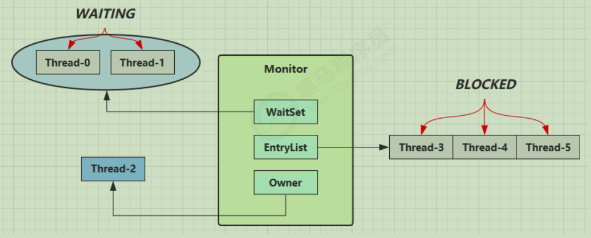
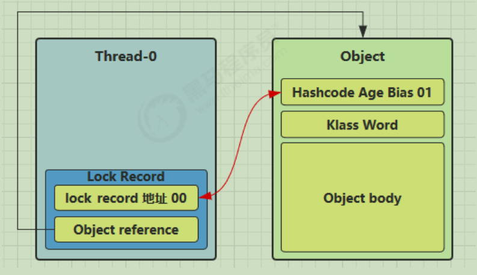
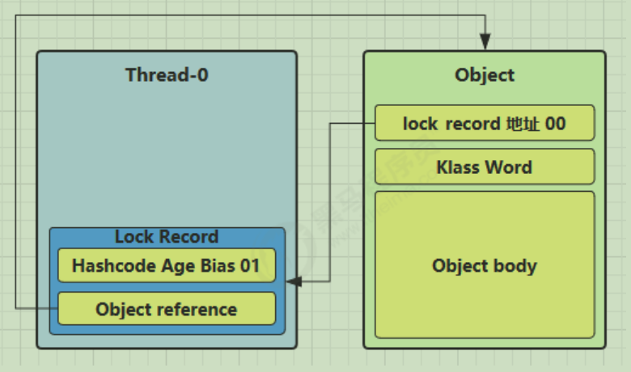
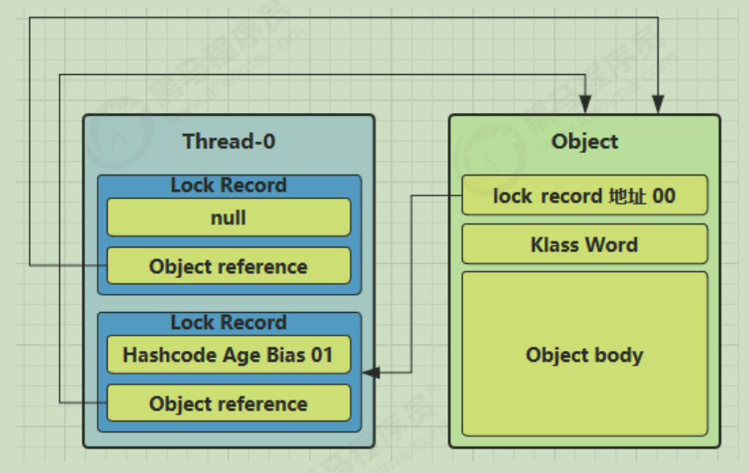
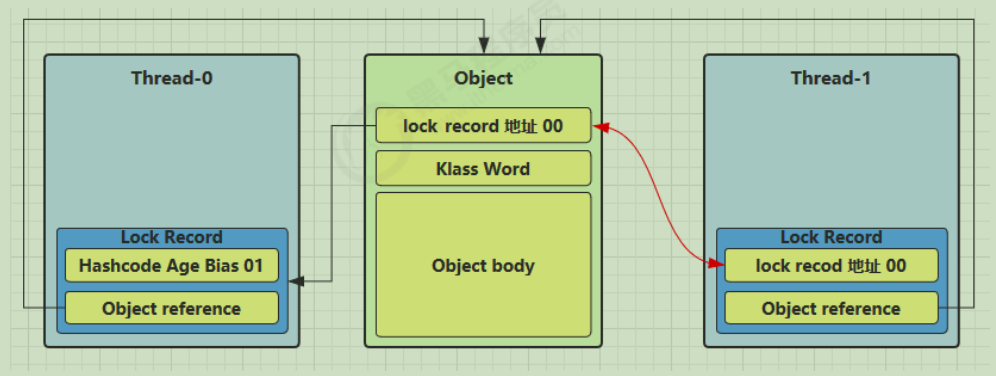
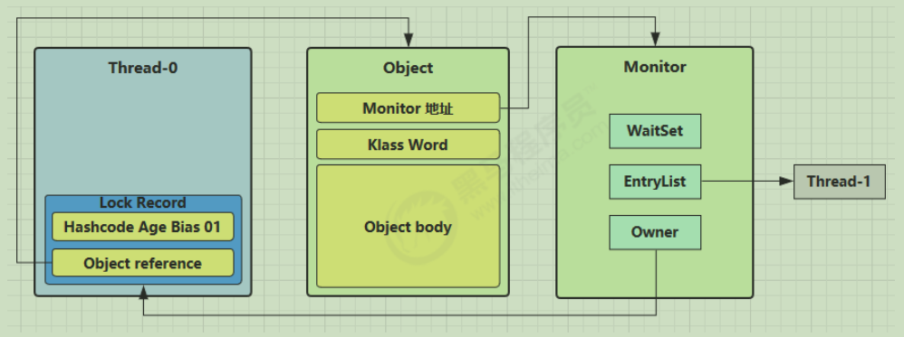
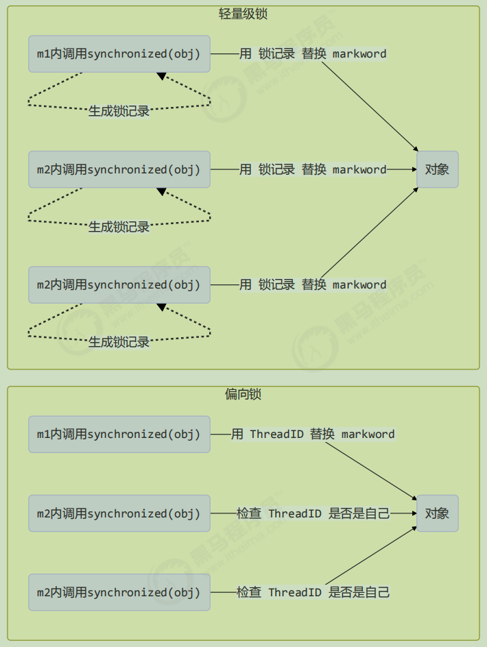

## 对象头
Java对象保存在内存中时，由三部分组成：对象头、实例数据、对齐填充字节。
对象头又由三部分组成：Mark Word、指向类的指针、数组长度（只有数组对象才有）。
- 指向类的指针：该指针在32位JVM中的长度是32bit，在64位JVM中长度是64bit。Java对象的类数据保存在方法区。
- 数组长度：只有数组对象保存了这部分数据。该数据在32位和64位JVM中长度都是32bit。
- 实例数据：对象的实例数据就是在java代码中能看到的属性和他们的值。
- 对齐填充字节：因为JVM要求java的对象占的内存大小应该是8bit的倍数，所以后面有几个字节用于把对象的大小补齐至8bit的倍数，没有特别的功能。

以32位JVM:

```
普通对象:
    |--------------------------------------------------------------| 
    |                   Object Header (64 bits)                    |
    |-------------------------------|------------------------------| 
    | Mark Word (32 bits)           | Klass Word (32 bits)         |
    |-------------------------------|------------------------------|

数组对象:
    |---------------------------------------------------------------------------------|
    |                       Object Header (96 bits)                                   |
    |--------------------------------|-----------------------|------------------------|
    | Mark Word(32bits)              | Klass Word(32bits)    | array length(32bits)   |
    |--------------------------------|-----------------------|------------------------|
```

## Mark Word
Mark Word在32位JVM中的长度是32bit，在64位JVM中长度是64bit。

利用 jol 第三方工具来查看对象头信息，官网：http://openjdk.java.net/projects/code-tools/jol/

```
32位JVM:
    |-------------------------------------------------------|--------------------|
    |                                   Mark Word (32 bits) |              State |
    |-------------------------------------------------------|--------------------|
    |              hashcode:25 | age:4 | biased_lock:0 | 01 | Normal             |
    |-------------------------------------------------------|--------------------|
    |      thread:23 | epoch:2 | age:4 | biased_lock:1 | 01 | Biased             |
    |-------------------------------------------------------|--------------------|
    | ptr_to_lock_record:30                            | 00 | Lightweight Locked |
    |-------------------------------------------------------|--------------------|
    | ptr_to_heavyweight_monitor:30                    | 10 | Heavyweight Locked |
    |-------------------------------------------------------|--------------------|
    |                                                  | 11 | Marked for GC      |
    |-------------------------------------------------------|--------------------|

64位JVM:
    |--------------------------------------------------------------------|--------------------|
    |                                                Mark Word (64 bits) |              State |
    |--------------------------------------------------------------------|--------------------|
    |    unused:25 | hashcode:31 | unused:1 | age:4 | biased_lock:0 | 01 | Normal             |
    |--------------------------------------------------------------------|--------------------|
    |        thread:54 | epoch:2 | unused:1 | age:4 | biased_lock:1 | 01 | Biased             |
    |--------------------------------------------------------------------|--------------------|
    |                                         ptr_to_lock_record:62 | 00 | Lightweight Locked |
    |--------------------------------------------------------------------|--------------------|
    |                                 ptr_to_heavyweight_monitor:62 | 10 | Heavyweight Locked |
    |--------------------------------------------------------------------|--------------------|
    |                                                               | 11 | Marked for GC      |
    |--------------------------------------------------------------------|--------------------|
```

## 锁升级流程
其中无锁和偏向锁的锁标志位都是01，只是在前面的1bit区分了这是无锁状态还是偏向锁状态。

JDK1.6以后的版本在处理同步锁时存在锁升级的概念，JVM对于同步锁的处理是从偏向锁开始的，随着竞争越来越激烈，处理方式从偏向锁升级到轻量级锁，最终升级到重量级锁。

JVM一般是这样使用锁和Mark Word的：

1. 当没有被当成锁时，这就是一个普通的对象，Mark Word记录对象的HashCode，锁标志位是01，是否偏向锁那一位是0。
2. 当对象被当做同步锁并有一个线程A抢到了锁时，锁标志位还是01，但是否偏向锁那一位改成1，前23bit记录抢到锁的线程id，表示进入偏向锁状态。
3. 当线程A再次试图来获得锁时，JVM发现同步锁对象的标志位是01，是否偏向锁是1，也就是偏向状态，Mark Word中记录的线程id就是线程A自己的id，表示线程A已经获得了这个偏向锁，可以执行同步锁的代码。
4. 当线程B试图获得这个锁时，JVM发现同步锁处于偏向状态，但是Mark Word中的线程id记录的不是B，那么线程B会先用CAS操作试图获得锁，这里的获得锁操作是有可能成功的，因为线程A一般不会自动释放偏向锁。如果抢锁成功，就把Mark Word里的线程id改为线程B的id，代表线程B获得了这个偏向锁，可以执行同步锁代码。如果抢锁失败，则继续执行步骤5。
5. 偏向锁状态抢锁失败，代表当前锁有一定的竞争，偏向锁将升级为轻量级锁。JVM会在当前线程的线程栈中开辟一块单独的空间，里面保存指向对象锁Mark Word的指针，同时在对象锁Mark Word中保存指向这片空间的指针。上述两个保存操作都是CAS操作，如果保存成功，代表线程抢到了同步锁，就把Mark Word中的锁标志位改成00，可以执行同步锁代码。如果保存失败，表示抢锁失败，竞争太激烈，继续执行步骤6。
6. 轻量级锁抢锁失败，JVM会使用自旋锁，自旋锁不是一个锁状态，只是代表不断的重试，尝试抢锁。从JDK1.7开始，自旋锁默认启用，自旋次数由JVM决定。如果抢锁成功则执行同步锁代码，如果失败则继续执行步骤7。
7. 自旋锁重试之后如果抢锁依然失败，同步锁会升级至重量级锁(Monitor锁)，锁标志位改为10。在这个状态下，未抢到锁的线程都会被阻塞。

## Monitor锁
Monitor被翻译为监视器或管程。

每个Java对象都可以关联一个 Monitor 对象，如果使用 synchronized关键字给对象上锁（重量级）之后，该对象头的Mark Word 中就被设置指向 Monitor 对象的指针。Monitor 结构如下：



1. 刚开始 Monitor 中 Owner 为 null
2. 当 Thread-2 执行 synchronized(obj) 就会将 Monitor 的所有者 Owner 置为 Thread-2，Monitor中只能有一个 Owner
3. 在 Thread-2 上锁的过程中，如果 Thread-3，Thread-4，Thread-5 也来执行 synchronized(obj)，就会进入EntryList BLOCKED
4. Thread-2 执行完同步代码块的内容，然后唤醒 EntryList 中等待的线程来竞争锁，竞争的时是非公平的
5. 图中 WaitSet 中的 Thread-0，Thread-1 是之前获得过锁，但条件不满足进入 WAITING 状态的线程，后面讲wait-notify 时会分析

> synchronized 必须是进入同一个对象的 monitor 才有上述的效果，不加 synchronized 的对象不会关联监视器，不遵从以上规则

```
static final Object lock = new Object();
static int counter = 0;

public static void main(String[] args) {
    synchronized (lock) {
        counter++;
    }
}
```

对应的字节码为:
```
public static void main(java.lang.String[]);
    descriptor: ([Ljava/lang/String;)V
    flags: ACC_PUBLIC, ACC_STATIC
    Code:
        stack=2, locals=3, args_size=1
            0: getstatic #2 // <- lock引用 （synchronized开始）
            3: dup
            4: astore_1 // lock引用 -> slot 1
            5: monitorenter // 将 lock对象 MarkWord 置为 Monitor 指针
            6: getstatic #3 // <- i
            9: iconst_1 // 准备常数 1
            10: iadd // +1
            11: putstatic #3 // -> i
            14: aload_1 // <- lock引用
            15: monitorexit // 将 lock对象 MarkWord 重置, 唤醒 EntryList
            16: goto 24
            19: astore_2 // e -> slot 2 
            20: aload_1 // <- lock引用
            21: monitorexit // 将 lock对象 MarkWord 重置, 唤醒 EntryList（此处是发生异常时释放锁）
            22: aload_2 // <- slot 2 (e)
            23: athrow // throw e
            24: return
        Exception table:
            from to target type
            6 16 19 any
            19 22 19 any
        LineNumberTable:
            line 8: 0
            line 9: 6
            line 10: 14
            line 11: 24
        LocalVariableTable:
            Start Length Slot Name Signature
            0 25 0 args [Ljava/lang/String;
        StackMapTable: number_of_entries = 2
            frame_type = 255 /* full_frame */
                offset_delta = 19
                locals = [ class "[Ljava/lang/String;", class java/lang/Object ]
                stack = [ class java/lang/Throwable ]
            frame_type = 250 /* chop */
                offset_delta = 4

```
> 方法级别的 synchronized 不会在字节码指令中有所体现

## 轻量级锁
轻量级锁的使用场景：如果一个对象虽然有多线程要加锁，但加锁的时间是错开的（也就是没有竞争），那么可以使用轻量级锁来优化。

轻量级锁对使用者是透明的，即语法仍然是 synchronized。假设有两个方法同步块，利用同一个对象加锁：
```
static final Object obj = new Object();
public static void method1() {
    synchronized( obj ) {
    // 同步块 A
    method2();
    }
}
public static void method2() {
    synchronized( obj ) {
    // 同步块 B
    }
}
```
每个线程的栈帧都会包含一个锁记录（Lock Record）的结构，内部可以存储锁对象的Mark Word。

加偏向锁时，让锁记录中 Object reference 指向锁对象，然后构造一个锁记录自己的地址+00标志位，并尝试用 cas 和锁对象的 Mark Word交换。


如果 CAS 替换成功，对象头中存储了锁记录地址和状态 00 ，表示由该线程给对象加锁，这时图示如下


如果 cas 失败，有两种情况:
- 如果是其它线程已经持有了该 Object 的轻量级锁，这时表明有竞争，进入锁膨胀过程
- 如果是自己执行了 synchronized 锁重入，那么再添加一条 Lock Record 作为重入的计数



- 当退出 synchronized 代码块（解锁时）如果有取值为 null 的锁记录，表示有重入，这时删除锁记录，表示重入计数减一
- 当退出 synchronized 代码块（解锁时）锁记录的值不为 null，这时使用 cas 将 Mark Word 的值恢复给对象头成功，则解锁成功；失败，说明轻量级锁进行了锁膨胀或已经升级为重量级锁，进入重量级锁解锁流程

## 锁膨胀
如果在尝试加轻量级锁的过程中，CAS 操作无法成功，这时一种情况就是有其它线程为此对象加上了轻量级锁（有竞争），这时需要进行锁膨胀，将轻量级锁变为重量级锁。

当 Thread-1 进行轻量级加锁时，Thread-0 已经对该对象加了轻量级锁



这时 Thread-1 加轻量级锁失败，进入锁膨胀流程，即为 锁Object 对象申请 Monitor 锁，让 锁Object的Mark Word 指向重量级锁地址，即将Monitor 锁地址+标志位10设置到锁Object的Mark Word，然后自己进入 Monitor 的 EntryList BLOCKED



当 Thread-0 退出同步块解锁时，使用 cas 将 Mark Word 的值恢复给对象头时会失败。这时会进入重量级解锁流程，即按照 Monitor 地址找到 Monitor 对象，设置 Owner 为 null，唤醒 EntryList 中 BLOCKED 线程

## 自旋优化
轻量级锁膨胀为重量级锁的时候，还可以使用自旋来进行优化，如果当前线程自旋成功（即这时候持锁线程已经退出了同步块，释放了锁），这时当前线程就可以避免阻塞。

自旋重试成功的情况:

线程 1 （core 1 上） |对象 Mark | 线程 2 （core 2 上）
-- | -- | --
访问同步块，获取 monitor| 10（重量锁）重量锁指针 |-
成功（加锁）| 10（重量锁）重量锁指针 |-
执行同步块 |10（重量锁）重量锁指针 |-
执行同步块 |10（重量锁）重量锁指针 |访问同步块，获取 monitor
执行同步块 |10（重量锁）重量锁指针 |自旋重试
执行完毕 |10（重量锁）重量锁指针 |自旋重试
成功（解锁）| 01（无锁） |自旋重试
 |10（重量锁）重量锁指针 |成功（加锁）
 |10（重量锁）重量锁指针 |执行同步块

自旋重试失败的情况:

线程 1（core 1 上） |对象 Mark| 线程 2（core 2 上）
-- | -- | --
访问同步块，获取 monitor |10（重量锁）重量锁指针 |-
成功（加锁）| 10（重量锁）重量锁指针 |-
执行同步块| 10（重量锁）重量锁指针 |-
执行同步块 |10（重量锁）重量锁指针 |访问同步块，获取 monitor
执行同步块 |10（重量锁）重量锁指针 |自旋重试
执行同步块 |10（重量锁）重量锁指针 |自旋重试
执行同步块 |10（重量锁）重量锁指针 |自旋重试
执行同步块 |10（重量锁）重量锁指针 |阻塞

自旋会占用 CPU 时间，单核 CPU 自旋就是浪费，多核 CPU 自旋才能发挥优势。

Java 6 之后自旋锁是自适应的，比如对象刚刚的一次自旋操作成功过，那么认为这次自旋成功的可能性会高，就多自旋几次；反之，就少自旋甚至不自旋，总之，比较智能。

Java 7 之后不能控制是否开启自旋功能

## 偏向锁
轻量级锁在没有竞争时（就自己这个线程），每次重入仍然需要执行 CAS 操作。

Java 6 中引入了偏向锁来做进一步优化：只有第一次使用 CAS 将线程 ID 设置到对象的 Mark Word 头，之后发现这个线程 ID 是自己的就表示没有竞争，不用重新 CAS。以后只要不发生竞争，这个对象就归该线程所有，注意处于偏向锁的对象解锁后，线程 id 仍存储于对象头中。



一个对象创建时：
- 如果开启了偏向锁（默认开启），那么对象创建后，markword 值为 0x05 即最后 3 位为 101，这时它的thread、epoch、age 都为 0
- 偏向锁是默认是延迟的，不会在程序启动时立即生效，如果想避免延迟，可以加 VM 参数 -XX:BiasedLockingStartupDelay=0 来禁用延迟
- 如果没有开启偏向锁，那么对象创建后，markword 值为 0x01 即最后 3 位为 001，这时它的 hashcode、age 都为 0，第一次用到 hashcode 时才会赋值

偏向锁撤销的情况：
1. 锁对象处于偏向锁状态时，即Mark Word值是 线程id + 状态位101时，调用了对象的 hashCode，会导致偏向锁被撤销。另外注意，轻量级锁会在锁记录中记录 hashCode，重量级锁会在 Monitor 中记录 hashCode。
2. 当有其它线程使用偏向锁对象时，会将偏向锁升级为轻量级锁
3. 调用 wait/notify

批量重偏向：如果对象虽然被多个线程访问，但没有竞争，这时偏向了线程 T1 的对象仍有机会重新偏向 T2，重偏向会重置对象的 Thread ID。当撤销偏向锁阈值超过 20 次后，jvm 会这样觉得，我是不是偏向错了呢，于是会在给这些对象加锁时重新偏向至加锁线程。

批量撤销：当撤销偏向锁阈值超过 40 次后，jvm 会这样觉得，自己确实偏向错了，根本就不该偏向。于是整个类的所有对象都会变为不可偏向的，新建的对象也是不可偏向的。


## 参考资料
> - []()
> - []()
