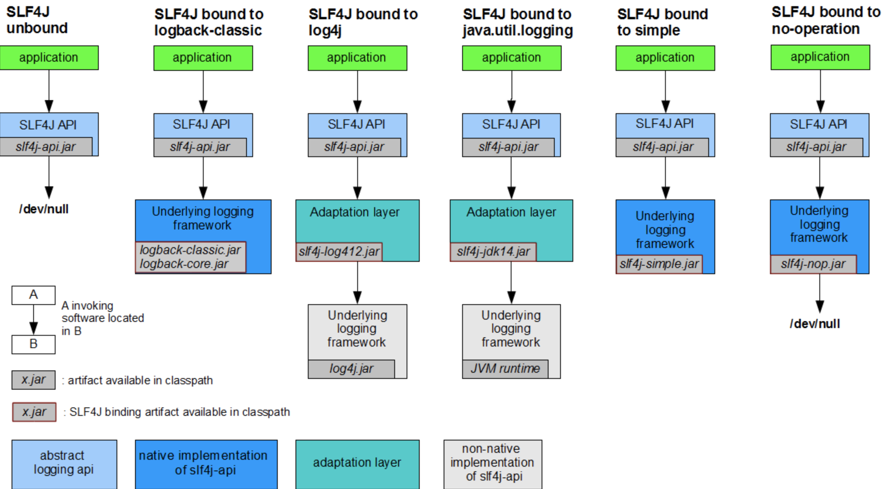

直入正题！

## 发展史
1. log4j（作者Ceki Gülcü）出来时就等到了广泛的应用（注意这里是直接使用），是Java日志事实上的标准，并成为了Apache的项目
2. Apache要求把log4j并入到JDK，SUN拒绝，并在jdk1.4版本后增加了JUL（java.util.logging）
3. 毕竟是JDK自带的，JUL也有很多人用。同时还有其他日志组件，如SimpleLog等。这时如果有人想换成其他日志组件，如log4j换成JUL，因为api完全不同，就需要改动代码。
4. Apache见此，开发了JCL（Jakarta Commons Logging），即commons-logging-xx.jar。它只提供一套通用的日志接口api，并不提供日志的实现。很好的设计原则嘛，依赖抽象而非实现。这样应用程序可以在运行时选择自己想要的日志实现组件。
5. 这样看上去也挺美好的，但是log4j的作者觉得JCL不好用，自己开发出slf4j，它跟JCL类似，本身不替供日志具体实现，只对外提供接口或门面。目的就是为了替代JCL。同时，还开发出logback，一个比log4j拥有更高性能的组件，目的是为了替代log4j。
6. Apache参考了logback,并做了一系列优化，推出了log4j2

所以目前的规范接口有如下两种：
- commons-logging: 最早的日志接口，现在已经停止更新，原名（Jakarta Commons Logging, JCL)，动态查找实现
- Slf4j: 现在的日志接口，兼容OSGi，编译时静态绑定，官网：http://www.slf4j.org/

接口实现
- log4j/log4j2: apache开源日志实现
- logback: 与log4j同一作者，增强功能,三个模块（logback-core，logback-classic，logback-access）
- Simple Logging：JCL自带简单实现
- java.util.logging：JDK实现

因为当时Java的日志组件比较混乱繁杂，Ceki Gülcü推出slf4j后，也相应为行业中各个主流日志组件推出了slf4j的适配 图来源于官方文档

图的意思为如果你想用slf4j作为日志门面的话，你如何去配合使用其他日志实现组件，这里说明一下（注意jar包名缺少了版本号，在找版本时也要注意版本之间是否兼容）

- slf4j + logbackslf4j-api.jar + logback-classic.jar + logback-core.jar
- slf4j + log4jslf4j-api.jar + slf4j-log4j12.jar + log4j.jar
- slf4j + julslf4j-api.jar + slf4j-jdk14.jar
- 也可以只用slf4j无日志实现slf4j-api.jar + slf4j-nop.jar

## 日志级别

日志级别 | 打印场景
---|---
DEBUG | 调试日志。
INFO | 业务日志。我们用来记录业务的主流程的走向。
WARN | 警告日志。一般来说，发生对整个系统没什么影响的异常时，可以打印该级别的日志。
ERROR | 错误日志。级别比较高，如果发生一些异常，并且任何时候都需要打印时使用。

## 参考资料
> - 
> - 
