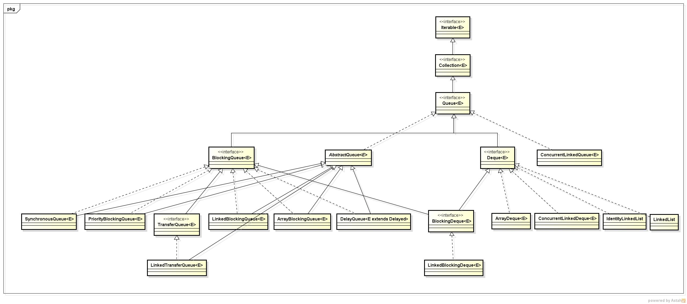

- Map: 存取键值对，键不允许重复，可存入一个键为null的对
- List: 有序集合，元素可重复，允许null
- Set: 元素不重复的集合，LinkedHashSet也可实现有序
- Queue: 队列接口，也继承Collection，常用LinkedList、ConcurrentLinkedQueue、BlockingQueue接口的实现

## 线程不安全的Map实现
### HashMap
首先它是非线程安全的, 采用哈希表，哈希表底层数据结构是数组+链表，数组是用来存储kv对的主体，链表是用来解决hash冲突的，在Java 1.8后，该链表达到8时，会转成红黑树。

初始数组大小默认为16，当元素超过，数组大小*loadFactor时，会扩容数组大小的2倍，会新建一个数组，重新计算hash，然后将原数组数据迁移到新数组
put时会把key经hash函数运算取模，定位到数组的具体下标，如果此处为空，则放入，不为空时，则发生了hash冲突，遍历该链表，将其添加到链表末尾
get时会通过key哈希定位到数组下标，如果是单个元素，直接取走，如果是链表，则要遍历，然后通过key对比，找到具体的值返回

### LinkedHashMap
HashMap是无序的，当想有序的储存kv时，可以用LinkedHashMap，默认为插入时的顺序

其继承自HashMap，底层实现为HashMap+双向链表，其Map.Entry接口的实现多了两个参数after和before
初始化时多一步创建一个空的双向链表表头，每次put后，会通过这两个参数将Map.Entry链接起来
扩容时是按双向链表遍历，重新计算hash再转移

### TreeMap
默认支持自然顺序排序，也可创建时传入Compartor进行自定义排序，底层是通过红黑数实现

## 线程不安全的Set实现
### HashSet
内部采用HashMap实现，利用其key唯一不重复的特点实现

### LinkedHashSet
内部采用LinkedHashMap来保存数据

### TreeSet
内部采用TreeMap实现

## 线程不安全的List实现
### ArrayList
首先它是非线程安全的，底层采用数组实现，默认初始大小是10。

- 扩容：数组大小是不可变的，但它可以实现自动扩容，一般扩容为原来的1.5倍，扩容过程是新建一个大容量的数组，然后将原始数组数据拷贝到新数组，然后将新数组作为扩容之后的数组。数组扩容的操作代价很高，我们应该尽量减少这种操作。采用的是 Arrays.copyOf浅复制。
- 采用了Fail-Fast机制，面对并发的修改时，迭代器很快就会完全失败，报异常concurrentModificationException,而不是冒着在将来某个不确定时间发生任意不确定行为的风险。
- remove方法会让下标到数组末尾的元素向前移动一个单位，并把最后一位的值置空，方便GC。
- 实现了Cloneable接口,标识着可以它可以被复制.注意,ArrayList里面的clone()复制其实是浅复制。
- ArrayList不是线程安全的，只能用在单线程环境下，多线程环境下可以考虑用Collections.synchronizedList(List l)函数返回一个线程安全的ArrayList类，也可以使用concurrent并发包下的CopyOnWriteArrayList类。
- 数组地址连续，支持快速随机查找，但插入和删除较慢

### LinkedList
底层采用双向链表实现，链表地址可不连续，插入和删除速度快，但查询和修改较慢

- 新增方法：默认是添加到双向链表尾部, 每次插入都是移动指针，和 ArrayList 的拷贝数组来说效率要高上不少
- 查询方法：使用二分查找来看 index 离 size 中间距离来判断是从头结点正序查还是从尾节点倒序查，查找效率为n/2
- JDK1.7/8 之后取消了循环，修改为双向链表

## 线程安全的Map实现
### ConcurrentHashMap
HashMap的并发版本，Java1.7采用分段锁+数组+链表的数据结构，Java1.8采用数组+链表+红黑树的数据结构和CAS+Synchronized来保证并发安全。

Java1.7: 
结构：首先它有一个称为Segment的段数组，它的大小一旦初始化就不能改变，决定了并发度，默认大小为16，这个段数组的元素是一个重入锁的实现，保护着不同段上的数据，当要修改每个段上的数据时，要先获取该段上的锁，每个段会关联一个用数组实现的哈希表，该数组是可以扩容的，它的每个元素会关联一个实际存储元素的链表。
put: 通过key的hash定位到段，如果该段处的哈希表没初始化，通过CAS初始化，然后再定位到要存到哈希表数组的哪个下标关联的链表，此时会判断是否该哈希表数组大小是否超过阀值，是则需要扩容，否则将新节点放入哈希表数组元素处，即放在此处原链表表头。
扩容：put时会先判断插入元素是否会导致超过阀值，如果是先扩容，再插入，容量为原来的2倍，扩容不用考虑并发，因为此时是获得锁状态
get: 通过key的hash先定位到段，再定位到哈希表数组下标，然后顺着链表查找即可。

Java1.8:
结构：它的无参构造方法什么都不做，带容量参数的构造方法只是通过向上取2的n次方计算初始化大小，它存储数据的主体是数组，第一次put时才初始化该数组。
put： put时通过key的hash定位到数组下标，如果此处不为空，则通过CAS设置上，CAS成功则表示put成功，如果不为空，则通过sync关键字加锁，然后根据该处关联的是链表还是数组，采取不同的插入方法进行操作。
扩容：扩容时，如果数组大小小于64，优先扩容数组，之后会在数组元素下构建链表存储，当链表节点大于8时，会转化为红黑树存储。
get: 通过key定位到数组下标，根据此处结构性质进行查找。

### ConcurrentSkipListMap
支持并发排序类似treeMap

## 线程安全的List/Set实现
### CopyOnWriteArrayList
### CopyOnWriteArraySet

上述一两者都是Copy-On-Write容器，适用于读多写少。

写时复制，指当往一个容器中做写（add,del,update）操作时，不直接往当前容器中添加, 而是将当前容器进行copy，复制出一个新的容器，然后对容器进行写操作，完成之后，再将原容器的引用指向新的容器，这样做可以对CopyOnWrite容器进行并发的读，而不需要加锁，提现读写分离的思想，读和写不同的容器。

## 队列继承体系

- Queue接口有两个子接口：BlockingQueue和Deque，然后这两个接口又被BlockingDeque接口继承了。
- AbstractQueue还有一个子类PriorityQueue，上图未标注

## Queue接口方法

操作 | - | - 
-- | -- | --
添加元素 | add() 满时抛异常 | offer() 满时返回boolean
获取并移除 | remove() 空时抛异常 | poll() 空时返回null
获取不移除 | element() 空时抛异常 | peek() 空时返回null

### BlockingQueue接口方法
操作 | - 
-- | --
添加 | put() 满时会阻塞，同时有超时方法
移除 | take() 空时会阻塞，同时有超时方法

### Deque接口方法
双向队列，可做栈用，可用方法：pop()、push()、peek()相当于 removeFirst()、addFirst()、peekFirst()
方法也可用：removeLast()、addLast()、peekLast()

## 线程不安全的队列实现
### LinkedList
它实现了Deque接口，Deque又继承Queue，所以它可同时用做栈和队列，另外它也是List的实现。

### PriorityQueue
优先级队列，每次出队的都是队列中最小的元素，使用小顶堆的数据结构，它是一颗完全二叉树，底层采用数组存储数据。
- 入队：插入数组最后，然后上浮
- 出队：取出数组第一个元素，即最小元素，然后将末尾元素放置数组首位，然后下沉

## 线程安全的非阻塞队列实现
如果我们要实现一个线程安全的队列有两种实现方式一种是使用阻塞算法，另一种是使用非阻塞算法。使用阻塞算法的队列可以用一个锁（入队和出队用同一把锁）或两个锁（入队和出队用不同的锁）等方式来实现，而非阻塞的实现方式则可以使用循环CAS的方式来实现，它的一个实现就是ConcurrentLinkedQueue。
### ConcurrentLinkedQueue
由名字可知，它是基于链表的无界线程安全队列，采用循环CAS的方式实现非阻塞。

ConcurrentLinkedQueue由head节点和tail节点组成，每个节点（Node）由节点元素（item）和指向下一个节点的引用(next)组成，节点与节点之间就是通过这个next关联起来，从而组成一张链表结构的队列。初始状态下head节点存储的元素为空，tail节点等于head节点。

入队操作：
1. 定位出尾节点。尾节点不一定是tail节点，所以每次入队要先通过tail节点定位出尾节点，通过判断tail节点的next是否为空来确定，如果是空则表示是尾节点进入第二步，不为空则表示有其他线程已经给尾节点设置了新节点，需要重新获取尾节点。
2. 通过CAS将入队节点设置成当前队列尾节点的下一个节点，如果失败则重试，如果成功则表示入队操作成功。另外此时还会判断尾节点是否为tail节点，不是的话会CAS更新tail节点指向尾节点，但这个CAS更新tail失败也没关系，因为失败了表示有其他线程成功更新了tail节点。

tail节点不一定为尾节点的设计意图：
1. 让tail节点永远作为队列的尾节点，这样实现代码量非常少，而且逻辑非常清楚和易懂。但是这么做有个缺点就是每次都需要使用循环CAS更新tail节点。如果能减少CAS更新tail节点的次数，就能提高入队的效率。
2. 在JDK 1.7的实现中，doug lea使用hops变量来控制并减少tail节点的更新频率，并不是每次节点入队后都将 tail节点更新成尾节点，而是当tail节点和尾节点的距离大于等于常量HOPS的值（默认等于1）时才更新tail节点，tail和尾节点的距离越长使用CAS更新tail节点的次数就会越少，但是距离越长带来的负面效果就是每次入队时定位尾节点的时间就越长，因为循环体需要多循环一次来定位出尾节点，但是这样仍然能提高入队的效率，因为从本质上来看它通过增加对volatile变量的读操作来减少了对volatile变量的写操作，而对volatile变量的写操作开销要远远大于读操作，所以入队效率会有所提升。
3. 在JDK 1.8的实现中，tail的更新时机是通过p和t是否相等来判断的，其实现结果和JDK 1.7相同，即当tail节点和尾节点的距离大于等于1时，更新tail。

出队操作：
1. 并不是每次出队时都更新head节点，当head节点里有元素时，直接弹出head节点里的元素，而不会更新head节点。只有当head节点里没有元素时，出队操作才会更新head节点。采用这种方式也是为了减少使用CAS更新head节点的消耗，从而提高出队效率。
2. 主要逻辑就是首先获取头节点的元素，然后判断头节点内的元素是否为空，如果为空，表示另外一个线程已经进行了一次出队操作将该节点的元素取走，如果不为空，则使用CAS的方式将头节点的元素设置成null，如果CAS成功，则直接返回头节点的元素，如果不成功，表示另外一个线程已经进行了一次出队操作更新了head节点，导致元素发生了变化，需要重新获取头节点。

## 线程安全的阻塞队列实现
1. ArrayBlockingQueue：一个由数组结构组成的有界阻塞队列
2. LinkedBlockingQueue：一个由链表结构组成的有界阻塞队列
3. PriorityBlockingQueue：一个支持优先级排序的无界阻塞队列
4. SynchronousQueue: 一个不存储元素的阻塞队列
5. DelayQueue： 一个支持延时获取元素的无界阻塞队列
6. LinkedTransferQueue：一个由链表结构组成的无界阻塞队列
7. LinkedBlockingDeque：一个由链表结构组成的双向阻塞队列

### LinkedBlockingQueue
此队列的默认和最大长度是Integer.MAX_VALUE。

### PriorityBlockingQueue
此队列默认采用自然升序排列，两种方法自定义排序：
1. 元素实现compareTo()方法
2. 构造队列时指定Comparator

### SynchronousQueue
SynchronousQueue是一个不存储元素的阻塞队列。每一个put操作必须等待一个take操作，否则不能继续添加元素。SynchronousQueue可以看成是一个传球手，负责把生产者线程处理的数据直接传递给消费者线程。队列本身并不存储任何元素，非常适合于传递性场景,比如在一个线程中使用的数据，传递给另外一个线程使用，SynchronousQueue的吞吐量高于LinkedBlockingQueue 和 ArrayBlockingQueue。

### DelayQueue
1. 支持延时获取元素的无界阻塞队列，基于PriorityQueue实现
2. 队列中的元素必须实现Delayed接口，可参考ScheduledThreadPoolExecutor里的ScheduledFutureTask类
3. 在创建元素时可以指定多久才能从队列中获取该元素，只有在延时满后才能取出该元素，在没到延时时间获取元素时会阻塞当前线程

- 应用场景

1. 缓存系统的设计：可以用DelayQueue保存缓存元素的有效期，使用一个线程去轮询，一但能从DelayQueue中获取到元素时，表示缓存有效期到了
2. 定时任务调度：使用DelayQueue保存当天要执行的任务和执行时间，一但从其中获取到任务就开始执行，如TimerQueue就是使用DelayQueue实现的

### LinkedTransferQueue
多了两个方法：tryTransfer和transfer

- transfer方法

如果当前有消费者在等待接收元素，该方法会把生产出来的元素直接传输给消费者，否则就将该元素放到队尾，阻塞等待该元素被消费了再返回

- tryTransfer方法

见名知义，该方法用来试探生产者传入的元素是否能直接传给消费者，如果没有消费者在等待获取，则返回false，不会阻塞。

### LinkedBlockingDeque
一个由链表结构组成的双向阻塞队列，可以运用在“工作窃取”模式中。

## 参考资料

> - 
> - 
