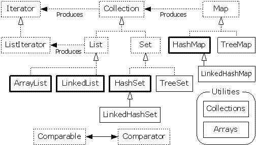

## 接口区别

Map：存取键值对，键不允许重复，可存入一个键为null的对

List:  有序集合，元素可重复

Set:  元素不重复的集合，LinkedHashSet也可实现有序 

## 不同实现的使用场景

- ArrayList:
- LinkedList:
- HashSet:
- LinkedHashSet:
- TreeSet:
- HashMap:
- LinkedHashMap:
- TreeMap:

## HashMap

首先它是非线程安全的

采用哈希表，哈希表底层数据结构是数组+链表，链表是用来解决hash冲突的，在Java 1.8后，该链表达到8时，会转成红黑树。

初始数组大小默认为16，当元素超过，数组大小*loadFactor时，会扩容数组大小的2倍，会新建一个数组，重新计算hash，然后将原数组数据迁移到新数组

put时会把key经hash函数运算取模，定位到数组的具体下标，如果此处为空，则放入，不为空时，则发生了hash冲突，遍历该链表，将其添加到链表末尾

get时会通过key哈希定位到数组下标，如果是单个元素，直接取走，如果是链表，则要遍历，然后通过key对比，找到具体的值返回

## LinkedHashMap

hashMap是无序的，当想有需的储存kv时，可以用LinkedHashMap，默认为插入时的顺序

其继承自HashMap，底层实现为HashMap+双向链表，其Entry实体，多了两个参数after和before，初始化时多一步创建一个空的双向链表表头，每次put后，会通过这两个参数将Entry链接起来

扩容时是按双向链表遍历，重新计算hash再转移

## TreeMap

默认支持自然顺序排序，也可创建时传入Compartor进行自定义排序

底层是通过红黑数实现

## HashSet

内部采用HashMap实现，利用其key唯一不重复的特点实现

## LinkedHashSet

内部采用LinkedHashMap来保存数据

## TreeSet

内部采用TreeMap实现

## ArrayList

首先它是非线程安全的

底层采用数组实现，默认初始大小是10，数组大小是不可变的，但它可以实现自动扩容，一般扩容为原来的1.5倍

数组地址连续，支持快速随机查找，但插入和删除较慢

## LinkedList

底层采用双向链表实现

链表地址可不连续，插入和删除速度快，但查询和修改较慢

## 参考资料

> - 
> - 
