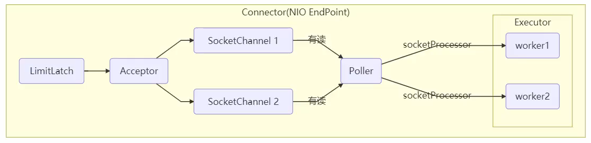
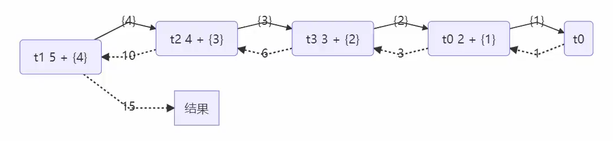
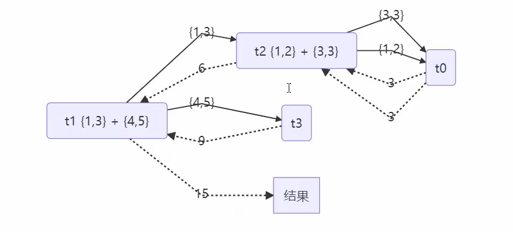
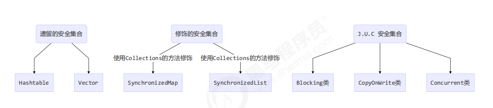
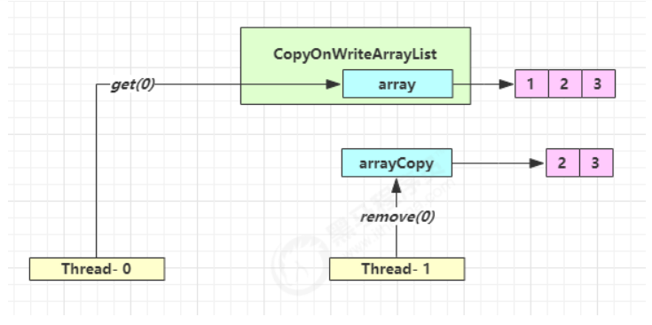

## 进程与线程

### 进程
- 程序由指令和数据组成，但这些指令要运行，数据要读写，就必须将指令加载至 CPU，数据加载至内存。在指令运行过程中还需要用到磁盘、网络等设备。进程就是用来加载指令、管理内存、管理 IO 的
- 当一个程序被运行，从磁盘加载这个程序的代码至内存，这时就开启了一个进程。
- 进程就可以视为程序的一个实例。大部分程序可以同时运行多个实例进程（例如记事本、画图、浏览器等），也有的程序只能启动一个实例进程（例如网易云音乐、360 安全卫士等）

### 线程
- 一个进程之内可以分为一到多个线程。
- 一个线程就是一个指令流，将指令流中的一条条指令以一定的顺序交给 CPU 执行
- Java 中，线程作为最小调度单位，进程作为资源分配的最小单位。 在 windows 中进程是不活动的，只是作为线程的容器

### 二者对比
- 进程基本上相互独立的，而线程存在于进程内，是进程的一个子集
- 进程拥有共享的资源，如内存空间等，供其内部的线程共享
- 进程间通信较为复杂：
    - 同一台计算机的进程通信称为 IPC（Inter-process communication）
    - 不同计算机之间的进程通信，需要通过网络，并遵守共同的协议，例如 HTTP
- 线程通信相对简单，因为它们共享进程内的内存，一个例子是多个线程可以访问同一个共享变量
- 线程更轻量，线程上下文切换成本一般上要比进程上下文切换低

### 线程上下文切换（Thread Context Switch）
因为以下一些原因导致 cpu 不再执行当前的线程，转而执行另一个线程的代码
- 线程的 cpu 时间片用完
- 垃圾回收
- 有更高优先级的线程需要运行
- 线程自己调用了 sleep、yield、wait、join、park、synchronized、lock 等方法

当 Context Switch 发生时，需要由操作系统保存当前线程的状态，并恢复另一个线程的状态，Java 中对应的概念就是程序计数器（Program Counter Register），它的作用是记住下一条 jvm 指令的执行地址，是线程私有的，状态包括程序计数器、虚拟机栈中每个栈帧的信息，如局部变量、操作数栈、返回地址等，Context Switch 频繁发生会影响性能

## 并行与并发
单核 cpu 下，线程实际还是 串行执行 的。操作系统中有一个组件叫做任务调度器，将 cpu 的时间片（windows下时间片最小约为 15 毫秒）分给不同的程序使用，只是由于 cpu 在线程间（时间片很短）的切换非常快，人类感觉是 同时运行的 。总结为一句话就是： 微观串行，宏观并行 ，

一般会将这种 线程轮流使用 CPU 的做法称为并发， concurrent

多核 cpu下，每个 核（core） 都可以调度运行线程，这时候线程可以是并行的。

引用 Go语言之父 Rob Pike 的一段描述：
- 并发（concurrent）是同一时间应对（dealing with）多件事情的能力
- 并行（parallel）是同一时间动手做（doing）多件事情的能力

例子
- 家庭主妇做饭、打扫卫生、给孩子喂奶，她一个人轮流交替做这多件事，这时就是并发
- 家庭主妇雇了个保姆，她们一起这些事，这时既有并发，也有并行（这时会产生竞争，例如锅只有一口，一个人用锅时，另一个人就得等待）
- 雇了3个保姆，一个专做饭、一个专打扫卫生、一个专喂奶，互不干扰，这时是并行

###  应用之异步调用（案例1）
以调用方角度来讲，如果
- 需要等待结果返回，才能继续运行就是同步
- 不需要等待结果返回，就能继续运行就是异步

设计：多线程可以让方法执行变为异步的（即不要巴巴干等着）比如说读取磁盘文件时，假设读取操作花费了 5 秒钟，如果没有线程调度机制，这 5 秒 cpu 什么都做不了，其它代码都得暂停...
- 比如在项目中，视频文件需要转换格式等操作比较费时，这时开一个新线程处理视频转换，避免阻塞主线程
- tomcat 的异步 servlet 也是类似的目的，让用户线程处理耗时较长的操作，避免阻塞 tomcat 的工作线程
- ui 程序中，开线程进行其他操作，避免阻塞 ui 线程

### 应用之提高效率（案例1）
充分利用多核 cpu 的优势，提高运行效率。想象下面的场景，执行 3 个计算，最后将计算结果汇总。
```
计算 1 花费 10 ms
计算 2 花费 11 ms
计算 3 花费 9 ms
汇总需要 1 ms
```
- 如果是串行执行，那么总共花费的时间是 10 + 11 + 9 + 1 = 31ms
- 但如果是四核 cpu，各个核心分别使用线程 1 执行计算 1，线程 2 执行计算 2，线程 3 执行计算 3，那么 3 个线程是并行的，花费时间只取决于最长的那个线程运行的时间，即 11ms 最后加上汇总时间只会花费 12ms
- 注意: 需要在多核 cpu 才能提高效率，单核仍然时是轮流执行

结论: 
1. 单核 cpu 下，多线程不能实际提高程序运行效率，只是为了能够在不同的任务之间切换，不同线程轮流使用cpu ，不至于一个线程总占用 cpu，别的线程没法干活
2. 多核 cpu 可以并行跑多个线程，但能否提高程序运行效率还是要分情况的有些任务，经过精心设计，将任务拆分，并行执行，当然可以提高程序的运行效率。但不是所有计算任务都能拆分（参考后文的【阿姆达尔定律】），也不是所有任务都需要拆分，任务的目的如果不同，谈拆分和效率没啥意义
3. IO 操作不占用 cpu，只是我们一般拷贝文件使用的是【阻塞 IO】，这时相当于线程虽然不用 cpu，但需要一直等待 IO 结束，没能充分利用线程。所以才有后面的【非阻塞 IO】和【异步 IO】优化

## Java 线程

### 创建和运行线程
1. 方法一，直接使用 Thread
```
// 创建线程对象
Thread t = new Thread() {
 public void run() {
 // 要执行的任务
 }
};
// 启动线程
t.start();
```

2. 方法二，使用 Runnable 配合 Thread，把【线程】和【任务】（要执行的代码）分开Thread 代表线程，Runnable 可运行的任务（线程要执行的代码）
```
Runnable runnable = new Runnable() {
 public void run(){
 // 要执行的任务
 }
};
// 创建线程对象
Thread t = new Thread( runnable );
// 启动线程
t.start();
```

> 原理之 Thread 与 Runnable 的关系

查看 Thread 的源码可知，Thread类中有一个Runnable类型的成员变量target，它的run方法中会判断target是否为null，不为null则调用run方法.
如上方法1是直接匿名类的方式重写了run方法.
如上方法2是实例化一个Runnable接口的实例，通过Thread构造方法传递给target.

使用Runnable有如下好处：

- 方法1 是把线程和任务合并在了一起，方法2 是把线程和任务分开了
- 用 Runnable 更容易与线程池等高级 API 配合
- 用 Runnable 让任务类脱离了 Thread 继承体系，更灵活

3. 方法三，FutureTask 配合 Thread，FutureTask 能够接收 Callable 类型的参数，用来处理有返回结果的情况

```java
// 创建任务对象
FutureTask<Integer> task3 = new FutureTask<>(() -> {
 log.debug("hello");
 return 100;
});

// 参数1 是任务对象; 参数2 是线程名字，推荐
new Thread(task3, "t3").start();
// 主线程阻塞，同步等待 task 执行完毕的结果
Integer result = task3.get();
log.debug("结果是:{}", result);
```

## 共享模型之管程

### 临界区 Critical Section
一个程序运行多个线程本身是没有问题的，问题出在多个线程访问共享资源
- 多个线程读共享资源其实也没有问题
- 在多个线程对共享资源读写操作时发生指令交错，就会出现问题

一段代码块内如果存在对共享资源的多线程读写操作，称这段代码块为临界区
例如，下面代码中的临界区：
```java
static int counter = 0;
static void increment() 
// 临界区
{ 
 counter++; 
}
static void decrement() 
// 临界区
{ 
 counter--; 
}
```
### 竞态条件 Race Condition
多个线程在临界区内执行，由于代码的执行序列不同而导致结果无法预测，称之为发生了竞态条件

### synchronized 解决方案
> 应用之互斥

为了避免临界区的竞态条件发生，有多种手段可以达到目的。
- 阻塞式的解决方案：synchronized，Lock
- 非阻塞式的解决方案：原子变量

synchronized，即俗称的【对象锁】，它采用互斥的方式让同一时刻至多只有一个线程能持有【对象锁】，其它线程再想获取这个【对象锁】时就会阻塞住。这样就能保证拥有锁的线程可以安全的执行临界区内的代码，不用担心线程上下文切换

虽然 java 中互斥和同步都可以采用 synchronized 关键字来完成，但它们还是有区别的：
- 互斥是保证临界区的竞态条件发生，同一时刻只能有一个线程执行临界区代码
- 同步是由于线程执行的先后、顺序不同、需要一个线程等待其它线程运行到某个点

```java
    static int counter = 0;
    static final Object room = new Object();

    public static void main(String[] args) throws InterruptedException {
        Thread t1 = new Thread(() -> {
            for (int i = 0; i < 5000; i++) {
                synchronized (room) {
                    counter++;
                }
            }
        }, "t1");
        Thread t2 = new Thread(() -> {
            for (int i = 0; i < 5000; i++) {
                synchronized (room) {
                    counter--;
                }
            }
        }, "t2");
        t1.start();
        t2.start();
        t1.join();
        t2.join();
        log.debug("{}", counter);
    }
```
你可以做这样的类比：synchronized(对象) 中的对象，可以想象为一个房间（room），有唯一入口（门）房间只能一次进入一人进行计算，线程 t1，t2 想象成两个人
1. 当线程 t1 执行到 synchronized(room) 时就好比 t1 进入了这个房间，并锁住了门拿走了钥匙，在门内执行count++ 代码
2. 这时候如果 t2 也运行到了 synchronized(room) 时，它发现门被锁住了，只能在门外等待，发生了上下文切换，阻塞住了
3. 这中间即使 t1 的 cpu 时间片不幸用完，被踢出了门外（不要错误理解为锁住了对象就能一直执行下去哦），这时门还是锁住的，t1 仍拿着钥匙，t2 线程还在阻塞状态进不来，只有下次轮到 t1 自己再次获得CPU时间片时会再次开门进入
4. 当 t1 执行完 synchronized{} 块内的代码，这时候才会从 obj 房间出来并解开门上的锁，唤醒 t2 线程把钥匙给他。t2 线程这时才可以进入 obj 房间，锁住了门拿上钥匙，执行它的 count-- 代码

思考：synchronized 实际是用对象锁保证了临界区内代码的原子性，临界区内的代码对外是不可分割的，不会被线程切换或交错执行造成问题。

面向对象改进: 把需要保护的共享变量放入一个类
```java
class Room {
    int value = 0;

    public void increment() {
        synchronized (this) {
            value++;
        }
    }

    public void decrement() {
        synchronized (this) {
            value--;
        }
    }

    public int get() {
        synchronized (this) {
            return value;
        }
    }
}

@Slf4j
public class Test1 {

    public static void main(String[] args) throws InterruptedException {
        Room room = new Room();
        Thread t1 = new Thread(() -> {
            for (int j = 0; j < 5000; j++) {
                room.increment();
            }
        }, "t1");
        Thread t2 = new Thread(() -> {
            for (int j = 0; j < 5000; j++) {
                room.decrement();
            }
        }, "t2");
        t1.start();
        t2.start();
        t1.join();
        t2.join();
        log.debug("count: {}", room.get());
    }
}
```

### 变量的线程安全分析
成员变量和静态变量是否线程安全？
- 如果它们没有共享，则线程安全
- 如果它们被共享了，根据它们的状态是否能够改变，又分两种情况
    - 如果只有读操作，则线程安全
    - 如果有读写操作，则这段代码是临界区，需要考虑线程安全

局部变量是否线程安全？
- 局部变量是线程安全的
- 但局部变量引用的对象则未必
    - 如果该对象没有逃离方法的作用访问，它是线程安全的
    - 如果该对象逃离方法的作用范围，需要考虑线程安全

如下类是线程安全的，因为：
- list 是局部变量，每个线程调用时会创建其不同实例，没有共享
- method2 的参数是从 method1 中传递过来的，与 method1 中引用同一个对象，method3 的参数分析与 method2 相同
- method2 和 method3 访问修饰符是private，不能被其他类访问，所以不会造成list引用逃逸

```java
class ThreadSafe {
    public final void method1(int loopNumber) {
        ArrayList<String> list = new ArrayList<>();
        for (int i = 0; i < loopNumber; i++) {
            method2(list);
            method3(list);
        }
    }
    private void method2(ArrayList<String> list) {
        list.add("1");
    }
    private void method3(ArrayList<String> list) {
        list.remove(0);
    }
}
```

考虑method2、method3访问修饰符改为public时，是否带来安全问题

- 有其它线程调用 method2 和 method3，会拿到list引用造成逃逸
- 在情况1 的基础上，为 ThreadSafe 类添加子类，子类覆盖 method2 或 method3 方法，也会得到list引用造成逃逸，即

```java
class ThreadSafeSubClass extends ThreadSafe{
    @Override
    public void method3(ArrayList<String> list) {
        new Thread(() -> {
            list.remove(0);
        }).start();
    }
}
```
从这个例子可以看出 private 或 final 提供【安全】的意义所在，请体会开闭原则中的【闭】

### 常见线程安全类
- String
- Integer
- StringBuffer
- Random
- Vector
- Hashtable
- java.util.concurrent 包下的类

这里说它们是线程安全的是指，多个线程调用它们同一个实例的某个方法时，是线程安全的。
也可以理解为它们的每个方法是原子的，但注意它们多个方法的组合不是原子的，如下操作是安全的：
```java
Hashtable table = new Hashtable();

new Thread(()->{
 table.put("key", "value1");
}).start();

new Thread(()->{
 table.put("key", "value2");
}).start();
```
线程安全类方法的组合，下面代码不是线程安全的：
```java
Hashtable table = new Hashtable();
// 线程1，线程2
if( table.get("key") == null) {
    table.put("key", value);
}
```

不可变类线程安全性：String、Integer 等都是不可变类，因为其内部的状态不可以改变，因此它们的方法都是线程安全的
有同学或许有疑问，String 有 replace，substring 等方法【可以】改变值啊，那么这些方法又是如何保证线程安全的呢？
类似如下，每次会构造一个新对象
```java
public class Immutable{
    private int value = 0;

    public Immutable(int value){
        this.value = value;
    }
    
    public int getValue(){
        return this.value;
    }
    
    public Immutable add(int v){
        return new Immutable(this.value + v);
    } 
}
```

### 实例分析
todo

### 卖票、转账实例
todo 

### Monitor 概念
> 原理之 Monitor(锁)
> 原理之 synchronized
> 原理之 synchronized 进阶

### wait/notify
> 原理之 wait / notify

它们都是线程之间进行协作的手段，都属于 Object 对象的方法。必须获得此对象的锁，才能调用这几个方法: 
- obj.wait() 会释放对象的锁，进入 WaitSet 等待区，从而让其他线程就机会获取对象的锁。无限制等待，直到notify 为止
- obj.wait(long n) 有时限的等待, 到 n 毫秒后结束等待，或是被 notify
- obj.notify() 在 object 上正在 waitSet 等待的线程中挑一个唤醒
- obj.notifyAll() 让 object 上正在 waitSet 等待的线程全部唤醒

sleep(long n) 和 wait(long n) 的区别
1. sleep 是 Thread 方法，而 wait 是 Object 的方法 
2. sleep 不需要强制和 synchronized 配合使用，但 wait 需要和 synchronized 一起用 
3. sleep 在睡眠的同时，不会释放对象锁的，但 wait 在等待的时候会释放对象锁 
4. 它们状态 TIMED_WAITING

> 模式之保护性暂停
> 模式之生产者消费者
> 原理之join

### Park/Unpark
它们是 LockSupport 类中的方法
- LockSupport.park();  暂停当前线程，内部是调用Unsafe.park()
- LockSupport.unpark(暂停线程对象); 恢复某个线程的运行，内部是调用UNSAFE.unpark(thread);

基本使用1：先 park 再 unpark
```java
Thread t1 = new Thread(() -> {
    log.debug("start...");
    sleep(1);
    log.debug("park...");
    LockSupport.park();
    log.debug("resume...");
},"t1");
t1.start();

sleep(2);
log.debug("unpark...");
LockSupport.unpark(t1);

输出：
18:42:52.585 c.TestParkUnpark [t1] - start... 
18:42:53.589 c.TestParkUnpark [t1] - park... 
18:42:54.583 c.TestParkUnpark [main] - unpark... 
18:42:54.583 c.TestParkUnpark [t1] - resume...
```

基本使用2： 先 unpark 再 park
```java
Thread t1 = new Thread(() -> {
    log.debug("start...");
    sleep(2);
    log.debug("park...");
    LockSupport.park();
    log.debug("resume...");
}, "t1");
t1.start();

sleep(1);
log.debug("unpark...");
LockSupport.unpark(t1);

输出：
18:43:50.765 c.TestParkUnpark [t1] - start... 
18:43:51.764 c.TestParkUnpark [main] - unpark... 
18:43:52.769 c.TestParkUnpark [t1] - park... 
18:43:52.769 c.TestParkUnpark [t1] - resume...
```

与 Object 的 wait & notify 相比
1. wait，notify 和 notifyAll 必须配合 Object Monitor 一起使用，而 park，unpark 不必
2. park & unpark 是以线程为单位来【阻塞】和【唤醒】线程，而 notify 只能随机唤醒一个等待线程，notifyAll 是唤醒所有等待线程，就不那么【精确】
3. park & unpark 可以先 unpark，而 wait & notify 不能先 notify

> 原理之 park & unpark

### 重新理解线程状态转换
todo

### 多把锁
一间大屋子有两个功能：睡觉、学习，互不相干。
现在小南要学习，小女要睡觉，但如果只用一间屋子（一个对象锁）的话，那么并发度很低
解决方法是准备多个房间（多个对象锁）

### 活跃性
- 死锁
有这样的情况：一个线程需要同时获取多把锁，这时就容易发生死锁
t1 线程 获得 A对象 锁，接下来想获取 B对象 的锁，t2 线程 获得 B对象锁，接下来想获取 A对象 的锁，如下所示：

```java

```

### ReentrantLock

> 同步模式之顺序控制

## 共享模型之内存
上一章讲解的 Monitor 主要关注的是访问共享变量时，保证临界区代码的原子性
这一章我们进一步深入学习共享变量在多线程间的【可见性】问题与多条指令执行时的【有序性】问题

### Java 内存模型
JMM 即 Java Memory Model，它定义了主存、工作内存抽象概念，底层对应着 CPU 寄存器、缓存、硬件内存、CPU 指令优化等。体现在以下几个方面
- 原子性 - 保证指令不会受到线程上下文切换的影响
- 可见性 - 保证指令不会受 cpu 缓存的影响
- 有序性 - 保证指令不会受 cpu 指令并行优化的影响

### 可见性
先来看一个现象，main 线程对 run 变量的修改对于 t 线程不可见，导致了 t 线程无法停止：
```java
static boolean run = true;
public static void main(String[] args) throws InterruptedException {
    Thread t = new Thread(()->{
        while(run){
            // ....
        }
    });
    t.start();

    sleep(1);
    run = false; // 线程t不会如预想的停下来
}
```
1. 初始状态， t 线程刚开始从主内存读取了 run 的值到工作内存。
2. 因为 t 线程要频繁从主内存中读取 run 的值，JIT 编译器会将 run 的值缓存至自己工作内存中的高速缓存中，减少对主存中 run 的访问，提高效率
3. 1 秒之后，main 线程修改了 run 的值，并同步至主存，而 t 是从自己工作内存中的高速缓存中读取这个变量的值，结果永远是旧值

解决方法: volatile（易变关键字），它可以用来修饰成员变量和静态成员变量，他可以避免线程从自己的工作缓存中查找变量的值，必须到主存中获取它的值，线程操作 volatile 变量都是直接操作主存

可见性 vs 原子性
- 可见性保证的是在多个线程之间，一个线程对 volatile 变量的修改对另一个线程可见，不能保证原子性，比较一下两个线程一个 i++ 一个 i-- ，只能保证看到最新值，不能解决指令交错
- synchronized 语句块既可以保证代码块的原子性，也同时保证代码块内变量的可见性。但缺点是synchronized 是属于重量级操作，性能相对更低

如果在前面示例的死循环中加入 System.out.println() 会发现即使不加 volatile 修饰符，线程 t 也能正确看到对 run 变量的修改了，想一想为什么？
因为println中加了synchronized，如下所示：
```java
public void println(boolean x) {
    synchronized (this) {
        print(x);
        newLine();
    }
}
```

> 原理之 CPU 缓存结构
> 模式之两阶段终止
> 模式之 Balking

### 有序性
JVM 会在不影响正确性的前提下，可以调整语句的执行顺序，这种特性称之为『指令重排』，多线程下『指令重排』会影响正确性。
为什么要有重排指令这项优化呢？从 CPU执行指令的原理来理解一下吧

> 原理之指令级并行

### 诡异的结果
```java
int num = 0;
boolean ready = false;
// 线程1 执行此方法
public void actor1(I_Result r) {
    if(ready) {
        r.r1 = num + num;
    } else {
        r.r1 = 1;
    }
}
// 线程2 执行此方法
public void actor2(I_Result r) {
    num = 2;
    ready = true;
}
```
I_Result 是一个对象，有一个属性 r1 用来保存结果，问，可能的结果有几种？

有同学这么分析
- 情况1：线程1 先执行，这时 ready = false，所以进入 else 分支结果为 1
- 情况2：线程2 先执行 num = 2，但没来得及执行 ready = true，线程1 执行，还是进入 else 分支，结果为1
- 情况3：线程2 执行到 ready = true，线程1 执行，这回进入 if 分支，结果为 4（因为 num 已经执行过了）
- 但结果还有可能是 0，这种情况下是：线程2 执行 ready = true，切换到线程1，进入 if 分支，相加为 0，再切回线程2 执行 num = 2

这种现象叫做指令重排，是 JIT 编译器在运行时的一些优化，这个现象需要通过大量测试才能复现：
借助 java 并发压测工具 jcstress https://wiki.openjdk.java.net/display/CodeTools/jcstress
我们能发现不同情况出现的次数，出现结果为 0 的情况很少，但是出现了

解决方法：volatile 修饰ready变量，可以禁用指令重排，volatile 的底层实现原理是内存屏障，Memory Barrier（Memory Fence） 
- 对 volatile 变量的写指令后会加入写屏障，写屏障会确保指令重排序时，不会将写屏障之前的代码排在写屏障之后
- 对 volatile 变量的读指令前会加入读屏障，读屏障会确保指令重排序时，不会将读屏障之后的代码排在读屏障之前

> 原理之 volatile

### happens-before
happens-before 规定了对共享变量的写操作对其它线程的读操作可见，它是可见性与有序性的一套规则总结，抛开以下 happens-before 规则，JMM 并不能保证一个线程对共享变量的写，对于其它线程对该共享变量的读可见

1. 程序次序规则：在一个线程内一段代码的执行结果是有序的。就是还会指令重排，但是随便它怎么排，结果是按照我们代码的顺序生成的不会变。
2. 管程锁定规则：对于使用synchronized时的同一个锁对象m，线程解锁 m 之前对变量的写，对于接下来对 m 加锁的其它线程对该变量的读可见
3. volatile变量规则：线程对 volatile 变量的写，对接下来其它线程对该变量的读可见
4. 线程启动规则：线程 start 前对变量的写，该线程 start 后对该变量的读可见
5. 线程结束规则：线程结束前对变量的写，对其它线程得知它结束后的读可见（比如其它线程调用 t1.isAlive() 或 t1.join()等待它结束）
6. 线程中断规则：线程 t1 打断 t2（interrupt）前对变量的写，对于其他线程得知 t2 被打断后对变量的读可见（通过t2.interrupted 或 t2.isInterrupted）
7. 传递性规则：具有传递性，如果 x hb-> y 并且 y hb-> z 那么有 x hb-> z ，配合 volatile 的防指令重排，有下面的例子
8. 对象终结规则：一个对象的初始化的完成，也就是构造函数执行的结束一定 先发生于它的finalize()方法。

> 同步模式之 Balking
> 模式之线程安全的单例
## 共享模型之无锁
- CAS 与 volatile
- 原子整数
- 原子引用
- 原子累加器
- Unsafe

### 问题提出
有如下需求，保证 account.withdraw 取款方法的线程安全
```java
interface Account {
    // 获取余额
    Integer getBalance();

    // 取款
    void withdraw(Integer amount);

    /**
     * 方法内会启动 1000 个线程，每个线程做 -10 元 的操作
     * 如果初始余额为 10000 那么正确的结果应当是 0
     */
    static void demo(Account account) {
        List<Thread> ts = new ArrayList<>();
        long start = System.nanoTime();
        for (int i = 0; i < 1000; i++) {
            ts.add(new Thread(() -> {
                account.withdraw(10);
            }));
        }
        ts.forEach(Thread::start);
        ts.forEach(t -> {
            try {
                t.join();
            } catch (InterruptedException e) {
                e.printStackTrace();
            }
        });
        long end = System.nanoTime();
        System.out.println(account.getBalance()
                + " cost: " + (end - start) / 1000_000 + " ms");
    }
}
```
原有实现并不是线程安全的
```java
class AccountUnsafe implements Account {
    private Integer balance;

    public AccountUnsafe(Integer balance) {
        this.balance = balance;
    }

    @Override
    public Integer getBalance() {
        return balance;
    }

    @Override
    public void withdraw(Integer amount) {
        balance -= amount;
    }
}
```
为什么不安全? withdraw 方法字节码指令如下：
```java
ALOAD 0                                                         // <- this
ALOAD 0
GETFIELD cn/itcast/AccountUnsafe.balance : Ljava/lang/Integer;  // <- this.balance
INVOKEVIRTUAL java/lang/Integer.intValue ()I                    // 拆箱
ALOAD 1                                                         // <- amount
INVOKEVIRTUAL java/lang/Integer.intValue ()I                    // 拆箱
ISUB                                                            // 减法
INVOKESTATIC java/lang/Integer.valueOf (I)Ljava/lang/Integer;   // 结果装箱
PUTFIELD cn/itcast/AccountUnsafe.balance : Ljava/lang/Integer;  // -> this.balance
```
多线程执行时，指令交错导致

### 解决思路1-锁
给withdraw方法加synchronized

### 解决思路2-无锁
```java
class AccountSafe implements Account {
    private AtomicInteger balance;

    public AccountSafe(Integer balance) {
        this.balance = new AtomicInteger(balance);
    }

    @Override
    public Integer getBalance() {
        return balance.get();
    }

    @Override
    public void withdraw(Integer amount) {
        while (true) {
            int prev = balance.get();
            int next = prev - amount;
            if (balance.compareAndSet(prev, next)) {
                break;
            }
        }
        // 可以简化为下面的方法
        // balance.addAndGet(-1 * amount);
    }
}
```

### CAS 与 volatile
前面看到的 AtomicInteger 的解决方法，内部并没有用锁来保护共享变量的线程安全。那么它是如何实现的呢？
- 其中的关键是 compareAndSet，它的简称就是 CAS （也有 Compare And Swap 的说法），它必须是原子操作。
- 其实 CAS 的底层是 lock cmpxchg 指令（X86 架构），在单核 CPU 和多核 CPU 下都能够保证【比较-交换】的原子性。
- 在多核状态下，某个核执行到带 lock 的指令时，CPU 会让总线锁住，当这个核把此指令执行完毕，再开启总线。这个过程中不会被线程的调度机制所打断，保证了多个线程对内存操作的准确性，是原子的。

CAS 必须借助 volatile 才能读取到共享变量的最新值来实现【比较并交换】的效果

- 获取共享变量时，为了保证该变量的可见性，需要使用 volatile 修饰。
- 它可以用来修饰成员变量和静态成员变量，他可以避免线程从自己的工作缓存中查找变量的值，必须到主存中获取
- 它的值，线程操作 volatile 变量都是直接操作主存。即一个线程对 volatile 变量的修改，对另一个线程可见。
- volatile 仅仅保证了共享变量的可见性，让其它线程能够看到最新值，但不能解决指令交错问题（不能保证原子性）

为什么无锁效率高

- 无锁情况下，即使重试失败，线程始终在高速运行，没有停歇，稍后可以再次重试，而 synchronized 会让线程在没有获得锁的时候，发生上下文切换，进入阻塞。打个比喻线程就好像高速跑道上的赛车，高速运行时，速度超快，一旦发生上下文切换，就好比赛车要减速、熄火，等被唤醒又得重新打火、启动、加速... 恢复到高速运行，代价比较大
- 但无锁情况下，线程仍然要服从CPU时间片使用的调度，即CPU时间片用完还是会发生上下文切换的。

CAS 的特点：
- 结合 CAS 和 volatile 可以实现无锁并发，适用于线程数少、多核 CPU 的场景下。
- CAS 是基于乐观锁的思想：最乐观的估计，不怕别的线程来修改共享变量，就算改了也没关系，我吃亏点再重试呗。
- synchronized 是基于悲观锁的思想：最悲观的估计，得防着其它线程来修改共享变量，我上了锁你们都别想改，我改完了解开锁，你们才有机会。
- CAS 体现的是无锁并发、无阻塞并发，请仔细体会这两句话的意思
    - 因为没有使用 synchronized，所以线程不会陷入阻塞，这是效率提升的因素之一
    - 但如果竞争激烈，可以想到重试必然频繁发生，反而效率会受影响

### 原子整数
J.U.C 并发包提供了：AtomicBoolean、AtomicInteger、AtomicLong

以 AtomicInteger 为例
```java
AtomicInteger i = new AtomicInteger(0);
// 获取并自增（i = 0, 结果 i = 1, 返回 0），类似于 i++
System.out.println(i.getAndIncrement());
// 自增并获取（i = 1, 结果 i = 2, 返回 2），类似于 ++i
System.out.println(i.incrementAndGet());
// 自减并获取（i = 2, 结果 i = 1, 返回 1），类似于 --i
System.out.println(i.decrementAndGet());
// 获取并自减（i = 1, 结果 i = 0, 返回 1），类似于 i--
System.out.println(i.getAndDecrement());
// 获取并加值（i = 0, 结果 i = 5, 返回 0）
System.out.println(i.getAndAdd(5));
// 加值并获取（i = 5, 结果 i = 0, 返回 0）
System.out.println(i.addAndGet(-5));
// 获取并更新（i = 0, p 为 i 的当前值, 结果 i = -2, 返回 0）
// 其中函数中的操作能保证原子，但函数需要无副作用
System.out.println(i.getAndUpdate(p -> p - 2));
// 更新并获取（i = -2, p 为 i 的当前值, 结果 i = 0, 返回 0）
// 其中函数中的操作能保证原子，但函数需要无副作用
System.out.println(i.updateAndGet(p -> p + 2));
// 获取并计算（i = 0, p 为 i 的当前值, x 为参数1, 结果 i = 10, 返回 0）
// 其中函数中的操作能保证原子，但函数需要无副作用
// getAndUpdate 如果在 lambda 中引用了外部的局部变量，要保证该局部变量是 final 的
// getAndAccumulate 可以通过 参数1 来引用外部的局部变量，但因为其不在 lambda 中因此不必是 final
System.out.println(i.getAndAccumulate(10, (p, x) -> p + x));
// 计算并获取（i = 10, p 为 i 的当前值, x 为参数1, 结果 i = 0, 返回 0）
// 其中函数中的操作能保证原子，但函数需要无副作用
System.out.println(i.accumulateAndGet(-10, (p, x) -> p + x));
```

### 原子引用
为什么需要原子引用类型？
- AtomicReference
- AtomicMarkableReference
- AtomicStampedReference

下面通过实例说明AtomicReference用法，之前Account的余额是整数，现改为BigDecimal
```java

public interface DecimalAccount {
    // 获取余额
    BigDecimal getBalance();

    // 取款
    void withdraw(BigDecimal amount);

    /**
     * 方法内会启动 1000 个线程，每个线程做 -10 元 的操作
     * 如果初始余额为 10000 那么正确的结果应当是 0
     */
    static void demo(DecimalAccount account) {
        List<Thread> ts = new ArrayList<>();
        for (int i = 0; i < 1000; i++) {
            ts.add(new Thread(() -> {
                account.withdraw(BigDecimal.TEN);
            }));
        }
        ts.forEach(Thread::start);
        ts.forEach(t -> {
            try {
                t.join();
            } catch (InterruptedException e) {
                e.printStackTrace();
            }
        });
        System.out.println(account.getBalance());
    }
}
```
解决思路1-锁
```java
class DecimalAccountSafeLock implements DecimalAccount {
    private final Object lock = new Object();
    BigDecimal balance;

    public DecimalAccountSafeLock(BigDecimal balance) {
        this.balance = balance;
    }

    @Override
    public BigDecimal getBalance() {
        return balance;
    }

    @Override
    public void withdraw(BigDecimal amount) {
        synchronized (lock) {
            BigDecimal balance = this.getBalance();
            this.balance = balance.subtract(amount);
        }
    }
}
```

解决思路2-使用 CAS
```java
public class DecimalAccountSafeCas implements DecimalAccount {
    AtomicReference<BigDecimal> ref;

    public DecimalAccountSafeCas(BigDecimal balance) {
        ref = new AtomicReference<>(balance);
    }

    @Override
    public BigDecimal getBalance() {
        return ref.get();
    }

    @Override
    public void withdraw(BigDecimal amount) {
        while (true) {
            BigDecimal prev = ref.get();
            BigDecimal next = prev.subtract(amount);
            if (ref.compareAndSet(prev, next)) {
                break;
            }
        }
    }
}
```

### ABA 问题及解决
ABA 问题: 如下代码主线程仅能判断出共享变量的值与最初值 A 是否相同，不能感知到这种从 A 改为 B 又 改回 A 的情况
```java
static AtomicReference<String> ref = new AtomicReference<>("A");

public static void main(String[] args) throws InterruptedException {
    log.debug("main start...");
    // 获取值 A
    // 这个共享变量被它线程修改过？
    String prev = ref.get();
    other();
    sleep(1);

    // 尝试改为 C
    log.debug("change A->C {}", ref.compareAndSet(prev, "C"));
}

private static void other() {
    new Thread(() -> {
        log.debug("change A->B {}", ref.compareAndSet(ref.get(), "B"));
    }, "t1").start();
    
    sleep(0.5);

    new Thread(() -> {
        log.debug("change B->A {}", ref.compareAndSet(ref.get(), "A"));
    }, "t2").start();
}
```
如果主线程希望：只要有其它线程【动过了】共享变量，那么自己的 cas 就算失败，这时，仅比较值是不够的，需要再加一个版本号
可通过AtomicStampedReference来实现

```java
static AtomicStampedReference<String> ref = new AtomicStampedReference<>("A", 0);

public static void main(String[] args) throws InterruptedException {
    log.debug("main start...");
    // 获取值 A
    String prev = ref.getReference();
    // 获取版本号
    int stamp = ref.getStamp();
    log.debug("版本 {}", stamp);

    // 如果中间有其它线程干扰，发生了 ABA 现象
    other();
    
    sleep(1);
    // 尝试改为 C
    log.debug("change A->C {}", ref.compareAndSet(prev, "C", stamp, stamp + 1));  // change A->C false
}

private static void other() {
    new Thread(() -> {
        log.debug("change A->B {}", ref.compareAndSet(ref.getReference(), "B",
                ref.getStamp(), ref.getStamp() + 1));
        log.debug("更新版本为 {}", ref.getStamp());
    }, "t1").start();

    sleep(0.5);
    new Thread(() -> {
        log.debug("change B->A {}", ref.compareAndSet(ref.getReference(), "A",
                ref.getStamp(), ref.getStamp() + 1));
        log.debug("更新版本为 {}", ref.getStamp());
    }, "t2").start();
}
```

AtomicStampedReference 可以给原子引用加上版本号，追踪原子引用整个的变化过程，如： A -> B -> A -> C ，通过AtomicStampedReference，我们可以知道，引用变量中途被更改了几次。
但是有时候，并不关心引用变量更改了几次，只是单纯的关心是否更改过，所以就有了AtomicMarkableReference，用一个布尔值来表示是否被修改过。

### 原子数组
- AtomicIntegerArray
- AtomicLongArray
- AtomicReferenceArray

todo

### 字段更新器
- AtomicReferenceFieldUpdater // 域 字段
- AtomicIntegerFieldUpdater
- AtomicLongFieldUpdater

利用字段更新器，可以针对对象的某个域（Field）进行原子操作，只能配合 volatile 修饰的字段使用，否则会出现异常

```java
class Test5 {
    private volatile int field;

    public static void main(String[] args) {
        AtomicIntegerFieldUpdater fieldUpdater = AtomicIntegerFieldUpdater.newUpdater(Test5.class, "field");
        Test5 test5 = new Test5();
        fieldUpdater.compareAndSet(test5, 0, 10);
        // 修改成功 field = 10
        System.out.println(test5.field);
        // 修改成功 field = 20
        fieldUpdater.compareAndSet(test5, 10, 20);
        System.out.println(test5.field);
        // 修改失败 field = 20
        fieldUpdater.compareAndSet(test5, 10, 30);
        System.out.println(test5.field);
    }
}
```

### 原子累加器
累加器性能比较
```java
public static void main(String[] args) {
    for (int i = 0; i < 5; i++) {
        demo(() -> new LongAdder(), adder -> adder.increment());
    }

    for (int i = 0; i < 5; i++) {
        demo(() -> new AtomicLong(), adder -> adder.getAndIncrement());
    }
}

private static <T> void demo(Supplier<T> adderSupplier, Consumer<T> action) {
    T adder = adderSupplier.get();
    long start = System.nanoTime();
    List<Thread> ts = new ArrayList<>();
    // 4 个线程，每人累加 50 万
    for (int i = 0; i < 40; i++) {
        ts.add(new Thread(() -> {
            for (int j = 0; j < 500000; j++) {
                action.accept(adder);
            }
        }));
    }
    ts.forEach(t -> t.start());
    ts.forEach(t -> {
        try {
            t.join();
        } catch (InterruptedException e) {
            e.printStackTrace();
        }
    });
    long end = System.nanoTime();
    System.out.println(adder + " cost:" + (end - start) / 1000_000);
}

输出：
20000000 cost:462
20000000 cost:56
20000000 cost:51
20000000 cost:49
20000000 cost:50

20000000 cost:627
20000000 cost:615
20000000 cost:635
20000000 cost:592
20000000 cost:479
```
性能提升的原因很简单，就是在有竞争时，设置多个累加单元，Therad-0 累加 Cell[0]，而 Thread-1 累加Cell[1]... 最后将结果汇总。这样它们在累加时操作的不同的 Cell 变量，因此减少了 CAS 重试失败，从而提高性能。
LongAdder 是并发大师 @author Doug Lea （大哥李）的作品，设计的非常精巧。

> 原理之伪共享
> LongAdder 源码

### Unsafe
Unsafe 对象提供了非常底层的，操作内存、线程的方法，Unsafe 对象不能直接调用，只能通过反射获得

```java

import sun.misc.Unsafe;

import java.lang.reflect.Field;

public class UnsafeAccessor {
    static Unsafe unsafe;

    static {
        try {
            Field theUnsafe = Unsafe.class.getDeclaredField("theUnsafe");
            theUnsafe.setAccessible(true);
            unsafe = (Unsafe) theUnsafe.get(null);
        } catch (NoSuchFieldException | IllegalAccessException e) {
            throw new Error(e);
        }
    }

    static Unsafe getUnsafe() {
        return unsafe;
    }
}
```

Unsafe CAS 操作:
```java
@Data
class Student {
    volatile int id;
    volatile String name;
}
```

```java
Unsafe unsafe = UnsafeAccessor.getUnsafe();
Field id = Student.class.getDeclaredField("id");
Field name = Student.class.getDeclaredField("name");

// 获得成员变量的偏移量
long idOffset = UnsafeAccessor.unsafe.objectFieldOffset(id);
long nameOffset = UnsafeAccessor.unsafe.objectFieldOffset(name);
Student student = new Student();

// 使用 cas 方法替换成员变量的值
UnsafeAccessor.unsafe.compareAndSwapInt(student, idOffset, 0, 20); // 返回 true
UnsafeAccessor.unsafe.compareAndSwapObject(student, nameOffset, null, "张三"); // 返回 true
System.out.println(student);

输出：Student(id=20, name=张三)
```        

使用自定义的 AtomicData 实现之前线程安全的原子整数 Account 实现
```java
class AtomicData {
    private volatile int data;
    static final Unsafe unsafe;
    static final long DATA_OFFSET;

    static {
        unsafe = UnsafeAccessor.getUnsafe();
        try {
            // data 属性在 DataContainer 对象中的偏移量，用于 Unsafe 直接访问该属性
            DATA_OFFSET = unsafe.objectFieldOffset(AtomicData.class.getDeclaredField("data"));
        } catch (NoSuchFieldException e) {
            throw new Error(e);
        }
    }

    public AtomicData(int data) {
        this.data = data;
    }

    public void decrease(int amount) {
        int oldValue;
        while (true) {
            // 获取共享变量旧值，可以在这一行加入断点，修改 data 调试来加深理解
            oldValue = data;
            // cas 尝试修改 data 为 旧值 + amount，如果期间旧值被别的线程改了，返回 false
            if (unsafe.compareAndSwapInt(this, DATA_OFFSET, oldValue, oldValue - amount)) {
                return;
            }
        }
    }

    public int getData() {
        return data;
    }
}

Account.demo(new Account() {
    AtomicData atomicData = new AtomicData(10000);
    @Override
    public Integer getBalance() {
        return atomicData.getData();
    }
    @Override
    public void withdraw(Integer amount) {
        atomicData.decrease(amount);
    }
});
```

## 共享模型之不可变
- 不可变类的使用
- 不可变类设计
- 无状态类设计

### 日期转换的问题
下面的代码在运行时，由于 SimpleDateFormat 不是线程安全的
```java
SimpleDateFormat sdf = new SimpleDateFormat("yyyy-MM-dd");
for (int i = 0; i < 10; i++) {
    new Thread(() -> {
        try {
            log.debug("{}", sdf.parse("1951-04-21"));
        } catch (Exception e) {
            log.error("{}", e);
        }
    }).start();
}
```
1. 思路 - 同步锁: 这样虽能解决问题，但带来的是性能上的损失，并不算很好

```java
SimpleDateFormat sdf = new SimpleDateFormat("yyyy-MM-dd");
for (int i = 0; i < 50; i++) {
    new Thread(() -> {
        synchronized (sdf) {
            try {
                log.debug("{}", sdf.parse("1951-04-21"));
            } catch (Exception e) {
                log.error("{}", e);
            }
        }
    }).start();
}
```

2. 思路 - 不可变: 如果一个对象在不能够修改其内部状态（属性），那么它就是线程安全的，因为不存在并发修改啊！这样的对象在Java 中有很多，例如在 Java 8 后，提供了一个新的日期格式化类：

```java
DateTimeFormatter dtf = DateTimeFormatter.ofPattern("yyyy-MM-dd");
for (int i = 0; i < 10; i++) {
    new Thread(() -> {
        LocalDate date = dtf.parse("2018-10-01", LocalDate::from);
        log.debug("{}", date);
    }).start();
}
```

可以看 DateTimeFormatter 的文档：

```java
@implSpec
This class is immutable and thread-safe.
```

不可变对象，实际是另一种避免竞争的方式。

### 不可变设计
另一个大家更为熟悉的 String 类也是不可变的，以它为例，说明一下不可变设计的要素
```java
public final class String
    implements java.io.Serializable, Comparable<String>, CharSequence {
    /** The value is used for character storage. */
    private final char value[];

    ...
}
```

#### final 的使用
发现String该类、类中所有属性都是 final 的
- 属性用 final 修饰保证了该属性是只读的，不能修改
- 类用 final 修饰保证了该类中的方法不能被覆盖，防止子类无意间破坏不可变性

#### 保护性拷贝
但有同学会说，使用字符串时，也有一些跟修改相关的方法啊，比如 substring 等，那么下面就看一看这些方法是如何实现的，就以 substring 为例：
```java
public String substring(int beginIndex) {
    if (beginIndex < 0) {
        throw new StringIndexOutOfBoundsException(beginIndex);
    }
    int subLen = value.length - beginIndex;
    if (subLen < 0) {
        throw new StringIndexOutOfBoundsException(subLen);
    }
    return (beginIndex == 0) ? this : new String(value, beginIndex, subLen);
}
```
发现其内部是调用 String 的构造方法创建了一个新字符串，再进入这个构造看看，是否对 final char[] value 做出了修改：
```java
public String(char value[], int offset, int count) {
    if (offset < 0) {
        throw new StringIndexOutOfBoundsException(offset);
    }
    if (count < 0) {
        throw new StringIndexOutOfBoundsException(count);
    }
    // Note: offset or count might be near -1>>>1.
    if (offset > value.length - count) {
        throw new StringIndexOutOfBoundsException(offset + count);
    }
    this.value = Arrays.copyOfRange(value, offset, offset+count);
}
```
结果发现也没有，构造新字符串对象时，会生成新的 char[] value，对内容进行复制 。这种通过创建副本对象来避免共享的手段称之为【保护性拷贝（defensive copy）】

> 模式之享元
> 原理之final

### 无状态
因为成员变量保存的数据也可以称为状态信息，因此没有成员变量就称之为【无状态】
在 web 阶段学习时，设计 Servlet 时为了保证其线程安全，都会有这样的建议，不要为 Servlet 设置成员变量，这种没有任何成员变量的类是线程安全的

## 共享模型之工具

### 线程池 ThreadPoolExecutor
线程池状态：ThreadPoolExecutor 中用一个AtomicInteger类型的私有final成员变量ctl的高 3 位来表示线程池状态，低 29 位表示线程数量
- RUNNING：高3位111，接受新任务，处理阻塞队列中的任务
- SHUTDOWN：高3位000，不接受新任务，但会处理阻塞队列任务
- STOP：高3位001，中断正在执行的任务，并抛弃阻塞队列任务
- TIDYING: 高3位010，任务执行完毕，活动线程为0即将进入终结
- TERMINATED：高3位011，终结状态

将线程池状态与线程个数合二为一的目的就是可以用一次 cas 原子操作进行赋值
```java
// c 为旧值， ctlOf 返回结果为新值
ctl.compareAndSet(c, ctlOf(targetState, workerCountOf(c))));

// rs 为高 3 位代表线程池状态， wc 为低 29 位代表线程个数，ctl 是合并它们
private static int ctlOf(int rs, int wc) { return rs | wc; }
```
构造方法如下：
```java
public ThreadPoolExecutor(int corePoolSize, // 核心线程数目, 最多保留的线程数
                            int maximumPoolSize, // 最大线程数目
                            long keepAliveTime, // 生存时间 - 针对救急线程
                            TimeUnit unit, // 时间单位 - 针对救急线程
                            BlockingQueue<Runnable> workQueue, // 阻塞队列
                            ThreadFactory threadFactory, // 线程工厂 - 可以为线程创建时起个好名字
                            RejectedExecutionHandler handler)  // 拒绝策略 
```
工作方式：
1. 线程池中刚开始没有线程，当一个任务提交给线程池后，线程池会创建一个新线程来执行任务。
2. 当线程数达到 corePoolSize 并没有线程空闲，这时再加入任务，新加的任务会被加入workQueue 队列排队，直到有空闲的线程。
3. 如果队列选择了有界队列，那么任务超过了队列大小时，会创建 maximumPoolSize - corePoolSize 数目的线程来救急。
4. 如果线程到达 maximumPoolSize 仍然有新任务这时会执行拒绝策略。拒绝策略 jdk 提供了 4 种实现，其它著名框架也提供了实现
    - AbortPolicy 让调用者抛出 RejectedExecutionException 异常，这是默认策略
    - CallerRunsPolicy 让调用者运行任务
    - DiscardPolicy 放弃本次任务
    - DiscardOldestPolicy 放弃队列中最早的任务，本任务取而代之
    - Dubbo 的实现，在抛出 RejectedExecutionException 异常之前会记录日志，并 dump 线程栈信息，方便定位问题
    - Netty 的实现，是创建一个新线程来执行任务
    - ActiveMQ 的实现，带超时等待（60s）尝试放入队列，类似我们之前自定义的拒绝策略
    - PinPoint 的实现，它使用了一个拒绝策略链，会逐一尝试策略链中每种拒绝策略                
5. 当高峰过去后，超过corePoolSize 的救急线程如果一段时间没有任务做，需要结束节省资源，这个时间由keepAliveTime 和 unit 来控制。

根据这个构造方法，JDK Executors 类中提供了众多工厂方法来创建各种用途的线程池
#### newFixedThreadPool
```java
public static ExecutorService newFixedThreadPool(int nThreads) {
    return new ThreadPoolExecutor(nThreads, nThreads,
                                    0L, TimeUnit.MILLISECONDS,
                                    new LinkedBlockingQueue<Runnable>());
}
```
- 核心线程数 == 最大线程数（没有救急线程被创建），因此也无需超时时间
- 阻塞队列是无界的，可以放任意数量的任务

评价：适用于任务量已知，相对耗时的任务

#### newCachedThreadPool
```java
public static ExecutorService newCachedThreadPool() {
    return new ThreadPoolExecutor(0, Integer.MAX_VALUE,
                                    60L, TimeUnit.SECONDS,
                                    new SynchronousQueue<Runnable>());
}
```
- 核心线程数是 0， 最大线程数是 Integer.MAX_VALUE，救急线程的空闲生存时间是 60s，意味着全部都是救急线程（60s 后可以回收）且救急线程可以无限创建
- 队列采用了 SynchronousQueue 实现特点是，它没有容量，没有线程来取是放不进去的（一手交钱、一手交货）

评价：整个线程池表现为线程数会根据任务量不断增长，没有上限，当任务执行完毕，空闲 1分钟后释放线程。 适合任务数比较密集，但每个任务执行时间较短的情况

#### newSingleThreadExecutor
```java
public static ExecutorService newSingleThreadExecutor() {
    return new FinalizableDelegatedExecutorService
        (new ThreadPoolExecutor(1, 1,
                                0L, TimeUnit.MILLISECONDS,
                                new LinkedBlockingQueue<Runnable>()));
}
```
自己创建一个单线程串行执行任务，如果任务执行失败而终止那么没有任何补救措施，而线程池还会新建一个线程，保证池的正常工作
使用场景：希望多个任务排队执行。线程数固定为 1，任务数多于 1 时，会放入无界队列排队。任务执行完毕，这唯一的线程也不会被释放。

- Executors.newSingleThreadExecutor() 线程个数始终为1，不能修改，其中 FinalizableDelegatedExecutorService 应用的是装饰器模式，只对外暴露了 ExecutorService 接口，因此不能调用 ThreadPoolExecutor 中特有的方法
- Executors.newFixedThreadPool(1) 初始时为1，以后还可以修改对外暴露的是 ThreadPoolExecutor 对象，可以强转后调用 setCorePoolSize 等方法进行修改

#### 提交任务方式
```java
// 执行任务
void execute(Runnable command);

// 提交任务 task，用返回值 Future 获得任务执行结果
<T> Future<T> submit(Callable<T> task);

// 提交 tasks 中所有任务
<T> List<Future<T>> invokeAll(Collection<? extends Callable<T>> tasks) throws InterruptedException;

// 提交 tasks 中所有任务，带超时时间
<T> List<Future<T>> invokeAll(Collection<? extends Callable<T>> tasks, long timeout, TimeUnit unit) throws InterruptedException;

// 提交 tasks 中所有任务，哪个任务先成功执行完毕，返回此任务执行结果，其它任务取消
<T> T invokeAny(Collection<? extends Callable<T>> tasks) throws InterruptedException, ExecutionException;

// 提交 tasks 中所有任务，哪个任务先成功执行完毕，返回此任务执行结果，其它任务取消，带超时时间
<T> T invokeAny(Collection<? extends Callable<T>> tasks, long timeout, TimeUnit unit) throws InterruptedException, ExecutionException, TimeoutException;
```

#### 关闭线程池
- shutdown()
```java
/*
线程池状态变为 SHUTDOWN
- 不会接收新任务
- 但已提交任务会执行完
- 此方法不会阻塞调用线程的执行
*/
public void shutdown() {
    final ReentrantLock mainLock = this.mainLock;
    mainLock.lock();
    try {
        checkShutdownAccess(); 
        advanceRunState(SHUTDOWN); // 修改线程池状态SHUTDOWN
        interruptIdleWorkers(); // 仅会打断空闲线程
        onShutdown(); // hook for ScheduledThreadPoolExecutor
    } finally {
        mainLock.unlock();
    }
    tryTerminate(); // 尝试终结(没有运行的线程可以立刻终结，如果还有运行的线程也不会等)
}
```

- shutdownNow()

```java
/*
线程池状态变为 STOP
- 不会接收新任务
- 会将队列中的任务返回
- 并用 interrupt 的方式中断正在执行的任务
*/
public List<Runnable> shutdownNow() {
    List<Runnable> tasks;
    final ReentrantLock mainLock = this.mainLock;
    mainLock.lock();
    try {
        checkShutdownAccess();
        advanceRunState(STOP); // 修改线程池状态STOP
        interruptWorkers(); // 打断所有线程
        tasks = drainQueue(); // 获取队列中剩余任务,最后返回
    } finally {
        mainLock.unlock();
    }
    tryTerminate();
    return tasks;
}
```
- 其他方法

```java
// 不在 RUNNING 状态的线程池，此方法就返回 true
boolean isShutdown();

// 线程池状态是否是 TERMINATED
boolean isTerminated();

// 调用 shutdown 后，由于调用线程并不会等待所有任务运行结束，因此如果它想在线程池 TERMINATED 后做些事情，可以利用此方法等待
boolean awaitTermination(long timeout, TimeUnit unit) throws InterruptedException;
```

>  模式之 Worker Thread

#### ScheduledThreadPoolExecutor
在『任务调度线程池』功能加入之前，可以使用 java.util.Timer 来实现定时功能，Timer 的优点在于简单易用，但由于所有任务都是由同一个线程来调度，因此所有任务都是串行执行的，同一时间只能有一个任务在执行，前一个任务的延迟或异常都将会影响到之后的任务。
```java
public static void main(String[] args) {
    Timer timer = new Timer();
    TimerTask task1 = new TimerTask() {
        @Override
        public void run() {
            log.debug("task 1");
            sleep(2);
        }
    };
    TimerTask task2 = new TimerTask() {
        @Override
        public void run() {
            log.debug("task 2");
        }
    };
    
    // 使用 timer 添加两个任务，希望它们都在 1s 后执行
    // 但由于 timer 内只有一个线程来顺序执行队列中的任务，因此『任务1』的延时，影响了『任务2』的执行
    timer.schedule(task1, 1000); // 1s后开始执行
    timer.schedule(task2, 1000); // 3s后开始执行
}
```
使用 ScheduledExecutorService 改写后，1s后两个任务同时开始执行：
```java
ScheduledExecutorService executor = Executors.newScheduledThreadPool(2);
        
// 添加两个任务，希望它们都在 1s 后执行
executor.schedule(() -> {
    System.out.println("任务1，执行时间：" + new Date());
    try {
        Thread.sleep(2000);
    } catch (InterruptedException e) {
    }
}, 1000, TimeUnit.MILLISECONDS);

executor.schedule(() -> {
    System.out.println("任务2，执行时间：" + new Date());
}, 1000, TimeUnit.MILLISECONDS); 
```
scheduleAtFixedRate 例子：
```java
ScheduledExecutorService pool = Executors.newScheduledThreadPool(1);
log.debug("start...");

pool.scheduleAtFixedRate(() -> {
    log.debug("running...");
}, 1, 1, TimeUnit.SECONDS); // 第1个1是首次延迟时间，第2个1是周期执行时间
```
scheduleAtFixedRate 例子（任务执行时间超过了间隔时间）：
```java
ScheduledExecutorService pool = Executors.newScheduledThreadPool(1);
log.debug("start...");

pool.scheduleAtFixedRate(() -> {
    log.debug("running...");
    sleep(2);
}, 1, 1, TimeUnit.SECONDS);

输出分析：一开始，延时 1s，接下来，由于任务执行时间 > 间隔时间，间隔被『撑』到了 2s
```

scheduleWithFixedDelay 例子：

```java
ScheduledExecutorService pool = Executors.newScheduledThreadPool(1);
log.debug("start...");

pool.scheduleWithFixedDelay(()-> {
    log.debug("running...");
    sleep(2);
}, 1, 1, TimeUnit.SECONDS);

输出分析：一开始，延时 1s，scheduleWithFixedDelay 的间隔是 上一个任务结束后开始计时延时时间，然后下一个任务开始，所以间隔都是 3s
```

ScheduledThreadPoolExecutor构造方法
```java
public ScheduledThreadPoolExecutor(int corePoolSize) {
    super(corePoolSize, Integer.MAX_VALUE, 0, NANOSECONDS,
            new DelayedWorkQueue());
}
```
评价: 整个线程池表现为：线程数固定，任务数多于线程数时，会放入无界队列排队。任务执行完毕，这些线程也不会被释放。用来执行延迟或反复执行的任务

#### 正确处理执行任务异常
方法1：主动捉异常
```java
ExecutorService pool = Executors.newFixedThreadPool(1);
pool.submit(() -> {
    try {
        log.debug("task1");
        int i = 1 / 0;
    } catch (Exception e) {
        log.error("error:", e);
    }
});
```
方法2：使用 Future
```java
ExecutorService pool = Executors.newFixedThreadPool(1);
Future<Boolean> f = pool.submit(() -> {
    log.debug("task1");
    int i = 1 / 0;
    return true;
});
log.debug("result:{}", f.get());
```

> 应用之定时任务

###  Tomcat 线程池

todo

### Fork/Join
Fork/Join 是 JDK 1.7 加入的新的线程池实现，它体现的是一种分治思想，适用于能够进行任务拆分的 cpu 密集型运算
所谓的任务拆分，是将一个大任务拆分为算法上相同的小任务，直至不能拆分可以直接求解。跟递归相关的一些计算，如归并排序、斐波那契数列、都可以用分治思想进行求解
Fork/Join 在分治的基础上加入了多线程，可以把每个任务的分解和合并交给不同的线程来完成，进一步提升了运算效率
Fork/Join 默认会创建与 cpu 核心数大小相同的线程池

使用: 提交给 Fork/Join 线程池的任务需要继承 RecursiveTask（有返回值）或 RecursiveAction（没有返回值），例如下面定义了一个对 1~n 之间的整数求和的任务
```java
class AddTask1 extends RecursiveTask<Integer> {
    int n;

    public AddTask1(int n) {
        this.n = n;
    }

    @Override
    public String toString() {
        return "{" + n + '}';
    }

    @Override
    protected Integer compute() {
        // 如果 n 已经为 1，可以求得结果了
        if (n == 1) {
            log.debug("join() {}", n);
            return n;
        }

        // 将任务进行拆分(fork)
        AddTask1 t1 = new AddTask1(n - 1);
        t1.fork();
        log.debug("fork() {} + {}", n, t1);

        // 合并(join)结果
        int result = n + t1.join();
        log.debug("join() {} + {} = {}", n, t1, result);
        return result;
    }
}

// 提交给 ForkJoinPool 来执行，计算1-5个数的和
public static void main(String[] args) {
    ForkJoinPool pool = new ForkJoinPool(4);
    System.out.println(pool.invoke(new AddTask1(5)));
}
```
用图表示如下：


改进：
```java
class AddTask3 extends RecursiveTask<Integer> {

    int begin;
    int end;

    public AddTask3(int begin, int end) {
        this.begin = begin;
        this.end = end;
    }

    @Override
    public String toString() {
        return "{" + begin + "," + end + '}';
    }

    @Override
    protected Integer compute() {
        // 5, 5
        if (begin == end) {
            log.debug("join() {}", begin);
            return begin;
        }
        // 4, 5
        if (end - begin == 1) {
            log.debug("join() {} + {} = {}", begin, end, end + begin);
            return end + begin;
        }

        // 1 5
        int mid = (end + begin) / 2; // 3
        AddTask3 t1 = new AddTask3(begin, mid); // 1,3
        t1.fork();
        AddTask3 t2 = new AddTask3(mid + 1, end); // 4,5
        t2.fork();
        log.debug("fork() {} + {} = ?", t1, t2);

        int result = t1.join() + t2.join();
        log.debug("join() {} + {} = {}", t1, t2, result);
        return result;
    }
}

// 提交给 ForkJoinPool 来执行，计算1-10个数的和
public static void main(String[] args) {
    ForkJoinPool pool = new ForkJoinPool(4);
    System.out.println(pool.invoke(new AddTask3(1, 10)));
}
```
用图表示如下：


### J.U.C
> AQS 原理
> ReentrantLock 原理

#### 读写锁

> 应用之缓存
> 读写锁原理

#### StampedLock

#### Semaphore

> Semaphore 应用
> Semaphore 原理

#### CountdownLatch

> 应用之同步等待多线程准备完毕
> 应用之同步等待多个远程调用结束

#### CyclicBarrier
CyclicBarrier内部使用ReentrantLock和Condition组合实现。


#### 线程安全集合类概述


线程安全集合类可以分为三大类：
- 遗留的线程安全集合如 Hashtable ， Vector，方法都用synchronize修饰
- 使用 Collections 装饰的线程安全集合，通过this加synchronize锁，方法还是调用被装饰集合的相应方法
    - Collections.synchronizedCollection
    - Collections.synchronizedList
    - Collections.synchronizedMap
    - Collections.synchronizedSet
    - Collections.synchronizedNavigableMap
    - Collections.synchronizedNavigableSet 
    - Collections.synchronizedSortedMap
    - Collections.synchronizedSortedSet
- java.util.concurrent.*

重点介绍 java.util.concurrent.* 下的线程安全集合类，可以发现它们有规律，里面包含三类关键词：locking、CopyOnWrite、Concurrent
- Blocking 大部分实现基于锁，并提供用来阻塞的方法
- CopyOnWrite 之类容器修改开销相对较重
- Concurrent 类型的容器
    - 内部很多操作使用 cas 优化，一般可以提供较高吞吐量
    - 遍历时弱一致性，例如，当利用迭代器遍历时，如果容器发生修改，迭代器仍然可以继续进行遍历，这时内容是旧的
    - 求大小弱一致性，size 操作未必是 100% 准确
    
PS: 对于非安全容器来讲，遍历时如果发生了修改，使用 fail-fast 机制也就是让遍历立刻失败，抛出ConcurrentModificationException，不再继续遍历

#### ConcurrentHashMap

#### BlockingQueue

#### ConcurrentLinkedQueue
ConcurrentLinkedQueue 的设计与 LinkedBlockingQueue 非常像，也是
- 两把【锁】，同一时刻，可以允许两个线程同时（一个生产者与一个消费者）执行
- dummy 节点的引入让两把【锁】将来锁住的是不同对象，避免竞争，只是这【锁】使用了 cas 来实现

事实上，ConcurrentLinkedQueue 应用还是非常广泛的，例如之前讲的 Tomcat 的 Connector 结构时，Acceptor 作为生产者向 Poller 消费者传递事件信息时，正是采用了ConcurrentLinkedQueue 将 SocketChannel 给 Poller 使用

#### CopyOnWriteArrayList
CopyOnWriteArraySet 是它的马甲
底层实现采用了 写入时拷贝 的思想，增删改操作会将底层数组拷贝一份，更改操作在新数组上执行，这时不影响其它线程的并发读，读写分离，适合『读多写少』的应用场景。 

新增实现如下，这里的源码版本是 Java 8，使用的是可重入锁，在 Java 11 中使用的是 synchronized
```java
public boolean add(E e) {
    final ReentrantLock lock = this.lock;
    lock.lock();
    try {
        Object[] elements = getArray(); // 获取旧的数组
        int len = elements.length;
        Object[] newElements = Arrays.copyOf(elements, len + 1); // 拷贝新的数组（这里是比较耗时的操作，但不影响其它读线程）
        newElements[len] = e;  // 添加新元素
        setArray(newElements);  // 替换旧的数组
        return true;
    } finally {
        lock.unlock();
    }
}
```

其它读操作并未加锁，例如foreach：
```java
public void forEach(Consumer<? super E> action) {
    if (action == null) throw new NullPointerException();
    Object[] elements = getArray();
    int len = elements.length;
    for (int i = 0; i < len; ++i) {
        @SuppressWarnings("unchecked") E e = (E) elements[i];
        action.accept(e);
    }
}
```

它的读取是弱一致性的，如下以get为例说明：


上图两个线程分别执行get(0)和remove(0)，执行流程如下时，就会出现读取弱一致性问题
1. 线程0获取旧数组的地址
2. 线程1获取旧数组，并copy一份新的
3. 线程1移除0下标处元素，更新容器中的数组引用为新数组地址
4. 线程0此时还是持有旧地址，所以还能获取到1，造成不一致

迭代器弱一致性
```java
CopyOnWriteArrayList<Integer> list = new CopyOnWriteArrayList<>();
list.add(1);
list.add(2);
list.add(3);
Iterator<Integer> iter = list.iterator();

new Thread(() -> {
    list.remove(0); // 此处会拷贝新数组
    System.out.println(list);
}).start();

Thread.sleep(1000);

while (iter.hasNext()) {
    System.out.println(iter.next()); // 此处遍历的旧数组
}
```
不要觉得弱一致性就不好
- 数据库的 MVCC 都是弱一致性的表现
- 并发高和一致性是矛盾的，需要权衡

## 参考资料
> - []()
> - []()
