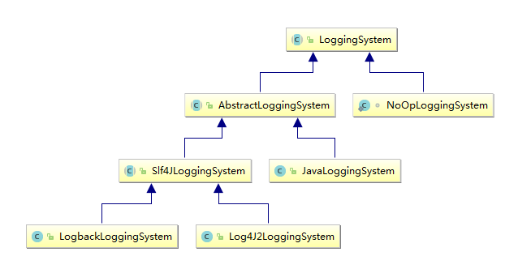

Spring Boot默认使用slf4j+logback，下面通过源码一探究竟！

SpringBoot对日志的配置和加载进行了封装，让我们可以很方便地使用一些日志框架，只需要定义对应日志框架的配置文件，比如LogBack、Log4j、Log4j2等，代码内部便可以直接使用。

SpringBoot对日志功能的封装继承图：


## LoggingSystem内部结构
从图中也可以发现目前SpringBoot支持4种类型的日志：
- JDK内置的Log(JavaLoggingSystem)
- Log4j(Log4JLoggingSystem)
- Log4j2(Log4J2LoggingSystem)
- Logback(LogbackLoggingSystem)

LoggingSystem是个抽象类，内部有这几个方法：

1. beforeInitialize方法：日志系统初始化之前需要处理的事情。抽象方法，不同的日志架构进行不同的处理
1. initialize方法：初始化日志系统。默认不进行任何处理，需子类进行初始化工作
1. cleanUp方法：日志系统的清除工作。默认不进行任何处理，需子类进行清除工作
1. getShutdownHandler方法：返回一个Runnable用于当jvm退出的时候处理日志系统关闭后需要进行的操作，默认返回null，也就是什么都不做
1. setLogLevel方法：抽象方法，用于设置对应logger的级别

## LoggingSystem的初始化
LoggingApplicationListener是ApplicationListener接口的实现类，会被springboot使用工厂加载机制加载。

```
// LoggingApplicationListener.class
@Override
public void onApplicationEvent(ApplicationEvent event) {
	// SpringApplication的run方法执行的时候触发该事件
	if (event instanceof ApplicationStartedEvent) {
		// onApplicationStartedEvent方法内部会先得到LoggingSystem，然后调用beforeInitialize方法
		onApplicationStartedEvent((ApplicationStartedEvent) event);
	}
	// 环境信息准备好，ApplicationContext创建之前触发该事件
	else if (event instanceof ApplicationEnvironmentPreparedEvent) {
		// onApplicationEnvironmentPreparedEvent方法内部会做一下几个事情
		// 1. 读取配置文件中"logging."开头的配置，比如logging.pattern.level, logging.pattern.console等设置到系统属性中
		// 2. 构造一个LogFile(LogFile是对日志对外输出文件的封装)，使用LogFile的静态方法get构造，会使用配置文件中logging.file和logging.path配置构造
		// 3. 判断配置中是否配置了debug并为true，如果是，设置level的DEBUG，然后继续查看是否配置了trace并为true，如果是，设置level的TRACE
		// 4. 构造LoggingInitializationContext，查看是否配置了logging.config，如有配置，调用LoggingSystem的initialize方法并带上该参数，否则调用initialize方法并且configLocation为null
		// 5. 设置一些比如org.springframework.boot、org.springframework、org.apache.tomcat、org.apache.catalina、org.eclipse.jetty、org.hibernate.tool.hbm2ddl、org.hibernate.SQL这些包的log level，跟第3步的level一样
		// 6. 查看是否配置了logging.register-shutdown-hook，如配置并设置为true，使用addShutdownHook的addShutdownHook方法加入LoggingSystem的getShutdownHandler
		onApplicationEnvironmentPreparedEvent(
				(ApplicationEnvironmentPreparedEvent) event);
	}
	// Spring容器创建好，并进行了部分操作之后触发该事件
	else if (event instanceof ApplicationPreparedEvent) {
		// onApplicationPreparedEvent方法内部会把LoggingSystem注册到BeanFactory中(前期是BeanFactory中不存在name为springBootLoggingSystem的实例)
		onApplicationPreparedEvent((ApplicationPreparedEvent) event);
	}
	// Spring容器关闭的时候触发该事件
	else if (event instanceof ContextClosedEvent && ((ContextClosedEvent) event)
			.getApplicationContext().getParent() == null) {
		// onContextClosedEvent方法内部调用LoggingSystem的cleanUp方法进行清除工作
		onContextClosedEvent();
	}
}

private void onApplicationStartedEvent(ApplicationStartedEvent event) {
	// 一开始先使用LoggingSystem的静态方法get获取LoggingSystem
	// 静态方法get会从下面那段static代码块中得到的Map中进行遍历
	// 如果对应的key(key是某个类的全名)在classloader中存在，那么会构造该key对应的value对应的LoggingSystem
	this.loggingSystem = LoggingSystem
			.get(event.getSpringApplication().getClassLoader());
	this.loggingSystem.beforeInitialize();
}

static {
	Map<String, String> systems = new LinkedHashMap<String, String>();
	systems.put("ch.qos.logback.core.Appender",
			"org.springframework.boot.logging.logback.LogbackLoggingSystem");
	systems.put("org.apache.logging.log4j.core.impl.Log4jContextFactory",
			"org.springframework.boot.logging.log4j2.Log4J2LoggingSystem");
	systems.put("org.apache.log4j.PropertyConfigurator",
			"org.springframework.boot.logging.log4j.Log4JLoggingSystem");
	systems.put("java.util.logging.LogManager",
			"org.springframework.boot.logging.java.JavaLoggingSystem");
	SYSTEMS = Collections.unmodifiableMap(systems);
}

private void onApplicationEnvironmentPreparedEvent(
		ApplicationEnvironmentPreparedEvent event) {
	if (this.loggingSystem == null) {
		this.loggingSystem = LoggingSystem
				.get(event.getSpringApplication().getClassLoader());
	}
	initialize(event.getEnvironment(), event.getSpringApplication().getClassLoader());
}

private void onApplicationPreparedEvent(ApplicationPreparedEvent event) {
	ConfigurableListableBeanFactory beanFactory = event.getApplicationContext()
			.getBeanFactory();
	if (!beanFactory.containsBean(LOGGING_SYSTEM_BEAN_NAME)) {
		beanFactory.registerSingleton(LOGGING_SYSTEM_BEAN_NAME, this.loggingSystem);
	}
}

private void onContextClosedEvent() {
	if (this.loggingSystem != null) {
		this.loggingSystem.cleanUp();
	}
}
```

spring-boot-starter模块内部会引用spring-boot-starter-logging模块，这个starter-logging模块内部会引入logback相关的依赖。这一依赖会导致LoggingSystem的静态方法get获取LoggingSystem的时候会得到LogbackLoggingSystem。

因此默认情况下，springboot程序基本都是使用logback作为默认的日志。
