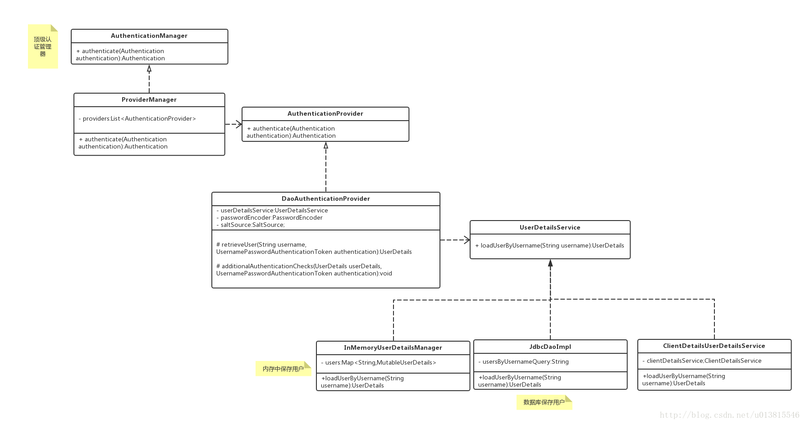
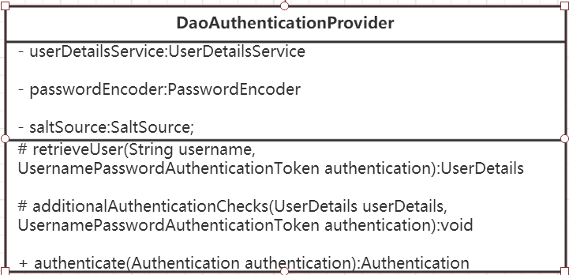

## 前言

先介绍几个接口，熟悉一下

- Principal： java.security中的接口，用户凭证，其中主要getName()获取用户名
- Authentication：Spring的认证对象接口，继承Principal，包含详细认证信息，常用实现类UsernamePasswordAuthenticationToken
- AuthenticationManager: 认证管理器接口，常用实现类ProviderManager
- ProviderManager: 实现类，包含一个AuthenticationProvider的List
- AuthenticationProvider: 认证提供者接口，提供实际的对Authentication的认证
- DaoAuthenticationProvider: 认证提供者实现类，从db读用户信息，与Authentication进行比对认证
- UserDetails: Spring Security对身份信息封装的一个接口
- UserDetailsService: 从db读用户信息的工具类

## 入口

1. Spring Security的核心入口是一系列的Filter组成的过滤器链
2. 经过过滤器链中的UsernamePasswordAuthenticationFilter获取到用户名和密码
3. 封装成Authentication，然后进入认证流程

## 认证流程

认证流程的核心是AuthenticationManager 接口，只有一个authenticate()方法，入参和返回值都是Authentication，但两者确差别很大

- 入参：仅包含了用户名和密码
- 返回值：包含了用户的权限列表、身份信息、详情信息等

所以authenticate()方法核心就是将上面前者转换为后者，且校验密码，之后将认证好的信息设置到安全上下文容器。

在实际需求中，我们可能会允许用户使用用户名+密码登录，同时允许用户使用邮箱+密码，手机号码+密码登录，所以AuthenticationManager一般不直接认证，它内部维护了一个List列表，存放多个AuthenticationProvider，去认证不同的登录方式。在默认策略下，只需要通过一个AuthenticationProvider的认证，即可被认为是登录成功。

按照我们最直观的思路，怎么去认证一个用户呢？用户前台提交了用户名和密码，而数据库中保存了用户名和密码，认证便是负责比对同一个用户名，提交的密码和保存的密码是否相同便是了。AuthenticationProvider最常用的一个实现便是DaoAuthenticationProvider，即校验数据库中的用户名密码。另外内部又用了一个工具类UserDetailsService来，通过用户名加载用户详情，一般情况下，我们只用实现该工具类就可以了。

调用关系如下：




##  获取当前用户的信息
SecurityContextHolder用于存储安全上下文（security context）的信息。当前操作的用户是谁，该用户是否已经被认证，他拥有哪些角色权限…这些都被保存在SecurityContextHolder中。

SecurityContextHolder默认使用ThreadLocal 策略来存储认证信息。看到ThreadLocal 也就意味着，这是一种与线程绑定的策略。Spring Security在用户登录时自动绑定认证信息到当前线程，在用户退出时，自动清除当前线程的认证信息。

但这一切的前提，是你在web场景下使用Spring Security，而如果是Swing界面，Spring也提供了支持，SecurityContextHolder的策略则需要被替换，鉴于我的初衷是基于web来介绍Spring Security，所以这里以及后续，非web的相关的内容都一笔带过。

因为身份信息是与线程绑定的，所以可以在程序的任何地方使用静态方法获取用户信息。一个典型的获取当前登录用户的姓名的例子如下所示：

```
Object principal = SecurityContextHolder.getContext().getAuthentication().getPrincipal();
if (principal instanceof UserDetails) {
    String username = ((UserDetails)principal).getUsername();
} else {
    String username = principal.toString();
}
```
getAuthentication()返回了认证信息，再次getPrincipal()返回了身份信息，UserDetails便是Spring对身份信息封装的一个接口。

Authentication和UserDetails的介绍在下面的小节具体讲解，本节重要的内容是介绍SecurityContextHolder这个容器。

## Authentication接口
常用实现类UsernamePasswordAuthenticationToken)

先看看这个接口的源码长什么样：

```
public interface Authentication extends Principal, Serializable { // <1>
    Collection<? extends GrantedAuthority> getAuthorities(); // <2> 权限信息列表
    Object getCredentials();// <2> 密码信息
    Object getDetails();// <2> 细节信息
    Object getPrincipal();// <2> 身份信息，通常是userDetails的实现类
    boolean isAuthenticated();// <2> 是否认证过
    void setAuthenticated(boolean var1) throws IllegalArgumentException;
}
```
1. Authentication是spring security包中的接口，直接继承自Principal类，而Principal是位于java.security包中的。可以见得，Authentication在spring security中是最高级别的身份/认证的抽象。

2. 由这个顶级接口，我们可以得到用户拥有的权限信息列表，密码，用户细节信息，用户身份信息，认证信息。如下方法详细解读如下：

- getAuthorities()，权限信息列表，默认是GrantedAuthority接口的一些实现类，通常是代表权限信息的一系列字符串。
- getCredentials()，密码信息，用户输入的密码字符串，在认证过后通常会被移除，用于保障安全。
- getDetails()，细节信息，web应用中的实现接口通常为 WebAuthenticationDetails，它记录了访问者的ip地址和sessionId的值。
- getPrincipal()，敲黑板！！！最重要的身份信息，大部分情况下返回的是UserDetails接口的实现类，也是框架中的常用接口之一。UserDetails接口将会在下面的小节重点介绍。

##  认证过程example
```
public class AuthenticationExample {
    private static AuthenticationManager am = new SampleAuthenticationManager();
    public static void main(String[] args) throws Exception {
    	BufferedReader in = new BufferedReader(new InputStreamReader(System.in));
    	while(true) {
    	    System.out.println("Please enter your username:");
    	    String name = in.readLine();
    	    System.out.println("Please enter your password:");
        	String password = in.readLine();
    	try {
    		Authentication request = new UsernamePasswordAuthenticationToken(name, password);
    		Authentication result = am.authenticate(request);
    		SecurityContextHolder.getContext().setAuthentication(result);
    		break;
    	} catch(AuthenticationException e) {
    		System.out.println("Authentication failed: " + e.getMessage());
    	}
    	}
    	System.out.println("Successfully authenticated. Security context contains: " +
    			SecurityContextHolder.getContext().getAuthentication());
    }
}

class SampleAuthenticationManager implements AuthenticationManager {
    static final List<GrantedAuthority> AUTHORITIES = new ArrayList<GrantedAuthority>();
    static {
    	AUTHORITIES.add(new SimpleGrantedAuthority("ROLE_USER"));
    }
    
    public Authentication authenticate(Authentication auth) throws AuthenticationException {
    	if (auth.getName().equals(auth.getCredentials())) {
    	    return new UsernamePasswordAuthenticationToken(auth.getName(),
    		auth.getCredentials(), AUTHORITIES);
    	}
    	throw new BadCredentialsException("Bad Credentials");
    }
}
```

##  AuthenticationManager接口
AuthenticationManager是认证相关的核心接口，常用实现类为ProviderManager

```
public class ProviderManager implements AuthenticationManager, MessageSourceAware,InitializingBean {
    // 维护一个AuthenticationProvider列表
    private List<AuthenticationProvider> providers = Collections.emptyList();
          
    public Authentication authenticate(Authentication authentication)
          throws AuthenticationException {
       Class<? extends Authentication> toTest = authentication.getClass();
       AuthenticationException lastException = null;
       Authentication result = null;
       // 依次认证
       for (AuthenticationProvider provider : getProviders()) {
          if (!provider.supports(toTest)) {
             continue;
          }
          try {
             result = provider.authenticate(authentication);
             if (result != null) {
                copyDetails(authentication, result);
                break;
             }
          }
          ...
          catch (AuthenticationException e) {
             lastException = e;
          }
       }
       // 如果有Authentication信息，则直接返回
       if (result != null) {
			if (eraseCredentialsAfterAuthentication
					&& (result instanceof CredentialsContainer)) {
              	 //移除密码
				((CredentialsContainer) result).eraseCredentials();
			}
             //发布登录成功事件
			eventPublisher.publishAuthenticationSuccess(result);
			return result;
	   }
	   ...
       //执行到此，说明没有认证成功，包装异常信息
       if (lastException == null) {
          lastException = new ProviderNotFoundException(messages.getMessage(
                "ProviderManager.providerNotFound",
                new Object[] { toTest.getName() },
                "No AuthenticationProvider found for {0}"));
       }
       prepareException(lastException, authentication);
       throw lastException;
    }
}
```

## AuthenticationProvider接口
常用实现类为DaoAuthenticationProvider

AuthenticationProvider最最最常用的一个实现便是DaoAuthenticationProvider。顾名思义，Dao正是数据访问层的缩写，也暗示了这个身份认证器的实现思路。由于本文是一个Overview，姑且只给出其UML类图：



## UserDetails与UserDetailsService接口

上面不断提到了UserDetails这个接口，它代表了最详细的用户信息，这个接口涵盖了一些必要的用户信息字段，具体的实现类对它进行了扩展。

它和Authentication接口很类似，比如它们都拥有username，authorities，区分他们也是本文的重点内容之一。Authentication的getCredentials()与UserDetails中的getPassword()需要被区分对待，前者是用户提交的密码凭证，后者是用户正确的密码，认证器其实就是对这两者的比对。Authentication中的getAuthorities()实际是由UserDetails的getAuthorities()传递而形成的。还记得Authentication接口中的getUserDetails()方法吗？其中的UserDetails用户详细信息便是经过了AuthenticationProvider之后被填充的。

UserDetailsService和AuthenticationProvider两者的职责常常被人们搞混，关于他们的问题在文档的FAQ和issues中屡见不鲜。记住一点即可，敲黑板！！！UserDetailsService只负责从特定的地方（通常是数据库）加载用户信息，仅此而已，记住这一点，可以避免走很多弯路。

UserDetailsService常见的实现类有JdbcDaoImpl，InMemoryUserDetailsManager，前者从数据库加载用户，后者从内存中加载用户，也可以自己实现UserDetailsService，通常这更加灵活。


## 参考资料

> - [徐靖峰](https://www.cnkirito.moe/categories/Spring-Security/)