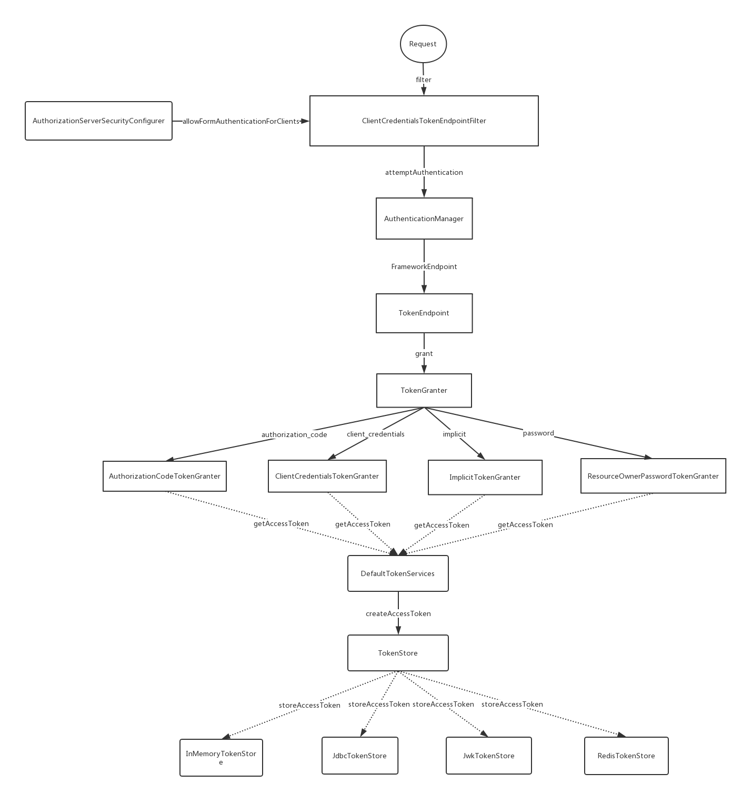
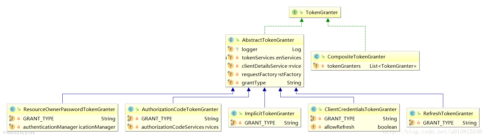
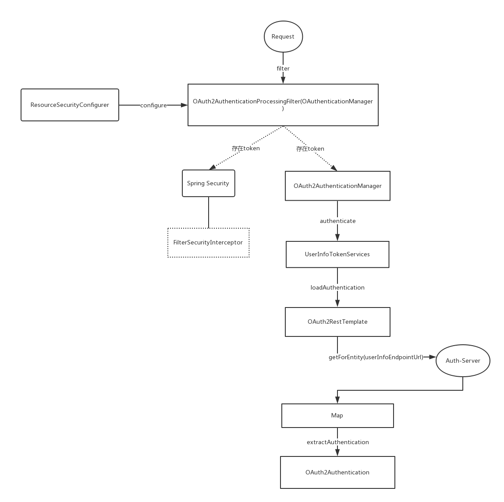
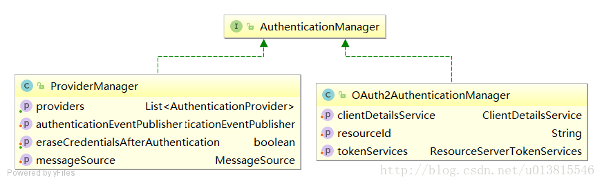

Spring Security Oauth2的不同授权方式的认证流程大致可抽象为两部分：

1. 获取token
2. 通过token请求资源

 简单实现源码传送门](https://github.com/unknow16/spring-security-family)


## 前言

先介绍一些工具类接口：

- AuthorizationServerTokenServices 提供了创建token，刷新token，获取token的功能
- ResourceServerTokenServices 根据accessToken加载客户端信息OAuth2Authentication和根据accessToken获取完整的访问令牌详细信息OAuth2AccessToken 
- ClientDetails客户端详情，包括clientId，secret，scope（客户端访问范围，默认为空则拥有全部范围），authorizedGrantTypes（授权类型），authorities（客户端可使用的权限）
- ClientDetailsService 根据clientId去加载ClientDetails，即OAuth2客户端信息，类似于UserDetailsService


## 获取token流程

先放一张整体类调用图，后面会详细解释每部分




## AuthorizationServerConfigurerAdapter

认证服务器实现，一般会如下配置

```
@Configuration
@EnableAuthorizationServer // 启用认证服务器
public class OAuth2ServerConfig extends AuthorizationServerConfigurerAdapter {
```

出现了AuthorizationServerConfigurerAdapter 关键类，他关联了三个重要的配置类，分别是

```
public class AuthorizationServerConfigurerAdapter implements AuthorizationServerConfigurer {
	@Override
	public void configure(AuthorizationServerSecurityConfigurer security <1>) throws Exception{
	}

	@Override
	public void configure(ClientDetailsServiceConfigurer clients <2>) throws Exception {
	}

	@Override
	public void configure(AuthorizationServerEndpointsConfigurer endpoints <3>) throws Exception {
	}

}
```

1. 配置AuthorizationServer安全认证的相关信息，创建ClientCredentialsTokenEndpointFilter核心过滤器

2.  配置OAuth2的客户端相关信息，可从db或内存加载

3. AuthorizationServerEndpointsConfigurer中集中定义了众多相关类的默认实现，可以自定义覆盖，包括配置身份认证器，配置认证方式，TokenStore，TokenGranter，OAuth2RequestFactory等。


## ClientCredentialsTokenEndpointFilter

它是一个客户端身份认证核心过滤器，默认获取的端点是/oauth/token,  在请求到达/oauth/token之前经过了ClientCredentialsTokenEndpointFilter这个过滤器，关键方法如下

```
public Authentication attemptAuthentication(HttpServletRequest request, HttpServletResponse response)
		throws AuthenticationException, IOException, ServletException {
	...
	String clientId = request.getParameter("client_id");
	String clientSecret = request.getParameter("client_secret");

	...
	clientId = clientId.trim();
	UsernamePasswordAuthenticationToken authRequest = new UsernamePasswordAuthenticationToken(clientId,
			clientSecret);

	return this.getAuthenticationManager().authenticate(authRequest);

}
```

这个设计是将client客户端的信息（client_id,client_secret）适配成用户的信息(username,password)，这样我们的认证流程就不需要修改了。经过ClientCredentialsTokenEndpointFilter之后，身份信息已经得到了AuthenticationManager的验证。接着便到达了TokenEndpoint。  

## TokenEndpoint

接受处理/oauth/token端点，生成并返回token。

```
@FrameworkEndpoint
public class TokenEndpoint extends AbstractEndpoint {

	@RequestMapping(value = "/oauth/token", method=RequestMethod.POST)
	public ResponseEntity<OAuth2AccessToken> postAccessToken(Principal principal, @RequestParam
	Map<String, String> parameters) throws HttpRequestMethodNotSupportedException {
		 ...
		String clientId = getClientId(principal);
		ClientDetails authenticatedClient = getClientDetailsService().loadClientByClientId(clientId);//<1>
		...
		TokenRequest tokenRequest = getOAuth2RequestFactory().createTokenRequest(parameters, authenticatedClient);//<2>
		...
		OAuth2AccessToken token = getTokenGranter().grant(tokenRequest.getGrantType(), tokenRequest);//<3>
		...
		return getResponse(token);
	
	}
	
	private TokenGranter tokenGranter;
}
```

1. 加载客户端信息

2.  结合请求信息，创建TokenRequest
3.  将TokenRequest传递给TokenGranter颁发token, 同时存储


OAuth2AccessToken的实现类DefaultOAuth2AccessToken就是最终得到的token序列化之前的原始类,如下是一个样例token响应：

```
{ 
	"access_token":"950a7cc9-5a8a-42c9-a693-40e817b1a4b0", 
	"token_type":"bearer", 
	"refresh_token":"773a0fcd-6023-45f8-8848-e141296cb3cb", 
	"expires_in":27036, 
	"scope":"select" 
}
```

## TokenGranter

先从UML类图对TokenGranter接口的设计有一个宏观的认识



TokenGranter的设计思路是使用CompositeTokenGranter管理一个List列表，每一种grantType对应一个具体的真正授权者，在debug过程中可以发现CompositeTokenGranter 内部就是在循环调用五种TokenGranter实现类的grant方法，而granter内部则是通过grantType来区分是否是各自的授权类型。

```
public class CompositeTokenGranter implements TokenGranter {
	
	private final List<TokenGranter> tokenGranters;
	
	public CompositeTokenGranter(List<TokenGranter> tokenGranters) {
		this.tokenGranters = new ArrayList<TokenGranter>(tokenGranters);
	}
	
	public OAuth2AccessToken grant(String grantType, TokenRequest tokenRequest) {
		for (TokenGranter granter : tokenGranters) {
			OAuth2AccessToken grant = granter.grant(grantType, tokenRequest);
			if (grant!=null) {
				return grant;
			}
		}
		return null;
	}
}
```

五种类型分别是：

- ResourceOwnerPasswordTokenGranter ==> password密码模式
- AuthorizationCodeTokenGranter ==> authorization_code授权码模式
- ClientCredentialsTokenGranter ==> client_credentials客户端模式
- ImplicitTokenGranter ==> implicit简化模式
- RefreshTokenGranter ==>refresh_token 刷新token专用

思考如何产生token的，则需要继续研究5种授权者的抽象类：AbstractTokenGranter，它中通过AuthorizationServerTokenServices去创建token，并存储token

```
public abstract class AbstractTokenGranter implements TokenGranter {
	protected final Log logger = LogFactory.getLog(getClass());
	//与token相关的service，重点
	private final AuthorizationServerTokenServices tokenServices;
	//与clientDetails相关的service，重点
	private final ClientDetailsService clientDetailsService;
	//创建oauth2Request的工厂，重点
	private final OAuth2RequestFactory requestFactory;
	
	private final String grantType;
	...
	
	public OAuth2AccessToken grant(String grantType, TokenRequest tokenRequest) {
	
		...
		String clientId = tokenRequest.getClientId();
		ClientDetails client = clientDetailsService.loadClientByClientId(clientId);
		validateGrantType(grantType, client);
		
		logger.debug("Getting access token for: " + clientId);
	
		return getAccessToken(client, tokenRequest);
	
	}
	
	protected OAuth2AccessToken getAccessToken(ClientDetails client, TokenRequest tokenRequest) {
		return tokenServices.createAccessToken(getOAuth2Authentication(client, tokenRequest));
	}
	
	protected OAuth2Authentication getOAuth2Authentication(ClientDetails client, TokenRequest tokenRequest) {
		OAuth2Request storedOAuth2Request = requestFactory.createOAuth2Request(client, tokenRequest);
		return new OAuth2Authentication(storedOAuth2Request, null);
	}
	
	...
}
```

AbstractTokenGranter中通过AuthorizationServerTokenServices接口的实现类DefaultTokenServices去创建token，然后DefaultTokenServices又用TokenStore存储token。

## TokenStore

存储token支持 内存、redis、数据库、等多种方式，对应实现类如下：

- 内存： InMemoryTokenStore
- 数据库：JdbcTokenStore
- Json Web Key:  JwkTokenStore
- Json Web Token: JwtTokenStore
- redis: RedisTokenStore


## 通过token请求资源

先放一张整体类调用图，后面会详细解释每部分，下图中如果认证和资源服务分开部署时ResourceServerTokenServices 的实现是UserInfoTokenServices，默认实现是DefaultTokenServices



## ResourceServerConfigurerAdapter

通过token请求受限资源一般是访问资源服务器，一般配置如下：

```
@Configuration
@EnableResourceServer // 启用资源服务器
public class ResourceServerConfiguration extends ResourceServerConfigurerAdapter {}
```

我们注意到其相关配置类是ResourceServerConfigurer，内部关联了ResourceServerSecurityConfigurer和HttpSecurity。前者与资源安全配置相关，后者与http安全配置相关。（类名比较类似，注意区分，以Adapter结尾的是适配器，以Configurer结尾的是配置器，以Builder结尾的是建造器，他们分别代表不同的设计模式，对设计模式有所了解可以更加方便理解其设计思路）

```
public class ResourceServerConfigurerAdapter implements ResourceServerConfigurer {
	@Override
	public void configure(ResourceServerSecurityConfigurer resources <1> ) throws Exception {
	}

	@Override
	public void configure(HttpSecurity http) throws Exception {
		http.authorizeRequests().anyRequest().authenticated();
	}
}
```

<1> ResourceServerSecurityConfigurer中集中配置了资源服务器默认的实现类，包括ResourceServerTokenServices、TokenStore等。

## ResourceServerSecurityConfigurer

```
public void configure(HttpSecurity http) throws Exception {
	AuthenticationManager oauthAuthenticationManager = oauthAuthenticationManager(http);
	resourcesServerFilter = new OAuth2AuthenticationProcessingFilter();//<1>
	resourcesServerFilter.setAuthenticationEntryPoint(authenticationEntryPoint);
	resourcesServerFilter.setAuthenticationManager(oauthAuthenticationManager);//<2>
	if (eventPublisher != null) {
		resourcesServerFilter.setAuthenticationEventPublisher(eventPublisher);
	}
	if (tokenExtractor != null) {
		resourcesServerFilter.setTokenExtractor(tokenExtractor);//<3>
	}
	resourcesServerFilter = postProcess(resourcesServerFilter);
	resourcesServerFilter.setStateless(stateless);

	// @formatter:off
	http
		.authorizeRequests().expressionHandler(expressionHandler)
	.and()
		.addFilterBefore(resourcesServerFilter, AbstractPreAuthenticatedProcessingFilter.class)
		.exceptionHandling()
			.accessDeniedHandler(accessDeniedHandler)//<4>
			.authenticationEntryPoint(authenticationEntryPoint);
	// @formatter:on
}
```

这段是整个oauth2与HttpSecurity相关的核心配置，其中有非常多的注意点，顺带的都强调一下：

1. 创建OAuth2AuthenticationProcessingFilter，OAuth2核心过滤器。

2. 为OAuth2AuthenticationProcessingFilter设置认证OAuth2请求的AuthenticationManager实现，即OAuth2AuthenticationManager类，它并没有被添加到spring的容器中，不然可能会影响spring security的普通认证流程（非oauth2请求），只有被OAuth2AuthenticationProcessingFilter拦截到的oauth2相关请求才被处理。

3. 为OAuth2AuthenticationProcessingFilter设置TokenExtractor默认的实现—-BearerTokenExtractor。

4. 相关的异常处理器，可以重写相关实现，达到自定义异常的目的。

上面提到的OAuth2AuthenticationProcessingFilter、OAuth2AuthenticationManager、TokenExtractor会在下面详解。

## OAuth2AuthenticationProcessingFilter

它是OAuth2保护资源的预先认证过滤器，会从请求中提取出token，如果存在会用OAuth2AuthenticationManager进行身份鉴定，然后来填充Spring Security上下文。

主要步骤：

1. 提取token，通过TokenExtractor实现，并封装成Authentication
2. 认证token，通过OAuth2AuthenticationManager认证1中封装的Authentication

```
public void doFilter(ServletRequest req, ServletResponse res, FilterChain chain){
	final HttpServletRequest request = (HttpServletRequest) req;
	final HttpServletResponse response = (HttpServletResponse) res;

	try {
		//从请求中取出身份信息，即access_token
		Authentication authentication = tokenExtractor.extract(request);
		
		if (authentication == null) {
			// ...
		}
		else {
			request.setAttribute(OAuth2AuthenticationDetails.ACCESS_TOKEN_VALUE, authentication.getPrincipal());
			if (authentication instanceof AbstractAuthenticationToken) {
				AbstractAuthenticationToken needsDetails = (AbstractAuthenticationToken) authentication;
				needsDetails.setDetails(authenticationDetailsSource.buildDetails(request));
			}
			//认证身份
			Authentication authResult = authenticationManager.authenticate(authentication);
			...
			eventPublisher.publishAuthenticationSuccess(authResult);
			//将身份信息绑定到SecurityContextHolder中
			SecurityContextHolder.getContext().setAuthentication(authResult);
		}
	}
	catch (OAuth2Exception failed) {
		...
		return;
	}

	chain.doFilter(request, response);
}
```

## TokenExtractor

这个接口只有一个实现类，它的作用在于分离出请求中包含的token。也启示了我们可以使用多种方式携带token。

1. 在请求头的Authentication中携带	
2. 拼接在URL中的以access_token为key的RequestParam
3. 在form表单中以access_token为key提交

## OAuth2AuthenticationManager

非OAuth2认证流程中AuthenticationManager的实现类是ProviderManager，但在OAuth2请求中的实现是OAuth2AuthenticationManager，它直接重写了顶级身份认证接口，内部维护了一个ClientDetailService和ResourceServerTokenServices




```
public Authentication authenticate(Authentication authentication) throws AuthenticationException {
	...
	String token = (String) authentication.getPrincipal();
	// 1. 借助ResourceServerTokenServices根据token加载身份信息
	OAuth2Authentication auth = tokenServices.loadAuthentication(token);
	...

	// 2. 借助ClientDetailService获取ClientDetails，然后和OAuth2Authentication鉴权
	checkClientDetails(auth);

	if (authentication.getDetails() instanceof OAuth2AuthenticationDetails) {
		OAuth2AuthenticationDetails details = (OAuth2AuthenticationDetails) authentication.getDetails();
		...
	}
	auth.setDetails(authentication.getDetails());
	auth.setAuthenticated(true);
	return auth;

}
```

## 参考资料

> - [徐靖峰](https://www.cnkirito.moe/Spring-Security-OAuth2-2/)
