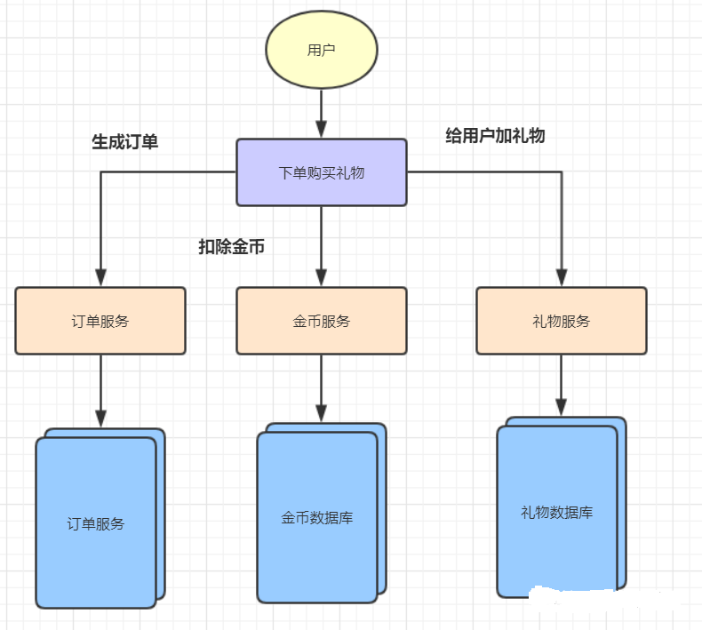
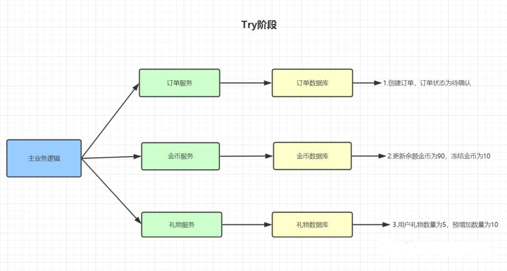
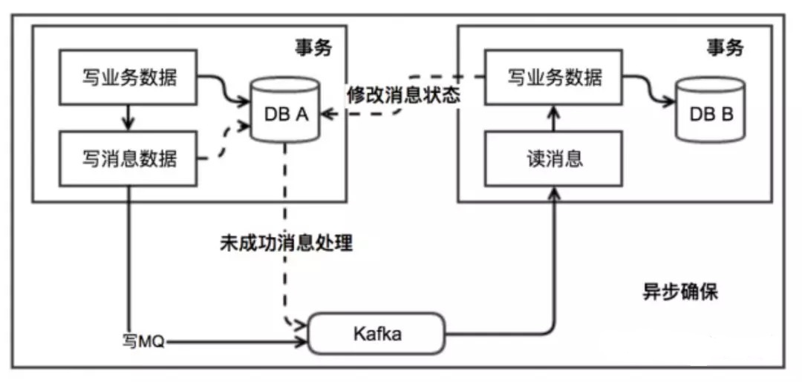
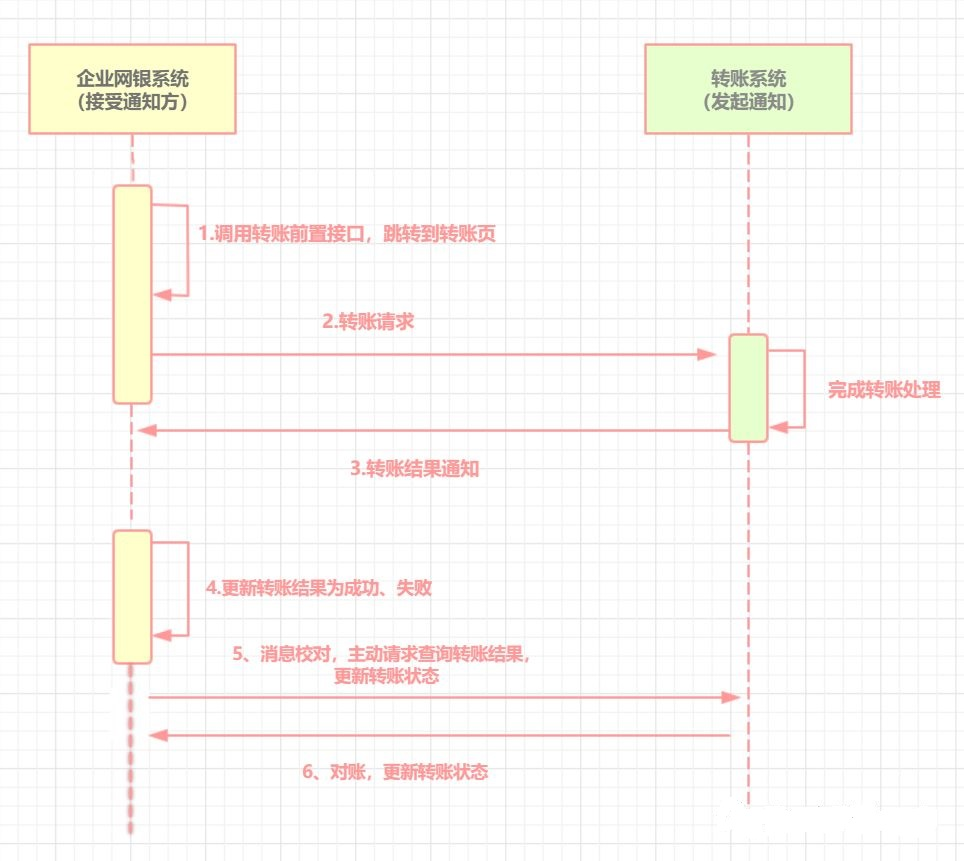

分布式事务就是指事务的参与者、支持事务的服务器、资源服务器以及事务管理器分别位于不同的分布式系统的不同节点之上。简单来说，分布式事务指的就是分布式系统中的事务，它的存在就是为了保证不同数据库节点的数据一致性。

为什么需要分布式事务？接下来分两方面阐述：

## 微服务架构下的分布式事务
随着互联网的快速发展，轻盈且功能划分明确的微服务，登上了历史舞台。比如，一个用户下订单，购买直播礼物的服务，被拆分成三个service，分别是金币服务（coinService），下订单服务（orderService）、礼物服务（giftService）。这些服务都部署在不同的机器上（节点），对应的数据库（金币数据库、订单数据库、礼物数据库）也在不同节点上。

用户下单购买礼物，礼物数据库、金币数据库、订单数据库在不同节点上，用本地事务是不可以的，那么如何保证不同数据库（节点）上的数据一致性呢？这就需要分布式事务啦~

## 分库分表下的分布式事务
随着业务的发展，数据库的数据日益庞大，超过千万级别的数据，我们就需要对它分库分表（以前公司是用mycat分库分表，后来用sharding-jdbc）。一分库，数据又分布在不同节点上啦，比如有的在深圳机房，有的在北京机房，你再想用本地事务去保证，已经无动于衷啦，还是需要分布式事务啦

比如A转10块给B，A的账户数据是在北京机房，B的账户数据是在深圳机房。流程如下：

## 分布式事务解决方案
分布式事务解决方案主要有以下这几种：
- 2PC(二阶段提交)方案
- TCC（Try、Confirm、Cancel）
- 本地消息表
- 最大努力通知
- Saga事务

## 二阶段提交方案
二阶段提交方案是常用的分布式事务解决方案。事务的提交分为两个阶段：准备阶段和提交执行方案。

二阶段提交成功的情况
准备阶段：事务管理器向每个资源管理器发送准备消息，如果资源管理器的本地事务操作执行成功，则返回成功。
提交执行阶段：如果事务管理器收到了所有资源管理器回复的成功消息，则向每个资源管理器发送提交消息，RM 根据 TM 的指令执行提交。

二阶段提交失败的情况
准备阶段：事务管理器向每个资源管理器发送准备消息，如果资源管理器的本地事务操作执行成功，则返回成功，如果执行失败，则返回失败。
提交执行阶段：如果事务管理器收到了任何一个资源管理器失败的消息，则向每个资源管理器发送回滚消息。资源管理器根据事务管理器的指令回滚本地事务操作，释放所有事务处理过程中使用的锁资源。

2PC方案实现起来简单，成本较低，但是主要有以下缺点：
- 单点问题：如果事务管理器出现故障，资源管理器将一直处于锁定状态。
- 性能问题：所有资源管理器在事务提交阶段处于同步阻塞状态，占用系统资源，一直到提交完成，才释放资源，容易导致性能瓶颈。
- 数据一致性问题：如果有的资源管理器收到提交的消息，有的没收到，那么会导致数据不一致问题。

## TCC模型
TCC（Try-Confirm-Cancel）是通过对业务逻辑的分解来实现分布式事务。针对一个具体的业务服务，TCC 分布式事务模型需要业务系统都实现一下三段逻辑：
- try阶段：尝试去执行，完成所有业务的一致性检查，预留必须的业务资源，如冻结新增的钱。
- Confirm阶段：该阶段对业务进行确认提交，不做任何检查，因为try阶段已经检查过了，默认Confirm阶段是不会出错的。
- Cancel 阶段：若业务执行失败，则进入该阶段，它会释放try阶段占用的所有业务资源，并回滚Confirm阶段执行的所有操作。

TCC 分布式事务模型包括三部分：主业务服务、从业务服务、业务活动管理器。
- 主业务服务：主业务服务负责发起并完成整个业务活动。
- 从业务服务：从业务服务是整个业务活动的参与方，实现Try、Confirm、Cancel操作，供主业务服务调用。
- 业务活动管理器：业务活动管理器（即数据库）管理控制整个业务活动，包括记录事务状态，调用从业务服务的 Confirm 操作（提交事务），调用从业务服务的 Cancel 操作（回滚事务）等。

下面再拿用户下单购买礼物作为例子来模拟TCC实现分布式事务的过程：
假设用户A余额为100金币，拥有的礼物为5朵。A花了10个金币，下订单，购买10朵玫瑰。余额、订单、礼物都在不同数据库。

TCC的Try阶段：
- 生成一条订单记录，订单状态为待确认。
- 将用户A的账户金币中余额更新为90，冻结金币为10（预留业务资源）
- 将用户的礼物数量为5，预增加数量为10。

Try成功之后，便进入Confirm阶段，Try过程发生任何异常，均进入Cancel阶段

TCC的Confirm阶段：
- 订单状态更新为已支付
- 更新用户余额为90，可冻结为0
- 用户礼物数量更新为15，预增加为0

Confirm过程发生任何异常，均进入Cancel阶段，Confirm过程执行成功，则该事务结束

TCC的Cancel阶段：
- 修改订单状态为已取消
- 更新用户余额回100
- 更新用户礼物数量为5

TCC方案让应用可以自定义数据库操作的粒度，降低了锁冲突，可以提升性能，但是也有以下缺点：
- 应用侵入性强，try、confirm、cancel三个阶段都需要业务逻辑实现。
- 需要根据网络、系统故障等不同失败原因实现不同的回滚策略，实现难度大，一般借助TCC开源框架，ByteTCC，TCC-transaction，Himly。

## 本地消息表
ebay最初提出本地消息表这个方案，来解决分布式事务问题。业界目前使用这种方案是比较多的，它的核心思想就是将分布式事务拆分成本地事务进行处理。可以看一下基本的实现流程图：

基本实现思路如下

发送消息方：
- 需要有一个消息表，记录着消息状态相关信息
- 业务数据和消息表在同一个数据库，即要保证它俩在同一个本地事务。
- 在本地事务中处理完业务数据和写消息表操作后，通过写消息到MQ消息队列。
- 消息会发到消息消费方，如果发送失败，即进行重试。

消息消费方：
- 处理消息队列中的消息，完成自己的业务逻辑。
- 此时如果本地事务处理成功，则表明已经处理成功了。
- 如果本地事务处理失败，那么就会重试执行。
- 如果是业务上面的失败，给消息生产方发送一个业务补偿消息，通知进行回滚等操作。

生产方和消费方定时扫描本地消息表，把还没处理完成的消息或者失败的消息再发送一遍。如果有靠谱的自动对账补账逻辑，这种方案还是非常实用的。

该方案的优点是很好地解决了分布式事务问题，实现了最终一致性。缺点是消息表会耦合到业务系统中。

## 最大努力通知
最大努力通知也是一种分布式事务解决方案。
它的目标，就是发起通知方通过一定的机制，最大努力将业务处理结果通知到接收方，同时还要提供给接收方主动查询结果的方法。
对于如何确认是否通知到接收方，可以采用MQ的ack机制。

下面是企业网银转账一个例子：

1. 企业网银系统调用前置接口，跳转到转账页
2. 企业网银调用转账系统接口
3. 转账系统完成转账处理，向企业网银系统发起转账结果通知，若通知失败，则转账系统按策略进行重复通知。
4. 企业网银系统未接收到通知，会主动调用转账系统的接口查询转账结果。
5. 转账系统会遇到退汇等情况，会定时回来对账。

最大努力通知实现机制如下：
1. 发起方将通知发给MQ。
2. 接收通知方监听MQ消息。
3. 接收通知方收到消息后，处理完业务，回应ack。
4. 接收通知方若没有回应ack，则MQ会间隔1min、5min、10min等重复通知。
5. 接受通知方可用消息校对接口，保证消息的一致性。

## Saga事务
Saga事务由普林斯顿大学的Hector Garcia-Molina和Kenneth Salem提出，其核心思想是将长事务拆分为多个本地短事务，由Saga事务协调器协调，如果正常结束那就正常完成，如果某个步骤失败，则根据相反顺序一次调用补偿操作。
- Saga = Long Live Transaction (LLT，长活事务)
- LLT = T1 + T2 + T3 + ... + Ti（Ti为本地短事务）
- 同时每个本地事务Ti 有对应的补偿 Ci

Saga的执行顺序：
- 正常情况：T1 T2 T3 ... Tn，即依次执行本地短事务
- 异常情况：T1 T2 T3 C3 C2 C1，即执行T1、T2、T3后，再执行T4失败了，然后反向执行C3、C2、C1等补偿操作

Saga两种恢复策略
- 向后恢复，如果任意本地子事务失败，补偿已完成的事务。如异常情况的执行顺序T1 T2 Ti Ci C2 C1.
- 向前恢复，即重试失败的事务，该策略前提假设最后每个子事务都会成功。执行顺序：T1, T2, ..., Tj(失败), Tj(重试),..., Tn。

举个例子，假设用户下订单，花10块钱购买了10多玫瑰，则有
- 本地短事务：T1=下订单 ，T2=扣用户10块钱，T3=用户加10朵玫瑰， T4=库存减10朵玫瑰
- 对应补偿操作：C1=取消订单 ，C2= 给用户加10块钱，C3 =用户减10朵玫瑰， C4=库存加10朵玫瑰

假设事务执行到T4发生异常回滚，在C4的要把玫瑰给库存加回去的时候，发现用户的玫瑰都用掉了，这是Saga的一个缺点，由于事务之间没有隔离性导致的问题。可以通过以下方案解决这个问题：
- 在应⽤层⾯加⼊逻辑锁的逻辑。
- Session层⾯隔离来保证串⾏化操作。
- 业务层⾯采⽤预先冻结资⾦的⽅式隔离此部分资⾦。
- 业务操作过程中通过及时读取当前状态的⽅式获取更新。

## 参考资料
> - 
> - 
