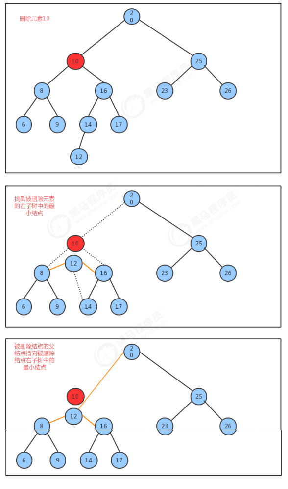
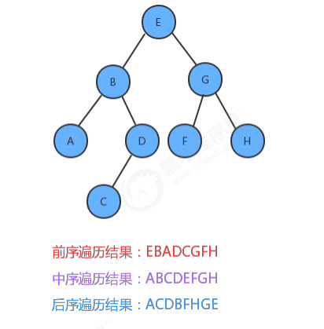
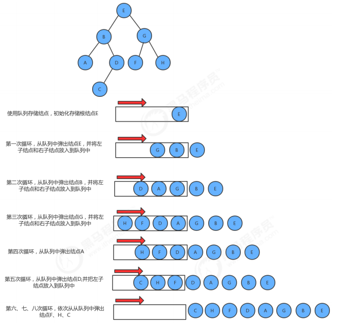

之前我们实现的符号表中，不难看出，符号表的增删查操作，随着元素个数N的增多，其耗时也是线性增多的，时间复杂度都是O(n),为了提高运算效率，接下来我们学习树这种数据结构。

## 树的定义
树是我们计算机中非常重要的一种数据结构，同时使用树这种数据结构，可以描述现实生活中的很多事物，例如家谱、单位的组织架构、等等。树是由n（n>=1）个有限结点组成一个具有层次关系的集合。把它叫做“树”是因为它看起来像一棵倒挂的树，也就是说它是根朝上，而叶朝下的。相关树的相关术语如下：

结点的度：一个结点含有的子树的个数称为该结点的度；
叶结点：度为0的结点称为叶结点，也可以叫做终端结点
分支结点：度不为0的结点称为分支结点，也可以叫做非终端结点
结点的层次：从根结点开始，根结点的层次为1，根的直接后继层次为2，以此类推
结点的层序编号：将树中的结点，按照从上层到下层，同层从左到右的次序排成一个线性序列，把他们编成连续的自然数。
树的度：树中所有结点的度的最大值
树的高度(深度)：树中结点的最大层次
森林：m（m>=0）个互不相交的树的集合，将一颗非空树的根结点删去，树就变成一个森林；给森林增加一个统一的根结点，森林就变成一棵树

孩子结点：一个结点的直接后继结点称为该结点的孩子结点
双亲结点(父结点)：一个结点的直接前驱称为该结点的双亲结点
兄弟结点：同一双亲结点的孩子结点间互称兄弟结点

二叉树：度不超过2的树(每个结点最多有两个子结点)
满二叉树：一个二叉树，如果每一个层的结点树都达到最大值，则这个二叉树就是满二叉树。
完全二叉树：叶节点只能出现在最下层和次下层，并且最下面一层的结点都集中在该层最左边的若干位置的二叉树

## 二叉树

结点类定义：

类名 | Node<Key,Value>
-- | --
构造方法 | Node(Key key, Value value, Node left, Node right)：创建Node对象
成员变量 | 1.public Node left:记录左子结点
        | 2.public Node right:记录右子结点
        | 3.public Key key:存储键
        | 4.public Value value:存储值

代码实现：
```
todo
```

### 二叉查找树
类名 | BinaryTree<Value,>
-- | --
构造方法 | BinaryTree()：创建BinaryTree对象
成员变量 | 1.private Node root:记录根结点
        | 2.private int N:记录树中元素的个数
成员方法    | 1. public void put(Key key,Value value):向树中插入一个键值对
            | 2.private Node put(Node x, Key key, Value val)：给指定树x上，添加键一个键值对，并返回添加后的新树
            | 3.public Value get(Key key):根据key，从树中找出对应的值
            | 4.private Value get(Node x, Key key):从指定的树x中，找出key对应的值
            | 5.public void delete(Key key):根据key，删除树中对应的键值对
            | 6.private Node delete(Node x, Key key):删除指定树x上的键为key的键值对，并返回删除后的新树
            | 7.public int size():获取树中元素的个数

插入方法put实现思想：
1. 如果当前树中没有任何一个结点，则直接把新结点当做根结点使用
2. 如果当前树不为空，则从根结点开始：
 2.1 如果新结点的key小于当前结点的key，则继续找当前结点的左子结点；
 2.2 如果新结点的key大于当前结点的key，则继续找当前结点的右子结点；
 2.3 如果新结点的key等于当前结点的key，则树中已经存在这样的结点，替换该结点的value值即可。            

查询方法get实现思想：
从根节点开始：
1. 如果要查询的key小于当前结点的key，则继续找当前结点的左子结点；
2. 如果要查询的key大于当前结点的key，则继续找当前结点的右子结点；
3. 如果要查询的key等于当前结点的key，则树中返回当前结点的value。

删除方法delete实现思想：
1. 找到被删除结点；
2. 找到被删除结点右子树中的最小结点minNode
3. 删除右子树中的最小结点
4. 让被删除结点的左子树称为最小结点minNode的左子树，让被删除结点的右子树称为最小结点minNode的右子树
5. 让被删除结点的父节点指向最小结点minNode



代码实现：
```
todo
```

查找二叉树中最小的键：在某些情况下，我们需要查找出树中存储所有元素的键的最小值，比如我们的树中存储的是学生的排名和姓名数据，那么需要查找出排名最低是多少名？这里我们设计如下两个方法来完成：

public Key min()  | 找出树中最小的键
-- | --
private Node min(Node x)  | 找出指定树x中，最小键所在的结点

```
//找出整个树中最小的键
public Key min(){
    return min(root).key;
}

//找出指定树x中最小的键所在的结点
private Node min(Node x){
    if (x.left!=null){
        return min(x.left);
    }else{
        return x;
    }
}

```
查找二叉树中最大的键：在某些情况下，我们需要查找出树中存储所有元素的键的最大值，比如比如我们的树中存储的是学生的成绩和学生的姓名，那么需要查找出最高的分数是多少？这里我们同样设计两个方法来完成：

public Key max() | 找出树中最大的键
-- | --
public Node max(Node x) | 找出指定树x中，最大键所在的结点

```
//找出整个树中最大的键
public Key max(){
    return max(root).key;
}

//找出指定树x中最大键所在的结点
public Node max(Node x){
    if (x.right!=null){
        return max(x.right);
    }else{
        return x;
    }
}
```

### 二叉树的前序/中序/后序遍历
很多情况下，我们可能需要像遍历数组数组一样，遍历树，从而拿出树中存储的每一个元素，由于树状结构和线性结构不一样，它没有办法从头开始依次向后遍历，所以存在如何遍历，也就是按照什么样的搜索路径进行遍历的问题。二叉树由一个根节点、一个左子树、一个右子树组成，那么按照根节点什么时候被访问，我们可以把二叉树的遍历分为以下三种方式：
1. 前序遍历；先访问根结点，然后再访问左子树，最后访问右子树
2. 中序遍历；先访问左子树，中间访问根节点，最后访问右子树
3. 后序遍历；先访问左子树，再访问右子树，最后访问根节点

如果我们分别对下面的树使用三种遍历方式进行遍历，得到的结果如下：


添加前序遍历的API：

public Queue<Key> preErgodic() | 使用前序遍历，获取整个树中的所有键
-- | --
private void preErgodic(Node x,Queue<Key> keys) | 使用前序遍历，把指定树x中的所有键放入到keys队列中

实现过程中，我们通过前序遍历，把每个结点的键取出，放入到队列中返回即可
1. 把当前结点的key放入到队列中;
2. 找到当前结点的左子树，如果不为空，递归遍历左子树
3. 找到当前结点的右子树，如果不为空，递归遍历右子树

代码实现：
```
todo
```

添加中序遍历的API：

public Queue<Key> midErgodic() | 使用中序遍历，获取整个树中的所有键
-- | --
private void midErgodic(Node x,Queue<Key> keys) | 使用中序遍历，把指定树x中的所有键放入到keys队列中

实现步骤：
1. 找到当前结点的左子树，如果不为空，递归遍历左子树
2. 把当前结点的key放入到队列中;
3. 找到当前结点的右子树，如果不为空，递归遍历右子树

添加后序遍历的API：

public Queue<Key> afterErgodic() | 使用后序遍历，获取整个树中的所有键
-- | --
private void afterErgodic(Node x,Queue<Key> keys) | 使用后序遍历，把指定树x中的所有键放入到keys队列中

实现步骤：
1. 找到当前结点的左子树，如果不为空，递归遍历左子树
2. 找到当前结点的右子树，如果不为空，递归遍历右子树
3. 把当前结点的key放入到队列中;

###  二叉树的层序遍历
所谓的层序遍历，就是从根节点（第一层）开始，从上向下，从左到右，依次获取每一层所有结点的值，对于上述树的层序遍历的结果是：EBGADFHC。

添加层序遍历的API：

public Queue<Key> layerErgodic() | 使用层序遍历，获取整个树中的所有键
-- | --

实现步骤：
1. 创建队列，存入根结点；
2. 使用循环从队列中弹出一个结点：
 2.1 获取当前结点的key；
 2.2 如果当前结点的左子结点不为空，则把左子结点放入到队列中
 2.3 如果当前结点的右子结点不为空，则把右子结点放入到队列中



代码实现：
```
todo
```

## 二叉树的最大深度问题
定义：树的根节点到最远叶子结点的最长路径上的结点数，如上述树的最大深度是4。

添加如下的API求最大深度：

public int maxDepth() | 计算整个树的最大深度
-- | --
private int maxDepth(Node x) | 计算指定树x的最大深度

实现步骤：
1. 如果根结点为空，则最大深度为0；
2. 计算左子树的最大深度；
3. 计算右子树的最大深度；
4. 当前树的最大深度=左子树的最大深度和右子树的最大深度中的较大者+1

代码实现：
```
//计算整个树的最大深度
public int maxDepth() {
    return maxDepth(root);
}

//计算指定树x的最大深度
private int maxDepth(Node x) {
    //1.如果根结点为空，则最大深度为0；
    if (x == null) {
        return 0;
    }

    int max = 0;
    int maxL = 0;
    int maxR = 0;

    //2.计算左子树的最大深度；
    if (x.left != null) {
        maxL = maxDepth(x.left);
    }

    //3.计算右子树的最大深度；
    if (x.right != null) {
        maxR = maxDepth(x.right);
    }

    //4.当前树的最大深度=左子树的最大深度和右子树的最大深度中的较大者+1
    max = maxL > maxR ? maxL + 1 : maxR + 1;
    return max;
}

//测试代码
public class Test {
    public static void main(String[] args) throws Exception {
        BinaryTree<String, String> bt = new BinaryTree<>();
        bt.put("E", "5");
        bt.put("B", "2");
        bt.put("G", "7");
        bt.put("A", "1");
        bt.put("D", "4");
        bt.put("F", "6");
        bt.put("H", "8");
        bt.put("C", "3");

        int i = bt.maxDepth();
        System.out.println(i);
    }
}
```

## 折纸问题
todo

##


## 参考资料
> - []()
> - []()
